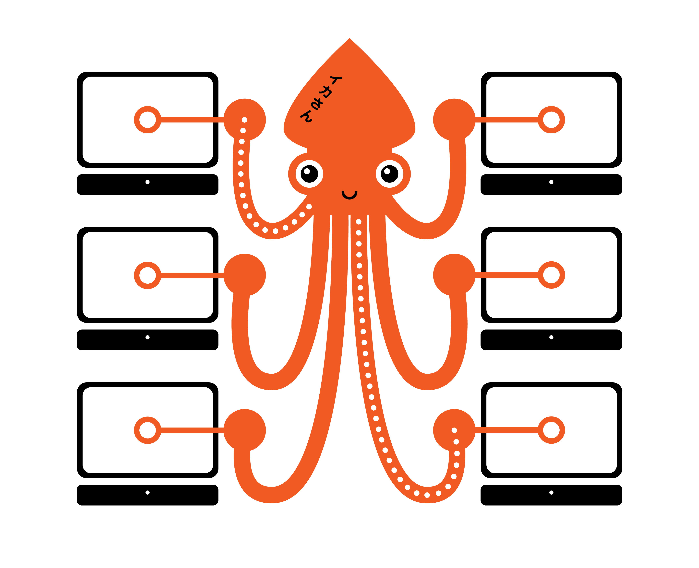
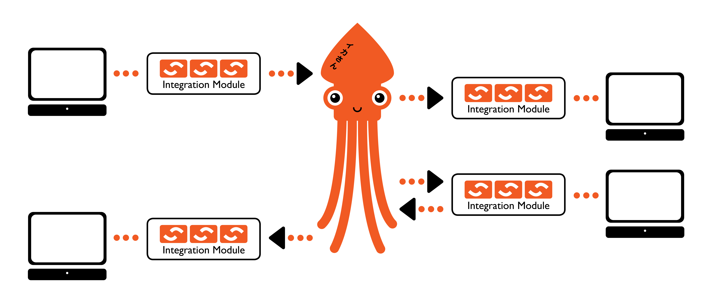

[../](./Readme.md)

# Open Source Enterprise Integration Platform

The Ikasan Enterprise Integration Platform (EIP) addresses the problem 
domain most commonly known as Enterprise Application Integration (EAI). 

Enterprise application integration can be, and already has been, 
approached a number of different ways by a number of projects/vendors, 
both Open Source and closed commercial frameworks. 

It is the intention of the Ikasan Enterprise Integration Platform 
to address this domain as commoditised configurable solutions rather 
than another development framework.

# Problem Domain

* System integration can be exponentially complex
* It is commonly agreed that “spaghetti integration” is bad
* It results in a bleed out of APIs; data syntax; and business semantics
* Ripple effect of change is massive
 

# Solution

* Use Standard Enterprise Application Integration (EAI) approach
* Provision of an Event/Service backbone
* Single point of integration for Enterprise Information System (EIS) business flows
* Ripple effect of change is localised and well understood (assuming best practice)
* Ikasan adopts the standard EAI approach and helps users solve integration problems by building applications constructed of modules/flows/components
 
#  Integration Module

* An Integration Module is a high level logical construct
* It provides a logical grouping of business operations as a single integration point
* These integration points can be either a source, a target, or bi-directional business flows
 

#  Flows

 * Integration modules comprise of one or more related flows
 * Flows are cohesive operations on a business artifact as an atomic operation
 * Multiple flows can be chained to isolate concerns
 * Ikasan defines only light-weight event containers so as to remain agnostic to the data being transported
 

#  Components

 * Flows comprise of flow components which have implementation injected as Plain Old Java objects (POJOs)
 * Components are individual operations acting on events within a flow
 * There are different types of components based on industry standard EAI Integration Patterns including,
   * Consumers
   * Converters
   * Translators
   * Splitters
   * Aggregators
   * Brokers
   * Filters
   * Sequencers
   * Routers
   * Producers
 * Standard re-useable components are available within Ikasan as well as being able to simply develop your own custom components
 * Core services are automatically bound to each flow
 * Service APIs support management of the flow, runtime status, resubmission, and replay
 
 

 

