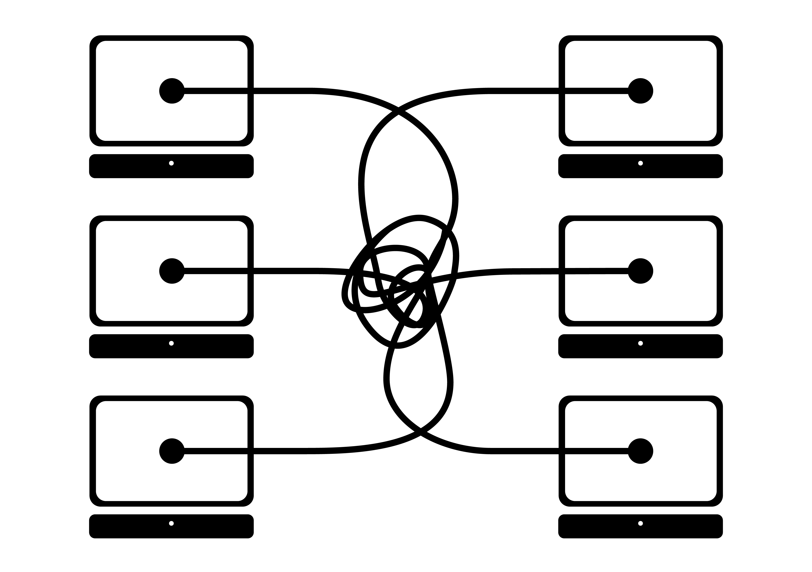

[](https://travis-ci.org/ikasanEIP/ikasan)


======

Open Source Enterprise Integration Platform

The Ikasan Enterprise Integration Platform (EIP) addresses the problem 
domain most commonly known as Enterprise Application Integration (EAI). 

Enterprise application integration can be, and already has been, 
approached a number of different ways by a number of projects/vendors, 
both Open Source and closed commercial frameworks. 

It is the intention of the Ikasan Enterprise Integration Platform 
to address this domain as commoditised configurable solutions rather 
than another development framework.


# Problem Domain

* System integration can be exponentially complex
* It is commonly agreed that “spaghetti integration” is bad
* Bleed out of APIs, data syntax and business semantics
* Ripple effect of change is massive
 


# Solution

* Use Standard Enterprise Application Integration (EAI) approach
* Provision of an Event/Service backbone
* Single point of integration for EIS business flow
* Ripple effect of change is localised (assuming best practice)
* Ikasan adopts the standard EAI approach and helps users solve integration problems by building applications constructed of modules/flows/components
 
#  Integration Module

* An Integration Module is a high level logical construct
* Provides a logical grouping of business operations as a single integration point
* Provide either a source, target, or bi-directional business flow
 

#  Flows

 * Integration modules comprise of one or more related flows
 * Flows are cohesive operations on a business artifact as a synchronous operation
 * Multiple flows can be chained to isolate concerns
 * Standard event container allows any data type to be transported
 

#  Components

 * Flows comprise of flow components which have implementation injected as POJOs
 * Components are individual operations acting on events within a flow
 * There are different types of components see the full list below
 * Consumer Component is a POJO with injected tech API for application integration to source events
 * Core services automatically bound to each flow
 * Service APIs support management of the flow, runtime status, resubmission, and replay
 
 
 #  Services
 
 ## Hospital Service
  
The Ikasan Hospital Service provides Ikasan users with the ability to view and understand errors that have occurred on the Ikasan bus. Depending upon the categorisation of the error, the user is
able to remediate the error by resubmitting messages that have been excluded. Error within Ikasan are broadly categorised into to two types of errors. Firstly, there are technical errors. Technical
errors are considered to be transient, and as such when a technical error occurs, Ikasan will log the error to the error reporting component of the Hospital Service and then will rollback and reattempt
processing the message which it was dealing with when the technical error was  encountered. Ikasan can be configured to retry n number of times or indefinitely. If configured to retry for a fixed
number of times, Ikasan will stop the processing flow, flag it into an error state, and notify the monitoring service of the error that has occurred.
The second broad categorisation of errors are those that are considered business errors. Business errors typically occur when Ikasan is unable to process a message it has received, perhaps dues to missing
static data it is trying to retrieve from the mapping service, or an XML validation issue. Generally business errors are deemed to be repairable. With this in mind Ikasan excludes messages associated
with business exceptions. These excluded messages can be viewed via the Ikasan Dashboard along with the error that caused the exclusion. Ikasan users are then able to resubmit the messages once the underlying
business exception has been remediated or alternatively ignore the message.

**An example of a JMSException configured to retry every 10 seconds, indefinitely.**
```xml
<bean class="org.ikasan.exceptionResolver.matcher.MatcherBasedExceptionGroup">
    <constructor-arg>
        <bean class="org.hamcrest.core.IsInstanceOf">
            <constructor-arg value="javax.jms.JMSException"/>
        </bean>
    </constructor-arg>
    <constructor-arg>
        <bean class="org.ikasan.exceptionResolver.action.RetryAction">
            <property name="delay" value="10000"/>
        </bean>
    </constructor-arg>
</bean>
```

**An example of a FixSessionException configured to retry every 60 seconds, for a maximum of 60 times before stopping in error.**
```xml
<bean class="org.ikasan.exceptionResolver.matcher.MatcherBasedExceptionGroup">
    <constructor-arg>
        <bean class="org.ikasan.exceptionResolver.matcher.ThrowableCauseMatcher">
            <constructor-arg>
                <bean class="org.hamcrest.core.IsInstanceOf">
                    <constructor-arg value="com.mizuho.api.fix.session.exception.FixSessionException"/>
                </bean>
            </constructor-arg>
            <constructor-arg value="false"/>
        </bean>
    </constructor-arg>
    <constructor-arg>
        <bean class="org.ikasan.exceptionResolver.action.RetryAction">
            <constructor-arg name="maxRetries" value="60"/>
            <constructor-arg name="delay" value="60000"/>
        </bean>
    </constructor-arg>
</bean>
```

**An example of a TransformationException configured to exclude the underlying message.**
```xml
<bean class="org.ikasan.exceptionResolver.matcher.MatcherBasedExceptionGroup">
     <constructor-arg>
         <bean class="org.hamcrest.core.IsInstanceOf">
             <constructor-arg value="org.ikasan.spec.component.transformation.TransformationException"/>
         </bean>
     </constructor-arg>
     <constructor-arg>
         <bean class="org.ikasan.exceptionResolver.action.ExcludeEventAction"/>
     </constructor-arg>
 </bean>
```
 <br/>
 
 ## Wiretap Service
 
Trying to get sime text to flow around the image. Trying to get sime text to flow around the image. Trying to get sime text to flow around the image. Trying to get sime text to flow around the image.
Trying to get sime text to flow around the image. Trying to get sime text to flow around the image. Trying to get sime text to flow around the image. Trying to get sime text to flow around the image. 
Trying to get sime text to flow around the image. Trying to get sime text to flow around the image. Trying to get sime text to flow around the image. Trying to get sime text to flow around the image. 
Trying to get sime text to flow around the image. Trying to get sime text to flow around the image. Trying to get sime text to flow around the image. Trying to get sime text to flow around the image.
Trying to get sime text to flow around the image. Trying to get sime text to flow around the image. Trying to get sime text to flow around the image. Trying to get sime text to flow around the image.

<br/>

## Mapping Service
 
Trying to get sime text to flow around the image. Trying to get sime text to flow around the image. Trying to get sime text to flow around the image. Trying to get sime text to flow around the image.
Trying to get sime text to flow around the image. Trying to get sime text to flow around the image. Trying to get sime text to flow around the image. Trying to get sime text to flow around the image. 
Trying to get sime text to flow around the image. Trying to get sime text to flow around the image. Trying to get sime text to flow around the image. Trying to get sime text to flow around the image. 
Trying to get sime text to flow around the image. Trying to get sime text to flow around the image. Trying to get sime text to flow around the image. Trying to get sime text to flow around the image.
Trying to get sime text to flow around the image. Trying to get sime text to flow around the image. Trying to get sime text to flow around the image. Trying to get sime text to flow around the image.

<br/>

## Replay Service
 
Trying to get sime text to flow around the image. Trying to get sime text to flow around the image. Trying to get sime text to flow around the image. Trying to get sime text to flow around the image.
Trying to get sime text to flow around the image. Trying to get sime text to flow around the image. Trying to get sime text to flow around the image. Trying to get sime text to flow around the image. 
Trying to get sime text to flow around the image. Trying to get sime text to flow around the image. Trying to get sime text to flow around the image. Trying to get sime text to flow around the image. 
Trying to get sime text to flow around the image. Trying to get sime text to flow around the image. Trying to get sime text to flow around the image. Trying to get sime text to flow around the image.
Trying to get sime text to flow around the image. Trying to get sime text to flow around the image. Trying to get sime text to flow around the image. Trying to get sime text to flow around the image.

<br/>

[Component Quick Start](ikasaneip/component/Readme.md)
======

[Dashboard Guide](ikasaneip/dashboard/Readme.md)
======

[Getting Started Guide](ikasaneip/developer/docs/Readme.md)
======


| Samples overview |
|-------------|
|  [spring-boot-builder-pattern](ikasaneip/sample/spring-boot/builder-pattern/README.md) |
|  [spring-boot-file](ikasaneip/sample/spring-boot/file/README.md) |
|  [spring-boot-jms](ikasaneip/sample/spring-boot/jms/README.md) |
|  [spring-boot-ftp](ikasaneip/sample/spring-boot/ftp/README.md) |
|  [spring-boot-ftp-jms](ikasaneip/sample/spring-boot/ftp-jms/README.md) |
|  [spring-boot-sftp](ikasaneip/sample/spring-boot/sftp/README.md) |
|  [spring-boot-sftp-jms](ikasaneip/sample/spring-boot/sftp-jms/README.md) |
---------------------


Contributor Best Practices
--------------------------
1. Ensure logging output from performing ```mvn clean install``` is kept to an absolute minimum, 
   as we have a 4MB limit on log output on our ci builds. 
2. Ensure the max log level is INFO for all code
3. Likewise ```hibernate.show_sql``` should always be ```false``` 
2. If adding a new component do add a README.md page to explain its configuration and use
3. For each new component ensure this is demonstrated in a sample module / flow. 
   
Using Eclipse
-------------
1. Install the latest version of eclipse
2. Launch eclipse and install the m2e plugin, make sure it uses your repo configs 
   (get it from: http://www.eclipse.org/m2e/download/ or install "Maven Integration for Eclipse" from the Eclipse Marketplace)
3. In eclipse preferences Java->Code Style, import the cleanup, templates, and
   formatter configs in [ikasaneip/ikasan-developer/eclipse](https://github.com/ikasanEIP/ikasan/tree/master/ikasaneip/developer/eclipse) in the ikasanEIP repository.
4. In eclipse preferences Java->Code Style->Code Templates enable the "Automatically add comments"
   checkbox to ensure the standard copyright notice gets added at the top of classes. 
5. Also in code template under Comments -> Types ensure you add your name to the @author tag   
6. In eclipse preferences Java->Editor->Save Actions enable "Additional Actions"
7. Use import on the root pom.xml which will pull in all modules
8. Wait (m2e takes awhile on initial import)


