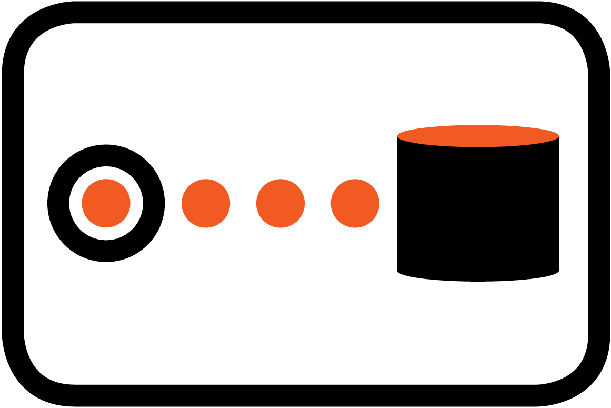

# Component Quick Start
 
## Consumers

Starting component of the flow for which only one consumer may exist in any given flow.

### Purpose

Consumers provide the &quot;glue&quot; between the entry into the flow and the underlying technology generating the event.
In order to create your own consumer you need to implement [Consumer Interface](../spec/component/src/main/java/org/ikasan/spec/component/endpoint/Consumer.java).

### Types
- [Scheduled Consumer](endpoint/quartz-schedule/Readme.md)
- [Local File Consumer](endpoint/quartz-schedule/localFileConsumer.md)
- [Generic JMS Consumer](endpoint/jms-client/consumer.md)
- [SpringTemplate JMS Consumer](endpoint/jms-spring-arjuna/consumer.md)
- [MongoDB Client Consumer](endpoint/mongo-endpoint/Readme.md)
- [FTP Consumer](endpoint/filetransfer/ftp/consumer.md)
- [SFTP Consumer](endpoint/filetransfer/sftp/consumer.md)
    
## Converters

### Purpose
The main responsibility of a converter is to convert from one POJO type to another. Coverter acts as an adapter between components requiring different input types.
Read more about EIP [Translators](http://www.enterpriseintegrationpatterns.com/patterns/messaging/MessageTranslator.html)
In order to create your own converter you need to implement [Converter Interface](../spec/component/src/main/java/org/ikasan/spec/component/transformation/Converter.java)
<br/>

### Types
- [JSON to XML Converter](converter/JsonToXmlConverter.md)
- [Map Message to Object Converter](converter/MapMessageToObjectConverter.md)
- [Map Message to Payload Converter](converter/MapMessageToPayloadConverter.md)
- [Object Message to Object Converter](converter/ObjectMessageToObjectConverter.md)
- [Object to XML String Converter](converter/ObjectToXmlStringConverter.md)
- [Payload to XML Document Converter](converter/PayloadToXmlDocumentConverter.md)
- [Text Message to String Converter](converter/TextMessageToStringConverter.md)
- [Threadsafe XSLT Converter](converter/ThreadSafeXsltConverter.md)
- [XML Byte Array to Object Converter](converter/XmlByteArrayToObjectConverter.md)
- [XML String to Object Converter](converter/XmlStringToObjectConverter.md)
- [XML to JSON Converter](converter/XmlToJsonConverter.md)
- [XSLT Configuration Parameter Converter](converter/XsltConfigurationParameterConverter.md)
- [XSLT Converter](converter/XsltConverter.md)

## Brokers

### Purpose

The main responsibility of a broker is enrich the contents of the existing message with additional data very often coming from synchronously calls to other systems. Very often broker would be utilising REST calls or DB calls.
In order to create your own broker you need to implement [Converter Interface](../spec/component/src/main/java/org/ikasan/spec/component/endpoint/Broker.java)
<br/>
<br/>
<br/>
<br/>

### Pattern

### Types

## Splitters

### Purpose
Splitter will devide existing event pasted to it or generate new event as a list of events. Any transition component following splitter will receive 'n' events one by one in order provided by the list.
Read more about EIP [Sequencer](http://www.enterpriseintegrationpatterns.com/patterns/messaging/Sequencer.html)
In order to create your own splitter you need to implement [Splitter Interface](../spec/component/src/main/java/org/ikasan/spec/component/splitting/Splitter.java)
<br/>
<br/>
<br/>
<br/>

### Types
- [Splitter](./splitter/Readme.md)

## Filters

### Purpose
Filter will allow given event to be past to next component or it will end the flow. You can think of filter as of an 'IF' statment in a programming language.
In order to create your own filter you need to implement [Filter Interface](../spec/component/src/main/java/org/ikasan/spec/component/filter/Filter.java)
<br/>

### Types
- [Duplicate Filter](./filter/Readme.md)
- [Scheduled Consumer](./filter/Readme.md)

## Routers

### Purpose


Read more about EIP [Message Router](http://www.enterpriseintegrationpatterns.com/patterns/messaging/MessageRouter.html)
In order to create your own router you need to implement  [SingleRecipientRouter Interface](../spec/component/src/main/java/org/ikasan/spec/component/routing/SingleRecipientRouter.java) or [MultiRecipientRouter Interface](../spec/component/src/main/java/org/ikasan/spec/component/routing/MultiRecipientRouter.java)
<br/>
<br/>
<br/>
<br/>
### Pattern

### Types
 
## Producers

### Purpose

Ending component of the flow, the only component in the flow which have no transition.
Read more about EIP [Message Endpoint](http://www.enterpriseintegrationpatterns.com/patterns/messaging/MessageEndpoint.html)
In order to create your own broker you need to implement [Producer Interface](../spec/component/src/main/java/org/ikasan/spec/component/endpoint/Producer.java)
<br/>
<br/>
<br/>
<br/>
### Pattern


### Types

#### Dev Null Producer

This type of producer discards all data passed to it and does not perform any processing. 

#### JMS Template Producer

The JMS producer is based on Spring template and is used to connect to any Vendor specific JMS Broker(ActiveMQ, HornetQ, IBM MQ etc). However one need to include the related vendor specific libraries in the IM.
<br/>
<br/>
<br/>
<br/>
##### Configuration Options

| Option | Type | Purpose |
| --- | --- | --- |
| destinationJNDIProperties | Map<String,String> | Optional JNDI parameters map. Typical map would include following keys : <ul><li>java.naming.provider.url</li><li> java.naming.factory.initial</li><li>java.naming.factory.url.pkgs </li><li>java.naming.security.credentials</li><li>java.naming.security.principle</li></ul> |
| destinationJNDIName | String | Destination(Topic/Queue) name, which could refer as well to JNDI name |
| connectionFactoryJNDIProperties | Map<String,String> | Optional JNDI parameters map. Typical map would include following keys : <ul><li>java.naming.provider.url</li><li> java.naming.factory.initial</li><li>java.naming.factory.url.pkgs </li><li>java.naming.security.credentials</li><li>java.naming.security.principle</li></ul> |
| connectionFactoryName | String | ConnectionFactoryName is required if not already passed on the constructor |
| connectionFactoryUsername | String | Authentication principal  |
| connectionFactoryPassword | String | Id set on the JMS connection for durable subscribers |
| pubSubDomain | boolean | set to true to indicate that destination is a topic, otherwise destination is a queue|
| deliveryPersistent | boolean | Default(false) flag indicating whether publishing messages are persisted on the broker or hold in memory   |
| deliveryMode | integer |  |
| sessionTransacted | boolean | Sets whether the session should be part of a transaction. |
| explicitQosEnabled | boolean | Default(false) |
| messageIdEnabled | boolean | Default(false) |
| messageTimestampEnabled | boolean | Default(false) |
| priority | Integer | Optional allows to set message priority on the message. This option will only work if the broker or/and consumer are configured to use the priority when dispatching/consuming messages. |
| pubSubNoLocal | boolean | Default(false) flag indicating whether to inhibit the delivery of messages published by its own connection. |
| receiveTimeout | long | Optional the timeout to use for receive calls (in milliseconds). |
| sessionAcknowledgeMode | integer | Optional the JMS acknowledgement mode that is used when creating a JMS Session to send a message   <ul><li>AUTO_ACKNOWLEDGE = 1</li><li>CLIENT_ACKNOWLEDGE = 2</li><li>DUPS_OK_ACKNOWLEDGE = 3</li><li>SESSION_TRANSACTED = 0</li></ul> |
| sessionAcknowledgeModeName | String | Optional |
| timeToLive | long | Optional the time-to-live of the message when sending. |

##### Sample Usage - Spring XML

```xml
<!-- jmsSampleProducer is a bean definition of component -->
<bean id="jmsSampleProducer" class="org.ikasan.component.endpoint.jms.spring.producer.JmsTemplateProducer">
    <property name="configuration">
        <bean class="org.ikasan.component.endpoint.jms.spring.producer.SpringMessageProducerConfiguration">
            <property name="destinationJndiName" value="java:jboss/exported/jms/topic/test.file"/>
            <property name="connectionFactoryName" value="java:/JmsXA"/>
            <property name="pubSubDomain" value="true"/>
            <property name="deliveryPersistent" value="true"/>
            <property name="sessionTransacted" value="true"/>
        </bean>
    </property>
    <property name="configuredResourceId" value="jmsSampleProducer"/>
</bean>

<!-- jmsSampleProducerFlowElement is a bean definition of flow elements which uses jmsSampleProducer as a component -->
<bean id="jmsSampleProducerFlowElement" class="org.ikasan.builder.FlowElementFactory">
    <property name="name" value="JMS Producer"/>
    <property name="component"  ref="jmsSampleProducer"/>
</bean>

```

##### Sample Usage - builder pattern

```java
public class ModuleConfig {


  @Resource
  private BuilderFactory builderFactory;

  public Consumer getJmsProducer(){


    Producer jmsProducer = builderFactory.getComponentBuilder().jmsProducer()
       .setConnectionFactoryName("java:/JmsXA")
       .setDestinationJndiName("java:jboss/exported/jms/topic/test.target")
       .setDeliveryPersistent(true)
       .setPubSubDomain(true)
       .setSessionTransacted(true)
       .setConfiguredResourceId("jmsProducer")
       .build();
    return jmsConsumer;
  }
}

```

#### (S)FTP Producer

This producer allows delivery of a file to remote (S)FTP server. The producer is under pined with persistent store which saves meta information about the deliver files.

##### Configuration Options

| Option | Type | Purpose |
| --- | --- | --- |
| clientId | String | clientId is stored as part of the meta information persisted about the processed file. The clientId should be a unique value identifing producer or consumer connecting to remote server.|
| cleanupJournalOnComplete | boolean | Default(true) Existing (S)FTP producer is using DB persistence tables to establish different operations it is performing as part of the command pattern (FileDiscovery, FileRename, FileDelivery). That persistent information is be default cleaned up when cleanupJournalOnComplete=true. It can be occasionally useful to cleanupJournalOnComplete=false when performing some debugging. |
| remoteHost | String | Default(‘localhost’) host name of the remote (S)FTP server where producer needs to connect.|
| remotePort | integer | Default(22) port of the remote (S)FTP server where producer needs to connect.|
| username | String | User name used to login to (S)FTP server where producer needs to connect.|
| password | String | password used to login to (S)FTP server where producer needs to connect. Takes precedences over privateKeyFilename. If both provided user/password combination will be used to login rather then user/privateKeyFilename. |
| maxRetryAttempts | integer | Default(3) internal (S)FTP connector retry count. |
| connectionTimeout | integer | Default(60000) expressed in milliseconds. Internal (S)FTP connector connection timeout value. |
| outputDirectory | String | Remote directory where to deliver the file |
| renameExtension | String | Default(‘tmp’) file delivery to remote location takes place in two stages, first a file is delivered with suffix equal to renameExtension, further file is renamed with suffix being removed.|
| tempFileName | String | |
| overwrite | boolean | Default(false) Flag indicating whether the remote file can be overwritten on remote server.| 
| unzip | boolean | Default(false) Flag indicating whether the file should be unzipped on remote server as post delivery task. This makes an assumption that delivered stream is zipped.| 
| checksumDelivered | boolean | Default(false) Flag indicating whether producer should generate and deliver a checksum md5 hash file to remote server.| 
| createParentDirectory | boolean | Default(false) Flag indicating whether outputDirectory should be created if it does not exist. | 
| cleanUpChunks | boolean | Default(trunk) Flag indicating whether chunk file information persisted in DB should be removed by producer after successful file delivery aka. successful file assembling from chunks.| 
| privateKeyFilename | String | Optional only available on SFTP producer. Allows authentication to remote server with private/public key set given the exchange of the keys and connectivity setup were performed upfront. |
| knownHostsFilename | String | Optional only available on SFTP producer. Works in combination with private/public key set. |
| preferredKeyExchangeAlgorithm | String | Optional only available on SFTP producer. Allowing to explicitly provide KeyExchange Algorithm used by the remote server. |
| active | boolean | Optional only available on FTP producer. Default(False) Flag indicating whether the FTP connection is active or passive | 
| dataTimeout | integer | Optional only available on FTP producer. Default(300000) expressed in milliseconds. Internal FTP connector data connection timeout value. |
| socketTimeout | integer | Optional only available on FTP producer. Default(300000) expressed in milliseconds. Internal FTP connector socket connection timeout value. |
| systemKey | String | Optional only available on FTP producer.  |


##### Sample Usage - builder pattern

```java
public class ModuleConfig {


  @Resource
  private BuilderFactory builderFactory;

  public Producer getSftpProducer(){


    Producer sftpProducer = componentBuilder.sftpProducer()
       .setClientID(sftpProducerClientID)
       .setUsername(sftpProducerUsername)
       .setPassword(sftpProducerPassword)
       .setRemoteHost(sftpProducerRemoteHost)
       .setRemotePort(sftpProducerRemotePort)
       .setOutputDirectory(sftpConsumerOutputDirectory)
       .setConfiguredResourceId("sftpProducerConfiguration")
       .build();
    return sftpProducer;
  }
}

```


# Document Info

| Authors | Ikasan Development Team |
| --- | --- |
| Contributors | n/a |
| Date | February 2018 |
| Email | info@ikasan.org |
| WebSite | [http://www.ikasan.org](http://www.ikasan.org/) |
