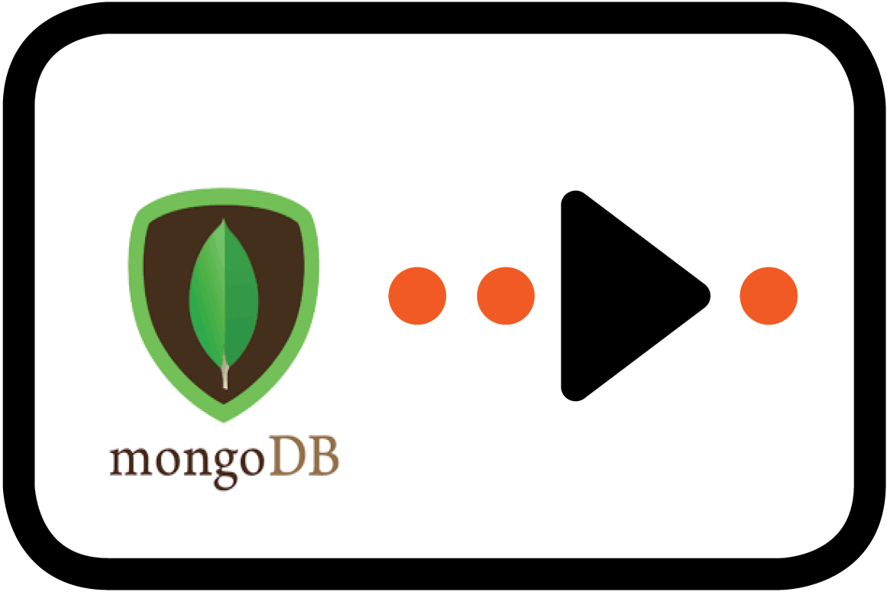

[<< Component Quick Start](../../Readme.md)

# MongoDB5 Endpoint

## Overview


The MongoDB5 endpoint provides integration with MongoDB databases using the MongoDB Java Synchronous Driver 5.x. This module includes core components for managing MongoDB connections, collections, and operations within the Ikasan Enterprise Integration Platform.
<br/>
<br/>
<br/>
<br/>

## Components

### MongoComponent

`MongoComponent` is an abstract base class that provides managed and configured MongoDB integration capabilities for Ikasan components. It implements both `ManagedResource` and `ConfiguredResource` interfaces, enabling lifecycle management and configuration within Ikasan flows.

**Key Features:**
- **Lifecycle Management**: Implements `startManagedResource()` and `stopManagedResource()` for proper connection management
- **Configuration Support**: Integrates with Ikasan's configuration framework through `ConfiguredResource<C extends MongoClientConfiguration>`
- **Shared Client Support**: Optional integration with `MongoClientProxy` for sharing a single `MongoClient` instance across multiple components
- **Collection Management**: Automatic initialization and mapping of MongoDB collections based on configuration
- **Critical Startup Flag**: Configurable criticality for flow startup dependencies

**Lifecycle Behavior:**
- On start, creates or obtains a `MongoClient` instance (either directly or via proxy)
- Initializes all configured MongoDB collections and validates their existence
- On stop, properly closes the `MongoClient` (unless externally injected or managed by proxy)
- Thread-safe start/stop operations when used with `MongoClientProxy`

**Usage Pattern:**
Extend `MongoComponent` to create MongoDB-based consumers, producers, or other integration components. The base class handles all connection management, allowing subclasses to focus on business logic.

### MongoClientProxy

`MongoClientProxy` enables multiple `MongoComponent` instances to share a single `MongoClient` connection, optimizing resource usage in scenarios where multiple flows or components access the same MongoDB cluster.

**Key Features:**
- **Connection Pooling**: Single `MongoClient` shared across multiple components
- **Reference Counting**: Tracks registered components and only closes the client when all have stopped
- **Thread Safety**: Synchronized operations for concurrent access
- **Lazy Initialization**: Client created on first use

### MongoClientFactory

Factory class for creating `MongoClient` instances from `MongoClientConfiguration`. Handles the construction of MongoDB connection strings with all configuration options, including authentication, SSL/TLS, SRV records, and custom connection parameters.

### MongoClientConfiguration

Comprehensive configuration class supporting all MongoDB connection parameters, including:
- Connection URLs and authentication credentials
- SSL/TLS settings and SRV DNS records
- Connection pool settings and timeouts
- Read preferences and write concerns
- Heartbeat and keepalive settings
- Custom connection parameters via `optionalConnectionParameters` map

Read more about EIP [Polling Consumer](http://www.enterpriseintegrationpatterns.com/patterns/messaging/PollingConsumer.html)


##### Configuration Options

NOTE: All options specified below will override any associated options in the driver if also specified.

| Option | Type | Purpose |
| --- | --- | --- |
| connectionUrls | List<String> | Connection URLs to try to connect to MongoDB (format: host:port) |
| authenticated | Boolean | Is the connection authenticated |
| username | String | Principal for simple authentication |
| password | Masked String | Password credential for simple authentication |
| databaseName | String | Name of the MongoDB database |
| applicationName | String | Application name to be passed to MongoDB connection string |
| authDatabaseName | String | Database name for authentication (defaults to databaseName if not specified) |
| sslEnabled | Boolean | Whether to use SSL/TLS for the connection (default: false) |
| sslInvalidHostNameAllowed | Boolean | Whether to allow invalid hostnames in SSL certificates (default: false) |
| srvRecord | Boolean | Whether to use '+srv' DNS SRV record for connection (default: false) |
| collectionNames | Map<String,String> | Names of the MongoDB collections. This is represented as a key-name followed by the value of the actual collection name |
| readPreference | ReadPreference | Replica set members to which any query may be sent (default: primary) |
| writeConcern | WriteConcern | Sets acknowledgement of write operations (default: ACKNOWLEDGED) |
| localThreshold | Integer | Local threshold in milliseconds - the acceptable latency difference between the fastest ping time and the slowest of the eligible servers |
| alwaysUseMBeans | Boolean | Whether JMX beans registered by the driver should always be MBeans, regardless of whether the VM is Java 6 or greater |
| connectionsPerHost | Integer | Maximum number of connections allowed per host for this MongoClient instance |
| connectionTimeout | Integer | Connection timeout in milliseconds - the timeout for connecting to a server |
| cursorFinalizerEnabled | Boolean | Sets whether cursor finalizers are enabled (default: true) |
| description | String | Description of the MongoClient for logging and debugging purposes |
| minHeartbeatFrequency | Integer | Minimum heartbeat frequency in milliseconds - the minimum time between successive heartbeats to a MongoDB server |
| heartbeatConnectTimeout | Integer | Heartbeat connect timeout in milliseconds - the timeout for connecting to a server during heartbeat |
| heartbeatFrequency | Integer | Heartbeat frequency in milliseconds - the interval between successive heartbeats to a MongoDB server |
| heartbeatSocketTimeout | Integer | Heartbeat socket timeout in milliseconds - the socket timeout for heartbeat connections |
| legacyDefaults | Boolean | Whether to use legacy default values (default: false) |
| maxConnectionIdleTime | Integer | Maximum idle time in milliseconds for a pooled connection - the maximum time a connection can remain idle before being closed |
| maxConnectionLifeTime | Integer | Maximum life time in milliseconds for a pooled connection - the maximum time a connection can exist before being closed |
| maxWaitTime | Integer | Maximum wait time in milliseconds - the maximum time a thread will block waiting for a connection to become available |
| minConnectionsPerHost | Integer | Minimum number of connections per host - the minimum size of the connection pool |
| requiredReplicaSetName | String | Required replica set name for the cluster - the client will only connect to clusters with this replica set name |
| socketKeepAlive | Boolean | Whether socket keep alive is enabled - enables TCP keep-alive on sockets |
| socketTimeout | Integer | Socket timeout in milliseconds - the timeout for socket read and write operations |
| threadsAllowedToBlockForConnectionMultiplier | Integer | Multiplier for number of threads allowed to block waiting for a connection - determines the maximum number of threads that can wait for a connection (connectionsPerHost * multiplier) |
| optionalConnectionParameters | Map<String,String> | Additional MongoDB connection string parameters not explicitly configured above. These are appended to the connection URL as key=value pairs. Refer to [MongoDB Connection String Options](https://www.mongodb.com/docs/manual/reference/connection-string/) for available parameters |

##### Additional Connection Parameters

The `optionalConnectionParameters` map allows you to specify any MongoDB connection string parameter that is not explicitly configured above. Common examples include:

- `retryWrites` - Enable retryable writes (true/false)
- `retryReads` - Enable retryable reads (true/false)
- `w` - Write concern (number or "majority")
- `journal` - Enable journaling (true/false)
- `compressors` - Compression algorithm (snappy, zlib, zstd)
- `maxPoolSize` - Maximum connection pool size
- `minPoolSize` - Minimum connection pool size
- `maxIdleTimeMS` - Maximum idle time for pooled connections
- `waitQueueTimeoutMS` - Wait timeout for a connection to become available
- `serverSelectionTimeoutMS` - Server selection timeout
- `localThresholdMS` - Local threshold for replica set member selection
- `heartbeatFrequencyMS` - Heartbeat frequency
- `replicaSet` - Replica set name
- `readPreference` - Read preference mode (primary, primaryPreferred, secondary, secondaryPreferred, nearest)
- `readConcernLevel` - Read concern level (local, majority, linearizable, available)
- `tls` - Enable TLS (true/false)
- `tlsAllowInvalidHostnames` - Allow invalid hostnames in TLS certificates (true/false)
- `tlsAllowInvalidCertificates` - Allow invalid certificates (true/false)

For a complete list of available parameters, refer to the [MongoDB Connection String documentation](https://www.mongodb.com/docs/manual/reference/connection-string/).

##### Sample Usage
(See examples above for basic usage, authenticated connections, proxy usage, advanced configuration, custom components, and replica sets)

### Example 7: MongoDB Broker Implementation for Request/Response Pattern

```java
package com.example.integration.broker;

import com.mongodb.client.MongoCollection;
import com.mongodb.client.model.Filters;
import com.mongodb.client.model.Updates;
import org.bson.Document;
import org.ikasan.component.endpoint.mongo5.MongoClientConfiguration;
import org.ikasan.component.endpoint.mongo5.MongoComponent;
import org.ikasan.spec.component.endpoint.Broker;
import org.ikasan.spec.component.endpoint.EndpointException;
import org.slf4j.Logger;
import org.slf4j.LoggerFactory;

import java.util.ArrayList;
import java.util.List;

/**
 * MongoDB Broker implementation that performs request/response operations
 * with MongoDB collections. Extends MongoComponent for lifecycle and
 * configuration management, implements Broker for request/response pattern.
 *
 * This example demonstrates:
 * - Extending MongoComponent for MongoDB integration
 * - Implementing Broker interface for request/response
 * - Performing CRUD operations on MongoDB
 * - Error handling and logging
 */
public class MongoDataBroker extends MongoComponent<MongoClientConfiguration>
    implements Broker<DataRequest, DataResponse> {

    private static final Logger logger = LoggerFactory.getLogger(MongoDataBroker.class);

    /**
     * Process a data request and return a response.
     * The MongoComponent base class ensures collections are initialized.
     *
     * @param request The incoming data request
     * @return DataResponse containing the result
     * @throws EndpointException if MongoDB operation fails
     */
    @Override
    public DataResponse invoke(DataRequest request) throws EndpointException {
        try {
            logger.info("Processing request: {}", request);

            // Access the pre-initialized collection from MongoComponent
            MongoCollection<Document> collection = collections.get("data");

            if (collection == null) {
                throw new EndpointException("Collection 'data' not found. Check configuration.");
            }

            DataResponse response = new DataResponse();

            switch (request.getOperation()) {
                case CREATE:
                    response = handleCreate(collection, request);
                    break;
                case READ:
                    response = handleRead(collection, request);
                    break;
                case UPDATE:
                    response = handleUpdate(collection, request);
                    break;
                case DELETE:
                    response = handleDelete(collection, request);
                    break;
                case QUERY:
                    response = handleQuery(collection, request);
                    break;
                default:
                    throw new EndpointException("Unsupported operation: " + request.getOperation());
            }

            logger.info("Request processed successfully: {}", response);
            return response;

        } catch (Exception e) {
            logger.error("Error processing MongoDB request", e);
            throw new EndpointException("Failed to process MongoDB request: " + e.getMessage(), e);
        }
    }

    /**
     * Create a new document in MongoDB
     */
    private DataResponse handleCreate(MongoCollection<Document> collection, DataRequest request) {
        Document doc = new Document(request.getData());
        doc.append("createdAt", System.currentTimeMillis());

        collection.insertOne(doc);

        DataResponse response = new DataResponse();
        response.setSuccess(true);
        response.setMessage("Document created successfully");
        response.setData(doc);
        return response;
    }

    /**
     * Read a document from MongoDB by ID
     */
    private DataResponse handleRead(MongoCollection<Document> collection, DataRequest request) {
        String id = request.getId();
        Document doc = collection.find(Filters.eq("_id", id)).first();

        DataResponse response = new DataResponse();
        if (doc != null) {
            response.setSuccess(true);
            response.setData(doc);
        } else {
            response.setSuccess(false);
            response.setMessage("Document not found with id: " + id);
        }
        return response;
    }

    /**
     * Update an existing document
     */
    private DataResponse handleUpdate(MongoCollection<Document> collection, DataRequest request) {
        String id = request.getId();

        // Build update operations from request data
        List<org.bson.conversions.Bson> updates = new ArrayList<>();
        request.getData().forEach((key, value) -> {
            if (!"_id".equals(key)) {
                updates.add(Updates.set(key, value));
            }
        });
        updates.add(Updates.set("updatedAt", System.currentTimeMillis()));

        long modifiedCount = collection.updateOne(
            Filters.eq("_id", id),
            Updates.combine(updates)
        ).getModifiedCount();

        DataResponse response = new DataResponse();
        response.setSuccess(modifiedCount > 0);
        response.setMessage("Modified " + modifiedCount + " document(s)");
        return response;
    }

    /**
     * Delete a document from MongoDB
     */
    private DataResponse handleDelete(MongoCollection<Document> collection, DataRequest request) {
        String id = request.getId();
        long deletedCount = collection.deleteOne(Filters.eq("_id", id)).getDeletedCount();

        DataResponse response = new DataResponse();
        response.setSuccess(deletedCount > 0);
        response.setMessage("Deleted " + deletedCount + " document(s)");
        return response;
    }

    /**
     * Query multiple documents based on criteria
     */
    private DataResponse handleQuery(MongoCollection<Document> collection, DataRequest request) {
        // Build query filter from request criteria
        List<Document> results = new ArrayList<>();

        org.bson.conversions.Bson filter = buildFilter(request.getCriteria());
        collection.find(filter)
            .limit(request.getLimit())
            .into(results);

        DataResponse response = new DataResponse();
        response.setSuccess(true);
        response.setResults(results);
        response.setMessage("Found " + results.size() + " document(s)");
        return response;
    }

    /**
     * Build MongoDB filter from request criteria
     */
    private org.bson.conversions.Bson buildFilter(java.util.Map<String, Object> criteria) {
        if (criteria == null || criteria.isEmpty()) {
            return new Document();
        }

        List<org.bson.conversions.Bson> filters = new ArrayList<>();
        criteria.forEach((key, value) -> filters.add(Filters.eq(key, value)));

        return filters.size() == 1 ? filters.get(0) : Filters.and(filters);
    }
}

/**
 * Data Transfer Objects for request/response
 */
class DataRequest {
    public enum Operation {CREATE, READ, UPDATE, DELETE, QUERY}

    private Operation operation;
    private String id;
    private java.util.Map<String, Object> data;
    private java.util.Map<String, Object> criteria;
    private int limit = 100;

    // Getters and setters
    public Operation getOperation() {
        return operation;
    }

    public void setOperation(Operation operation) {
        this.operation = operation;
    }

    public String getId() {
        return id;
    }

    public void setId(String id) {
        this.id = id;
    }

    public java.util.Map<String, Object> getData() {
        return data;
    }

    public void setData(java.util.Map<String, Object> data) {
        this.data = data;
    }

    public java.util.Map<String, Object> getCriteria() {
        return criteria;
    }

    public void setCriteria(java.util.Map<String, Object> criteria) {
        this.criteria = criteria;
    }

    public int getLimit() {
        return limit;
    }

    public void setLimit(int limit) {
        this.limit = limit;
    }

    @Override
    public String toString() {
        return "DataRequest{operation=" + operation + ", id='" + id + "'}";
    }
}

class DataResponse {
    private boolean success;
    private String message;
    private Document data;
    private List<Document> results;

    // Getters and setters
    public boolean isSuccess() {
        return success;
    }

    public void setSuccess(boolean success) {
        this.success = success;
    }

    public String getMessage() {
        return message;
    }

    public void setMessage(String message) {
        this.message = message;
    }

    public Document getData() {
        return data;
    }

    public void setData(Document data) {
        this.data = data;
    }

    public List<Document> getResults() {
        return results;
    }

    public void setResults(List<Document> results) {
        this.results = results;
    }

    @Override
    public String toString() {
        return "DataResponse{success=" + success + ", message='" + message + "'}";
    }
}
```

**Spring Configuration for MongoDB Broker:**

```java
@Configuration
class MongoBrokerConfiguration {

    @Bean
    public MongoDataBroker mongoDataBroker() {
        MongoClientConfiguration config = new MongoClientConfiguration();
        config.setConnectionUrls(Arrays.asList("localhost:27017"));
        config.setDatabaseName("integrationDb");

        // Configure collections
        Map<String, String> collections = new HashMap<>();
        collections.put("data", "integration_data");
        config.setCollectionNames(collections);

        // Optional: Configure connection pool
        config.setConnectionsPerHost(50);
        config.setMinConnectionsPerHost(10);
        config.setConnectionTimeout(10000);

        MongoDataBroker broker = new MongoDataBroker();
        broker.setConfiguration(config);
        broker.setConfiguredResourceId("mongoDataBroker");

        return broker;
    }

    @Bean
    public Flow mongoBrokerFlow(
        FlowBuilder flowBuilder,
        MongoDataBroker mongoDataBroker) {

        return flowBuilder.consumer("Consumer", scheduledConsumer())
                         .broker("MongoDB Broker", mongoDataBroker)
                         .producer("Producer", loggingProducer())
                         .build();
    }
}
```

**Usage Example:**

```java
// The broker is used in an Ikasan flow to transform messages
// by interacting with MongoDB in a request/response pattern

// Example: Creating a document
DataRequest createRequest = new DataRequest();
createRequest.setOperation(DataRequest.Operation.CREATE);

Map<String, Object> data = new HashMap<>();
data.put("name", "John Doe");
data.put("email", "john@example.com");
data.put("status", "active");
createRequest.setData(data);

// Example: Querying documents
DataRequest queryRequest = new DataRequest();
queryRequest.setOperation(DataRequest.Operation.QUERY);
Map<String, Object> criteria = new HashMap<>();
criteria.put("status", "active");
queryRequest.setCriteria(criteria);
queryRequest.setLimit(10);

// Example: Updating a document
DataRequest updateRequest = new DataRequest();
updateRequest.setOperation(DataRequest.Operation.UPDATE);
updateRequest.setId("12345");
Map<String, Object> updates = new HashMap<>();
updates.put("status", "inactive");
updateRequest.setData(updates);

// In an Ikasan flow, these requests are processed automatically:
// Consumer -> [Transformation] -> MongoDB Broker -> Producer
```

**Key Points about this Broker Implementation:**

1. **Extends MongoComponent**: Inherits lifecycle management, configuration, and collection initialization
2. **Implements Broker Interface**: Provides request/response pattern with `invoke()` method  
3. **Type Safety**: Defines clear request/response DTOs for type-safe operations
4. **CRUD Operations**: Demonstrates Create, Read, Update, Delete, and Query operations
5. **Error Handling**: Properly catches and wraps exceptions in `EndpointException`
6. **Logging**: Includes appropriate logging for debugging and monitoring
7. **Spring Integration**: Shows how to configure as a Spring bean in an Ikasan flow
8. **Collection Access**: Uses pre-initialized collections from the base `MongoComponent`
9. **Flexible**: Supports multiple operation types in a single broker implementation
10. **Production Ready**: Includes validation, error messages, and resource management

This broker can be used in Ikasan flows where you need to perform MongoDB operations as part of message processing, such as enriching messages with database lookups, storing processed data, or transforming messages based on MongoDB queries.
