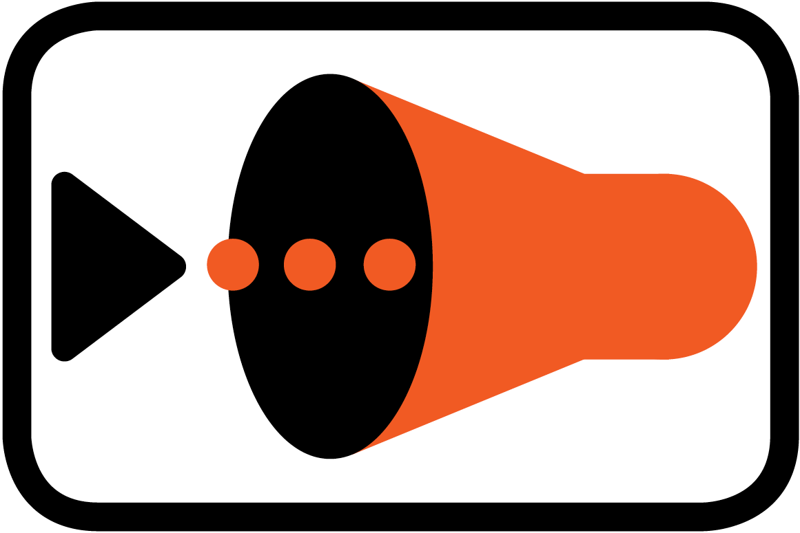

# Filters

### Purpose

Filter will allow given event to be past to next component or it will end the flow. You can think of filter as of an 'IF' statment in a programming language.
In order to create your own filter you need to implement [Filter Interface](../spec/component/src/main/java/org/ikasan/spec/component/filter/Filter.java)
 
 
 
 
### Pattern

### Types

