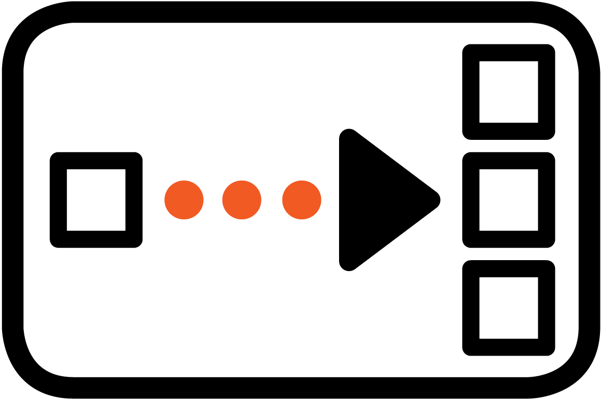

# Splitters

### Purpose

Splitter will split the incoming event into a list of multiple outgoing events. Each split event in the list will be operated on
 by each down stream component before the next split event in the list. Splitter components can be executed by the default splitter invoker as a single thread, or by the concurrent splitter invoker where each split event in the returned list can operated on concurrently.

### Pattern

### Types

- [Default Splitter](./DefaultSplitter.md)
- [Concurrent Splitter](./ConcurrentSplitter.md)

