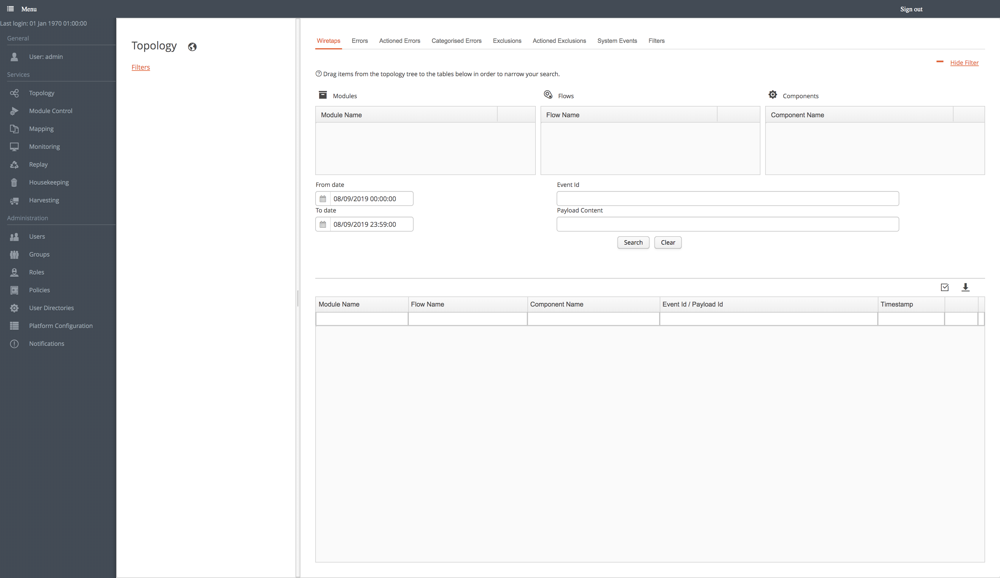

[../](../../Readme.md)

# Dashboard
 
The Ikasan Dashboard provides a management web front end for searching and tracking events passing through Ikasan Integration Modules. Ikasan dashboard functionality covers:
- [Navigating the Dashboard](./MenuNavigation.md)
- [Event Searching and Tracking](./Topology.md)
- [User Administration and Management](./UserAdministration.md)
- [Ikasan Support and Resources](./HousekeepingAndHarvesting.md)
- [Security and Access Management](./SecurityAndAccessManagement.md)
- [Data Mapping](./DataMapping.md)
- [Error and Event Exclusion Lifecycle](./Topology.md)
- [Module control](./TopologyTree.md)
- [Monitoring](./Monitoring.md)
  

## Step-by-step guide how run ikasan-dashboard as standalone 

Download ikasan-dashboard from official mvn repo [ikasan-dashboard-boot/2.1.3](https://repo1.maven.org/maven2/org/ikasan/ikasan-dashboard-boot/2.1.3/ikasan-dashboard-boot-2.1.3.jar)

### Out of the Box with h2 in-memory persistence
Out of the box the Ikasan-dashboard runs with an h2 in-memory database.

The following command will run the dashboard fully functional based on in-memory persistence.

```
$JAVA_HOME/bin/java -jar ikasan-dashboard-boot-2.1.3.jar
```           
The first time you run the dashboard you will see a number of errors in the log relating to the database, this is normal as we havent created the required tables yet.

It should be note that as this is an in-memory database you will lose all configuration as soon as the dashboard JVM is stopped.

### Out of the Box with h2 Server and file persistence
To run the dashboard with h2 as a server and file persistence, extract the H2 jar from the dashboard jar
 ```
 jar xvf ikasan-dashboard-boot-2.1.3.jar BOOT-INF/lib/h2-1.4.197.jar
 ```
 
Start the H2 Server
 ```
 java -cp ./BOOT-INF/lib/h2-1.4.197.jar org.h2.tools.Server -tcp -tcpAllowOthers
 ```

This will start the H2 server on an IP and port as shown in the example below (IP and port number may differ from you),
 ```
 TCP server running at tcp://192.168.0.8:52477 (others can connect)
 ```

This will require a configuration change to the packaged application.properties. To do this, create a config directory and a new application.properties file inside based on [application.properties](boot/src/main/resources/application.properties)

Specifically the database.url will require changing to use the H2 server IP and port, and to give the folly qualified name of the database. The final part of the url tell H2 to create the database is it doesnt already exist.
Example format,
```
datasource.url=jdbc:h2:tcp://<Specified IP>:<Specified Port>/<relative or absolute path for the database>;IFEXISTS=FALSE
```
 
```
datasource.username=sa
datasource.password=sa
datasource.driver-class-name=org.h2.Driver
datasource.url=jdbc:h2:tcp://<Specified IP>:<Specified Port>/~/dev/github/temp/archetypes/myIntegrationModule/db/esb;IFEXISTS=FALSE
datasource.dialect=org.hibernate.dialect.H2Dialect
datasource.show-sql=true
datasource.min.pool.size=20
datasource.max.pool.size=100
```
The server and port should be copied into the datasource.url below.

### Alternate Database Providers
To start the ikasan-dashboard with different DB driver configuration              
- download desired driver 
  - sybase [jconn4-7.0.jar](http://mvn.sonner.com.br/~maven/com/sybase/jdbc4/jdbc/jconn4/7.0/jconn4-7.0.jar)
  - sql [mssql-jdbc-6.2.1.jre8.jar](http://central.maven.org/maven2/com/microsoft/sqlserver/mssql-jdbc/6.2.1.jre8/mssql-jdbc-6.2.1.jre8.jar)
  - mysql [mysql-connector-java-5.1.44.jar](http://central.maven.org/maven2/mysql/mysql-connector-java/5.1.44/mysql-connector-java-5.1.44.jar)  
- create sub dir lib, and place new driver in lib        
- create sub dir config
- create new config/application.properties file based on [application.properties](boot/src/main/resources/application.properties)
 
```
datasource.username=sa
datasource.password=sa
datasource.driver-class-name=org.h2.Driver
datasource.url=jdbc:h2:tcp://<Specified IP>:<Specified Port>/~/dev/github/temp/archetypes/myIntegrationModule/db/esb;IFEXISTS=FALSE
datasource.dialect=org.hibernate.dialect.H2Dialect
datasource.show-sql=true
datasource.min.pool.size=20
datasource.max.pool.size=100
```

- Sybase 
```
datasource.username=ikasan01xxx
datasource.password=XXXXXXXXXXXXXXXXXXXXXXX
datasource.driver-class-name=com.sybase.jdbc4.jdbc.SybDataSource
datasource.xadriver-class-name=com.sybase.jdbc4.jdbc.SybXADataSource
datasource.dialect=org.ikasan.persistence.hibernate.IkasanSybaseASE157Dialect
datasource.url=jdbc:sybase:Tds:hostname:50100/Ikasan01
datasource.db.name=Ikasan01
datasource.port=50100
datasource.host=hostname
```         
   - mssql   
```
datasource.username=ikasan01xxx
datasource.password=XXXXXXXXXXXXXXXXXXXXXXX
datasource.dialect=org.hibernate.dialect.SQLServer2012Dialect
datasource.driver-class-name=com.microsoft.sqlserver.jdbc.SQLServerDriver
datasource.xa-driver-class-name=com.microsoft.sqlserver.jdbc.SQLServerXADataSource 
datasource.url=jdbc:sybase:Tds:hostname:50100/Ikasan01
datasource.db.name=Ikasan01
datasource.port=50100
datasource.host=hostname
```                          
- Start dashboard with custom driver 
```
$JAVA_HOME/bin/java -Dloader.path=lib,config -jar ikasan-dashboard-boot-2.1.3.jar

```    
### Initial Setup
Navigate to Frontend [http://localhost:9980/ikasan-dashboard](http://localhost:9980/ikasan-dashboard)

In order to setup the ikasan dashboard for the first time append #!persistanceSetupView to the url in the browser to navigate to the persistence setup page (localhost:9980/ikasan-dashboard/#!persistanceSetupView). 

You will be presented with a screen.


- Select "Full Installation" from the action drop down.
- Press the create button.

You will be presented with a dialog that prompts for the admin password that will be created.


- Enter the admin password that you wish to use. Press save.
- A notification will appear to state that the database has been created successfully. Click on the return to login link in the top left corner.

You will return to the login screen. 


- Enter the user name as 'admin' along with the password created in the previous step.

When you have logged in successfully, you will be presented with the following screen.




- you can modify binding IP, port and application context in  [application.properties](boot/src/main/resources/application.properties)
```
server.port=8080
server.address=0.0.0.0
server.servlet.context-path=/ikasan-dashboard
```      
### Initial Configuration
The Platform Configuration should be updated to ensure the server url of the dashboard is correctly set.
From the left side Menu, navigate to the Platform Configuration and then the Control tab.
Set the Dashboard Base URL to the base URL of where the dashboard is running ie. http://<IP:Port>/ikasan-dashboard.
Ensure you save this update.

WARNING: Any Integration Modules pointing to the same database must have their application.properties datasource.hbm2ddl.auto set to none. If left as the default 'create' you will drop and recreate the tables shared by the Integration Modules and the Dashboard.
```
datasource.hbm2ddl.auto=none
```

