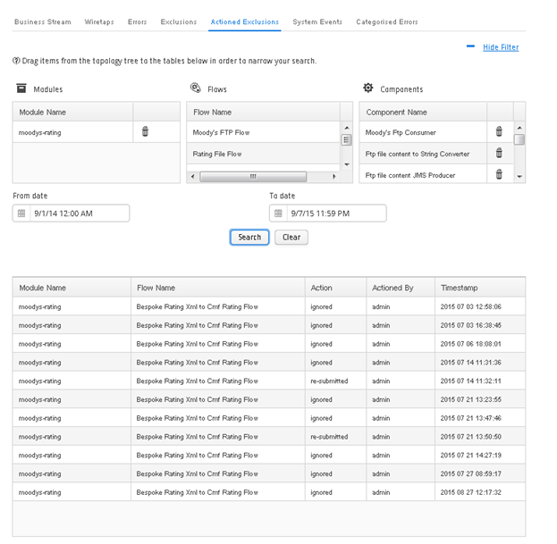
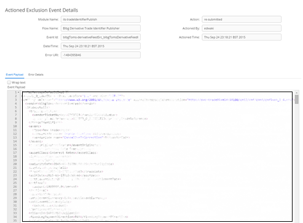
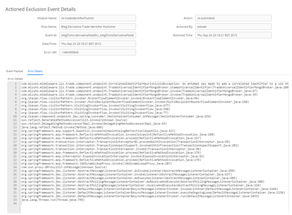

[<< Topology](./Topology.md)

## Topology - Actioned Exclusions Tab

The ‘Actioned Exclusions Tab’ allows the user to search for and view all actioned exclusions that have occurred within the ESB. An ‘Actioned Exclusion’ is an ‘Excluded Event’ that has either been resubmitted or ignored by a user.

The ‘Actioned Exclusions Tab’ consists of 2 main sections. The top section allows the user to provide filtering on the ‘Exclusions’ search. In order to filter the search ‘Modules’ and ‘Flows’ can be dragged from the topology tree and dropped into their respective tables. It is also possible to narrow by the date and time that the exclusion occurred. Once the search filter has been defined the user can click the ‘Search’ button to perform the search and results will appear in the table below. The search filter can be cleared using the ‘Clear’ button. 

The filter can be expanded and collapsed using the 'Hide Filter' link at the top right of the screen.

###	Actioned Exclusion Event Details Window

Once an ‘Actioned Exclusions’ search has been performed, it is possible to click on a row within the search results table. This will cause the ‘Actioned Exclusion Event Details’ window to open. The ‘Actioned Exclusion Event Details’ window provides further information regarding the ‘Actioned Exclusion’ including the payload of the event along with the error details.
 the ‘Excluded Event’. The action taken, who it was taken by, and at what time will be recorded against the ‘Excluded Event’. The ‘Excluded Event’ will no longer appear in future ‘Excluded Event’ searches and will become an ‘Actioned Excluded Event’ who has been ignored.

The error associated with the actioned exclusion can also be viewed.

