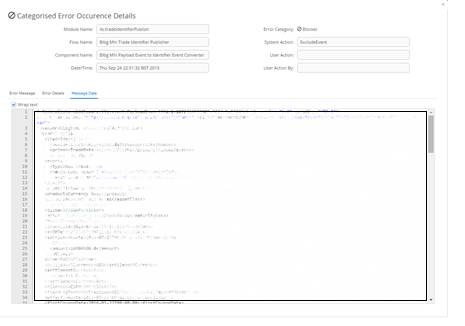

[<< Topology](./Topology.md)

## Topology - Categorised Error Tab

The ‘Categorised Errors Tab’ allows the user to search for and view all errors that have occurred within the ESB and that have a ‘Categorised Error’ associated with them.

The ‘Categorised Errors Tab’ consists of 2 main sections. The top section allows the user to provide filtering on the ‘Categorised Errors’ search. In order to filter the search ‘Modules’, ‘Flows’ and ‘Components’ can be dragged from the topology tree and dropped into their respective tables. It is also possible to narrow by the date and time that the error occurred. Once the search filter has been defined the user can click the ‘Search’ button to perform the search and results will appear in the table below. The results are colour coded based on the error category associated with them. The search filter can be cleared using the ‘Clear’ button. 

The filter can be expanded and collapsed using the 'Hide Filter' link at the top right of the screen.

###	Categorised Error Occurrence Details Window
Once a ‘Categorised Error’ search has been performed, it is possible to click on a row within the search results table. This will cause the ‘Categorised Error Occurrence Details’ window to open. The ‘Categorised Error Occurrence Details’ window provides further information regarding the ‘Error’ including the payload of the error event along with the error message and a full java stack trace and user friendly error message.

#### View the Error Message

#### View the Error Details

#### View the Error Payload

