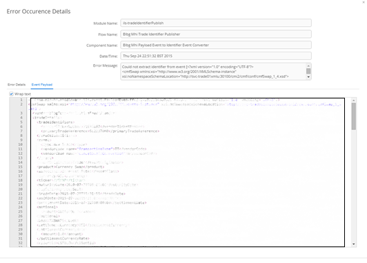

[<< Topology](./Topology.md)

## Topology - Error Tab

The ‘Errors Tab’ allows the user to search for and view all errors that have occurred within the ESB.

The ‘Errors Tab’ consists of 2 main sections. The top section allows the user to provide filtering on the ‘Errors’ search. In order to filter the search ‘Modules’, ‘Flows’ and ‘Components’ can be dragged from the topology tree and dropped into their respective tables. It is also possible to narrow by the date and time that the error occurred. Once the search filter has been defined the user can click the ‘Search’ button to perform the search and results will appear in the table below. The search filter can be cleared using the ‘Clear’ button. 

The filter can be expanded and collapsed using the 'Hide Filter' link at the top right of the screen.

###	Error Occurrence Details Window
Once an ‘Error’ search has been performed, it is possible to click on a row within the search results table. This will cause the ‘Error Occurrence Details’ window to open. The ‘Error Occurrence Details’ window provides further information regarding the ‘Error’ including the payload of the error event along with the error message and a full java stack trace.

The payload associated with the error can also be viewed.

