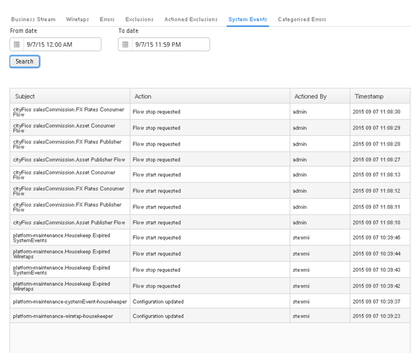

[<< Topology](./Topology.md)

## Topology - System Events Tab

The ‘System Events Tab’ allows the user to search for and view all system events that have occurred within the ESB. The following system events can occur:
- A user starting or stopping a module.
- A user creating, updating or deleing a configuration.
- When a user’s security role changes.
- When a user logs in or out of the dashboard,
- When a user creates, modifies or deletes a ‘Mapping Configuration’.

