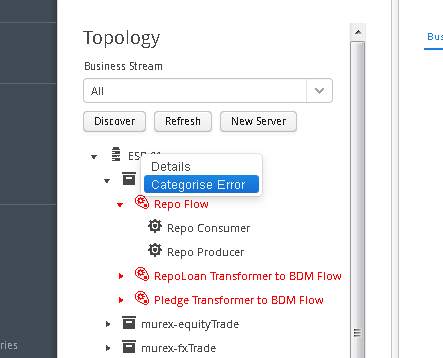
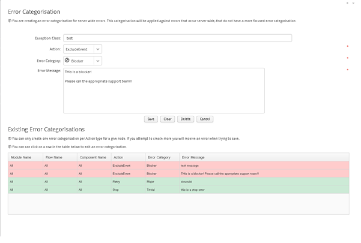

[<< Topology Tree](./TopologyTree.md)

## Topology Tree - Categorised Errors

A categorised error is a decoration of an underlying ESB error occurrence. It allows the user to provide a criticality as well as a user friendly error message for errors of a certain type, which caused a certain action at a certain location within the ESB. These errors will then be displayed on the ‘Categorised Errors Tab’ where they can be filtered based on relevant criteria.
In order to create a categorised error, select the location within the ESB where you want to categorise an error by expanding the dashboard topology tree. Right click on the node in the tree and select ‘Categorised Error’ from the menu that appears as seen in the image below.

Once you have selected the ‘Categorise Error’ menu item, a window will appear. This window allows you to create, modify or delete categorised errors associated with the node. There are some basic rules for the creation of a ‘Categorised Error’.
1.	For a given node (ESB Element) within the topology tree, the ‘Action’ / ‘Exception Class’ combination must be unique. 
2.	‘Categorised Errors’ are applied to the underlying error occurrence in a cascading manner from the most relevant to the least relevant configured ‘Categorised Error’. For example, if you have a ‘Categorised Error’ configured at the component level that is a direct match for the ‘Exception Class / Action’ combination, then this is the ‘Categorised Error’ that will be displayed in the ‘Categorised Error’ tab when searched. However, if there is no direct match at the component level, but there are ‘Categorised Errors’ configured at the flow, module or server level that match on the ‘Exception Class / Action’ combination, then this will cause this error to be included in the results on the Categorised Error tab.

The use of the ‘Error Categorisation’ window is straight forward. The form at the top allows the following to be added:
- Exception Class – free form text containing the fully qualified java exception class to match on.
- Action – the action taken by Ikasan when the exception occurs.
- Error Category – how this particular error should be categorised.
- Error message - the user friendly error message that will be displayed with the categorised error. 

Once the ‘Categorised Error’ is saved it will appear in the table of ‘Categorised Errors’ at the bottom of the window. Any of these can be selected and modified or deleted from this table.

