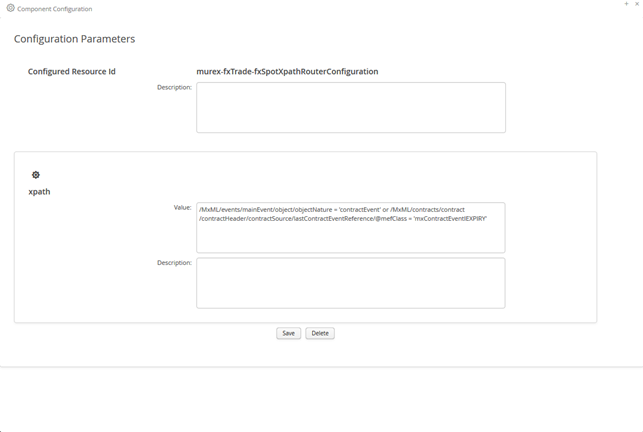
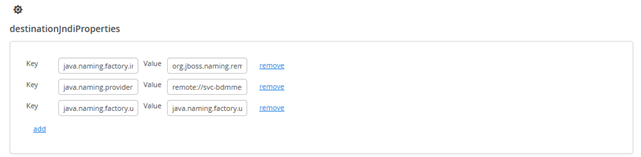
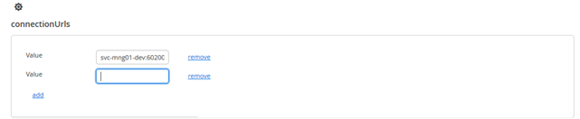

[<< Topology Tree](./TopologyTree.md)

## Topology Tree - Component Configuration

The component configuration functionality is available at the component level within the ‘Topology Tree’. It can be accessed by right clicking on the relevant component node in the topology tree that you want to create or modify the configuration for. 
Components in the topology tree are denoted by 2 different cog icons

Denotes components that are configurable, hence will have the ‘Configure’ menu option available when right mouse clicked on.

Denotes components that are not configurable and do not have the ‘Configure’ menu item available.

Once the ‘Configure’ menu item in the topology tree has been selected, the ’Component Configuration’ window will appear. The action of opening the window is twofold.
1.	If the ‘Configuration’ does not yet exist, a new one will be created. Any default field vales that have been defined in the containing module will be set on the appropriate configuration parameter when the ‘Component Configuration’ window opens.
2.	If the ‘Configuration’ already exists then all values currently set on the configuration in the database will be used to populate the ‘Component Configuration’ window.
 

Ikasan provides support for a number of different configuration parameter data types:
- Integer
- Boolean
- List of Strings
- Map of String key and value
- String
- Long 
- Masked String

These datatypes are defined on the underlying configuration object that has been created within the associated Ikasan module. All form validation that occurs when a ‘Configuration’ is saved will validate against the relevant datatypes and the user will be presented with an appropriate error message if the configuration parameter cannot be converted to the expected datatype. 

There are 2 actions that can be performed on the ‘Component Configuration’ window:
1.	Save. Will validate all datatypes that have been entered into the form with the expected underlying datatypes. Validation errors will be raised if any validation rules are violated, otherwise the configuration will be saved. NB It is important to note, newly configured configuration values will not take effect until the associated flow is restarted.
2.	Delete. This will delete the configuration from the underlying data store.

### Managing Map Configuration Parameters
Map datatypes can be used as configuration parameters. These are stored as a Map with keys which are String datatypes and values which are also String datatypes.  The image below shows a Map being managed from the ‘Component Configuration’ screen. To add a new key-value pair, click the ‘add’ link at the bottom of the existing key-value pairs. To remove an existing key-value pair, click on the ‘remove’ link to the right of the key-value pair you wish to remove. The changes to the Map will not be applied to the underlying data store until the ‘save’ button of the ‘Component Configuration’ window is pressed.

### Managing List Configuration Parameters
List datatypes can be used as configuration parameters. These are stored as a List of String elements. The image below shows a List being managed from the ‘Component Configuration’ screen. To add an element to the list, click the ‘add’ link at the bottom of the existing elements. To remove an existing element click on the ‘remove’ link to the right of the element you wish to remove. The changes to the List will not be applied to the underlying data store until the ‘save’ button of the ‘Component Configuration’ window is pressed.

