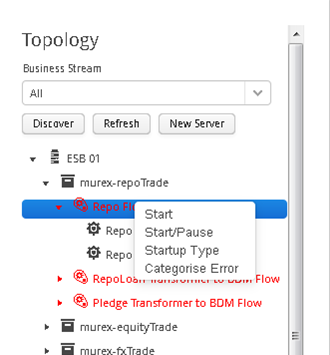
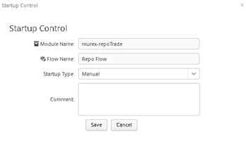

[<< Topology Tree](./TopologyTree.md)

## Topology Tree - Startup Control

The start-up control functionality is available at the flow level within the ‘Topology Tree’. It can be accessed by right clicking on the relevant 
flow node in the topology tree that you want to set the start-up control for and selecting Startup Type. There are 3 settings for start-up control:
1.	Manual – when a server restarts, it relies on the user to manually restart the flow.
2.	Automatic – when a server restarts, the flow will be automatically restarted.
3.	Disabled – the flow is disabled and cannot be restarted.

Once selected the ‘Startup Control’ window will be displayed. The user can then select the appropriate startup type. 
A comment is mandatory when setting the startup type to ‘Disabled’.

