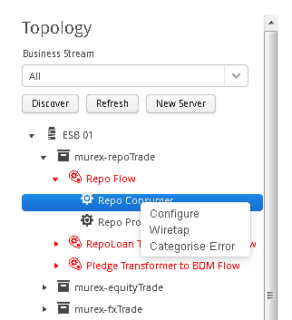
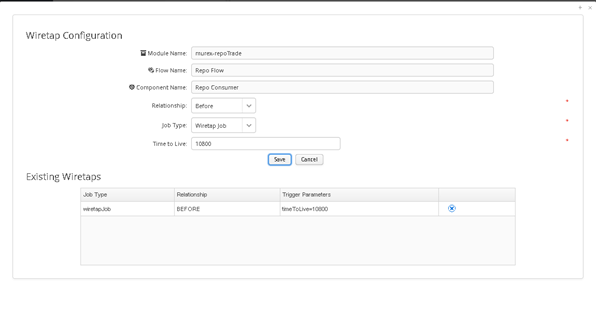

[<< Topology Tree](./TopologyTree.md)

## Topology Tree - Wiretap Configuration

The Ikasan framework supports the common EAI concept of wiretaps. A wiretap is a trigger that allows for data events that occur within the ESB to be captured in order to be search and viewed. They create a temporal trail of events flowing through the ESB and are an invaluable tool when supporting the ESB. This section explains the creation of wiretaps, while the Wiretap Tab section has more details about searching for wiretapped events.
Wiretaps are configured at the component level. This is done by right clicking on the component you wish to wiretap and selecting the ‘Wiretap’ menu item. 

Once the ‘Wiretap’ menu item has been selected, the ‘Wiretap Configuration’ will appear as seen below.

The ‘Configuration Window’ will have the Module Name, Flow Name, and Component Name fields pre-populated based on the node in the topology tree from which with ‘Wiretap’ menu item was selected. In order to create a ‘Wiretap’ the user will be required to provide values for the following fields:
- Relationship. The relationship determines when the trigger is fired. There are 2 choices. ‘Before’ which causes the wiretap trigger to be fired prior to the event being processed by the component being wiretapped. And ‘After’ which causes the wiretap trigger to be fired after the component has processed the event.
- Job Type. There are 2 job types. ‘Logging Job’ which when fired, writes details of the event to the log file that is associated with the Ikasan module that the component belongs to. ‘Wiretap Job’ which when fired, writes details of the event to the underlying data store which has been associated with Ikasan. Wiretaps can then be searched and viewed via the Ikasan dashboard as defined in section Wiretap Tab.
- Time to Live. The ‘Time to Live’ field is only relevant for ‘Wiretap Jobs’. It is configured with the ‘Wiretap Job’ to inform scheduled housekeeping processes to remove the wiretap after the ‘Time to Live’ has expired. This field is expecting a numerical value and is expressed as a time to live in seconds.

**Once the wiretap form has been completed, the save button will store the wiretap which will take immediate effect for all subsequent events received by the associated component.**

Once a ‘Wiretap’ has been saved it will appear in the ‘Existing Wiretaps’ table at the bottom of the wiretaps window. This table provides a view on all the wiretaps that have been created for a component. Wiretaps can be deleted by clicking on the delete icon in the right hand column of this table