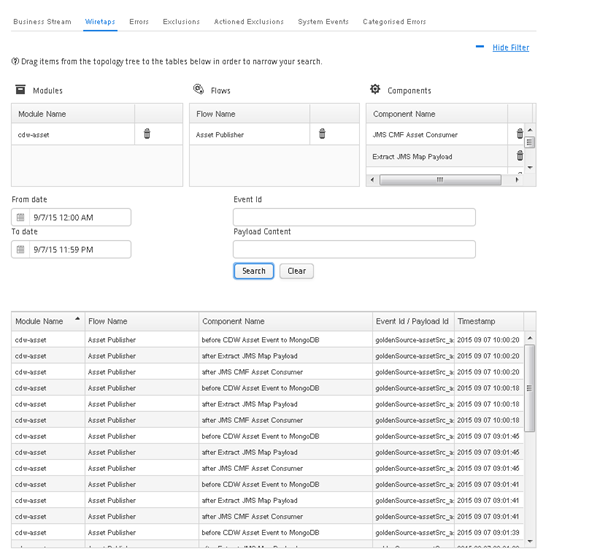
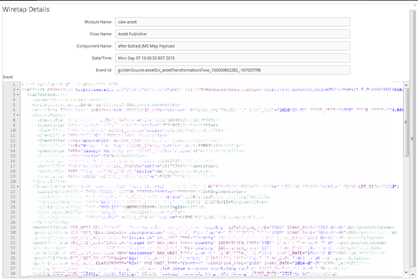

[<< Topology](./Topology.md)

## Topology - Wiretap Tab

The Ikasan framework supports the common EAI concept of wiretaps. A wiretap is a trigger that allows for data events that occur within the ESB to be captured in order to be search and viewed. They create a temporal trail of events flowing through the ESB and are an invaluable tool when supporting the ESB. This section explains the creation of wiretaps, while the Wiretap Tab section has more details about searching for wiretapped events.
Wiretaps are configured at the component level. This is done by right clicking on the component you wish to wiretap and selecting the ‘Wiretap’ menu item. 

The filter can be expanded and collapsed using the 'Hide Filter' link at the top right of the screen.

###	Wiretap Details Window
Once a ‘Wiretap’ search has been performed, it is possible to click on a row within the search results table. This will cause the ‘Wiretap Details’ window to open. The ‘Wiretap Details’ window provides further information regarding the ‘Wiretapped Event’ including the payload of the event.

