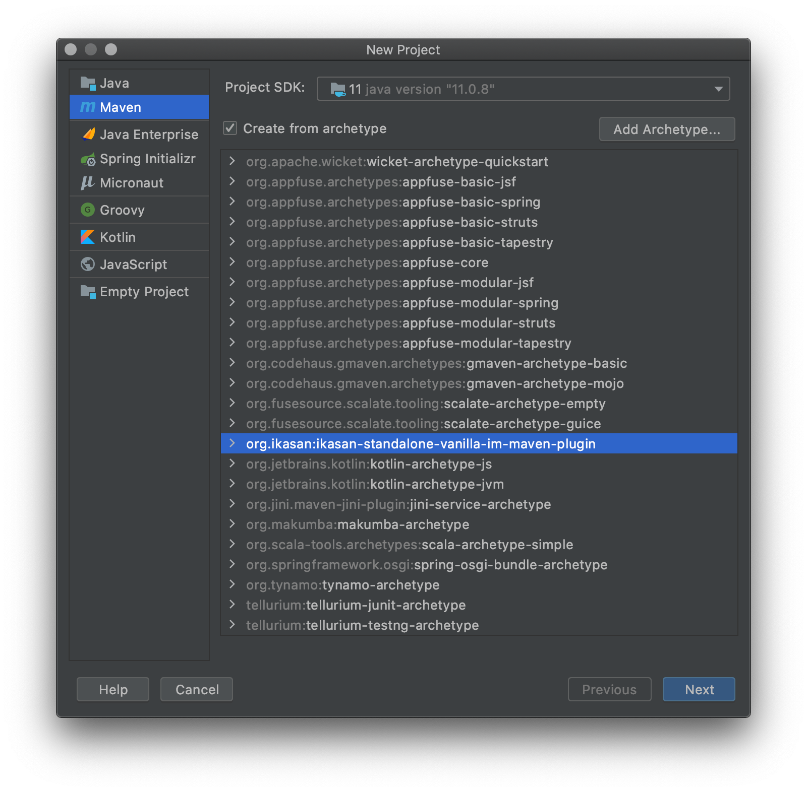
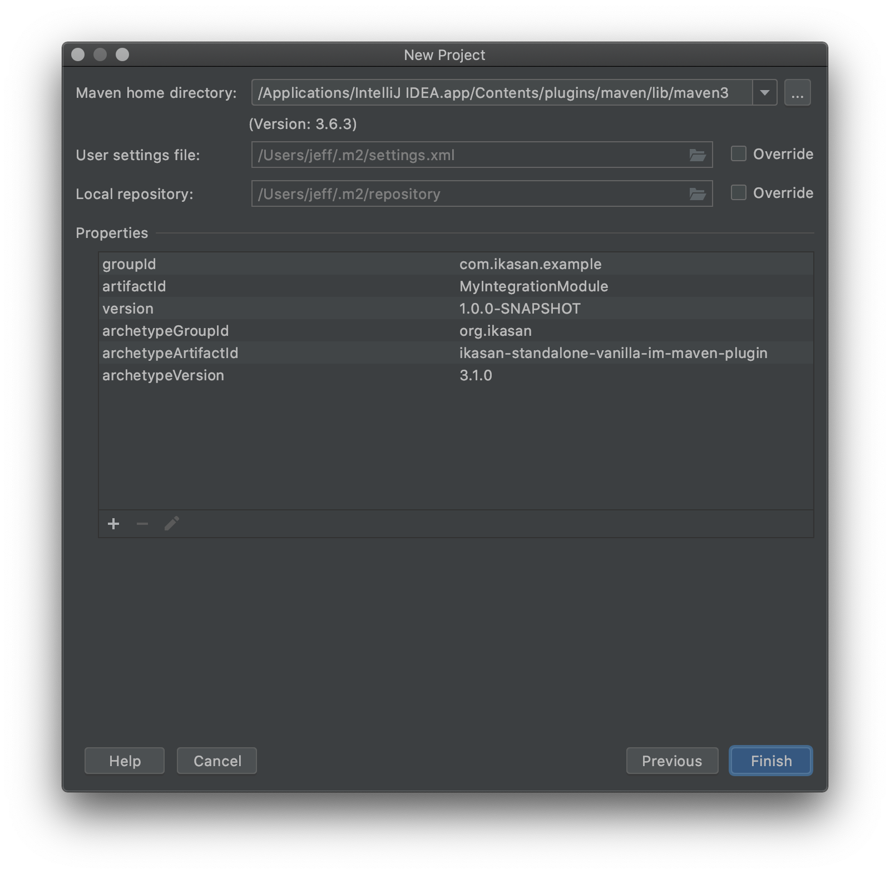

# Ikasan Developer Guide

# Introduction

## Overview

The Ikasan Enterprise Integration Platform (IkasanEIP) provides a robust and scalable ESB platform based on open technologies and standards. 
IkasanEIP can be adopted as little or as much as required to meet your integration needs.

## About

This guide demonstrates the IkasanESB features through a hands-on Ikasan Application build from scratch to a fully working solution.

_NOTE: This is an example to demonstrate the development and core features of Ikasan - it is not intended to produce a production ready solution._

This is part of the documentation suite for the Ikasan Enterprise Integration Platform.

## Audience

This guide is targeted at developers wishing to get started and undertake their first development projects with the Ikasan Enterprise Integration Platform.

A familiarity with Java and Maven is assumed.

## How to Use This Guide

This guide provides a quick and concise series of steps for getting started with the IkasanEIP platform. These steps should be followed sequentially. Points to note and other hints/tips are provided as additional information or best practices, however, full details on these aspects are beyond the scope of this document.

On completion of this document the reader should have installed and configured all required software for development and have created and run an Ikasan Application.

# Pre-Requisites

[Developer Pre-Requisiites](./DeveloperPreRequisites.md)
 
# Problem Definition
To begin we can define a simple problem to give some context to the demo. 
Typically the problem domain addressed by IkasanESB requires the sourcing of business events from one application followed by 
various conversions, orchestrations, and delivery to other downstream applications.

# Design
We will create an Ikasan Integration Module which consists 
of a single flow containing two component operations, a consumer and a producer.

    IntegrationModule
    - Flow
        - Consumer -> Producer
        
For simplicity we will utilise some Ikasan off-the-shelf consumers to mock application event generation as a source; and off-the-shelf producers to mock event publication as a target.

# Implementation
We will be using IntelliJ for the rest of this demonstration.

## Create a Project
In IntelliJ select `File/New/Project...`

Ensure you select JDK 11 as the SDK for this new project.
Select Maven, tick the checkbox "Create from archetype", then select "Add Archetype".
 

Add the coordinates of the archetype to use, for this example we will use a vanilla Ikasan archetype
based on Ikasan version 3.1.0. See [Ikasan Maven Archetypes](#ikasan-maven-archetypes) at the end of this page for a full list. 

If you are using a different Ikasan version ensure you specify the correct version.

For instance, 
- GroupId --> `org.ikasan`
- ArtefactId --> `ikasan-standalone-vanilla-im-maven-plugin`
- Version --> `3.1.0`


Select Ok.

 
Select Next from the New Project dialogue.

Now specify the project name and the directory/workspace to create this project. 
Here we have named it ```MyIntegrationModule``` and will create the project in a working directory 
```~/dev/examples/MyIntegrationModule```

You will need to expand the Artefact Coordinates to specify your project's
 Maven coordinates such as GroupId, ArtefactId, and Version.

For instance, 
- GroupId --> `com.ikasan.example`
- ArtefactId --> `MyIntegrationModule`
- Version --> `1.0.0-SNAPSHOT`
 
Select Next.

 

Finally select Finish.

You will be prompted as to how you wish to open the new project, we recommend selecting ```New Window```.
 

From here the Maven archetype will be created.

That's it, your project has been created.

Lets build it!

## Building the Project
All Ikasan projects are just standard Java Maven projects containing,
- `pom.xml` - parent Maven build pom
- `bin` - standard Ikasan command line environment scripts
- `distribution` - standard Maven packaging to create a distributable Ikasan module
- `jar` - all the Java code for this module

Open the ```Terminal``` window from within IntelliJ. 
This will open a command line at the root directory of the project.
To build and package into the binary simply run the following Maven command,
```bash
mvn clean package
```
This will build and package the application in to a distributed zip file. 
On completion of the build you should see similar output as that below in the terminal window.
 

The deployable zip can be found under ```distribution/target``` and will be named
```MyIntegrationModule-distribution-1.0.0-SNAPSHOT-dist.zip```.

This zip can be copied to anywhere, unzipped, and run as a Java progress.
for instance, 

On Linux,
```linux
unzip MyIntegrationModule-distribution-1.0.0-SNAPSHOT-dist.zip
cd MyIntegrationModule-distribution-1.0.0-SNAPSHOT
./ikasan-simple.sh start
```
On Windows,

Unzip the image using the tool of your choice.

```windows
cd MyIntegrationModule-distribution-1.0.0-SNAPSHOT
.\ikasan-simple.bat start
```

You should now be able to open a browser and access the Integration Module at 
```http://localhost:8080/MyIntegrationModule``` 

Login with the default credential admin:admin.
 

This will give you the default home page.
Selecting 'Modules' will show the Vanilla Integration Module created in this example.
 

Selecting 'Vanilla Integration Module' will show you the flows within this module.
 

We haven't actually named the flow yet, so it just says 'flow name', 
but you can still start the flow. 
 

Try it and you will see the flow status
change from stopped to running.
 

From here you can pause, resume, or stop.

Congratulations, you have created, built, packaged, and run your Integration Module.

We will now have a look at what is in the project.

## Ikasan Projects
At the end of the day Ikasan projects are just Java projects based on Maven
build and dependency management. So if you are familiar with Java and Maven then 
the Ikasan projects will look familiar.

Lets look in the IDE at what has been created. At the root we can see there is a bin directory; a distribution directory; a jar direcotry; 
and lastly a pom.xml which is the parent pom of the project.

Lets look at these in turn.

### Parent pom.xml
This is a standard Ikasan parent pom.xml containing the coordinates, properties, and build dependencies for 
an Ikasan module.
```xml
<project xmlns="http://maven.apache.org/POM/4.0.0" xmlns:xsi="http://www.w3.org/2001/XMLSchema-instance" xsi:schemaLocation="http://maven.apache.org/POM/4.0.0 http://maven.apache.org/xsd/maven-4.0.0.xsd">

    <modelVersion>4.0.0</modelVersion>

    <!-- Maven coordinates for your project -->
    <groupId>org.example</groupId>
    <artifactId>MyIntegrationModule-parent</artifactId>
    <packaging>pom</packaging>
    <version>1.0-SNAPSHOT</version>
    <name>MyIntegrationModule Integration Module Parent POM</name>
    <description>Describe the purpose of this Integration Module</description>

    <!-- build plugins -->
    <build>
        <plugins>
            <plugin>
                <groupId>org.apache.maven.plugins</groupId>
                <artifactId>maven-compiler-plugin</artifactId>
                <version>3.8.1</version>
            </plugin>
            <plugin>
                <groupId>org.apache.maven.plugins</groupId>
                <artifactId>maven-javadoc-plugin</artifactId>
                <version>3.0.1</version>
                <executions>
                    <execution>
                        <id>attach-javadocs</id>
                        <goals>
                            <goal>jar</goal>
                        </goals>
                    </execution>
                </executions>
            </plugin>
            <plugin>
                <groupId>org.apache.maven.plugins</groupId>
                <artifactId>maven-source-plugin</artifactId>
                <version>2.1.2</version>
                <executions>
                    <execution>
                        <id>attach-sources</id>
                        <goals>
                            <goal>jar</goal>
                        </goals>
                    </execution>
                </executions>
            </plugin>
            <plugin>
                <groupId>org.apache.maven.plugins</groupId>
                <artifactId>maven-enforcer-plugin</artifactId>
                <version>1.4.1</version>
                <executions>
                    <execution>
                        <id>enforce-versions</id>
                        <goals>
                            <goal>enforce</goal>
                        </goals>
                        <configuration>
                            <rules><dependencyConvergence /></rules>
                        </configuration>
                    </execution>
                </executions>
            </plugin>
        </plugins>
    </build>

    <!-- standard modules -->
    <modules>
        <module>jar</module>
        <module>distribution</module>
    </modules>

    <!-- SCM URLS -->
    <scm>
        <developerConnection><!-- scm:svn: developer connection URL --></developerConnection>
        <url><!-- SCM connection URL --></url>
        <connection><!-- scm:svn: connection URL --></connection>
    </scm>

    <!-- project properties including the Ikasan version to use -->
    <properties>
        <project.build.sourceEncoding>UTF-8</project.build.sourceEncoding>
        <version.ikasan>3.1.0</version.ikasan>
        <version.org.springboot>2.3.4.RELEASE</version.org.springboot>
        <version.com.h2database>1.4.200</version.com.h2database>
        <maven.compiler.source>11</maven.compiler.source>
        <maven.compiler.target>11</maven.compiler.target>
    </properties>

    <!-- standard Ikasan bill of materials -->
    <dependencyManagement>
        <dependencies>
            <dependency>
                <groupId>org.ikasan</groupId>
                <artifactId>ikasan-eip-standalone-bom</artifactId>
                <version>${version.ikasan}</version>
                <type>pom</type>
                <scope>import</scope>
            </dependency>
        </dependencies>
    </dependencyManagement>

</project>
```
### Bin Directory
The bin directory contains both Windows and Linux environment properties scripts which you
can customise as befits your environment. Two types of environment scripts are shipped by default,
- ```simple-env``` - for sourcing runtime properties on start-up from application.properties
- ```config-service-env``` - for sourcing runtime properties on start-up from Spring Cloud Config Server

Typically these do not need changing.

### Distribution Directory
The distribution directory contains standard Maven configuration for packaging the Ikasan Module 
as a deployable zip file. 

### Java Directory
The java directory contains all the source, configuration, and test classes required to create 
the Ikasan Integration module in a standard Maven layout.

Lets look at the key classes.

#### Application.java
This is the boot class for Ikasan. 
It is a very small, but important class which leverages Springboot to boot the Ikasan Module.
```java
package com.ikasan.sample.spring.boot.builderpattern;

import org.springframework.boot.SpringApplication;
import org.springframework.boot.autoconfigure.SpringBootApplication;

/**
 * Vanilla integration module implementation.
 *
 * @author Ikasan Development Team
 */
@SpringBootApplication
public class Application
{
    public static void main(String[] args)
    {
        new SpringApplicationBuilder()
            .environment(new StandardEncryptableEnvironment())
            .sources(Application.class).run(args);
    }
}
```

#### MyModule.java
This is the main class which defines and creates the Integration Module.

As this is just Java the code can be created any number of different ways, but what
we are showing here is a fairly standard approach.

All Ikasan artefacts can be created from a single instance of a ```builderFactory``` from Spring context. The builderFactory is the base factory class from which all Ikasan constructs such as modules, flows, and components are created.

Next we create a ```moduleBuilder``` from the ```builderFactory```. 
When we create the ```moduleBuilder``` we provide the name we are going to assign to the module.
We can also set other properties on the module through this ```moduleBuilder``` such as description.

Next, get a ```componentBuilder``` instance from the ```builderFactory``` - we will be using this in the ```flowBuilder```.

Now on to the interesting parts.

We use the ```moduleBuilder``` to get a ```flowBuilder``` and specify the name of the flow.
The components within the flow are then added as ```consumer``` and ```producer```, both from the ```componentBuilder```.
Each component is given a name and a functional class that does the work. 
The component classes shown are off-the-shelf 
Ikasan components, however, your own components can be easily written and added as shown later.

```java
package com.ikasan.sample.spring.boot.builderpattern;

import org.ikasan.builder.BuilderFactory;
import org.ikasan.builder.ModuleBuilder;
import org.ikasan.builder.OnException;
import org.ikasan.spec.flow.Flow;
import org.ikasan.spec.module.Module;
import org.springframework.context.annotation.Bean;
import org.springframework.context.annotation.Configuration;

import javax.annotation.Resource;

@Configuration("ModuleFactory")
public class MyModule
{
    @Resource
    BuilderFactory builderFactory;
    @Resource
    ComponentFactory componentFactory;

    @Bean
    public Module myModule()
    {
        // get the module builder
        ModuleBuilder moduleBuilder = builderFactory.getModuleBuilder("Vanilla Integration Module")
                .withDescription("Vanilla Integration Module.");

        Flow flow = moduleBuilder.getFlowBuilder("flow name")
            .withDescription("Vanilla source flow")
            .withExceptionResolver( builderFactory.getExceptionResolverBuilder().addExceptionToAction(Exception.class, OnException.retryIndefinitely()))
            .withMonitor( builderFactory.getMonitorBuilder().withFlowStateChangeMonitor())
            .consumer("Event Generating Consumer", builderFactory.getComponentBuilder().eventGeneratingConsumer())
            .converter("Event Converter", componentFactory.getConverter())
            .producer("Logging Producer", builderFactory.getComponentBuilder().logProducer()).build();

        Module module = moduleBuilder
            .addFlow(flow)
            .build();

        return module;
    }
}
```

So ```componentBuilder.eventGeneratingConsumer()``` returns an off-the-shelf event generating consumer component which will provide the functionality of that consumer named "My Source Consumer";
```componentBuilder.logProducer()``` returns an off-the-shelf logProducer producer component which will provide the functionality of the producer named "My Target Producer".

The consumer of this flow will continuously generate events as fast as it can - this is the default behaviour if this component isn't further configured by overriding the MessageProvider. 
The event from the consumer to the producer is a simple string message with an incrementing sequential number. The event is subsequently logged by the producer.

Each off-the-shelf component can optionally have a ```build()``` method called against it which tells the builder pattern to create this instance, as does the flow. Typically, this is optional against components when created inline like this as the Ikasan builder will call this if not called explicitly.
 
Finally we have the flow we can add it to the moduleBuilder and ```build()``` the module.
 
That is how every Ikasan Application Integration Module is created regardless of how simple or complex the operations.

#### ComponentFactory.java
This class creates your individual custom components.

## Adding your own Components
Lets add a custom Converter between the Consumer and Producer components.

To start with we will create a new Converter component implementation.

Create a new class called ```com.ikasan.example.converter.MyConverter```.
To implement the class as an Ikasan Converter component we simply need to use the Converter contract through ```implement Converter```
The contract for the Converter allows for the provision of generic types defining the incoming type and the return type on the method.
In the example below the Converter is expecting an incoming String which it will convert and return as an Integer.

```java
package com.ikasan.example.converter;

import org.ikasan.spec.component.transformation.Converter;
import org.ikasan.spec.component.transformation.TransformationException;

public class MyConverter implements Converter<String,Integer>
{
    public Integer convert(String payload) throws TransformationException
    {
        String[] strings = payload.split(" ");
        int intPart = Integer.valueOf( strings[2] );
        return Integer.valueOf(intPart);
    }
}
```

Now we need to add this new Converter operation to our flow.

Simply update the flowBuilder lines to insert this new component called "My Converter".
```java
        // create a flow from the module builder and add required orchestration components
        Flow eventGeneratingFlow = moduleBuilder.getFlowBuilder("Event Generating Flow")
                .consumer("My Source Consumer", componentBuilder.eventGeneratingConsumer())
                .converter("My Converter", new MyConverter())
                .producer("My Target Producer", componentBuilder.logProducer())
                .build();
```
Remember, you are adding a new functional class that will need to be imported at the top of your MyModule class as 
```
import com.ikasan.example.converter.MyConverter;
```
Build it, run it, and start the flow from the Browser and see what gets output to the logs by the LogProducer.

You will notice that the `payload=` has changed from the 'Test Message 1' etc, to simply just the integer part of the message from the consumer.

## Exception Handling
Every Ikasan flow has an automatically created and assigned 'Recovery Manager'. The role of the Recovery Manager is to manage the flow if things fail at runtime i.e. an Exception occurs in the flow or any of its components.

Lets see what happens if we get our Converter to throw an exception on a specific message i.e message 5.
```java
    public Integer convert(String payload) throws TransformationException
    {
        String[] strings = payload.split(" ");
        int intPart = Integer.valueOf( strings[2] );
        if(intPart == 5)
        {
            throw new TransformationException("error - bad number received [" + 5 + "]");
        }
        return Integer.valueOf(intPart);
    }
```
Build it, run it, and start the flow from the Browser.

If you look at the logs you will see that when it gets to message 5 an exception occurs 
and the Recovery Manager kicked in to decide what to do. 
```java
RecoveryManager resolving to [Stop] for componentName[My Converter] exception [error - bad number received [5]]

org.ikasan.spec.component.transformation.TransformationException: error - bad number received [5]
	at com.ikasan.example.converter.MyConverter.convert(MyConverter.java:14) ~[classes/:na]
	at com.ikasan.example.converter.MyConverter.convert(MyConverter.java:6) ~[classes/:na]
	at org.ikasan.flow.visitorPattern.invoker.ConverterFlowElementInvoker.invoke(ConverterFlowElementInvoker.java:121) ~[ikasan-flow-visitorPattern-2.1.0.jar:na]
	at org.ikasan.flow.visitorPattern.VisitingInvokerFlow.invoke(VisitingInvokerFlow.java:860) [ikasan-flow-visitorPattern-2.1.0.jar:na]
	at org.ikasan.flow.visitorPattern.VisitingInvokerFlow.invoke(VisitingInvokerFlow.java:778) [ikasan-flow-visitorPattern-2.1.0.jar:na]
	at org.ikasan.flow.visitorPattern.VisitingInvokerFlow.invoke(VisitingInvokerFlow.java:76) [ikasan-flow-visitorPattern-2.1.0.jar:na]
	at org.ikasan.component.endpoint.util.consumer.EventGeneratingConsumer.onMessage(EventGeneratingConsumer.java:190) [ikasan-utility-endpoint-2.1.0.jar:na]
	at org.ikasan.component.endpoint.util.consumer.EventGeneratingConsumer.onMessage(EventGeneratingConsumer.java:61) [ikasan-utility-endpoint-2.1.0.jar:na]
	at sun.reflect.NativeMethodAccessorImpl.invoke0(Native Method) ~[na:1.8.0_111]
	at sun.reflect.NativeMethodAccessorImpl.invoke(NativeMethodAccessorImpl.java:62) ~[na:1.8.0_111]
	at sun.reflect.DelegatingMethodAccessorImpl.invoke(DelegatingMethodAccessorImpl.java:43) ~[na:1.8.0_111]
	at java.lang.reflect.Method.invoke(Method.java:498) ~[na:1.8.0_111]
	at org.springframework.aop.support.AopUtils.invokeJoinpointUsingReflection(AopUtils.java:333) [spring-aop-4.3.10.RELEASE.jar:4.3.10.RELEASE]
	at org.springframework.aop.framework.ReflectiveMethodInvocation.invokeJoinpoint(ReflectiveMethodInvocation.java:190) [spring-aop-4.3.10.RELEASE.jar:4.3.10.RELEASE]
	at org.springframework.aop.framework.ReflectiveMethodInvocation.proceed(ReflectiveMethodInvocation.java:157) [spring-aop-4.3.10.RELEASE.jar:4.3.10.RELEASE]
	at org.springframework.transaction.interceptor.TransactionInterceptor$1.proceedWithInvocation(TransactionInterceptor.java:99) [spring-tx-4.3.10.RELEASE.jar:4.3.10.RELEASE]
	at org.springframework.transaction.interceptor.TransactionAspectSupport.invokeWithinTransaction(TransactionAspectSupport.java:282) [spring-tx-4.3.10.RELEASE.jar:4.3.10.RELEASE]
	at org.springframework.transaction.interceptor.TransactionInterceptor.invoke(TransactionInterceptor.java:96) [spring-tx-4.3.10.RELEASE.jar:4.3.10.RELEASE]
	at org.springframework.aop.framework.ReflectiveMethodInvocation.proceed(ReflectiveMethodInvocation.java:179) [spring-aop-4.3.10.RELEASE.jar:4.3.10.RELEASE]
	at org.springframework.aop.framework.JdkDynamicAopProxy.invoke(JdkDynamicAopProxy.java:213) [spring-aop-4.3.10.RELEASE.jar:4.3.10.RELEASE]
	at com.sun.proxy.$Proxy87.onMessage(Unknown Source) [na:na]
	at org.ikasan.component.endpoint.util.consumer.SimpleMessageGenerator.execute(SimpleMessageGenerator.java:95) [ikasan-utility-endpoint-2.1.0.jar:na]
	at org.ikasan.component.endpoint.util.consumer.SimpleMessageGenerator.run(SimpleMessageGenerator.java:83) [ikasan-utility-endpoint-2.1.0.jar:na]
	at java.util.concurrent.Executors$RunnableAdapter.call(Executors.java:511) [na:1.8.0_111]
	at java.util.concurrent.FutureTask.run(FutureTask.java:266) [na:1.8.0_111]
	at java.util.concurrent.ThreadPoolExecutor.runWorker(ThreadPoolExecutor.java:1142) [na:1.8.0_111]
	at java.util.concurrent.ThreadPoolExecutor$Worker.run(ThreadPoolExecutor.java:617) [na:1.8.0_111]
	at java.lang.Thread.run(Thread.java:745) [na:1.8.0_111]
```
In this case because we havent told the Recovery Manager to take specific action on this type of exception
it resolves to stopping the flow in error. This stoppedInError state can also be seen on the Console when refreshed.


Lets tell the Recovery Manager to take a different action on this exception.

* Option one set exception resolver on given flow
  
As this is a setting on the flow we need to update the code on the flowBuilder to add
a different exceptionResolver. In this case when we see a TransformationException we are now going to exclude the event
that caused the exception. 
  ```java
        // create a flow from the module builder and add required orchestration components
        Flow eventGeneratingFlow = moduleBuilder.getFlowBuilder("Event Generating Flow")
                .withExceptionResolver(builderFactory
                        .getExceptionResolverBuilder()
                        .addExceptionToAction(TransformationException.class, OnException.excludeEvent()).build())
                .consumer("My Source Consumer", componentBuilder.eventGeneratingConsumer())
                .converter("My Converter", new MyConverter())
                .producer("My Target Producer", componentBuilder.logProducer())
                .build();
   ```
* Option two configure default exception resolver through properties

   In this case when we see a TransformationException we are now going to exclude the event
   that caused the exception. Update application properties with following  
  ```java
  # In order to configure exclusion behavior 
  ikasan.exceptions.excludedClasses[0]=org.ikasan.spec.component.transformation.TransformationException
  
  # In order to configure ignore behavior  ignoredClasses
  #ikasan.exceptions.ignoredClasses[0]=org.ikasan.spec.component.transformation.TransformationException
     
  # In order to configure Retry
  #ikasan.exceptions.retry-configs.[0].className=org.ikasan.spec.component.transformation.TransformationException
  #ikasan.exceptions.retry-configs.[0].delayInMillis=10000
  #ikasan.exceptions.retry-configs.[0].maxRetries=10
  
  # In order to configure Scheduled Retry
  #ikasan.exceptions.scheduled-retry-configs.[0].className=org.ikasan.spec.component.transformation.TransformationException
  #ikasan.exceptions.scheduled-retry-configs.[0].cronExpression=0 0/1 * * * ?
  #ikasan.exceptions.scheduled-retry-configs.[0].maxRetries=10
  
   ```

## Setting Persistent Flow Configurations
Each flow has a persistent configuration associated with it [FlowPersistentConfiguration](../../flow/visitorPatternFlow/src/main/java/org/ikasan/flow/configuration/FlowPersistentConfiguration.java)
which exposes 3 configuration values.

| Configuration Name      | Type    | Description                                                                                                                                                                                                                                                                                                                                                                                                                                                                                                                                                                                                                                                                                                                                                                                                                                                                                          | Default Value |
|-------------------------|---------|------------------------------------------------------------------------------------------------------------------------------------------------------------------------------------------------------------------------------------------------------------------------------------------------------------------------------------------------------------------------------------------------------------------------------------------------------------------------------------------------------------------------------------------------------------------------------------------------------------------------------------------------------------------------------------------------------------------------------------------------------------------------------------------------------------------------------------------------------------------------------------------------------|---------------|
| isRecording             | Boolean | Flag to instruct the flow to record messages it receives.                                                                                                                                                                                                                                                                                                                                                                                                                                                                                                                                                                                                                                                                                                                                                                                                                                            | false         |
| recordedEventTimeToLive | int     | The number of days to retain the recorded messages before they are house kept.                                                                                                                                                                                                                                                                                                                                                                                                                                                                                                                                                                                                                                                                                                                                                                                                                       | 30            |
| invokeContextListeners  | Boolean | Flag to indicate whether or not to invoke the associated [FlowInvocationContextListeners](../../spec/flow/src/main/java/org/ikasan/spec/flow/FlowInvocationContextListener.java). There are currently 2 implementations available in Ikasan <br/> - [ComponentTimingLoggingListener](../../flow/visitorPatternFlow/src/main/java/org/ikasan/flow/context/ComponentTimingLoggingListener.java) which provides simple timings of component invocations, written to the log file associated with the module.<br/> -  [MessageHistoryContextListener](../../wiretap/src/main/java/org/ikasan/history/listener/MessageHistoryContextListener.java) provides a richer set of persisten information relating to component and flow invocations, including timings, a snapped event if so configured as well as any [CustomMetrics](../../wiretap/src/main/java/org/ikasan/history/model/CustomMetric.java). | false         |

The properties can be set in the relevant application.properties file associated with the module where 'flowName' is replaced with the relevant flow name. 
If the flow name contains white space use a backslash to escape the whitespace. For example 'My\ Flow\ Name'. 
```properties
ikasan.flow.configuration[flowName].isRecording=true
ikasan.flow.configuration[flowName].recordedEventTimeToLive=100
ikasan.flow.configuration[flowName].invokeContextListeners=true
```

## Setting Flow Component Invoker Configurations
The invocation of each component within Ikasan as a configuration associated with it  [InvokerConfiguration](../../flow/visitorPatternFlow/src/main/java/org/ikasan/flow/visitorPattern/invoker/InvokerConfiguration.java)
which exposes 3 configuration values.

| Configuration Name   | Type    | Description                                                                                                                                                                               | Default Value |
|----------------------|---------|-------------------------------------------------------------------------------------------------------------------------------------------------------------------------------------------|---------------|
| snapEvent            | boolean | If this flag is set to true, the event associated with the component invocation will be written to the underlying persistent store, and will subsequently be harvested to Solr.           | false         |
| captureMetrics       | boolean | If this flag is set to true, Ikasan will capture metrics associated with the component invocation, written to the underlying persisten store, and will subsequently be harvested to Solr. | false         |
| dynamicConfiguration | boolean | If the component is a ConfiguredResource, then the configuration will be dynmanically backed into the persistent store each time the component is invoked.                                | false         |

The properties can be set in the relevant application.properties file associated with the module as seen below.

Each property value String is in the format `<flow-name>, <component-name>, <snap-event>, <capture-metric>, <dynamic-configuration>`.

```properties
ikasan.flow.component.invoker.configuration.flowComponentInvokerConfigurations[0]=flowName, consumer, false, true, false
ikasan.flow.component.invoker.configuration.flowComponentInvokerConfigurations[1]=flowName, producerA ,false, false, true
```


Build it, run it, and start the flow from the Browser.

Now we see the same error occuring, but the Recovery Manager excludes the event and allows the flow to keep running.
If you look in the logs you will see something like this,
```
2018-04-14 11:57:51.681  INFO 4811 --- [0.1-8090-exec-2] o.i.f.v.VisitingInvokerFlow              : Started Flow[EventGeneratingFlow] in Module[My Integration Module]
2018-04-14 11:57:51.687  INFO 4811 --- [pool-4-thread-1] o.i.c.e.util.producer.LogProducer        : GenericFlowEvent [identifier=Message 1, relatedIdentifier=null, timestamp=1523703471683, payload=1]
2018-04-14 11:57:52.692  INFO 4811 --- [pool-4-thread-1] o.i.c.e.util.producer.LogProducer        : GenericFlowEvent [identifier=Message 2, relatedIdentifier=null, timestamp=1523703472692, payload=2]
2018-04-14 11:57:53.696  INFO 4811 --- [pool-4-thread-1] o.i.c.e.util.producer.LogProducer        : GenericFlowEvent [identifier=Message 3, relatedIdentifier=null, timestamp=1523703473696, payload=3]
2018-04-14 11:57:54.701  INFO 4811 --- [pool-4-thread-1] o.i.c.e.util.producer.LogProducer        : GenericFlowEvent [identifier=Message 4, relatedIdentifier=null, timestamp=1523703474701, payload=4]
2018-04-14 11:57:55.711  INFO 4811 --- [pool-4-thread-1] o.i.recovery.ScheduledRecoveryManager    : RecoveryManager resolving to [ExcludeEvent] for componentName[My Converter] exception [error - bad number received [5]]

org.ikasan.spec.component.transformation.TransformationException: error - bad number received [5]
	at com.ikasan.example.converter.MyConverter.convert(MyConverter.java:14) ~[classes/:na]
	at com.ikasan.example.converter.MyConverter.convert(MyConverter.java:6) ~[classes/:na]
	at org.ikasan.flow.visitorPattern.invoker.ConverterFlowElementInvoker.invoke(ConverterFlowElementInvoker.java:121) ~[ikasan-flow-visitorPattern-2.1.0.jar:na]
	at org.ikasan.flow.visitorPattern.VisitingInvokerFlow.invoke(VisitingInvokerFlow.java:860) [ikasan-flow-visitorPattern-2.1.0.jar:na]
	at org.ikasan.flow.visitorPattern.VisitingInvokerFlow.invoke(VisitingInvokerFlow.java:778) [ikasan-flow-visitorPattern-2.1.0.jar:na]
	at org.ikasan.flow.visitorPattern.VisitingInvokerFlow.invoke(VisitingInvokerFlow.java:76) [ikasan-flow-visitorPattern-2.1.0.jar:na]
	at org.ikasan.component.endpoint.util.consumer.EventGeneratingConsumer.onMessage(EventGeneratingConsumer.java:190) [ikasan-utility-endpoint-2.1.0.jar:na]
	at org.ikasan.component.endpoint.util.consumer.EventGeneratingConsumer.onMessage(EventGeneratingConsumer.java:61) [ikasan-utility-endpoint-2.1.0.jar:na]
	at sun.reflect.NativeMethodAccessorImpl.invoke0(Native Method) ~[na:1.8.0_111]
	at sun.reflect.NativeMethodAccessorImpl.invoke(NativeMethodAccessorImpl.java:62) ~[na:1.8.0_111]
	at sun.reflect.DelegatingMethodAccessorImpl.invoke(DelegatingMethodAccessorImpl.java:43) ~[na:1.8.0_111]
	at java.lang.reflect.Method.invoke(Method.java:498) ~[na:1.8.0_111]
	at org.springframework.aop.support.AopUtils.invokeJoinpointUsingReflection(AopUtils.java:333) [spring-aop-4.3.10.RELEASE.jar:4.3.10.RELEASE]
	at org.springframework.aop.framework.ReflectiveMethodInvocation.invokeJoinpoint(ReflectiveMethodInvocation.java:190) [spring-aop-4.3.10.RELEASE.jar:4.3.10.RELEASE]
	at org.springframework.aop.framework.ReflectiveMethodInvocation.proceed(ReflectiveMethodInvocation.java:157) [spring-aop-4.3.10.RELEASE.jar:4.3.10.RELEASE]
	at org.springframework.transaction.interceptor.TransactionInterceptor$1.proceedWithInvocation(TransactionInterceptor.java:99) [spring-tx-4.3.10.RELEASE.jar:4.3.10.RELEASE]
	at org.springframework.transaction.interceptor.TransactionAspectSupport.invokeWithinTransaction(TransactionAspectSupport.java:282) [spring-tx-4.3.10.RELEASE.jar:4.3.10.RELEASE]
	at org.springframework.transaction.interceptor.TransactionInterceptor.invoke(TransactionInterceptor.java:96) [spring-tx-4.3.10.RELEASE.jar:4.3.10.RELEASE]
	at org.springframework.aop.framework.ReflectiveMethodInvocation.proceed(ReflectiveMethodInvocation.java:179) [spring-aop-4.3.10.RELEASE.jar:4.3.10.RELEASE]
	at org.springframework.aop.framework.JdkDynamicAopProxy.invoke(JdkDynamicAopProxy.java:213) [spring-aop-4.3.10.RELEASE.jar:4.3.10.RELEASE]
	at com.sun.proxy.$Proxy87.onMessage(Unknown Source) [na:na]
	at org.ikasan.component.endpoint.util.consumer.SimpleMessageGenerator.execute(SimpleMessageGenerator.java:95) [ikasan-utility-endpoint-2.1.0.jar:na]
	at org.ikasan.component.endpoint.util.consumer.SimpleMessageGenerator.run(SimpleMessageGenerator.java:83) [ikasan-utility-endpoint-2.1.0.jar:na]
	at java.util.concurrent.Executors$RunnableAdapter.call(Executors.java:511) [na:1.8.0_111]
	at java.util.concurrent.FutureTask.run(FutureTask.java:266) [na:1.8.0_111]
	at java.util.concurrent.ThreadPoolExecutor.runWorker(ThreadPoolExecutor.java:1142) [na:1.8.0_111]
	at java.util.concurrent.ThreadPoolExecutor$Worker.run(ThreadPoolExecutor.java:617) [na:1.8.0_111]
	at java.lang.Thread.run(Thread.java:745) [na:1.8.0_111]

Hibernate: select erroroccur_.Uri, erroroccur_.ModuleName as ModuleNa2_2_, erroroccur_.FlowName as FlowName3_2_, erroroccur_.FlowElementName as FlowElem4_2_, erroroccur_.ErrorDetail as ErrorDet5_2_, erroroccur_.ErrorMessage as ErrorMes6_2_, erroroccur_.ExceptionClass as Exceptio7_2_, erroroccur_.EventLifeIdentifier as EventLif8_2_, erroroccur_.EventRelatedIdentifier as EventRel9_2_, erroroccur_.Action as Action10_2_, erroroccur_.Event as Event11_2_, erroroccur_.EventAsString as EventAs12_2_, erroroccur_.Timestamp as Timesta13_2_, erroroccur_.Expiry as Expiry14_2_, erroroccur_.UserAction as UserAct15_2_, erroroccur_.ActionedBy as Actione16_2_, erroroccur_.UserActionTimestamp as UserAct17_2_, erroroccur_.Harvested as Harvest18_2_ from ErrorOccurrence erroroccur_ where erroroccur_.Uri=?
Hibernate: insert into ErrorOccurrence (ModuleName, FlowName, FlowElementName, ErrorDetail, ErrorMessage, ExceptionClass, EventLifeIdentifier, EventRelatedIdentifier, Action, Event, EventAsString, Timestamp, Expiry, UserAction, ActionedBy, UserActionTimestamp, Harvested, Uri) values (?, ?, ?, ?, ?, ?, ?, ?, ?, ?, ?, ?, ?, ?, ?, ?, ?, ?)
Hibernate: insert into ExclusionEvent (Id, ModuleName, FlowName, Identifier, Event, Timestamp, ErrorUri, Harvested) values (null, ?, ?, ?, ?, ?, ?, ?)
2018-04-14 11:57:56.769  INFO 4811 --- [pool-4-thread-1] o.i.c.e.util.producer.LogProducer        : GenericFlowEvent [identifier=Message 6, relatedIdentifier=null, timestamp=1523703476769, payload=6]
2018-04-14 11:57:57.774  INFO 4811 --- [pool-4-thread-1] o.i.c.e.util.producer.LogProducer        : GenericFlowEvent [identifier=Message 7, relatedIdentifier=null, timestamp=1523703477773, payload=7]
2018-04-14 11:57:58.778  INFO 4811 --- [pool-4-thread-1] o.i.c.e.util.producer.LogProducer        : GenericFlowEvent [identifier=Message 8, relatedIdentifier=null, timestamp=1523703478778, payload=8]
```

If you are running the Ikasan Dashboard, you will be able to navigate to the Topology view and select the Error tab, to see the error; or the Exclusion tab to see the excluded event.

## Configuring Components
Currently we have hardcoded a value of 5 to indicate the bad message in the Converter. What if we want this to be user defined or even dynamic based on runtime?

### Configured Resources
We can tell a component that it is a ConfiguredResource. Telling it this allows access to configure attributes on the component through the Console.
Firstly, lets define a simple JavaBean to denote the configuration properties we wish to expose.
Create a new class called ```com.ikasan.example.converter.MyConverterConfiguration``` within which we will
define an attribute as a configurable value called 'badNumber'.

```java
package com.ikasan.example.converter;

public class MyConverterConfiguration
{
    int badNumber = 5;

    public int getBadNumber() {
        return badNumber;
    }

    public void setBadNumber(int badNumber) {
        this.badNumber = badNumber;
    }
}
```
Next, update the Converter component to implement ```ConfiguredResource```.
The ConfiguredResource interface allows you to specify the exact type of the configuration, 
in this case ```MyConverterConfiguration```.
```java
package com.ikasan.example.converter;

import org.ikasan.spec.component.transformation.Converter;
import org.ikasan.spec.component.transformation.TransformationException;
import org.ikasan.spec.configuration.ConfiguredResource;

public class MyConverter implements Converter<String,Integer>, ConfiguredResource<MyConverterConfiguration>
{
    public Integer convert(String payload) throws TransformationException
    {
        String[] strings = payload.split(" ");
        int intPart = Integer.valueOf( strings[2] );
        if(intPart == 5)
        {
            throw new TransformationException("error - bad number received [" + 5 + "]");
        }
        return Integer.valueOf(intPart);
    }
}
```
Implementing this new contract will require some additional methods to be created to support the configuration instance and 
a configuredResourceId.

The ConfiguredResourceId is an identifier which ties this instance of the configuration with this component. Infact, if you use the same ConfiguredResourceId across multiple components
it will load the same instance of the configuration. This can sometimes be very useful where multiple components need to share a configuration.
However, care should be taken as sometimes shared configuration is not what you want and in that case you simply need to provide a different ConfiguredResourceId value.
It is best practice to set the ConfiguredResourceId to something representative of that module, flow, and component.

The example class below is updated for these method implementations.
```java
package com.ikasan.example.converter;

import org.ikasan.spec.component.transformation.Converter;
import org.ikasan.spec.component.transformation.TransformationException;
import org.ikasan.spec.configuration.ConfiguredResource;

public class MyConverter implements Converter<String,Integer>, ConfiguredResource<MyConverterConfiguration>
{
    String configuredResourceId;
    MyConverterConfiguration configuration = new MyConverterConfiguration();
    
    public Integer convert(String payload) throws TransformationException
    {
        String[] strings = payload.split(" ");
        int intPart = Integer.valueOf( strings[2] );
        if(intPart == 5)
        {
            throw new TransformationException("error - bad number received [" + 5 + "]");
        }
        return Integer.valueOf(intPart);
    }

    public String getConfiguredResourceId() {
        return configuredResourceId;
    }

    public void setConfiguredResourceId(String configuredResourceId) {
        this.configuredResourceId = configuredResourceId;
    }

    public MyConverterConfiguration getConfiguration() {
        return configuration;
    }

    public void setConfiguration(MyConverterConfiguration configuration) {
        this.configuration = configuration;
    }
}
```
Finally, change the converter method to use the configuration attribute rather than the hard-coded 5.
```java
    public Integer convert(String payload) throws TransformationException
    {
        String[] strings = payload.split(" ");
        int intPart = Integer.valueOf( strings[2] );
        if(intPart == configuration.getBadNumber())
        {
            throw new TransformationException("error - bad number received [" + configuration.getBadNumber() + "]");
        }
        return Integer.valueOf(intPart);
    }
```
Ikasan also has the concept of Configured - this is typically used where your component, marked as a ConfiguredResource, has other classes that can also be configured, but arent defined as specific components.

In this case the subsequent classes would simply be marked as Configured.

So now we have updated our module lets build it, run it, and open the Console from a Browser.

#### Configuration Validation
The configuration class can implement the ```IsValidationAware``` interface which will require the class to implement a ```validate()``` method.
This method allows the configuration class to have specific attributes checked to ensure validity. The ```validate()``` method is called by Ikasan just prior to the configuration being passed to the component, any failure will result in an ```InvalidConfigurationException``` being thrown from validate().
Typically this should only be thrown from ```validate()``` on critical issues with the configuration instance. Validation will be called on any configuration implementing this contract.

### Dynamic Configured Resources
Configured resources can specifically be set to persist their configuration on every event invocation through the flow.
This can be useful where the configuration itself is updated based on the inflight event.
To do this the component must first be set as a ConfiguredResource (interface implementation on the component class) at build time. 
Once set dynamic configuration can be turned on at runtime through the configuration of the component invoker.

*NOTE: If dynamicConfiguration is false, any updates to a component configuration will only work whilst the flow is running - it will not be persisted. Restart of a flow will reset that configuration back to its original state.*

Setting the component invoker with dynamicConfiguration true or false turns dynamic configuration on and off respectively. 
Turning this on will ensure the configuration is loaded at the start of the inflight event and updated on completion of processing the inflight event.
Changing the content of the configuration is left to the remit of the developer. This can be achieved by updating the configuration in 
the component using that configuration; or, for off-the-shelf components, as a subsequent translator component.

#### FluentAPI Builder Pattern Usage
Dynamic Configuration can also be set programmatically via the FluentAPI builder pattern.
```java
         Flow eventGeneratingFlow = moduleBuilder.getFlowBuilder("Event Generating Flow")
                 .withExceptionResolver(builderFactory
                         .getExceptionResolverBuilder()
                         .addExceptionToAction(TransformationException.class, OnException.excludeEvent()).build())
                 .consumer("My Source Consumer", componentBuilder.eventGeneratingConsumer())
                 .converter("My Converter", new MyConverter(), org.ikasan.builder.invoker.Configuration.converterInvoker().withDynamicConfiguration(true))
                 .producer("My Target Producer", componentBuilder.logProducer())
                 .build();
```
Here is an example of changing a configuration property based on the incoming event within a ConfiguredResource component.

Lets first add a new attribute to hold timestamp in the configuration.
```java
package com.ikasan.example.converter;

public class MyConverterConfiguration
{
    long timestamp;
    
    int badNumber = 5;

    public int getBadNumber() {
        return badNumber;
    }

    public void setBadNumber(int badNumber) {
        this.badNumber = badNumber;
    }

    public long getTimestamp()
    {
        return timestamp;
    }

    public void setTimestamp(long timestamp)
    {
        this.timestamp = timestamp;
    }
}
```

Then update the converter to set the timestamp to the invocation time.
```java
package com.ikasan.example.converter;

import org.ikasan.spec.component.transformation.Converter;
import org.ikasan.spec.component.transformation.TransformationException;
import org.ikasan.spec.configuration.ConfiguredResource;

public class MyConverter implements Converter<String,Integer>, ConfiguredResource<MyConverterConfiguration>
{
    String configuredResourceId;
    MyConverterConfiguration configuration = new MyConverterConfiguration();

    public Integer convert(String payload) throws TransformationException
    {
        // update a timestamp in the configuration based on the time the event hits this component
        configuration.setTimestamp( System.currentTimeMillis() );

        String[] strings = payload.split(" ");
        int intPart = Integer.valueOf( strings[2] );
        if(intPart == configuration.getBadNumber())
        {
            throw new TransformationException("error - bad number received [" + configuration.getBadNumber() + "]");
        }
        return Integer.valueOf(intPart);
    }

    public String getConfiguredResourceId() {
        return configuredResourceId;
    }

    public void setConfiguredResourceId(String configuredResourceId) {
        this.configuredResourceId = configuredResourceId;
    }

    public MyConverterConfiguration getConfiguration() {
        return configuration;
    }

    public void setConfiguration(MyConverterConfiguration configuration) {
        this.configuration = configuration;
    }
}
```

In this example a timestamp configuration property is set to current timestamp on the occurrence of each inflight event. By turning on dynamicConfiguration we can ensure this configuration change is persisted with the success of the event publication.
Should any exceptions occur within the flow then the persistence does not occur and the original configuration values restored on the next inflight event.

#### Configuration of Invoker via the Management Console
Changing DynamicConfiguration at runtime.


#### Configuration of Invoker via the Ikasan Dashboard
TODO

#### Compatibility Note ####
Prior to release ikasaneip-2.1.0 you needed to implement a marker interface on the class to tell Ikasan that it was a dynamic configured resource. 
From ikasan-2.1.0 onwards, the DynamicConfigured interface has been removed and components can be marked as dynamically configured through runtime configuration on the component invoker.

When upgrading from a version prior to 2.1.0, you will need to remove any DynamicConfiguration interface implementations on your component classes and ensure you turn on dynamicConfiguration either through the FluentAPI builder pattern or the runtime console for that component.

## Managed Resource Component
TODO

```java
package com.ikasan.example.converter;

import org.ikasan.spec.component.transformation.Converter;
import org.ikasan.spec.component.transformation.TransformationException;
import org.ikasan.spec.configuration.ConfiguredResource;
import org.ikasan.spec.management.ManagedResource;
import org.ikasan.spec.management.ManagedResourceRecoveryManager;
import org.slf4j.Logger;
import org.slf4j.LoggerFactory;

public class MyConverter implements Converter<String,Integer>,
        ConfiguredResource<MyConverterConfiguration>, ManagedResource
{
    private final static Logger logger = LoggerFactory.getLogger(MyConverter.class);

    MyConverterConfiguration configuration  = new MyConverterConfiguration();
    String configuredResourceId;
    boolean critical;

    public Integer convert(String payload) throws TransformationException
    {
        // update a timestamp in the configuration based on the time the event hits this component
        configuration.setTimestamp( System.currentTimeMillis() );

        String[] strings = payload.split(" ");
        int intPart = Integer.valueOf( strings[2] );
        if(intPart == configuration.getBadNumber())
        {
            throw new TransformationException("error - bad number received [" + configuration.getBadNumber() + "]");
        }
        return Integer.valueOf(intPart);
    }

    public String getConfiguredResourceId() {
        return configuredResourceId;
    }

    public void setConfiguredResourceId(String configuredResourceId)
    {
        this.configuredResourceId = configuredResourceId;
    }

    public MyConverterConfiguration getConfiguration() {
        return configuration;
    }

    public void setConfiguration(MyConverterConfiguration myConverterConfiguration)
    {
        this.configuration =  myConverterConfiguration;
    }

    public void startManagedResource() 
    {
        configuration.setTimestamp(0L);
        logger.info("Call to start any managed resources");
    }

    public void stopManagedResource() {
        logger.info("Call to stop any managed resources");
    }

    public void setManagedResourceRecoveryManager(ManagedResourceRecoveryManager managedResourceRecoveryManager) {

    }

    public boolean isCriticalOnStartup() {
        return critical;
    }

    public void setCriticalOnStartup(boolean critical) {
        this.critical = critical;
    }
}
```
## Encrypting Clear Text Passwords
Ikasan supports the encryption of sensitive configuration properties in the Spring Boot application.properties file using Java Simplified Encryption 
(http://www.jasypt.org/) and jasypt-spring-boot (https://github.com/ulisesbocchio/jasypt-spring-boot). 

The [sample encrypted properties](../../sample/non-functional/encrypted-properties) module is a working example of an Ikasan module that employs property encryption. 
In order to encrypt properties the following steps are required.

Generate a private key:
```
openssl genpkey -algorithm RSA -out <key-name>.pem -pkeyopt rsa_keygen_bits:2048
```
Generate a public key from the private key:
```
openssl rsa -pubout -in <key-name>.pem -out <key-name>_pub.pem
```

Store the keys in a secure location.

[PropertyEncryptor.java](../../sample/non-functional/encrypted-properties/src/test/java/com/ikasan/sample/spring/boot/builderpattern/PropertyEncryptor.java) provides a sample implementation
of an approach to using the public key in order to encrypt a property value. In this case the default H2 password.

In the application.properties file add the encrypted password to the properties file. It must be prefixed with 'ENC(' and with a ')' suffix.

```
datasource.password=ENC(uXO66pHlRQGR9mNBtSpCALrJPHvJ1hfgM+zDqRWUYWSWic4pM/uOduNZa+LkJuONiOwbQjbecDJwfLN0wPs4XWIs/1xV+feDpdK62+UygY1ePxjzUJlAUDBa7eXqqlmsmEq9LGuR3BVtXjMd0s2Jihy8FVD+9WmJ3HlQQv4N9JlOHjt+vBWsoh+Hof/IJEY7y80FFp2ABBy1MOt/c/52fIXzz8nlqEXKUbA4HYpUGU01+mwcnF/UhP75KWo5UK4uUcSU9jgm7dRa+iuSp67IFLhgTJ/gg5x/wWzMq/Rf/7rVHa1Rf0nNaLXzykc9tPaJIogWbfHqvvNPtt8/mxKG3g==)
```

Details of the private key location must also be shared with the Spring Boot application in the properties file.

```
# encryption configuration
jasypt.encryptor.private-key-format=pem
jasypt.encryptor.private-key-location=<path-to-private-key>/jasypt.pem
```

The application will now bootstrap and delegate to jasypt to decrypt all encrypted values in the application.properties file.

## Testing
TOOO
### Unit Testing
#### Methods
#### Components
#### Flows
Flow testing is a great way of verifying that the whole Integration Module bootstraps correctly. It also allows you to exercise each and every route through the flow in a controlled and verifiable manner. 

Before we create the flow test we need to change the module to provide certainty around the events invoking the flow. The default EndpointEventProvider for the Event Generating consumer creates as many events as possible as quickly as possible - we need to override this with something more measureable to test.

So firstly, lets create a consistent EndpointEventProvider implementation by adding the following to the ```com.ikasan.example.MyModule``` class.
```java
public class MyModule
{
    ...
    
    class MyMessageProvider implements EndpointEventProvider<String>
    {
        int count = 0;

        @Override
        public String getEvent()
        {
            return (++count <= 1 ?  "Test Message " + count : null);
        }

        @Override
        public void rollback()
        {

        }
    }
}
```
The above MyMessageProvider will create events until count exceeds 1 - so in this case just one event in total.

We also need to override the EndpointEventProvider on the consumer in the same class. The sample below shows the full java class with the new EndpointEventProvider implementation and override on the consumer.
```java
package com.ikasan.example;

import com.ikasan.example.converter.MyConverter;
import org.ikasan.builder.BuilderFactory;
import org.ikasan.builder.ModuleBuilder;
import org.ikasan.builder.component.ComponentBuilder;
import org.ikasan.component.endpoint.consumer.api.spec.EndpointEventProvider;
import org.ikasan.spec.flow.Flow;
import org.ikasan.spec.module.Module;
import org.quartz.JobExecutionContext;
import org.springframework.context.annotation.Bean;
import org.springframework.context.annotation.Configuration;
import org.springframework.context.annotation.ImportResource;

import javax.annotation.Resource;

@Configuration("ModuleFactory")
@ImportResource( {
        "classpath:h2-datasource-conf.xml",
        "classpath:ikasan-transaction-pointcut-ikasanMessageListener.xml"
} )
public class MyModule
{
    @Resource BuilderFactory builderFactory;

    @Bean
    public Module myModule()
    {
        // Create a module builder from the builder factory
        ModuleBuilder moduleBuilder = builderFactory.getModuleBuilder("My Integration Module")
                .withDescription("My first integration module.");

        // Create a component builder from the builder factory
        ComponentBuilder componentBuilder = builderFactory.getComponentBuilder();

        // create a flow from the module builder and add required orchestration components
        Flow eventGeneratingFlow = moduleBuilder.getFlowBuilder("Event Generating Flow")
                .consumer("My Source Consumer", componentBuilder.eventGeneratingConsumer()
                .setEndpointEventProvider( new MyMessageProvider() ))
                .converter("My Converter", new MyConverter())
                .producer("My Target Producer", componentBuilder.logProducer())
                .build();

        // Add the created flow to the module builder and create the module
        Module module = moduleBuilder
                .addFlow(eventGeneratingFlow)
                .build();
        return module;
    }

    class MyMessageProvider implements EndpointEventProvider<String>
    {
        int count = 0;

        @Override
        public String getEvent()
        {
            return (++count <= 1 ?  "Test Message " + count : null);
        }

        @Override
        public void rollback()
        {

        }
    }
}
```
Now we have consistent event generation we can use the following test class.
```java
package com.ikasan.example;

import org.ikasan.spec.flow.Flow;
import org.ikasan.spec.module.Module;
import org.ikasan.testharness.flow.rule.IkasanFlowTestRule;
import org.junit.Assert;
import org.junit.Before;
import org.junit.Rule;
import org.junit.Test;
import org.junit.runner.RunWith;
import org.springframework.boot.test.context.SpringBootTest;
import org.springframework.test.context.junit4.SpringRunner;

import javax.annotation.Resource;


@RunWith(SpringRunner.class)
@SpringBootTest(classes = {Application.class},
        webEnvironment = SpringBootTest.WebEnvironment.RANDOM_PORT)
public class ApplicationTest
{
    @Resource
    private Module moduleUnderTest;

    @Rule
    public IkasanFlowTestRule ikasanFlowTestRule = new IkasanFlowTestRule();

    @Before
    public void setup()
    {
        Flow flowUnderTest = (Flow) moduleUnderTest.getFlow("Event Generating Flow");
        ikasanFlowTestRule.withFlow(flowUnderTest);
    }

    @Test
    public void test()
    {
        ikasanFlowTestRule
                .consumer("My Source Consumer")
                .converter("My Converter")
                .producer("My Target Producer");

        ikasanFlowTestRule.startFlow();

        while (ikasanFlowTestRule.getFlowState().equals(Flow.RUNNING))
        {
            ikasanFlowTestRule.sleep(500);
        }

        Assert.assertTrue(ikasanFlowTestRule.getFlowState().equals(Flow.STOPPED));
    }
}
```

#### Exception Handling
#### Monitoring
#### Modules
#### Business Streams

# Ikasan Maven Archetypes
The basic constituents of an Ikasan Integration Module (IM) are the same. 
Due to this we have created some out of the box IM archetypes based on common technical integration problems.

- [DB (SQL) to JMS / JMS to DB (SQL) Integration Module Archetype](../mvn-archetype/ikasan-standalone-db-jms-im/Readme.md)
- [Local File System to JMS / JMS to Local File System Integration Module Archetype](../mvn-archetype/ikasan-standalone-filesystem-im/Readme.md)
- [FTP to JMS / JMS to FTP Integration Module Archetype](../mvn-archetype/ikasan-standalone-ftp-jms-im/Readme.md)
- [Hibernate DB to JMS / JMS to Hibernate DB Integration Module Archetype](../mvn-archetype/ikasan-standalone-hibernate-jms-im/Readme.md)
- [JMS to JMS Integration Module Archetype](../mvn-archetype/ikasan-standalone-jms-im/Readme.md)
- [SFTP to JMS / JMS to SFTP Integration Module Archetype](../mvn-archetype/ikasan-standalone-sftp-jms-im/Readme.md)
- [Vanilla Integration Module Archetype](../mvn-archetype/ikasan-standalone-vanilla-im/Readme.md)
