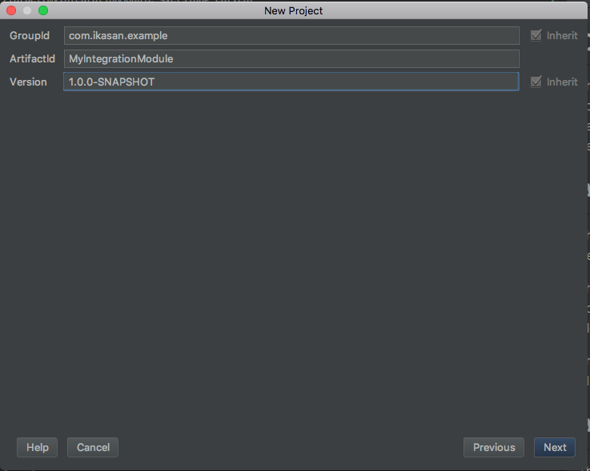
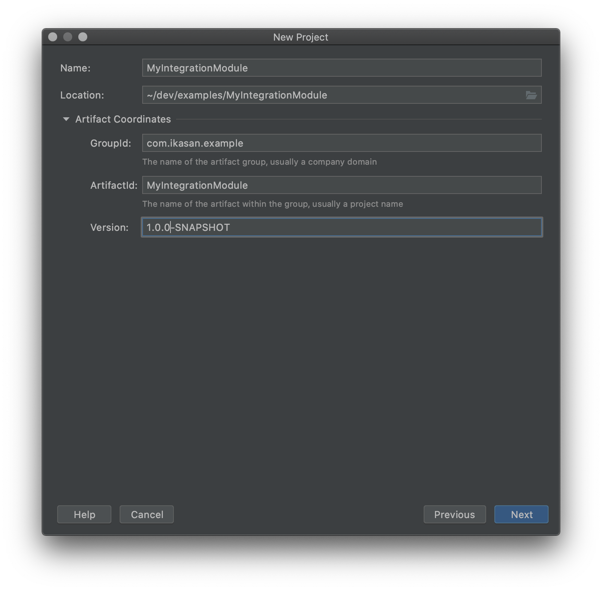
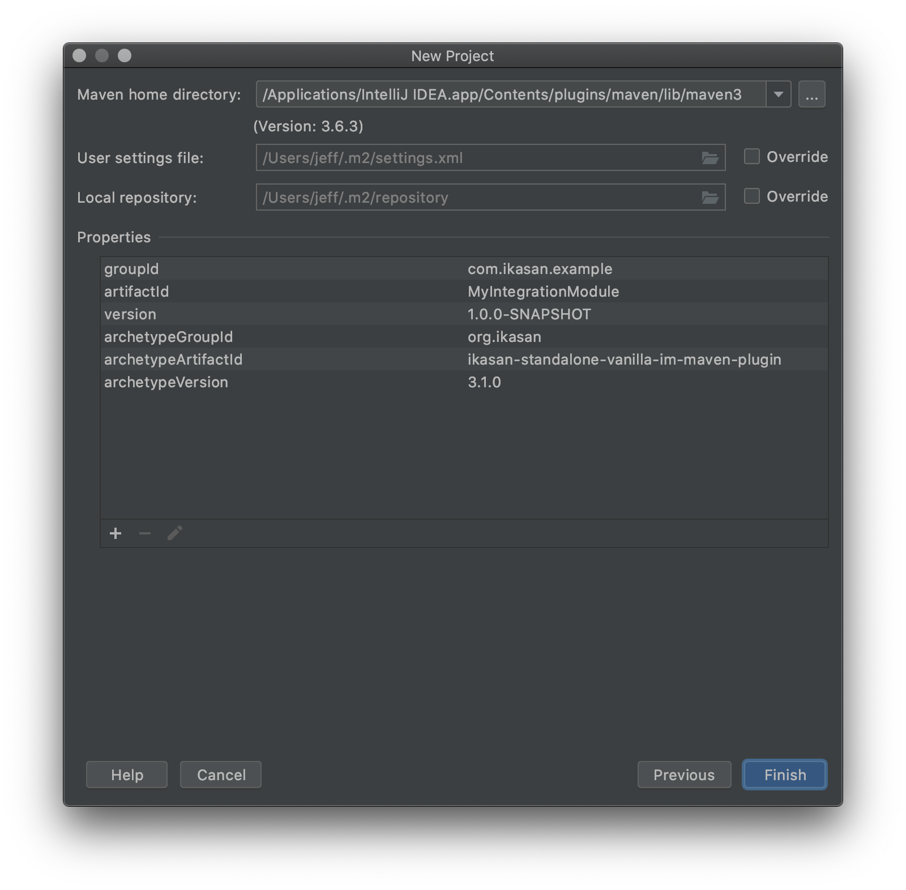

# Ikasan Getting Started Guide

# Introduction

## Overview

The Ikasan Enterprise Integration Platform (IkasanEIP) provides a robust and scalable ESB platform based on open technologies and standards. IkasanEIP can be adopted as little or as much as required to meet your integration needs.

## About

This document will guide you through the process of creating an Ikasan development environment and runtime platform from scratch.

This will include the build tools and configuration; container install and configuration; and the creation and deployment of a simple Ikasan Integration Module.

This is part of the documentation suite for the Ikasan Enterprise Integration Platform.

## Audience

This guide is targeted at developers wishing to get started and undertake their first development projects with the Ikasan Enterprise Integration Platform.

Although not mandatory to getting started familiarity with Java, XML, Spring, and general Application Server concepts around data sources and deployment packaging constructs i.e. jar, ear, war will be advantageous.

## How to Use This Guide

This guide provides a quick and concise series of steps for getting started with the IkasanEIP platform. These steps should be followed sequentially. Points to note and other hints/tips are provided as additional information or best practices, however, full details on these aspects are beyond the scope of this document.

On completion of this document the reader should have installed and configured all required software for development and have an operational runtime environment containing a functional example Integration Module.

**NOTE: This does not denote a production quality runtime environment.  **

# Development Platform Structure

You can choose to install and configure the platform and tooling on your machine as is your preference – the following is recommended simply as a guide providing a split between the development tools; your development sandbox area; and your development runtime environment.
```
${root\_install\_dir}/${devtools\_install\_dir}
                         /${runtime\_dir}
                         /${sandbox\_dir}
```

where,

${devtools\_install\_dir} - contains your development tools installs i.e. Java, Maven

${runtime\_dir}  - is your runtime environment for deployment

${sandbox\_dir}  - is your area for creating and building Integration Modules

For convenience we will refer to the base directories above throughout this guide.

# Development Tools

This section assumes you have nothing currently in place. If you do have any of the tools installed/configured then please check the setup and versions to ensure they are compatible.

## Java Development Kit/Runtime Environment

IkasanEIP is built in Java (JDK) and runs on the Java Runtime Environment (JRE).

IkasanEIP will support any language which compiles to bytecode and runs within the Java Virtual Machine (JVM).

For more details on Java see [http://www.oracle.com./technetwork/java](http://www.oracle.com./technetwork/java)

### Version

IkasanEIP version 1.0.0+ requires Java 1.8.x.

### Installation

Download the JDK appropriate for your Operating System.

All Java JDK downloads are available from [http://www.oracle.com./technetwork/java/javase/downloads/index.html](http://www.oracle.com./technetwork/java/javase/downloads/index.html)

Install by following the JDK installation instructions.

We will refer to the java install directory as ${devtools\_install\_dir}/java although depending on your OS and installer the location may differ.  For instance, on Windows this may be under "_Program Files\Java_".

The important point is that we have the JAVA_HOME and PATH environment variables set to reflect this java install.

#### Setting Unix Environment Variables
```
export JAVA_HOME=${root\_install\_dir}/${platform\_install\_dir}/<java install dir name>;
export PATH=$JAVA_HOME/bin;$PATH |
```

#### Setting Windows Environment Variables
```
set JAVA_HOME=%root\_install\_dir%\%platform\_install\_dir%\<java install dir name>
set PATH=%JAVA_HOME%\bin:%PATH% |
```

### Sanity Checks

You can test your installation by starting a new command line session and typing,
```
  java –version 
```

This should reflect the Java JDK version you have just installed.

For instance – the line in bold depicts the important information.

```
java version "1.8.0_31"
Java(TM) SE Runtime Environment (build 1.8.0_31-b13)
Java HotSpot(TM) 64-Bit Server VM (build 25.31-b07, mixed mode)
```

## Maven

IkasanEIP uses Maven for its build and build time dependency management.

For more details on Maven see [http://maven.apache.org](http://maven.apache.org/)

### Version

IkasanEIP version 1.0.0+ requires Maven 3.3.x.

### Installation

Download the latest 3.3.x Maven binary from [http://maven.apache.org/download.cgi](http://maven.apache.org/download.cgi)

Unzip the image under ${devtools\_install\_dir}.

The M2_HOME and PATH environment variables should be set to reflect this maven install.

#### Setting Environment Variables From UNIX Command Line

```
export M2_HOME=${root\_install\_dir}/${platform\_install\_dir}/<maven install dir name>
export PATH=$M2_HOME/bin;$PATH 
```

#### Setting Environment Variables From Windows Command Line

```
set M2_HOME=${root\_install\_dir}/${platform\_install\_dir}\<maven install dir name>
set PATH=%M2_HOME%\bin;%PATH% 
```

### Sanity Checks

You can test your installation by starting a new command line session and typing,

```
mvn --version 
```

This should reflect the Maven version you have just installed.

For instance – the bold output depicts the important information,

```
Apache Maven 3.3.9 (bb52d8502b132ec0a5a3f4c09453c07478323dc5; 2015-11-10T16:41:47+00:00)
Maven home: /usr/local/Cellar/maven/3.3.9/libexec
Java version: 1.8.0_31, vendor: Oracle Corporation
Java home: /Library/Java/JavaVirtualMachines/jdk1.8.0_31.jdk/Contents/Home/jre
Default locale: en_GB, platform encoding: UTF-8
OS name: "mac os x", version: "10.12.6", arch: "x86_64", family: "mac"
```

### update mvn settings.xml 

If you using Snapshot versions, please make sure you refer to oss repo in your .m2/settings.xml
```xml  
<profile>
  <id>securecentral</id>
  <repositories>
      <repository>
          <id>ikasaneip-snapshots</id>
          <url>http://oss.sonatype.org/content/repositories/snapshots/</url>
          <releases>
              <enabled>false</enabled>
          </releases>
          <snapshots>
              <enabled>true</enabled>
          </snapshots>
      </repository>
      <repository>
          <id>ikasaneip-releases</id>
          <url>http://oss.sonatype.org/content/repositories/releases/</url>
          <releases>
              <enabled>true</enabled>
          </releases>
          <snapshots>
              <enabled>false</enabled>
          </snapshots>
      </repository>
      <repository>
          <id>central</id>
          <url>https://repo1.maven.org/maven2</url>
          <releases>
              <enabled>true</enabled>
          </releases>
      </repository>
  </repositories>
  <pluginRepositories>
      <pluginRepository>
          <id>central</id>
          <url>https://repo1.maven.org/maven2</url>
          <releases>
              <enabled>true</enabled>
          </releases>
      </pluginRepository>
  </pluginRepositories>
</profile>
        
 <activeProfiles>
    <activeProfile>securecentral</activeProfile>
 </activeProfiles>
```
 

# Runtime Environment

IkasanEIP runs as standalone JVM process or within a variety of Application Servers.

The specifics of each Application Server installation and configuration for IkasanEIP are detailed [below](#jboss-eap-application-server) .

## Standalone JVM

Running Ikasan Integration Module (IM) on single JVM does not require any any prior software. IM will run as a web application and would ship with embedded Tomcat web server. Moreover to simplify the setup process all samples are shipped with H2 in memory database. There are two options on how to proceed with standalone JVM approach:
 * check out one of the ready samples which can be downloaded from public MVN repo and started
 * Generate new IM from artefact provided

### Use existing standalone samples

| Samples overview |
|-------------|
|  [spring-boot-builder-pattern](../../sample/spring-boot/builder-pattern/README.md) |
|  [spring-boot-file](../../sample/spring-boot/file/README.md) |
|  [spring-boot-jms](../../sample/spring-boot/jms/README.md) |
|  [spring-boot-ftp](../../sample/spring-boot/ftp/README.md) |
|  [spring-boot-ftp-jms](../../sample/spring-boot/ftp-jms/README.md) |
|  [spring-boot-sftp](../../sample/spring-boot/sftp/README.md) |
|  [spring-boot-sftp-jms](../../sample/spring-boot/sftp-jms/README.md) |

### Creating an Integration Module from Sample Artefact

The basic constituents of an Ikasan Integration Module (IM) are the same. Due to this we have created some out of the box IM archetypes based on common technical integration problems.

#### Vanilla Archetype

This archetype creates an empty Ikasan shell as a starting point for your classes and configuration, free from specifics of any integration use cases. 
This is a good starting point when first learning Ikasan.

A Maven archetype to create this is available from Maven Central and can be invoked as follows,

```
mvn archetype:generate     
    -DarchetypeGroupId=org.ikasan    
    -DarchetypeArtifactId=ikasan-standalone-vanilla-im-maven-plugin 
    -DarchetypeVersion=<Ikasan Version>    
    -DgroupId=<Maven Group Id>     
    -DartifactId=<Module Name>     
    -Dversion=<Module Version>     
    -DsourceFlowName=<Source Flow Name>     

```

where the standard Maven archetype coordinates are,

- **archetypeGroupId** – is always **org.ikasan** for Ikasan based archetypes
- **archetypeArtifactId** – details the archetype type to invoke **ikasan-standalone-vanilla-im-maven-plugin**
- **archetypeVersion** – details the version of the Ikasan archetype type to invoke **2.0.0 and above**

where the following parameters provide the configuration for the Integration Module pom being created,

- **groupId** – groupId for this new Integration Module
- **artifactId** – artifactId for this new Integration Module
- **version** – version of this new Integration Module

Example Usage,

```
mvn archetype:generate     
    \-DarchetypeGroupId=org.ikasan     
    \-DarchetypeArtifactId=ikasan-standalone-vanilla-im-maven-plugin 
    \-DarchetypeVersion=2.0.0-SNAPSHOT    
    \-DgroupId=com.sample     
    \-DartifactId=vanilla-im     
    \-Dversion=1.0.0-SNAPSHOT     
```

(Accept defaults or update as required)

This will create a standard empty Ikasan application as a starting point. 
Even without an Integration Module and associated flows we can still build and create a deployable image by going into the directory and run a maven clean package.

```
cd vanilla-im
mvn clean package 
```

This will build and create a zip binary containing all the required deployments.

It is recommended this archetype be used when getting familiar with Ikasan as part of the "Hands On Developer Walk Through" section.

#### JMS to JMS Archetype

This archetype creates a working integration module containing one flow,

- **JMS to JMS Flow** – JMS (ActiveMQ Text Message) events are consumed and published to different JMS (ActiveMQ Text Message)

A Maven archetype to create this is available from Maven Central and can be invoked as follows,

```
mvn archetype:generate     
    -DarchetypeGroupId=org.ikasan    
    -DarchetypeArtifactId=ikasan-standalone-jms-im-maven-plugin 
    -DarchetypeVersion=<Ikasan Version>    
    -DgroupId=<Maven Group Id>     
    -DartifactId=<Module Name>     
    -Dversion=<Module Version>     
    -DsourceFlowName=<Source Flow Name>     

```

where the standard Maven archetype coordinates are,

- **archetypeGroupId** – is always **org.ikasan** for Ikasan based archetypes
- **archetypeArtifactId** – details the archetype type to invoke **ikasan-standalone-jms-im-maven-plugin**
- **archetypeVersion** – details the version of the Ikasan archetype type to invoke **2.0.0 and above**

where the following parameters provide the configuration for the Integration Module pom being created,

- **groupId** – groupId for this new Integration Module
- **artifactId** – artifactId for this new Integration Module
- **version** – version of this new Integration Module
- **sourceFlowName** – source flow name within this Integration Module


Example Usage,

```
mvn archetype:generate     
    \-DarchetypeGroupId=org.ikasan     
    \-DarchetypeArtifactId=ikasan-standalone-jms-im-maven-plugin 
    \-DarchetypeVersion=2.0.0-SNAPSHOT    
    \-DgroupId=com.sample     
    \-DartifactId=jms-im     
    \-Dversion=1.0.0-SNAPSHOT     
    \-DsourceFlowName="JMS to JMS Flow" 
```

(Accept defaults or update as required)

This will create a standard integration module project structure. To build and create a deployable integration module image you need to go into the directory and run a maven clean package.

```
cd jms-im
mvn clean package 
```

This will build and create a zip binary containing all the required deployments for your integration module.


#### Local File System to JMS / JMS to Local File System Archetype

This archetype creates a working integration module containing two flows,

- **File System to JMS** – local file system files are consumed and published as JMS (ActiveMQ) events
- **JMS to File System** – JMS (ActiveMQ) events are consumed and published to a local file system

A Maven archetype to create this is available from Maven Central and can be invoked as follows,

```
mvn archetype:generate     
    -DarchetypeGroupId=org.ikasan    
    -DarchetypeArtifactId=ikasan-standalone-filesystem-im-maven-plugin 
    -DarchetypeVersion=<Ikasan Version>    
    -DgroupId=<Maven Group Id>     
    -DartifactId=<Module Name>     
    -Dversion=<Module Version>     
    -DsourceFlowName=<Source Flow Name>     
    -DtargetFlowName=<Target Flow Name>
```

where the standard Maven archetype coordinates are,

- **archetypeGroupId** – is always **org.ikasan** for Ikasan based archetypes
- **archetypeArtifactId** – details the archetype type to invoke **ikasan-standalone-filesystem-im-maven-plugin**
- **archetypeVersion** – details the version of the Ikasan archetype type to invoke  **2.0.0 and above**

where the following parameters provide the configuration for the Integration Module pom being created,

- **groupId** – groupId for this new Integration Module
- **artifactId** – artifactId for this new Integration Module
- **version** – version of this new Integration Module
- **sourceFlowName** – source flow name within this Integration Module
- **targetFlowName** – target flow name within this Integration Module


Example Usage,

```
mvn archetype:generate     
    \-DarchetypeGroupId=org.ikasan     
    \-DarchetypeArtifactId=ikasan-standalone-filesystem-im-maven-plugin 
    \-DarchetypeVersion=2.0.0-SNAPSHOT    
    \-DgroupId=com.ikasan     
    \-DartifactId=myIntegrationModule     
    \-Dversion=1.0.0-SNAPSHOT     
    \-DsourceFlowName=fileSystemToJMSFlow     
    \-DtargetFlowName=jmsToFileSystemFlow
```

(Accept defaults or update as required)

This will create a standard integration module project structure. To build and create a deployable integration module image you need to go into the directory and run a maven clean package.

```
cd myIntegrationModule
mvn clean package 
```

This will build and create a zip binary containing all the required deployments for your integration module.

#### FTP to JMS / JMS to FTP Archetype

This archetype creates a working integration module containing two flows,

- **FTP to JMS Flow** – Remote FTP files are consumed and published as JMS (ActiveMQ Map Message) events
- **JMS to FTP Flow** – JMS (ActiveMQ Map Message) events are consumed and published to a remote FTP files

A Maven archetype to create this is available from Maven Central and can be invoked as follows,

```
mvn archetype:generate     
    -DarchetypeGroupId=org.ikasan    
    -DarchetypeArtifactId=ikasan-standalone-ftp-jms-im-maven-plugin 
    -DarchetypeVersion=<Ikasan Version>    
    -DgroupId=<Maven Group Id>     
    -DartifactId=<Module Name>     
    -Dversion=<Module Version>     
    -DsourceFlowName=<Source Flow Name>     
    -DtargetFlowName=<Target Flow Name>
```


where the standard Maven archetype coordinates are,

- **archetypeGroupId** – is always **org.ikasan** for Ikasan based archetypes
- **archetypeArtifactId** – details the archetype type to invoke **ikasan-standalone-ftp-jms-im-maven-plugin**
- **archetypeVersion** – details the version of the Ikasan archetype type to invoke **2.0.0 and above**

where the following parameters provide the configuration for the Integration Module pom being created,

- **groupId** – groupId for this new Integration Module
- **artifactId** – artifactId for this new Integration Module
- **version** – version of this new Integration Module
- **sourceFlowName** – source flow name within this Integration Module
- **targetFlowName** – target flow name within this Integration Module


Example Usage,

```
mvn archetype:generate     
    \-DarchetypeGroupId=org.ikasan     
    \-DarchetypeArtifactId=ikasan-standalone-ftp-jms-im-maven-plugin 
    \-DarchetypeVersion=2.0.0-SNAPSHOT    
    \-DgroupId=com.sample     
    \-DartifactId=ftp-jms-im     
    \-Dversion=1.0.0-SNAPSHOT     
    \-DsourceFlowName="FTP to JMS Flow" 
    \-DtargetFlowName="JMS To FTP Flow"
```

(Accept defaults or update as required)

This will create a standard integration module project structure. To build and create a deployable integration module image you need to go into the directory and run a maven clean package.

```
cd ftp-jms-im
mvn clean package 
```

This will build and create a zip binary containing all the required deployments for your integration module.


#### SFTP to JMS / JMS to SFTP Archetype

This archetype creates a working integration module containing two flows,

- **SFTP to JMS Flow** – Remote SFTP files are consumed and published as JMS (ActiveMQ Map Message) events
- **JMS to SFTP Flow** – JMS (ActiveMQ Map Message) events are consumed and published to a remote SFTP files

A Maven archetype to create this is available from Maven Central and can be invoked as follows,

```
mvn archetype:generate     
    -DarchetypeGroupId=org.ikasan    
    -DarchetypeArtifactId=ikasan-standalone-sftp-jms-im-maven-plugin 
    -DarchetypeVersion=<Ikasan Version>    
    -DgroupId=<Maven Group Id>     
    -DartifactId=<Module Name>     
    -Dversion=<Module Version>     
    -DsourceFlowName=<Source Flow Name>     
    -DtargetFlowName=<Target Flow Name>
```


where the standard Maven archetype coordinates are,

- **archetypeGroupId** – is always **org.ikasan** for Ikasan based archetypes
- **archetypeArtifactId** – details the archetype type to invoke **ikasan-standalone-sftp-jms-im-maven-plugin**
- **archetypeVersion** – details the version of the Ikasan archetype type to invoke **2.0.0 and above**

where the following parameters provide the configuration for the Integration Module pom being created,

- **groupId** – groupId for this new Integration Module
- **artifactId** – artifactId for this new Integration Module
- **version** – version of this new Integration Module
- **sourceFlowName** – source flow name within this Integration Module
- **targetFlowName** – target flow name within this Integration Module


Example Usage,

```
mvn archetype:generate     
    \-DarchetypeGroupId=org.ikasan     
    \-DarchetypeArtifactId=ikasan-standalone-sftp-jms-im-maven-plugin 
    \-DarchetypeVersion=2.0.0-SNAPSHOT    
    \-DgroupId=com.sample     
    \-DartifactId=sftp-jms-im     
    \-Dversion=1.0.0-SNAPSHOT     
    \-DsourceFlowName="SFTP to JMS Flow" 
    \-DtargetFlowName="JMS To SFTP Flow"
```

(Accept defaults or update as required)

This will create a standard integration module project structure. To build and create a deployable integration module image you need to go into the directory and run a maven clean package.

```
cd sftp-jms-im
mvn clean package 
```

This will build and create a zip binary containing all the required deployments for your integration module.

##### Common problem when generating artifact

Occasionally you might see similar issue when generating an artifact
``` 
 mvn archetype:generate     -DarchetypeGroupId=org.ikasan     -DarchetypeArtifactId=ikasan-standalone-filesystem-im-maven-plugin -DarchetypeVersion=2.0.0-SNAPSHOT
[INFO] Scanning for projects...
[INFO]
[INFO] ------------------------------------------------------------------------
[INFO] Building Maven Stub Project (No POM) 1
[INFO] ------------------------------------------------------------------------
[INFO]
[INFO] >>> maven-archetype-plugin:2.4:generate (default-cli) > generate-sources @ standalone-pom >>>
[INFO]
[INFO] <<< maven-archetype-plugin:2.4:generate (default-cli) < generate-sources @ standalone-pom <<<
[INFO]
[INFO] --- maven-archetype-plugin:2.4:generate (default-cli) @ standalone-pom ---
[INFO] Generating project in Interactive mode
[WARNING] Archetype not found in any catalog. Falling back to central repository (http://repo.maven.apache.org/maven2).
[WARNING] Use -DarchetypeRepository=<your repository> if archetype's repository is elsewhere.
Downloading: http://repo.maven.apache.org/maven2/org/ikasan/ikasan-standalone-filesystem-im-maven-plugin/2.0.0-SNAPSHOT/maven-metadata.xml
Downloading: http://repo.maven.apache.org/maven2/org/ikasan/ikasan-standalone-filesystem-im-maven-plugin/2.0.0-SNAPSHOT/ikasan-standalone-filesystem-im-maven-plugin-2.0.0-SNAPSHOT.jar
[INFO] ------------------------------------------------------------------------
[INFO] BUILD FAILURE
[INFO] ------------------------------------------------------------------------
[INFO] Total time: 2.089 s
[INFO] Finished at: 2017-10-30T11:09:39+00:00
[INFO] Final Memory: 14M/309M
[INFO] ------------------------------------------------------------------------
[ERROR] Failed to execute goal org.apache.maven.plugins:maven-archetype-plugin:2.4:generate (default-cli) on project standalone-pom: The desired archetype does not exist (org.ikasan:ikasan-standalone-filesystem-im-maven-plugin:2.0.0-SNAPSHOT) -> [Help 1]
```

This can be resolved by making sure you referring oss mvn repo in you mvn setting.xml file. [Check instructions](#update-mvn-settings.xml) 


## JBoss EAP Application Server

The JBoss Enterprise Application Platform (EAP) is one of the more popular Application Servers.

For further information about JBoss see [http://www.jboss.org](http://www.jboss.org/products/eap/download/)

### Versions

IkasanEIP version 1.0.0+ has currently been ratified against the following versions.

- JBoss EAP 6.2.x.GA
- JBoss EAP 6.3.0.GA
- JBoss EAP 6.4.x GA

It is recommended you use the latest version from the above list.

### Installation

Download the image from [http://www.jboss.org/products/eap/download/](http://www.jboss.org/products/eap/download/) as is appropriate for your OS and installer type.

Install by following the JBoss installation instructions. Downloading of the zip image is the simplest and therefore, recommended approach.

Ensure the JBOSS_HOME environment variable is set.

#### Setting Environment Variables From Unix Command Line

```
export JBOSS_HOME==${root\_install\_dir}/${runtime\_dir}/<jboss install dir name>
export PATH=$JBOSS_HOME/bin;$PATH
```

#### Setting Environment Variables from Windows Command Line

```
set JBOSS_HOME==%root\_install\_dir%\%runtime\_dir%\<jboss install dir name>
set PATH=%JBOSS_HOME%\bin;%PATH% 
```

Some installers will create an initial administration user for jboss, if that&#39;s the case then you can skip the next steps. If not then you will need to manually create an initial administration user as follows.

#### Creating User from Unix Command Line

```
cd $JBOSS_HOME/bin./add-user.sh 
```

#### Creating User from Windows Command Line

```
cd %JBOSS_HOME%\bin.\add-user
```

You will be prompted for the following – select (a) and RETURN

```
What type of user do you wish to add?  a) Management User (mgmt-users.properties)  b) Application User (application-users.properties)(a):
 
Enter the name of the user and <RETURN>
Enter the details of the new user to add.Using realm <ManagementRealm> as discovered from the existing property files.Username :
Enter the password for this user and <RETURN>, re-enter to confirm and <RETURN>

Password requirements are listed below. To modify these restrictions edit the add-user.properties configuration file. 
- The password must not be one of the following restricted values {root, admin, administrator} 
- The password must contain at least 8 characters, 1 alphabetic character(s), 1 digit(s), 1 non-alphanumeric symbol(s) 
- The password must be different from the usernamePassword : **\*\*\*\*\*\*\***
Re-enter Password : **\*\*\*\*\*\*\***

Accept values with <RETURN>

What groups do you want this user to belong to? (Please enter a comma separated list, or leave blank for none)[ ]:

Accept with 'yes' and <RETURN>

About to add user <USERNAME> for realm 'ManagementRealm' Is this correct yes/no? **yes**

Accept with 'yes' and <RETURN>

Added user <USERNAME> to file ‘${root\_install\_dir}/${runtime\_dir}/jboss-eap-6.3/standalone/configuration/mgmt-users.properties’ 
Added user <USERNAME> to file ‘${root\_install\_dir}/${runtime\_dir}/jboss-eap-6.3/domain/configuration/mgmt-users.properties’
Added user <USERNAME>with groups  to file ‘${root\_install\_dir}/${runtime\_dir}/jboss-eap-6.3/standalone/configuration/mgmt-groups.properties’
Added user <USERNAME> with groups  to file ‘${root\_install\_dir}/${runtime\_dir}/jboss-eap-6.3/domain/configuration/mgmt-groups.properties’
Is this new user going to be used for one AS process to connect to another AS process? e.g. for a slave host controller connecting to the master or for a Remoting connection for server to server EJB calls.yes/no? **yes**
```

### Sanity Checks

You can test your installation by starting the server as follows,

```
cd $JBOSS_HOME/bin
./domain.sh
```

Ensure no errors are reported in the console logs.

NOTE: We tend to use JBoss&#39;s domain configuration as opposed to the standalone configuration for ease of management and availability of managing multiple server instances from a single console. However, IkasanEIP is not tied to this and will work equally within both.

## Ikasan Runtime Platform Configuration

### Versions

The latest IkasanEIP official release versions (and SNAPSHOT versions) are available from Maven Central and the required software will be downloaded automatically as you execute each step below. All steps assume access to the Internet.

### Installation

All Ikasan runtime configurations are available as Maven archetypes to ease the configuration steps required for particular flavours of Application Server providers.

#### JBoss Application Server Platform Configuration

The Ikasan runtime configuration is deployed to JBoss as a JBoss module. For more information about JBoss modules see JBoss&#39;s Application Server documentation. A Maven archetype to create this default configuration is available from Maven Central and can be invoked as follows,

```
mvn archetype:generate
    -DarchetypeGroupId=org.ikasan
    -DarchetypeArtifactId=ikasan-rt-conf-jboss6-maven-plugin
    -DarchetypeVersion=<Ikasan Version>
```

Where,

-  **Ikasan Version** - the version of the Ikasan platform being used. i.e. 1.0.0


Example Usage,

```
mvn archetype:generate \
-DarchetypeGroupId=org.ikasan \
-DarchetypeArtifactId=ikasan-rt-conf-jboss6-maven-plugin \
-DarchetypeVersion=1.0.0
```

(Accept defaults)

On execution this archetype will create all the required directories and files under a parent directory called ikasan-rt-conf. Navigate into this directory and run maven package assembly to create a binary distribution image for the Ikasan runtime configuration.

```
mvn clean package assembly:assembly
```

This command will create a binary distribution zip within the ikasan-rt-conf/target directory.

Navigate into this directory and unzip the image.

```
cd target
unzip <ikasan-rf-conf-distribution>.zip
```
We need to deploy the following to the JBoss Application Server runtime environment.

##### JBoss Modules

Deploy the Ikasan runtime configuration JBoss module

```
cd ikasan-rt-conf-jboss6/jboss-eap/modules
cp –R org $JBOSS_HOME/modules
```

##### JBoss Cli Scipts

Configure IkasanEIP&#39;s datasources (for Ikasan&#39;s database persistence) within JBoss.

These steps require the JBoss server to be running, so if not already started, start JBoss as follows,

###### From UNIX Command Line

```
cd $JBOSS\_HOME/bin
./domain.sh
```

###### From Windows Command Line

```
cd %JBOSS_HOME%\bin
.\domain.bat
```

The script you choose to execute to create the data sources will depend on the flavour of the database provider you are using.

The supported databases with IkasanEIP are

- Sybase 12.x
- Sybase 15.x
- MS SQLServer 2008, R2
- MS SQLServer 2012
- MySQL 5.x
- H2

If you do not have a specific database setup then simply use the in-memory H2 database which is shipped with JBoss.

Copy your DB flavoured script to the JBoss bin directory as follows,

```
cd ikasan-rt-conf-jboss6/jboss-eap/bin
cp \<DB flavour>\* $JBOSS_HOME/bin
```

Select the domain datasource for your chosen database and register the data sources with JBoss as follows,

###### From UNIX Command Line

```
cd $JBOSS\_HOME/bin
./jboss-cli.sh --file=./domain-<DB flavour>-ikasan-ds.cli
```

###### From Windows Command Line

```
cd %JBOSS\_HOME%/bin
./jboss-cli --file=./domain-<DB flavour>-ikasan-ds.cli
```


##### Stop Gap Sanity Check

Check the JBoss Administration Console to ensure the two new data sources have been successfully created.

Open a browser to [http://localhost:9990/console](http://localhost:9990/console)

Login to the Console using the administration account created when you setup the JBoss Application Server user.

Select the Configuration tab from the Console.

As shown in the image below, select the &quot;_Datasources_&quot; to see the local h2-ikasan-ds datasource.


Select &quot;_XA Datasources_&quot; to see the XA h2-ikasan-xads datasource.

 !

#### Creating IkasanEIP Databases

The creation of the database for the IkasanEIP persistence tables is done automatically on the first deployment of the Ikasan Dashboard application.

#### IkasanEIP Dashboard Deployment

Download the latest official version of the Ikasan Dashboard and deploy this to the Application Server via the Administration Console.

As no database tables will currently exist you can use the administration features to create these for you.

Enter the following URL in a browser,

[http://localhost:8080/ikasan-dashboard/admin/setup/providers.htm](http://localhost:8080/ikasan-dashboard/admin/setup/providers.htm)

Select your desired database type and continue.

**NOTE: The default shipped database within JBoss and Ikasan is an H2 in-memory database, H2. As H2 is run as an in-memory database all database configurations are only good for the duration of the JBoss server running. Stopping and starting the server will drop and re-create the database.**

You should now be able to login to this console using the default credentials.

## Ikasan Integration Module Development Sandbox

All IkasanEIP Integration Modules have a very similar structure and configuration content. Due to this it is possible to use Maven archetypes to create Integration Modules from standard template to get you developing quickly.

A common approach to managing Integration Modules and their software dependencies such as log4j, junit, ikasan libraries, etc is to create a parent pom upon which all integration modules can inherit their required library versions. A Maven archetype exists for the creation of this parent build pom.

### Creating a Build Parent Artefact

Create a standard build parent project containing all dependencies and versions of dependencies for any Integration Module.

A Maven archetype to create this default configuration is available from Maven Central and can be invoked as follows,

```
mvn archetype:generate
    -DarchetypeGroupId=org.ikasan
    -DarchetypeArtifactId=ikasan-build-parent-maven-plugin
    -DarchetypeVersion=<Ikasan Version>

    -DgroupId=<Maven Group Id>
    -DartifactId=<Module Name>
    -Dversion=<Module Version>
```

where the standard Maven archetype coordinates are,

- **archetypeGroupId** – is always org.ikasan for Ikasan based archetypes
- **archetypeArtifactId** – details the archetype type to invoke
- **archetypeVersion** – details the version of the Ikasan archetype type to invoke

where the following parameters provide the configuration for the Integration Module pom being created,

- **groupId** – groupId for this new Integration Module
- **artifactId** – artifactId for this new Integration Module
- **version** – version of this new Integration Module

Example Usage,

```
mvn archetype:generate \    -DarchetypeGroupId=org.ikasan \
    -DarchetypeArtifactId=ikasan-build-parent-maven-plugin \
    -DarchetypeVersion=1.0.0 \
    -DgroupId=org.ikasan \
    -DartifactId=esb-build \
    -Dversion=1.0.0-SNAPSHOT
```

(Accept defaults or update as required)

This will create a standard parent build project structure. To build and install this parent pom to your maven repository you need to go into the directory and run a maven clean, install.

```
cd esb-build
mvn clean install 
```


This will create the parent build pom and install it to your local maven repository for reference by subsequent integration module build dependencies.

### Creating an Integration Module Artefact

The basic constituents of an Ikasan Integration Module (IM) are the same. Due to this we have created some out of the box IM archetypes based on common technical integration problems.

#### Local File System to JMS / JMS to Local File System Archetype

This archetype creates a working integration module containing two flows,

- **File System to JMS** – local file system files are consumed and published as JMS (HornetQ) events
- **JMS to File System** – JMS (HornetQ) events are consumed and published to a local file system

A Maven archetype to create this is available from Maven Central and can be invoked as follows,

```
mvn archetype:generate
    -DarchetypeGroupId=org.ikasan
    -DarchetypeArtifactId=ikasan-im-jboss6-filesystem-maven-plugin
    -DarchetypeVersion=<Ikasan Version>

    -DbuildParentGroupId=<Maven Parent Group Id>
    -DbuildParentArtifactId=<Maven Parent Artifact Id>
    -DbuildParentVersion=<Maven Parent Version>

    -DgroupId=<Maven Group Id>
    -DartifactId=<Module Name>
    -Dversion=<Maven Group Id>
    -DflowName=<Default flow names>
    -DjbossModuleDir=<Default JBoss Module directory>
```


where the standard Maven archetype coordinates are,

- **archetypeGroupId** – is always org.ikasan for Ikasan based archetypes
- **archetypeArtifactId** – details the archetype type to invoke
- **archetypeVersion** – details the version of the Ikasan archetype type to invoke

where the following parameters provide the configuration for the parent pom for your new Integration Module,

- **buildParentGroupId** – groupId of the Maven parent pom for this Integration Module
- **buildParentArtifactId** – artifactId of the Maven parent pom for this Integration Module
- **buildParentVersion** – version of the Maven parent pom for this Integration Module

where the following parameters provide the configuration for the Integration Module pom being created,

- **groupId** – groupId for this new Integration Module
- **artifactId** – artifactId for this new Integration Module
- **version** – version of this new Integration Module
- **flowName** – flow name assigned to the examples flows within this Integration Module
- **jbossModuleDir** – runtime JBoss module directory for this Integration Module


Example Usage,

```
mvn archetype:generate \    -DarchetypeGroupId=org.ikasan \
    -DarchetypeArtifactId=ikasan-im-jboss6-filesystem-maven-plugin \
    -DarchetypeVersion=1.0.5-SNAPSHOT \
    -DbuildParentGroupId=org.ikasan \
    -DbuildParentArtifactId=esb-build \
    -DbuildParentVersion=1.0.0-SNAPSHOT \
    -DgroupId=org.ikasan \
    -DartifactId=myIntegrationModule \
    -Dversion=1.0.0-SNAPSHOT \
    -DsourceFlowName=sourceFlow \
    -DtargetFlowName=targetFlow \
    -DjbossModuleDir=org/ikasan/myIntegrationModule/1-0-0-SNAPSHOT/conf/main
```

(Accept defaults or update as required)

This will create a standard integration module project structure. To build and create a deployable integration module image you need to go into the directory and run a maven clean, package assembly.

```
cd myIntegrationModule
mvn clean package assembly:assembly 
```


This will build and create a zip binary containing all the required deployments for your integration module.

##### Deploying the Integration Module

Once the archetype has been generated and built there are two aspects that require deployment to runtime.

###### JBoss Module Deploy

```

cd target
unzip myIntegrationModule-<version>-dist.zip
cp –R myIntegrationModule-<version>/modules/com $JBOSS\_HOME/modules  
```


###### Ikasan Integration Module (EAR) Deploy

Use the JBoss Administration Console to deploy the EAR to the Application Server from,

```
ear/target/myIntegrationModule-<version>-ear.ear 
```

#### JMS to JMS (HornetQ) Archetype

This archetype creates a working integration module containing one flow,

- **JMS to JMS** – events are consumed from one JMS (HornetQ) destination and published to another JMS (HornetQ) destination

A Maven archetype to create this is available from Maven Central and can be invoked as follows,

```
mvn archetype:generate
    -DarchetypeGroupId=org.ikasan
    -DarchetypeArtifactId=ikasan-im-jboss6-jms-maven-plugin
    -DarchetypeVersion=<Ikasan Version>

    -DbuildParentGroupId=<Maven Parent Group Id>
    -DbuildParentArtifactId=<Maven Parent Artifact Id>
    -DbuildParentVersion=<Maven Parent Version>

    -DgroupId=<Maven Group Id>
    -DartifactId=<Module Name>
    -Dversion=<Maven Group Id>
    -DflowName=<Default flow names>
    -DjbossModuleDir=<Default JBoss Module directory>
```

where the standard Maven archetype coordinates are,

- **archetypeGroupId** – is always org.ikasan for Ikasan based archetypes
- **archetypeArtifactId** – details the archetype type to invoke
- **archetypeVersion** – details the version of the Ikasan archetype type to invoke

where the following parameters provide the configuration for the parent pom for your new Integration Module,

- **buildParentGroupId** – groupId of the Maven parent pom for this Integration Module
- **buildParentArtifactId** – artifactId of the Maven parent pom for this Integration Module
- **buildParentVersion** – version of the Maven parent pom for this Integration Module

where the following parameters provide the configuration for the Integration Module pom being created,

- **groupId** – groupId for this new Integration Module
- **artifactId** – artifactId for this new Integration Module
- **version** – version of this new Integration Module
- **flowName** – flow name assigned to the examples flows within this Integration Module
- **jbossModuleDir** – runtime JBoss module directory for this Integration Module


Example Usage,

```
mvn archetype:generate \    -DarchetypeGroupId=org.ikasan \
    -DarchetypeArtifactId=ikasan-im-jboss6-jms-maven-plugin \
    -DarchetypeVersion=1.0.5-SNAPSHOT \
    -DbuildParentGroupId=org.ikasan \
    -DbuildParentArtifactId=esb-build \
    -DbuildParentVersion=1.0.0-SNAPSHOT \
    -DgroupId=org.ikasan \
    -DartifactId=myIntegrationModule \
    -Dversion=1.0.0-SNAPSHOT \
    -DflowName=sourceFlow \
    -DjbossModuleDir=org/ikasan/myIntegrationModule/1-0-0-SNAPSHOT/conf/main
```

(Accept defaults or update as required)

This will create a standard integration module project structure. To build and create a deployable integration module image you need to go into the directory and run a maven clean, package assembly.

```
cd myIntegrationModule
mvn clean package assembly:assembly 
```

This will build and create a zip binary containing all the required deployments for your integration module.

##### Deploying the Integration Module

Once the archetype has been generated and built there are two aspects that require deployment to runtime.

###### JBoss Module Deploy

```

cd target
unzip myIntegrationModule-<version>-dist.zip
cp –R myIntegrationModule-<version>/modules/com $JBOSS\_HOME/modules 
```

###### Ikasan Integration Module (EAR) Deploy

Use the JBoss Administration Console to deploy the EAR to the Application Server from,

```
ear/target/myIntegrationModule-<version>-ear.ear 
```

#### JMS to JMS (ActiveMQ) Archetype

This archetype creates a working integration module containing one flow,

- **JMS to JMS** – events are consumed from one JMS (ActiveMQ) destination and published to another JMS (ActiveMQ) destination

This Integration Module archetype has a requirement on an ActiveMQ resource adapter. This resource adapter is created and deployed as a JBoss module and similar to the other integration modules can be created from an archetype.

##### 4.4.0.1.1ActiveMQ Resource Adapter JBoss Module

A Maven archetype to create this is available from Maven Central and can be invoked as follows,

```

mvn archetype:generate
    -DarchetypeGroupId=org.ikasan
    -DarchetypeArtifactId=jboss6-module-activemq-maven-plugin
    -DarchetypeVersion=<Ikasan Version>

    -DbuildParentGroupId=<Maven Parent Group Id>
    -DbuildParentArtifactId=<Maven Parent Artifact Id>
    -DbuildParentVersion=<Maven Parent Version>

    -DgroupId=<Maven Group Id>
    -DartifactId=<Module Name>
    -Dversion=<Maven Group Id>
    -DjbossModuleDir=<Default JBoss Module directory>
```

where the standard Maven archetype coordinates are,

- **archetypeGroupId** – is always org.ikasan for Ikasan based archetypes
- **archetypeArtifactId** – details the archetype type to invoke
- **archetypeVersion** – details the version of the Ikasan archetype type to invoke

where the following parameters provide the configuration for the parent pom for your new Integration Module,

- **buildParentGroupId** – groupId of the Maven parent pom for this JBoss Module
- **buildParentArtifactId** – artifactId of the Maven parent pom for this JBoss Module
- **buildParentVersion** – version of the Maven parent pom for this JBoss Module

where the following parameters provide the configuration for the JBoss Module pom being created,

- **groupId** – groupId for this new JBoss Module
- **artifactId** – artifactId for this new JBoss Module
- **version** – version of this new JBoss Module


Example Usage,

```
mvn archetype:generate \    -DarchetypeGroupId=org.ikasan \
    -DarchetypeArtifactId=jboss6-module-activemq-maven-plugin \
    -DarchetypeVersion=1.0.5-SNAPSHOT \
    -DbuildParentGroupId=org.ikasan \
    -DbuildParentArtifactId=esb-build \
    -DbuildParentVersion=1.0.0-SNAPSHOT \
    -DgroupId=org.ikasan \
    -DartifactId=activemq-jboss-module \
    -Dversion=1.0.0-SNAPSHOT
```

(Accept defaults or update as required)

This will create a standard JBoss module project structure specifically for ActiveMQ. To build and create a deployable JBoss module image you need to go into the directory and run a maven clean, package assembly.

Before undertaking the build consider if you need to override the ActiveMQ version rather than inheriting from your parent build. If you wish to change the version edit the pom.xml and add/update the following properties. For instance, if you wished to use ActiveMQ 5.12.1.

```
<properties>  
 <activemq.url>tcp://localhost:61616</activemq.url>   
<version.activemq>5.12.1</version.activemq>
</properties> 
```

Then to build the JBoss module run the following.

```
cd activemq-jboss-module
mvn clean package assembly:assembly 
```

This will build and create a zip binary containing all the required deployments for your JBoss module.

###### ActiveMQ Resource Adapter JBoss Module Deploy

```
cd target
unzip jboss-activemq-module-<version>-dist.zip
cp –R jboss-activemq-module-<version>/modules/com $JBOSS\_HOME/modules 
```

##### ActiveMQ Integration Module

A Maven archetype to create this is available from Maven Central and can be invoked as follows,

```
mvn archetype:generate
    -DarchetypeGroupId=org.ikasan
    -DarchetypeArtifactId=ikasan-im-jboss6-activemq-maven-plugin
    -DarchetypeVersion=<Ikasan Version>
    -DbuildParentGroupId=<Maven Parent Group Id>
    -DbuildParentArtifactId=<Maven Parent Artifact Id>
    -DbuildParentVersion=<Maven Parent Version>

    -DgroupId=<Maven Group Id>
    -DartifactId=<Module Name>
    -Dversion=<Maven Group Id>
    -DflowName=<Default flow names>
    -DjbossModuleDir=<Default JBoss Module directory>
```

where the standard Maven archetype coordinates are,

- **archetypeGroupId** – is always org.ikasan for Ikasan based archetypes
- **archetypeArtifactId** – details the archetype type to invoke
- **archetypeVersion** – details the version of the Ikasan archetype type to invoke

where the following parameters provide the configuration for the parent pom for your new Integration Module,

- **buildParentGroupId** – groupId of the Maven parent pom for this Integration Module
- **buildParentArtifactId** – artifactId of the Maven parent pom for this Integration Module
- **buildParentVersion** – version of the Maven parent pom for this Integration Module

where the following parameters provide the configuration for the Integration Module pom being created,

- **groupId** – groupId for this new Integration Module
- **artifactId** – artifactId for this new Integration Module
- **version** – version of this new Integration Module
- **flowName** – flow name assigned to the examples flows within this Integration Module
- **jbossModuleDir** – runtime JBoss module directory for this Integration Module

Example Usage,

```
mvn archetype:generate \    -DarchetypeGroupId=org.ikasan \
    -DarchetypeArtifactId=ikasan-im-jboss6-activemq-maven-plugin \
    -DarchetypeVersion=1.0.5-SNAPSHOT \
    -DbuildParentGroupId=org.ikasan \
    -DbuildParentArtifactId=esb-build \
    -DbuildParentVersion=1.0.0-SNAPSHOT \
    -DgroupId=org.ikasan \
    -DartifactId=myIntegrationModule \
    -Dversion=1.0.0-SNAPSHOT \
    -DflowName=sourceFlow \
    -DjbossModuleDir=org/ikasan/myIntegrationModule/1-0-0-SNAPSHOT/conf/main
```
(Accept defaults or update as required)

This will create a standard integration module project structure. To build and create a deployable integration module image you need to go into the directory and run a maven clean, package assembly.

```
cd myIntegrationModule
mvn clean package assembly:assembly |
```

This will build and create a zip binary containing all the required deployments for your integration module.

###### Integration Module JBoss Module Deploy

```
cd target
unzip myIntegrationModule-<version>-dist.zip
cp –R myIntegrationModule-<version>/modules/com $JBOSS\_HOME/modules 
```

###### Ikasan Integration Module (EAR) Deploy

Use the JBoss Administration Console to deploy the EAR to the Application Server from,

```
ear/target/myIntegrationModule-<version>-ear.ear 
```


#### DB to JMS / JMS to DB Archetype

This archetype creates a working integration module containing two flows,

- **DB to JMS** – events are consumed from a database and published to a JMS (HornetQ) destination

A Maven archetype to create this is available from Maven Central and can be invoked as follows,

```
mvn archetype:generate
    -DarchetypeGroupId=org.ikasan
    -DarchetypeArtifactId=ikasan-im-jboss6-db-maven-plugin
    -DarchetypeVersion=<Ikasan Version>

    -DbuildParentGroupId=<Maven Parent Group Id>
    -DbuildParentArtifactId=<Maven Parent Artifact Id>
    -DbuildParentVersion=<Maven Parent Version>

    -DgroupId=<Maven Group Id>
    -DartifactId=<Module Name>
    -Dversion=<Maven Group Id>
    -DflowName=<Default flow names>
    -DjbossModuleDir=<Default JBoss Module directory>
```

where the standard Maven archetype coordinates are,


- **archetypeGroupId** – is always org.ikasan for Ikasan based archetypes
- **archetypeArtifactId** – details the archetype type to invoke
- **archetypeVersion** – details the version of the Ikasan archetype type to invoke

where the following parameters provide the configuration for the parent pom for your new Integration Module,

- **buildParentGroupId** – groupId of the Maven parent pom for this Integration Module
- **buildParentArtifactId** – artifactId of the Maven parent pom for this Integration Module
- **buildParentVersion** – version of the Maven parent pom for this Integration Module

where the following parameters provide the configuration for the Integration Module pom being created,

- **groupId** – groupId for this new Integration Module
- **artifactId** – artifactId for this new Integration Module
- **version** – version of this new Integration Module
- **flowName** – flow name assigned to the examples flows within this Integration Module
- **jbossModuleDir** – runtime JBoss module directory for this Integration Module

Example Usage,

```
mvn archetype:generate \    -DarchetypeGroupId=org.ikasan \
    -DarchetypeArtifactId=ikasan-im-jboss6-db-maven-plugin \
    -DarchetypeVersion=1.0.5-SNAPSHOT \
    -DbuildParentGroupId=org.ikasan \
    -DbuildParentArtifactId=esb-build \
    -DbuildParentVersion=1.0.0-SNAPSHOT \
    -DgroupId=org.ikasan \
    -DartifactId=myIntegrationModule \
    -Dversion=1.0.0-SNAPSHOT \
    -DsourceFlowName=sourceFlow \
    -DtargetFlowName=targetFlow \
    -DjbossModuleDir=org/ikasan/myIntegrationModule/1-0-0-SNAPSHOT/conf/main
```

(Accept defaults or update as required)

This will create a standard integration module project structure. To build and create a deployable integration module image you need to go into the directory and run a maven clean, package assembly.

```
cd myIntegrationModule
mvn clean package assembly:assembly 
```

This will build and create a zip binary containing all the required deployments for your integration module.

##### Deploying the Integration Module

Once the archetype has been generated and built there are two aspects that require deployment to runtime.

###### JBoss Module Deploy

```
cd target
unzip myIntegrationModule-<version>-dist.zip
cp –R myIntegrationModule-<version>/modules/com $JBOSS\_HOME/modules 
```

###### Ikasan Integration Module (EAR) Deploy

Use the JBoss Administration Console to deploy the EAR to the Application Server from,

```
ear/target/myIntegrationModule-<version>-ear.ear 
```

#### FTP to JMS / JMS to SFTP Archetype

This archetype creates a working integration module containing two flows,

- **SFTP to JMS** – events are consumed from an SFTP server and published to a JMS (HornetQ) destination

A Maven archetype to create this is available from Maven Central and can be invoked as follows,

```
mvn archetype:generate
    -DarchetypeGroupId=org.ikasan
    -DarchetypeArtifactId=ikasan-im-jboss6-sftp-maven-plugin
    -DarchetypeVersion=<Ikasan Version>

    -DbuildParentGroupId=<Maven Parent Group Id>
    -DbuildParentArtifactId=<Maven Parent Artifact Id>
    -DbuildParentVersion=<Maven Parent Version>

    -DgroupId=<Maven Group Id>
    -DartifactId=<Module Name>
    -Dversion=<Maven Group Id>
    -DflowName=<Default flow names>
    -DjbossModuleDir=<Default JBoss Module directory>
```

where the standard Maven archetype coordinates are,

- **archetypeGroupId** – is always org.ikasan for Ikasan based archetypes
- **archetypeArtifactId** – details the archetype type to invoke
- **archetypeVersion** – details the version of the Ikasan archetype type to invoke

where the following parameters provide the configuration for the parent pom for your new Integration Module,

- **buildParentGroupId** – groupId of the Maven parent pom for this Integration Module
- **buildParentArtifactId** – artifactId of the Maven parent pom for this Integration Module
- **buildParentVersion** – version of the Maven parent pom for this Integration Module

where the following parameters provide the configuration for the Integration Module pom being created,

- **groupId** – groupId for this new Integration Module
- **artifactId** – artifactId for this new Integration Module
- **version** – version of this new Integration Module
- **flowName** – flow name assigned to the examples flows within this Integration Module
- **jbossModuleDir** – runtime JBoss module directory for this Integration Module


Example Usage,

```
mvn archetype:generate \    -DarchetypeGroupId=org.ikasan \
    -DarchetypeArtifactId=ikasan-im-jboss6-sftp-maven-plugin \
    -DarchetypeVersion=1.0.5-SNAPSHOT \
    -DbuildParentGroupId=org.ikasan \
    -DbuildParentArtifactId=esb-build \
    -DbuildParentVersion=1.0.0-SNAPSHOT \
    -DgroupId=org.ikasan \
    -DartifactId=myIntegrationModule \
    -Dversion=1.0.0-SNAPSHOT \
    -DsourceFlowName=sourceFlow \
    -DtargetFlowName=targetFlow \
    -DjbossModuleDir=org/ikasan/myIntegrationModule/1-0-0-SNAPSHOT/conf/main
```

(Accept defaults or update as required)

This will create a standard integration module project structure. To build and create a deployable integration module image you need to go into the directory and run a maven clean, package assembly.

```
cd myIntegrationModule
mvn clean package assembly:assembly 
```

This will build and create a zip binary containing all the required deployments for your integration module.

##### Deploying the Integration Module

Once the archetype has been generated and built there are two aspects that require deployment to runtime.

###### JBoss Module Deploy

```
cd target
unzip myIntegrationModule-<version>-dist.zip
cp –R myIntegrationModule-<version>/modules/com $JBOSS\_HOME/modules 
```

###### Ikasan Integration Module (EAR) Deploy

Use the JBoss Administration Console to deploy the EAR to the Application Server from,

```
ear/target/myIntegrationModule-<version>-ear.ear 
```

# Hands-On Developer Walk Through
This section demonstrates the IkasanESB features by walking the developer through a hands-on Ikasan Application build from scratch to a fully working solution.

_NOTE: This is an example to demonstrate the development and core features of Ikasan - it is not intended to produce a production ready solution._

## Problem Definition
TODO

## Design
TODO

## Implementation
### Pre-Requisites
The following is required to work through this section to build an Ikasan Application from scratch.

JDK 1.8.x
Maven 3.3.x+
Java IDE - although any Java IDE will suffice (even a text editor if you are feeling brave), we recommend IntelliJ. We will be using IntelliJ for the rest of this demonstation.

### Create a Project
In IntelliJ select `File/New/Project...`

Select maven (blank archetype). Ensure you select JDK 1.8 as the SDK for this new project.
 

Specify your project Maven coordinates such as Groupid, ArtefactId, and Version.

For instance, 
GroupId --> `com.ikasan.example`
ArtefactId --> `MyIntegrationModule`
Version --> `1.0.0-SNAPSHOT`
 

Select the directory/woorkspace to create this project.
 

Thats it! Your project will be created and look something like this.
 

We now have a blank Java project based on a Maven project structure.
First we need to update the Maven pom.xml to set the application packaging to create a Jar.
```
<?xml version="1.0" encoding="UTF-8"?>
      <project xmlns="http://maven.apache.org/POM/4.0.0"
               xmlns:xsi="http://www.w3.org/2001/XMLSchema-instance"
               xsi:schemaLocation="http://maven.apache.org/POM/4.0.0 http://maven.apache.org/xsd/maven-4.0.0.xsd">
          <modelVersion>4.0.0</modelVersion>
      
          <groupId>com.ikasan.example</groupId>
          <artifactId>MyIntegrationModule</artifactId>
          <version>1.0.0-SNAPSHOT</version>
          <packaging>jar</packaging>        <!-- Add packaging type to create a jar -->
      
      </project>
```

Now we add the first Ikasan Application dependency to the Maven pom.xml. Edit the pom.xml and add the following dependency.
```
<?xml version="1.0" encoding="UTF-8"?>
   <project xmlns="http://maven.apache.org/POM/4.0.0"
            xmlns:xsi="http://www.w3.org/2001/XMLSchema-instance"
            xsi:schemaLocation="http://maven.apache.org/POM/4.0.0 http://maven.apache.org/xsd/maven-4.0.0.xsd">
       <modelVersion>4.0.0</modelVersion>
   
       <groupId>com.ikasan.example</groupId>
       <artifactId>MyIntegrationModule</artifactId>
       <version>1.0.0-SNAPSHOT</version>
       <packaging>jar</packaging>
   
       <!-- Add project dependencies -->
       <dependencies>
       
           <!-- Add IkasanESB core library dependency -->
           <dependency>
               <groupId>org.ikasan</groupId>
               <artifactId>ikasan-eip-standalone</artifactId>
               <version>2.0.0-SNAPSHOT</version>
           </dependency>
           
       </dependencies>
   
   </project>
```

Now create a class to instantiate the Ikasan Application.
```
package com.ikasan.example;

import org.ikasan.builder.IkasanApplication;
import org.ikasan.builder.IkasanApplicationFactory;

public class MyApplication
{
    public static void main(String[] args)
    {
        MyApplication myApplication = new MyApplication();
        myApplication.boot(args);   
    }
    
    public void boot(String args)
    {
        IkasanApplication ikasanApplication = IkasanApplicationFactory.getIkasanApplication(MyApplication.class, args);
    }
}
```

And the application
```
package com.ikasan.example;

import org.ikasan.builder.*;
import org.ikasan.builder.component.ComponentBuilder;
import org.ikasan.spec.flow.Flow;
import org.ikasan.spec.module.Module;

public class MyApplication
{
    public static void main(String[] args)
    {
        MyApplication myApplication = new MyApplication();
        myApplication.boot(args);   
    }
    
    public void boot(String args)
    {
        // Create instance of an ikasan application
        IkasanApplication ikasanApplication = IkasanApplicationFactory.getIkasanApplication(MyApplication.class, args);
        
        // Get an instance of a builder factory from the application which will
        // provide access to all required builders for the application
        BuilderFactory builderFactory = ikasanApplication.getBuilderFactory();
        
        // Create a module builder from the builder factory
        ModuleBuilder moduleBuilder = builderFactory.getModuleBuilder("MyModuleName");
        
        // Create a component builder from the builder factory
        ComponentBuilder componentBuilder = builderFactory.getComponentBuilder();
        
        // create a flow from the module builder and add required orchestration components
        Flow flow = moduleBuilder.getFlowBuilder("FirstFlow")
                .consumer("consumerName", componentBuilder.eventGeneratingConsumer().build())
                .producer("producerName", componentBuilder.logProducer().build())
                .build();
        
        // Add the created flow to the module builder and create the module
        Module module = moduleBuilder.addFlow(flow).build();
        
        // Pass the module to the Ikasan Application for execution
        ikasanApplication.run(module);
    }
}
```

Ikasan application requires a persistence data source which can be facilitated by adding the dependency
```
<?xml version="1.0" encoding="UTF-8"?>
<project xmlns="http://maven.apache.org/POM/4.0.0"
         xmlns:xsi="http://www.w3.org/2001/XMLSchema-instance"
         xsi:schemaLocation="http://maven.apache.org/POM/4.0.0 http://maven.apache.org/xsd/maven-4.0.0.xsd">
    <modelVersion>4.0.0</modelVersion>

    <groupId>com.ikasan.example</groupId>
    <artifactId>MyIntegrationModule</artifactId>
    <version>1.0.0-SNAPSHOT</version>
    <packaging>jar</packaging>

    <dependencies>
        <dependency>
            <groupId>org.ikasan</groupId>
            <artifactId>ikasan-eip-standalone</artifactId>
            <version>2.0.0-SNAPSHOT</version>
        </dependency>

        <!-- h2 based persistence -->
        <dependency>
            <groupId>org.ikasan</groupId>
            <artifactId>ikasan-h2-standalone-persistence</artifactId>
            <version>2.0.0-SNAPSHOT</version>
            <scope>runtime</scope>
        </dependency>
    </dependencies>

</project>
```

Properties configuration of the module via resources/application.properties
```
# Logging levels across packages (optional)
logging.level.com.arjuna=INFO
logging.level.org.springframework=INFO

# Blue console servlet settings (optional)
server.error.whitelabel.enabled=false

# Web Bindings
server.port=8090
server.address=localhost
server.contextPath=/example-im

# health probs and remote management (optional)
management.security.enabled=false
management.context-path=/manage
endpoints.shutdown.enabled=true

# persistence
datasource.username=sa
datasource.password=sa
datasource.driver-class-name=org.h2.Driver
datasource.xadriver-class-name=org.h2.jdbcx.JdbcDataSource
datasource.url=jdbc:h2:mem:testdb;DB_CLOSE_DELAY=-1
datasource.dialect=org.hibernate.dialect.H2Dialect
datasource.show-sql=true
datasource.hbm2ddl.auto=create
datasource.validationQuery=select 1
```

To do this we will use the vanilla archetype.

```
mvn archetype:generate 
    -DarchetypeGroupId=org.ikasan 
    -DarchetypeArtifactId=ikasan-im-standalone-vanilla-maven-plugin 
    -DarchetypeVersion=2.0.0 
    -DgroupId=org.ikasan 
    -DartifactId=myFirstModule 
    -Dversion=1.0.0-SNAPSHOT 
```
(Accept defaults or update as required)

All eing well the  end of the Maven archtype generation should display successfully as 
```[INFO] ------------------------------------------------------------------------
   [INFO] BUILD SUCCESS
   [INFO] ------------------------------------------------------------------------
   [INFO] Total time: 26.882 s
   [INFO] Finished at: 2018-01-11T18:55:09+00:00
   [INFO] Final Memory: 14M/135M
   [INFO] ------------------------------------------------------------------------
``` 

and you have All being well you should see a directory called ```myFirstModule``` where Maven has created the basics required for an Ikasan Application.

We can now navigate into the ```myFirstModule``` directory and build the application as follows,

```cd myFirstModule
mvn clean package```

A successful build will finish with 
```[INFO] ------------------------------------------------------------------------
   [INFO] BUILD SUCCESS
   [INFO] ------------------------------------------------------------------------
   [INFO] Total time: 01:14 min
   [INFO] Finished at: 2018-01-11T19:02:09+00:00
   [INFO] Final Memory: 38M/104M
   [INFO] ------------------------------------------------------------------------```
   
### Running the Ikasan Application
Once built navigate to the ```jar``` directory and run as follows,

```java -jar target/myFirstModule-1.0.0-SNAPSHOT.jar```

### Accessing the Ikasan Application Management Console

Open a browser and navigate to the URL ```http://localhost:8080/sample-vanilla-im```

Login with the default credentials of username:admin password:admin

### Developing Functionality
Import the generated Ikasan Application into your favourite IDE - we receommend IntelliJ.

Ensure your JDK version in your IDE is set to 1.8+ and that you are pointing to a Maven install of 3.3.0+

Add builder for module, flow, and component

Add some default Ikasan components

Add custom component ie converter

Add exception throwing

Add ConfiguredResource

Add ManagedResource

Add an exception handler
    - stopInError
    - recover
    - ignore
    - exclude
    
Add a monitor

Add a business rule

Add more complex components
    - broker
    - sequencer
    - SRR
    - MRR
    
Batching?    

# Document Info

| Authors | Ikasan Development Team |
| --- | --- |
| Contributors | n/a |
| Date | March 2018 |
| Email | info@ikasan.org |
| WebSite | [http://www.ikasan.org](http://www.ikasan.org/) |
