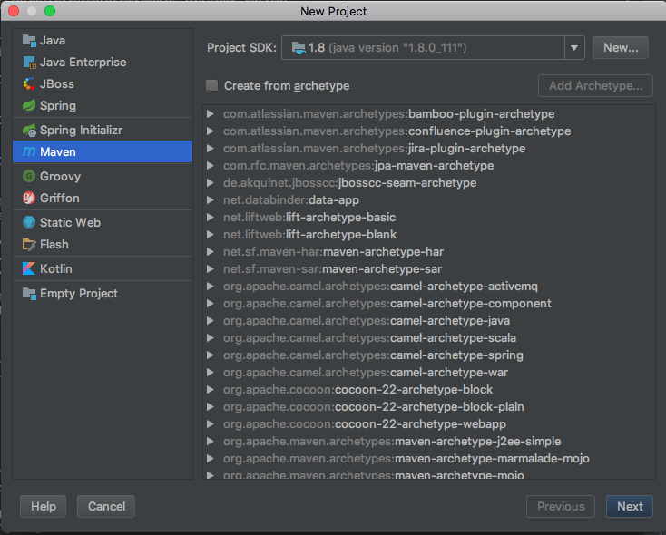
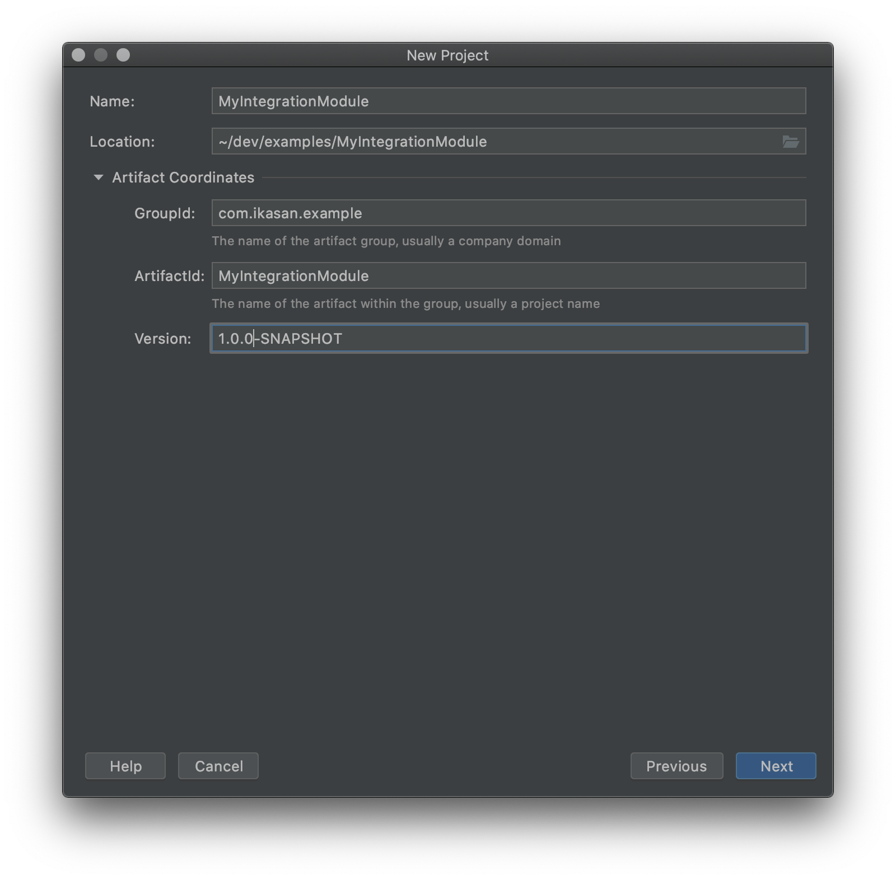
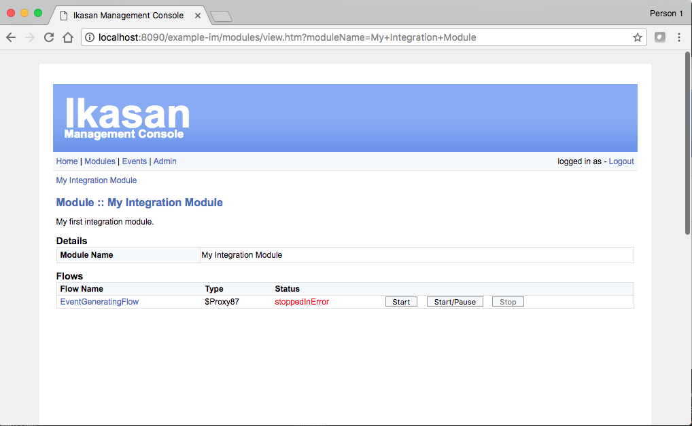

# Ikasan Standalone Developer Guide

# Introduction

## Overview

The Ikasan Enterprise Integration Platform (IkasanEIP) provides a robust and scalable ESB platform based on open technologies and standards. 
IkasanEIP can be adopted as little or as much as required to meet your integration needs.

## About

This guide demonstrates the IkasanESB features through a hands-on Ikasan Application build from scratch to a fully working solution.

_NOTE: This is an example to demonstrate the development and core features of Ikasan - it is not intended to produce a production ready solution._

This is part of the documentation suite for the Ikasan Enterprise Integration Platform.

## Audience

This guide is targeted at developers wishing to get started and undertake their first development projects with the Ikasan Enterprise Integration Platform.

A familiarity with Java and Maven is assumed.

## How to Use This Guide

This guide provides a quick and concise series of steps for getting started with the IkasanEIP platform. These steps should be followed sequentially. Points to note and other hints/tips are provided as additional information or best practices, however, full details on these aspects are beyond the scope of this document.

On completion of this document the reader should have installed and configured all required software for development and have created and run an Ikasan Application.

# Pre-Requisites

[Developer Pre-Requisiites](./DeveloperPreRequisites.md)
 
# Problem Definition
To begin we can define a simple problem to give some context to the demo. 
Typically the problem domain addressed by IkasanESB requires the sourcing of business events from one application followed by 
various conversions, orchestrations, and delivery to other downstream applications.

# Design
We will create an Ikasan Integration Module which consists of a single flow containing two component operations.

    IntegrationModule
    - Flow
        - Consumer -> Producer
        
For simplicity we will utilise some Ikasan off-the-shelf consumers to mock application event generation as a source; and off-the-shelf producers to mock event publication as a target.

# Implementation
We will be using IntelliJ for the rest of this demonstration.

## Create a Project
In IntelliJ select `File/New/Project...`

Select maven (blank archetype). Ensure you select JDK 1.8 as the SDK for this new project.
 

Specify your project Maven coordinates such as GroupId, ArtefactId, and Version.

For instance, 
- GroupId --> `com.ikasan.example`
- ArtefactId --> `MyIntegrationModule`
- Version --> `1.0.0-SNAPSHOT`

 

Select the directory/workspace to create this project.
 

Thats it! 

Your project will be created and look something like this.
 

We now have a blank Java project based on a Maven project structure.
Next we need to update the Maven pom.xml to set the application packaging to create a Jar.
```xml
<?xml version="1.0" encoding="UTF-8"?>
      <project xmlns="http://maven.apache.org/POM/4.0.0"
               xmlns:xsi="http://www.w3.org/2001/XMLSchema-instance"
               xsi:schemaLocation="http://maven.apache.org/POM/4.0.0 http://maven.apache.org/xsd/maven-4.0.0.xsd">
          <modelVersion>4.0.0</modelVersion>
      
          <groupId>com.ikasan.example</groupId>
          <artifactId>MyIntegrationModule</artifactId>
          <version>1.0.0-SNAPSHOT</version>
          <packaging>jar</packaging>        <!-- Add packaging type to create a jar -->
      
      </project>
```

Now add the first Ikasan Application dependency to the Maven pom.xml.
 
Edit the pom.xml and add the ikasan-eip-standalone dependency as well as the build plugin execution requirement.
```xml
<?xml version="1.0" encoding="UTF-8"?>
   <project xmlns="http://maven.apache.org/POM/4.0.0"
            xmlns:xsi="http://www.w3.org/2001/XMLSchema-instance"
            xsi:schemaLocation="http://maven.apache.org/POM/4.0.0 http://maven.apache.org/xsd/maven-4.0.0.xsd">
       <modelVersion>4.0.0</modelVersion>
   
       <groupId>com.ikasan.example</groupId>
       <artifactId>MyIntegrationModule</artifactId>
       <version>1.0.0-SNAPSHOT</version>
       <packaging>jar</packaging>
   
       <!-- Add project dependencies -->
       <dependencies>
       
           <!-- Add IkasanESB core library dependency -->
           <dependency>
               <groupId>org.ikasan</groupId>
               <artifactId>ikasan-eip-standalone</artifactId>
               <version>2.0.0</version>
           </dependency>
           
           <!-- Use Ikasan h2 persistence (Do not use in production) -->
           <dependency>
               <groupId>org.ikasan</groupId>
               <artifactId>ikasan-h2-standalone-persistence</artifactId>
               <version>2.0.0</version>
           </dependency>
                   
       </dependencies>
   
       <!-- Add project build plugin -->
       <build>
           <plugins>
               <plugin>
                   <groupId>org.springframework.boot</groupId>
                   <artifactId>spring-boot-maven-plugin</artifactId>
                   <version>1.5.6.RELEASE</version>
                   <executions>
                       <execution>
                           <goals>
                               <goal>repackage</goal>
                           </goals>
                       </execution>
                   </executions>
               </plugin>
           </plugins>
       </build>
       
   </project>
```

Now create a class with a fully qualified name of ```com.ikasan.example.MyApplication``` from which we will instantiate the Ikasan Application.

Copy and paste the entirety of the code below replacing the content of that class.
```java
package com.ikasan.example;

import org.ikasan.builder.*;
import org.springframework.context.annotation.ComponentScan;
import org.springframework.context.annotation.ImportResource;

@ComponentScan({"org.ikasan", "com.ikasan"})
@ImportResource({ "classpath:h2-datasource-conf.xml" })
public class MyApplication
{
    public static void main(String[] args)
    {
        // Create instance of an ikasan application
        IkasanApplication ikasanApplication = IkasanApplicationFactory.getIkasanApplication(MyApplication.class);
    }
}  
```

Provide some configuration properties for the module by creating a resources/application.properties
```properties
# Logging levels across packages (optional)
logging.level.com.arjuna=INFO
logging.level.org.springframework=INFO

# Blue console servlet settings (optional)
server.error.whitelabel.enabled=false

# Web Bindings
server.port=8090
server.address=localhost
server.contextPath=/example-im

# health probs and remote management (optional)
management.security.enabled=false
management.context-path=/manage
endpoints.shutdown.enabled=true

# Ikasan persistence store
datasource.username=sa
datasource.password=sa
datasource.driver-class-name=org.h2.Driver
datasource.xadriver-class-name=org.h2.jdbcx.JdbcDataSource
datasource.url=jdbc:h2:mem:testdb;DB_CLOSE_DELAY=-1
datasource.dialect=org.hibernate.dialect.H2Dialect
datasource.show-sql=true
datasource.hbm2ddl.auto=create
datasource.validationQuery=select 1
```

NOTE: To run any of the examples along with the Ikasan Dashboard, then the H2 db will not suffice.
To change ikasan persistence to another DB simply change the persistence drivers and configuration.

For instance, to change to MySQL update the pom.xml to switch h2 to MySql

```xml
        *** REMOVE H2 dependency ***
        <!-- Use Ikasan h2 persistence (Do not use in production) -->
        <dependency>
            <groupId>org.ikasan</groupId>
            <artifactId>ikasan-h2-standalone-persistence</artifactId>
            <version>2.0.0</version>
        </dependency>
        
        *** ADD MySQL dependency ***
        <!-- Use Ikasan MySQL persistence (Do not use in production) -->
        <dependency>
            <groupId>org.ikasan</groupId>
            <artifactId>ikasan-mysql-standalone-persistence</artifactId>
            <version>2.0.0</version>
        </dependency>
```

Update the application datasource to load that for MySQL.
```java
UPDATE --> @ImportResource({ "classpath:h2-datasource-conf.xml", "classpath:ikasan-transaction-pointcut-eventListener.xml" })
TO --> @ImportResource({ "classpath:mysql-datasource-conf.xml", "classpath:ikasan-transaction-pointcut-eventListener.xml" })
```
Upate connection properties to be specific to MySQL instance.
```properties
datasource.username=username
datasource.password=password
datasource.url=jdbc:mysql://localhost:3306/Ikasan01
datasource.dialect=org.hibernate.dialect.MySQL5Dialect
datasource.driver-class-name=com.mysql.jdbc.Driver
datasource.xadriver-class-name=com.mysql.jdbc.jdbc2.optional.MysqlXADataSource
datasource.validationQuery=select 1\
```

The web binding section in ```application.properties``` is particularly important and you should ensure you choose a free server.port to bind to.

Build and run the application.
From IntelliJ just right click on MyApplication and select run ```MyApplication.main()```

Alternatively to run from the command line ensure you are in the project root directory i.e. MyIntegrationModule then run a Maven clean install
```
mvn clean install
```

If successful run the application
```
java -jar target/MyIntegrationModule-1.0.0-SNAPSHOT.jar
```

Try accessing the application through a browser at ```http://localhost:8090/example-im``` (user:admin password:admin)
 

Logging in will give you the default home page.
 

Selecting 'Modules' will show the Integration Module for this example, but as we haven't defined one you just see a fairly empty screen.
 
 
Lets define a module.

Go back to the MyApplication class in IntelliJ and update it to the following
```java
package com.ikasan.example;

import org.ikasan.builder.*;
import org.ikasan.builder.component.ComponentBuilder;
import org.ikasan.spec.flow.Flow;
import org.ikasan.spec.module.Module;
import org.springframework.context.annotation.ComponentScan;
import org.springframework.context.annotation.ImportResource;

@ComponentScan({"org.ikasan", "com.ikasan"})
@ImportResource({ "classpath:h2-datasource-conf.xml", "classpath:ikasan-transaction-pointcut-eventListener.xml" })
public class MyApplication
{
    public static void main(String[] args)
    {
        // Create instance of an ikasan application
        IkasanApplication ikasanApplication = IkasanApplicationFactory.getIkasanApplication(MyApplication.class);

        // Get an instance of a builder factory from the application which will
        // provide access to all required builders for the application
        BuilderFactory builderFactory = ikasanApplication.getBuilderFactory();

        // Create a module builder from the builder factory
        ModuleBuilder moduleBuilder = builderFactory.getModuleBuilder("My Integration Module")
                .withDescription("My first integration module.");

        // Create a component builder from the builder factory
        ComponentBuilder componentBuilder = builderFactory.getComponentBuilder();

        // create a flow from the module builder and add required orchestration components
        Flow eventGeneratingFlow = moduleBuilder.getFlowBuilder("EventGeneratingFlow")
                .consumer("My Source Consumer", componentBuilder.eventGeneratingConsumer().build())
                .producer("My Target Producer", componentBuilder.logProducer().build())
                .build();

        // Add the created flow to the module builder and create the module
        Module module = moduleBuilder
                .addFlow(eventGeneratingFlow)
                .build();

        // Pass the module to the Ikasan Application for execution
        ikasanApplication.run(module);
    }
}
```

Build and run the application again.

From IntelliJ just right click on MyApplication and select run ```MyApplication.main()```

Alternatively to run from the command line ensure you are in the project root directory i.e. MyIntegrationModule then run a Maven clean install
```
mvn clean install
```

Refresh your browser at ```http://localhost:8090/example-im```, login and select 'Modules' - you now see your new module.


Selecting the module will show you the flows within this module which can be started, stopped, paused/resumed.


Start the flow - you will see the state change from 'stopped' to 'running'. 


View the application logs (either in IntelliJ or the command line, depending on how the application was started).


Congratulations - your first working Ikasan Integration Module, but what is it doing...

Lets go back to the code, specifically the ```main()``` method to understand what we just implemented and ran.

```java
   public static void main(String[] args)
   {
       // Create instance of an ikasan application
       IkasanApplication ikasanApplication = IkasanApplicationFactory.getIkasanApplication(MyApplication.class);

   }
```
Firstly, we get an instance of an IkasanApplication from the IkasanApplicationFactory. This ikasanApplication will 
provision everything we need to instantiate and run this application.


```java
   public static void main(String[] args)
   {
       // Create instance of an ikasan application
       IkasanApplication ikasanApplication = IkasanApplicationFactory.getIkasanApplication(MyApplication.class);

       // Get an instance of a builder factory from the application which will
       // provide access to all required builders for the application
       BuilderFactory builderFactory = ikasanApplication.getBuilderFactory();

   }
```
We then get an instance of a builderFactory from the application. 

This builderFactory will provide all other builders required to create modules, flows, and components.

The first thing to create is a moduleBuilder from the builderFactory. When we create the moduleBuilder we provide the name we are going to assign to the module.
We can also set other properties on the module through this moduleBuilder such as description.

```java
   public static void main(String[] args)
   {
       // Create instance of an ikasan application
       IkasanApplication ikasanApplication = IkasanApplicationFactory.getIkasanApplication(MyApplication.class);

       // Get an instance of a builder factory from the application which will
       // provide access to all required builders for the application
       BuilderFactory builderFactory = ikasanApplication.getBuilderFactory();

       // Create a module builder from the builder factory
       ModuleBuilder moduleBuilder = builderFactory.getModuleBuilder("My Integration Module")
               .withDescription("My first integration module.");

   }
```
Next, get a componentBuilder instance from the builderFactory - we will be using this in the flowBuilder.
```java
   public static void main(String[] args)
   {
       // Create instance of an ikasan application
       IkasanApplication ikasanApplication = IkasanApplicationFactory.getIkasanApplication(MyApplication.class);

       // Get an instance of a builder factory from the application which will
       // provide access to all required builders for the application
       BuilderFactory builderFactory = ikasanApplication.getBuilderFactory();

       // Create a module builder from the builder factory
       ModuleBuilder moduleBuilder = builderFactory.getModuleBuilder("My Integration Module")
               .withDescription("My first integration module.");

       // Create a component builder from the builder factory
       ComponentBuilder componentBuilder = builderFactory.getComponentBuilder();

   }
```

Now on to the interesting parts. 
We use the moduleBuilder to get a flowBuilder and provide the name of the flow.
The components within the flow are then added as consumer and producer, both from the componentBuilder.
Each component is given a name and a functional class that does the work. The component classes below are off-the-shelf 
Ikasan components, however, your own components can be easily written and added as shown later.
```java
   public static void main(String[] args)
   {
       // Create instance of an ikasan application
       IkasanApplication ikasanApplication = IkasanApplicationFactory.getIkasanApplication(MyApplication.class);

       // Get an instance of a builder factory from the application which will
       // provide access to all required builders for the application
       BuilderFactory builderFactory = ikasanApplication.getBuilderFactory();

       // Create a module builder from the builder factory
       ModuleBuilder moduleBuilder = builderFactory.getModuleBuilder("My Integration Module")
               .withDescription("My first integration module.");

       // Create a component builder from the builder factory
       ComponentBuilder componentBuilder = builderFactory.getComponentBuilder();

       // create a flow from the module builder and add required orchestration components
       Flow eventGeneratingFlow = moduleBuilder.getFlowBuilder("EventGeneratingFlow")
               .consumer("My Source Consumer", componentBuilder.eventGeneratingConsumer().build())
               .producer("My Target Producer", componentBuilder.logProducer().build())
               .build();

   }
```
So ```componentBuilder.eventGeneratingConsumer().build()``` returns an off-the-shelf eventGenerating consumer component which will provide the functionality of that consumer named "My Source Consumer";
```componentBuilder.logProducer().build()``` returns an off-the-shelf logProducer producer component which will provide the functionality of the producer named "My Source Producer".

Each off-the-shelf component has ```build()``` called against it which tells the builder pattern to create this instance, as does the flow.
 
```java
   public static void main(String[] args)
   {
       // Create instance of an ikasan application
       IkasanApplication ikasanApplication = IkasanApplicationFactory.getIkasanApplication(MyApplication.class);

       // Get an instance of a builder factory from the application which will
       // provide access to all required builders for the application
       BuilderFactory builderFactory = ikasanApplication.getBuilderFactory();

       // Create a module builder from the builder factory
       ModuleBuilder moduleBuilder = builderFactory.getModuleBuilder("My Integration Module")
               .withDescription("My first integration module.");

       // Create a component builder from the builder factory
       ComponentBuilder componentBuilder = builderFactory.getComponentBuilder();

       // create a flow from the module builder and add required orchestration components
       Flow eventGeneratingFlow = moduleBuilder.getFlowBuilder("EventGeneratingFlow")
               .consumer("My Source Consumer", componentBuilder.eventGeneratingConsumer().build())
               .producer("My Target Producer", componentBuilder.logProducer().build())
               .build();

       // Add the created flow to the module builder and create the module
       Module module = moduleBuilder
               .addFlow(eventGeneratingFlow)
               .build();

   }
```
 Now we have the flow we can add it to the moduleBuilder and ```build()``` the module.
 
```java
   public static void main(String[] args)
   {
       // Create instance of an ikasan application
       IkasanApplication ikasanApplication = IkasanApplicationFactory.getIkasanApplication(MyApplication.class);

       // Get an instance of a builder factory from the application which will
       // provide access to all required builders for the application
       BuilderFactory builderFactory = ikasanApplication.getBuilderFactory();

       // Create a module builder from the builder factory
       ModuleBuilder moduleBuilder = builderFactory.getModuleBuilder("My Integration Module")
               .withDescription("My first integration module.");

       // Create a component builder from the builder factory
       ComponentBuilder componentBuilder = builderFactory.getComponentBuilder();

       // create a flow from the module builder and add required orchestration components
       Flow eventGeneratingFlow = moduleBuilder.getFlowBuilder("EventGeneratingFlow")
               .consumer("My Source Consumer", componentBuilder.eventGeneratingConsumer().build())
               .producer("My Target Producer", componentBuilder.logProducer().build())
               .build();

       // Add the created flow to the module builder and create the module
       Module module = moduleBuilder
               .addFlow(eventGeneratingFlow)
               .build();

       // Pass the module to the Ikasan Application for execution
       ikasanApplication.run(module);
   }
```
Finally we pass the module to the ```ikasanApplication.run()``` method to execute.

That is how every Ikasan Application Integration Module is created regardless of how simple or complex the operations.

## Adding your own Components
Lets add a custom Converter between the Consumer and Producer components.

To start with we will create a new Converter component implementation.

Create a new class called ```com.ikasan.example.converter.MyConverter```.
To implement the class as an Ikasan Converter component we simply need to use the Converter contract through ```implement Converter```
The contract for the Converter allows for the provision of generic types defining the incoming type and the return type on the method.
In the example below the Converter is expecting an incoming String which it will convert and return as an Integer.

```java
package com.ikasan.example.converter;

import org.ikasan.spec.component.transformation.Converter;
import org.ikasan.spec.component.transformation.TransformationException;

public class MyConverter implements Converter<String,Integer>
{
    public Integer convert(String payload) throws TransformationException 
    {
        String[] strings = payload.split(" ");
        int intPart = Integer.valueOf( strings[1] );
        return Integer.valueOf(intPart);
    }
}
```

Now we need to add this new Converter operation to our flow.

Simply update the flowBuilder lines to insert this new component called "My Converter".
```java
        // create a flow from the module builder and add required orchestration components
        Flow eventGeneratingFlow = moduleBuilder.getFlowBuilder("EventGeneratingFlow")
                .consumer("My Source Consumer", componentBuilder.eventGeneratingConsumer().build())
                .converter("My Converter", new MyConverter())
                .producer("My Target Producer", componentBuilder.logProducer().build())
                .build();
```

Build it, run it, and start the flow from the Browser and see what gets output to the logs by the LogProducer.

You will notice that the `payload=` has changed from the 'Message 1' etc, to simply just the integer part of the message from the consumer.

## Exception Handling
Every Ikasan flow has an automatically created and assigned 'Recovery Manager'. The role of the Recovery Manager is to manage the flow if things fail at runtime i.e. an Exception occurs in the flow or any of its components.

Lets see what happens if we get our Converter to throw an exception on a specific message i.e message 5.
```java
    public Integer convert(String payload) throws TransformationException
    {
        String[] strings = payload.split(" ");
        int intPart = Integer.valueOf( strings[1] );
        if(intPart == 5)
        {
            throw new TransformationException("error - bad number received [" + 5 + "]");
        }
        return Integer.valueOf(intPart);
    }
```
Build it, run it, and start the flow from the Browser.

If you look at the logs you will see that when it gets to message 5 an exception occurs 
and the Recovery Manager kicked in to decide what to do. 
```java
RecoveryManager resolving to [Stop] for componentName[My Converter] exception [error - bad number received [5]]

org.ikasan.spec.component.transformation.TransformationException: error - bad number received [5]
	at com.ikasan.example.converter.MyConverter.convert(MyConverter.java:14) ~[classes/:na]
	at com.ikasan.example.converter.MyConverter.convert(MyConverter.java:6) ~[classes/:na]
	at org.ikasan.flow.visitorPattern.invoker.ConverterFlowElementInvoker.invoke(ConverterFlowElementInvoker.java:121) ~[ikasan-flow-visitorPattern-2.1.0-SNAPSHOT.jar:na]
	at org.ikasan.flow.visitorPattern.VisitingInvokerFlow.invoke(VisitingInvokerFlow.java:860) [ikasan-flow-visitorPattern-2.1.0-SNAPSHOT.jar:na]
	at org.ikasan.flow.visitorPattern.VisitingInvokerFlow.invoke(VisitingInvokerFlow.java:778) [ikasan-flow-visitorPattern-2.1.0-SNAPSHOT.jar:na]
	at org.ikasan.flow.visitorPattern.VisitingInvokerFlow.invoke(VisitingInvokerFlow.java:76) [ikasan-flow-visitorPattern-2.1.0-SNAPSHOT.jar:na]
	at org.ikasan.component.endpoint.util.consumer.EventGeneratingConsumer.onMessage(EventGeneratingConsumer.java:190) [ikasan-utility-endpoint-2.1.0-SNAPSHOT.jar:na]
	at org.ikasan.component.endpoint.util.consumer.EventGeneratingConsumer.onMessage(EventGeneratingConsumer.java:61) [ikasan-utility-endpoint-2.1.0-SNAPSHOT.jar:na]
	at sun.reflect.NativeMethodAccessorImpl.invoke0(Native Method) ~[na:1.8.0_111]
	at sun.reflect.NativeMethodAccessorImpl.invoke(NativeMethodAccessorImpl.java:62) ~[na:1.8.0_111]
	at sun.reflect.DelegatingMethodAccessorImpl.invoke(DelegatingMethodAccessorImpl.java:43) ~[na:1.8.0_111]
	at java.lang.reflect.Method.invoke(Method.java:498) ~[na:1.8.0_111]
	at org.springframework.aop.support.AopUtils.invokeJoinpointUsingReflection(AopUtils.java:333) [spring-aop-4.3.10.RELEASE.jar:4.3.10.RELEASE]
	at org.springframework.aop.framework.ReflectiveMethodInvocation.invokeJoinpoint(ReflectiveMethodInvocation.java:190) [spring-aop-4.3.10.RELEASE.jar:4.3.10.RELEASE]
	at org.springframework.aop.framework.ReflectiveMethodInvocation.proceed(ReflectiveMethodInvocation.java:157) [spring-aop-4.3.10.RELEASE.jar:4.3.10.RELEASE]
	at org.springframework.transaction.interceptor.TransactionInterceptor$1.proceedWithInvocation(TransactionInterceptor.java:99) [spring-tx-4.3.10.RELEASE.jar:4.3.10.RELEASE]
	at org.springframework.transaction.interceptor.TransactionAspectSupport.invokeWithinTransaction(TransactionAspectSupport.java:282) [spring-tx-4.3.10.RELEASE.jar:4.3.10.RELEASE]
	at org.springframework.transaction.interceptor.TransactionInterceptor.invoke(TransactionInterceptor.java:96) [spring-tx-4.3.10.RELEASE.jar:4.3.10.RELEASE]
	at org.springframework.aop.framework.ReflectiveMethodInvocation.proceed(ReflectiveMethodInvocation.java:179) [spring-aop-4.3.10.RELEASE.jar:4.3.10.RELEASE]
	at org.springframework.aop.framework.JdkDynamicAopProxy.invoke(JdkDynamicAopProxy.java:213) [spring-aop-4.3.10.RELEASE.jar:4.3.10.RELEASE]
	at com.sun.proxy.$Proxy87.onMessage(Unknown Source) [na:na]
	at org.ikasan.component.endpoint.util.consumer.SimpleMessageGenerator.execute(SimpleMessageGenerator.java:95) [ikasan-utility-endpoint-2.1.0-SNAPSHOT.jar:na]
	at org.ikasan.component.endpoint.util.consumer.SimpleMessageGenerator.run(SimpleMessageGenerator.java:83) [ikasan-utility-endpoint-2.1.0-SNAPSHOT.jar:na]
	at java.util.concurrent.Executors$RunnableAdapter.call(Executors.java:511) [na:1.8.0_111]
	at java.util.concurrent.FutureTask.run(FutureTask.java:266) [na:1.8.0_111]
	at java.util.concurrent.ThreadPoolExecutor.runWorker(ThreadPoolExecutor.java:1142) [na:1.8.0_111]
	at java.util.concurrent.ThreadPoolExecutor$Worker.run(ThreadPoolExecutor.java:617) [na:1.8.0_111]
	at java.lang.Thread.run(Thread.java:745) [na:1.8.0_111]
```
In this case because we havent told the Recovery Manager to take specific action on this type of exception
it resolves to stopping the flow in error. This stoppedInError state can also be seen on the Console.


Lets tell the Recovery Manager to take a different action on this exception.
As this is a setting on the flow we need to update the code on the flowBuilder to add
a different exceptionResolver. In this case when we see a TransformationException we are now going to exclude the event
that caused the exception.
```java
        // create a flow from the module builder and add required orchestration components
        Flow eventGeneratingFlow = moduleBuilder.getFlowBuilder("EventGeneratingFlow")
                .withExceptionResolver(builderFactory
                        .getExceptionResolverBuilder()
                        .addExceptionToAction(TransformationException.class, OnException.excludeEvent()).build())
                .consumer("My Source Consumer", componentBuilder.eventGeneratingConsumer().build())
                .converter("My Converter", new MyConverter())
                .producer("My Target Producer", componentBuilder.logProducer().build())
                .build();
```
Build it, run it, and start the flow from the Browser.

Now we see the same error occuring, but the Recovery Manager excludes the event and allows the flow to keep running.
If you look in the logs you will see something like this,
```
2018-04-14 11:57:51.681  INFO 4811 --- [0.1-8090-exec-2] o.i.f.v.VisitingInvokerFlow              : Started Flow[EventGeneratingFlow] in Module[My Integration Module]
2018-04-14 11:57:51.687  INFO 4811 --- [pool-4-thread-1] o.i.c.e.util.producer.LogProducer        : GenericFlowEvent [identifier=Message 1, relatedIdentifier=null, timestamp=1523703471683, payload=1]
2018-04-14 11:57:52.692  INFO 4811 --- [pool-4-thread-1] o.i.c.e.util.producer.LogProducer        : GenericFlowEvent [identifier=Message 2, relatedIdentifier=null, timestamp=1523703472692, payload=2]
2018-04-14 11:57:53.696  INFO 4811 --- [pool-4-thread-1] o.i.c.e.util.producer.LogProducer        : GenericFlowEvent [identifier=Message 3, relatedIdentifier=null, timestamp=1523703473696, payload=3]
2018-04-14 11:57:54.701  INFO 4811 --- [pool-4-thread-1] o.i.c.e.util.producer.LogProducer        : GenericFlowEvent [identifier=Message 4, relatedIdentifier=null, timestamp=1523703474701, payload=4]
2018-04-14 11:57:55.711  INFO 4811 --- [pool-4-thread-1] o.i.recovery.ScheduledRecoveryManager    : RecoveryManager resolving to [ExcludeEvent] for componentName[My Converter] exception [error - bad number received [5]]

org.ikasan.spec.component.transformation.TransformationException: error - bad number received [5]
	at com.ikasan.example.converter.MyConverter.convert(MyConverter.java:14) ~[classes/:na]
	at com.ikasan.example.converter.MyConverter.convert(MyConverter.java:6) ~[classes/:na]
	at org.ikasan.flow.visitorPattern.invoker.ConverterFlowElementInvoker.invoke(ConverterFlowElementInvoker.java:121) ~[ikasan-flow-visitorPattern-2.1.0-SNAPSHOT.jar:na]
	at org.ikasan.flow.visitorPattern.VisitingInvokerFlow.invoke(VisitingInvokerFlow.java:860) [ikasan-flow-visitorPattern-2.1.0-SNAPSHOT.jar:na]
	at org.ikasan.flow.visitorPattern.VisitingInvokerFlow.invoke(VisitingInvokerFlow.java:778) [ikasan-flow-visitorPattern-2.1.0-SNAPSHOT.jar:na]
	at org.ikasan.flow.visitorPattern.VisitingInvokerFlow.invoke(VisitingInvokerFlow.java:76) [ikasan-flow-visitorPattern-2.1.0-SNAPSHOT.jar:na]
	at org.ikasan.component.endpoint.util.consumer.EventGeneratingConsumer.onMessage(EventGeneratingConsumer.java:190) [ikasan-utility-endpoint-2.1.0-SNAPSHOT.jar:na]
	at org.ikasan.component.endpoint.util.consumer.EventGeneratingConsumer.onMessage(EventGeneratingConsumer.java:61) [ikasan-utility-endpoint-2.1.0-SNAPSHOT.jar:na]
	at sun.reflect.NativeMethodAccessorImpl.invoke0(Native Method) ~[na:1.8.0_111]
	at sun.reflect.NativeMethodAccessorImpl.invoke(NativeMethodAccessorImpl.java:62) ~[na:1.8.0_111]
	at sun.reflect.DelegatingMethodAccessorImpl.invoke(DelegatingMethodAccessorImpl.java:43) ~[na:1.8.0_111]
	at java.lang.reflect.Method.invoke(Method.java:498) ~[na:1.8.0_111]
	at org.springframework.aop.support.AopUtils.invokeJoinpointUsingReflection(AopUtils.java:333) [spring-aop-4.3.10.RELEASE.jar:4.3.10.RELEASE]
	at org.springframework.aop.framework.ReflectiveMethodInvocation.invokeJoinpoint(ReflectiveMethodInvocation.java:190) [spring-aop-4.3.10.RELEASE.jar:4.3.10.RELEASE]
	at org.springframework.aop.framework.ReflectiveMethodInvocation.proceed(ReflectiveMethodInvocation.java:157) [spring-aop-4.3.10.RELEASE.jar:4.3.10.RELEASE]
	at org.springframework.transaction.interceptor.TransactionInterceptor$1.proceedWithInvocation(TransactionInterceptor.java:99) [spring-tx-4.3.10.RELEASE.jar:4.3.10.RELEASE]
	at org.springframework.transaction.interceptor.TransactionAspectSupport.invokeWithinTransaction(TransactionAspectSupport.java:282) [spring-tx-4.3.10.RELEASE.jar:4.3.10.RELEASE]
	at org.springframework.transaction.interceptor.TransactionInterceptor.invoke(TransactionInterceptor.java:96) [spring-tx-4.3.10.RELEASE.jar:4.3.10.RELEASE]
	at org.springframework.aop.framework.ReflectiveMethodInvocation.proceed(ReflectiveMethodInvocation.java:179) [spring-aop-4.3.10.RELEASE.jar:4.3.10.RELEASE]
	at org.springframework.aop.framework.JdkDynamicAopProxy.invoke(JdkDynamicAopProxy.java:213) [spring-aop-4.3.10.RELEASE.jar:4.3.10.RELEASE]
	at com.sun.proxy.$Proxy87.onMessage(Unknown Source) [na:na]
	at org.ikasan.component.endpoint.util.consumer.SimpleMessageGenerator.execute(SimpleMessageGenerator.java:95) [ikasan-utility-endpoint-2.1.0-SNAPSHOT.jar:na]
	at org.ikasan.component.endpoint.util.consumer.SimpleMessageGenerator.run(SimpleMessageGenerator.java:83) [ikasan-utility-endpoint-2.1.0-SNAPSHOT.jar:na]
	at java.util.concurrent.Executors$RunnableAdapter.call(Executors.java:511) [na:1.8.0_111]
	at java.util.concurrent.FutureTask.run(FutureTask.java:266) [na:1.8.0_111]
	at java.util.concurrent.ThreadPoolExecutor.runWorker(ThreadPoolExecutor.java:1142) [na:1.8.0_111]
	at java.util.concurrent.ThreadPoolExecutor$Worker.run(ThreadPoolExecutor.java:617) [na:1.8.0_111]
	at java.lang.Thread.run(Thread.java:745) [na:1.8.0_111]

Hibernate: select erroroccur_.Uri, erroroccur_.ModuleName as ModuleNa2_2_, erroroccur_.FlowName as FlowName3_2_, erroroccur_.FlowElementName as FlowElem4_2_, erroroccur_.ErrorDetail as ErrorDet5_2_, erroroccur_.ErrorMessage as ErrorMes6_2_, erroroccur_.ExceptionClass as Exceptio7_2_, erroroccur_.EventLifeIdentifier as EventLif8_2_, erroroccur_.EventRelatedIdentifier as EventRel9_2_, erroroccur_.Action as Action10_2_, erroroccur_.Event as Event11_2_, erroroccur_.EventAsString as EventAs12_2_, erroroccur_.Timestamp as Timesta13_2_, erroroccur_.Expiry as Expiry14_2_, erroroccur_.UserAction as UserAct15_2_, erroroccur_.ActionedBy as Actione16_2_, erroroccur_.UserActionTimestamp as UserAct17_2_, erroroccur_.Harvested as Harvest18_2_ from ErrorOccurrence erroroccur_ where erroroccur_.Uri=?
Hibernate: insert into ErrorOccurrence (ModuleName, FlowName, FlowElementName, ErrorDetail, ErrorMessage, ExceptionClass, EventLifeIdentifier, EventRelatedIdentifier, Action, Event, EventAsString, Timestamp, Expiry, UserAction, ActionedBy, UserActionTimestamp, Harvested, Uri) values (?, ?, ?, ?, ?, ?, ?, ?, ?, ?, ?, ?, ?, ?, ?, ?, ?, ?)
Hibernate: insert into ExclusionEvent (Id, ModuleName, FlowName, Identifier, Event, Timestamp, ErrorUri, Harvested) values (null, ?, ?, ?, ?, ?, ?, ?)
2018-04-14 11:57:56.769  INFO 4811 --- [pool-4-thread-1] o.i.c.e.util.producer.LogProducer        : GenericFlowEvent [identifier=Message 6, relatedIdentifier=null, timestamp=1523703476769, payload=6]
2018-04-14 11:57:57.774  INFO 4811 --- [pool-4-thread-1] o.i.c.e.util.producer.LogProducer        : GenericFlowEvent [identifier=Message 7, relatedIdentifier=null, timestamp=1523703477773, payload=7]
2018-04-14 11:57:58.778  INFO 4811 --- [pool-4-thread-1] o.i.c.e.util.producer.LogProducer        : GenericFlowEvent [identifier=Message 8, relatedIdentifier=null, timestamp=1523703478778, payload=8]
```

If you are running the Ikasan Dashboard, you will be able to navigate to the Topology view and select the Error tab, to see the error; or the Exclusion tab to see the excluded event.

## Configuring Components
Currently we have hardcoded a value of 5 to indicate the bad message in the Converter. What if we want this to be user defined or even dynamic based on runtime?

### Configured Resources
We can tell a componenet that it is a ConfiguredResource. Telling it this allows access to configure attributes on the component through the Console.
Update the Converter component to implement ```ConfiguredResource``` and specify a Configuration class defining the allowed attributes.
```java
package com.ikasan.example.converter;

public class MyConverterConfiguration
{
    public int badNumber = 5;

    public int getBadNumber() {
        return badNumber;
    }

    public void setBadNumber(int badNumber) {
        this.badNumber = badNumber;
    }
}
```

```java
package com.ikasan.example.converter;

import org.ikasan.spec.component.transformation.Converter;
import org.ikasan.spec.component.transformation.TransformationException;
import org.ikasan.spec.configuration.ConfiguredResource;

public class MyConverter implements Converter<String,Integer>, ConfiguredResource<MyConverterConfiguration>
{
    String configuredResourceId;
    MyConverterConfiguration configuration = new MyConverterConfiguration();
    
    public Integer convert(String payload) throws TransformationException
    {
        String[] strings = payload.split(" ");
        int intPart = Integer.valueOf( strings[1] );
        if(intPart == configuration.getBadNumber())
        {
            throw new TransformationException("error - bad number received [" + configuration.getBadNumber() + "]");
        }
        return Integer.valueOf(intPart);
    }

    public String getConfiguredResourceId() {
        return configuredResourceId;
    }

    public void setConfiguredResourceId(String configuredResourceId) {
        this.configuredResourceId = configuredResourceId;
    }

    public MyConverterConfiguration getConfiguration() {
        return configuration;
    }

    public void setConfiguration(MyConverterConfiguration configuration) {
        this.configuration = configuration;
    }
}
```
The ConfiguredResource interface allows you to specify the exact type of the configuration, 
in this case MyConverterConfiguration; as well as enforcing getter/setter methods for the configuration instance 
and something called the ConfiguredResourceId.

The ConfiguredResourceId is an identifier which ties this instance of the configuration with this component. Infact, if you use the same ConfiguredResourceId across multiple components
it will load the same instance of the configuration. This can sometimes be very useful where multiple components need to share a configuration.
However, care should be taken as sometimes shared configuration is not what you want and in that case you simply need to provide a different ConfiguredResourceId value.
It is best practice to set the ConfiguredResourceId to something representative of that module, flow, and component.

Ikasan also has the concept of Configured - this is typically used where your component, marked as a ConfiguredResource, has other classes that can also be configured, but arent defined as specific components.

In this case the subsequent classes would simply be marked as Configured.

 
So now we have updated our module lets build it, run it, and open the Console from a Browser.

## Managed Resource Component
TOOO

```java
package com.ikasan.example.converter;

import org.ikasan.spec.component.transformation.Converter;
import org.ikasan.spec.component.transformation.TransformationException;
import org.ikasan.spec.configuration.ConfiguredResource;
import org.ikasan.spec.management.ManagedResource;
import org.ikasan.spec.management.ManagedResourceRecoveryManager;
import org.slf4j.Logger;
import org.slf4j.LoggerFactory;

public class MyConverter implements Converter<String,Integer>,
        ConfiguredResource<MyConverterConfiguration>, ManagedResource
{
    private final static Logger logger = LoggerFactory.getLogger(MyConverter.class);

    MyConverterConfiguration configuration  = new MyConverterConfiguration();
    String configuredResourceId;
    boolean critical;

    public Integer convert(String payload) throws TransformationException
    {
        String[] strings = payload.split(" ");
        int intPart = Integer.valueOf( strings[1] );
        if(intPart == configuration.getBadNumber())
        {
            throw new TransformationException("error - bad number received [" + configuration.getBadNumber() + "]");
        }
        return Integer.valueOf(intPart);
    }

    public String getConfiguredResourceId() {
        return configuredResourceId;
    }

    public void setConfiguredResourceId(String configuredResourceId)
    {
        this.configuredResourceId = configuredResourceId;
    }

    public MyConverterConfiguration getConfiguration() {
        return configuration;
    }

    public void setConfiguration(MyConverterConfiguration myConverterConfiguration)
    {
        this.configuration =  myConverterConfiguration;
    }

    public void startManagedResource() {
        logger.info("Call to start any managed resources");
    }

    public void stopManagedResource() {
        logger.info("Call to stop any managed resources");
    }

    public void setManagedResourceRecoveryManager(ManagedResourceRecoveryManager managedResourceRecoveryManager) {

    }

    public boolean isCriticalOnStartup() {
        return critical;
    }

    public void setCriticalOnStartup(boolean critical) {
        this.critical = critical;
    }
}
```
## Testing
TOOO
### Unit Testing
#### Methods
#### Components
#### Flows
#### Exception Handling
#### Monitoring
#### Modules
#### Business Streams

# Ikasan Maven Archetypes
The basic constituents of an Ikasan Integration Module (IM) are the same. 
Due to this we have created some out of the box IM archetypes based on common technical integration problems.

## Vanilla Integration Module Archetype
This archetype creates an empty Ikasan shell as a starting point for your classes and configuration, free from specifics of any integration use cases. 
This is a good starting point when first learning Ikasan.

A Maven archetype to create this is available from Maven Central and can be invoked as follows,

```
mvn archetype:generate     
    -DarchetypeGroupId=org.ikasan    
    -DarchetypeArtifactId=ikasan-standalone-vanilla-im-maven-plugin 
    -DarchetypeVersion=<Ikasan Version>    
    -DgroupId=<Maven Group Id>     
    -DartifactId=<Module Name>     
    -Dversion=<Module Version>     
    -DsourceFlowName=<Source Flow Name>     

```

where the standard Maven archetype coordinates are,

- **archetypeGroupId** – is always **org.ikasan** for Ikasan based archetypes
- **archetypeArtifactId** – details the archetype type to invoke **ikasan-standalone-vanilla-im-maven-plugin**
- **archetypeVersion** – details the version of the Ikasan archetype type to invoke **2.0.0 and above**

where the following parameters provide the configuration for the Integration Module pom being created,

- **groupId** – groupId for this new Integration Module
- **artifactId** – artifactId for this new Integration Module
- **version** – version of this new Integration Module

Example Usage,

```
mvn archetype:generate     
    \-DarchetypeGroupId=org.ikasan     
    \-DarchetypeArtifactId=ikasan-standalone-vanilla-im-maven-plugin 
    \-DarchetypeVersion=2.0.0    
    \-DgroupId=com.sample     
    \-DartifactId=vanilla-im     
    \-Dversion=1.0.0-SNAPSHOT     
```

(Accept defaults or update as required)

This will create a standard empty Ikasan application as a starting point. 
Even without an Integration Module and associated flows we can still build and create a deployable image by going into the directory and run a maven clean package.

```
cd vanilla-im
mvn clean package 
```

This will build and create a zip binary containing all the required deployments.

It is recommended this archetype be used when getting familiar with Ikasan as part of the "Hands On Developer Walk Through" section.

## JMS to JMS Integration Module Archetype

This archetype creates a working integration module containing one flow,

- **JMS to JMS Flow** – JMS (ActiveMQ Text Message) events are consumed and published to different JMS (ActiveMQ Text Message)

A Maven archetype to create this is available from Maven Central and can be invoked as follows,

```
mvn archetype:generate     
    -DarchetypeGroupId=org.ikasan    
    -DarchetypeArtifactId=ikasan-standalone-jms-im-maven-plugin 
    -DarchetypeVersion=<Ikasan Version>    
    -DgroupId=<Maven Group Id>     
    -DartifactId=<Module Name>     
    -Dversion=<Module Version>     
    -DsourceFlowName=<Source Flow Name>     

```

where the standard Maven archetype coordinates are,

- **archetypeGroupId** – is always **org.ikasan** for Ikasan based archetypes
- **archetypeArtifactId** – details the archetype type to invoke **ikasan-standalone-jms-im-maven-plugin**
- **archetypeVersion** – details the version of the Ikasan archetype type to invoke **2.0.0 and above**

where the following parameters provide the configuration for the Integration Module pom being created,

- **groupId** – groupId for this new Integration Module
- **artifactId** – artifactId for this new Integration Module
- **version** – version of this new Integration Module
- **sourceFlowName** – source flow name within this Integration Module


Example Usage,

```
mvn archetype:generate     
    \-DarchetypeGroupId=org.ikasan     
    \-DarchetypeArtifactId=ikasan-standalone-jms-im-maven-plugin 
    \-DarchetypeVersion=2.0.0    
    \-DgroupId=com.sample     
    \-DartifactId=jms-im     
    \-Dversion=1.0.0-SNAPSHOT     
    \-DsourceFlowName="JMS to JMS Flow" 
```

(Accept defaults or update as required)

This will create a standard integration module project structure. To build and create a deployable integration module image you need to go into the directory and run a maven clean package.

```
cd jms-im
mvn clean package 
```

This will build and create a zip binary containing all the required deployments for your integration module.


## Local File System to JMS / JMS to Local File System Integration Module Archetype

This archetype creates a working integration module containing two flows,

- **File System to JMS** – local file system files are consumed and published as JMS (ActiveMQ) events
- **JMS to File System** – JMS (ActiveMQ) events are consumed and published to a local file system

A Maven archetype to create this is available from Maven Central and can be invoked as follows,

```
mvn archetype:generate     
    -DarchetypeGroupId=org.ikasan    
    -DarchetypeArtifactId=ikasan-standalone-filesystem-im-maven-plugin 
    -DarchetypeVersion=<Ikasan Version>    
    -DgroupId=<Maven Group Id>     
    -DartifactId=<Module Name>     
    -Dversion=<Module Version>     
    -DsourceFlowName=<Source Flow Name>     
    -DtargetFlowName=<Target Flow Name>
```

where the standard Maven archetype coordinates are,

- **archetypeGroupId** – is always **org.ikasan** for Ikasan based archetypes
- **archetypeArtifactId** – details the archetype type to invoke **ikasan-standalone-filesystem-im-maven-plugin**
- **archetypeVersion** – details the version of the Ikasan archetype type to invoke  **2.0.0 and above**

where the following parameters provide the configuration for the Integration Module pom being created,

- **groupId** – groupId for this new Integration Module
- **artifactId** – artifactId for this new Integration Module
- **version** – version of this new Integration Module
- **sourceFlowName** – source flow name within this Integration Module
- **targetFlowName** – target flow name within this Integration Module


Example Usage,

```
mvn archetype:generate     
    \-DarchetypeGroupId=org.ikasan     
    \-DarchetypeArtifactId=ikasan-standalone-filesystem-im-maven-plugin 
    \-DarchetypeVersion=2.0.0    
    \-DgroupId=com.ikasan     
    \-DartifactId=myIntegrationModule     
    \-Dversion=1.0.0-SNAPSHOT     
    \-DsourceFlowName=fileSystemToJMSFlow     
    \-DtargetFlowName=jmsToFileSystemFlow
```

(Accept defaults or update as required)

This will create a standard integration module project structure. To build and create a deployable integration module image you need to go into the directory and run a maven clean package.

```
cd myIntegrationModule
mvn clean package 
```

This will build and create a zip binary containing all the required deployments for your integration module.

## FTP to JMS / JMS to FTP Integration Module Archetype

This archetype creates a working integration module containing two flows,

- **FTP to JMS Flow** – Remote FTP files are consumed and published as JMS (ActiveMQ Map Message) events
- **JMS to FTP Flow** – JMS (ActiveMQ Map Message) events are consumed and published to a remote FTP files

A Maven archetype to create this is available from Maven Central and can be invoked as follows,

```
mvn archetype:generate     
    -DarchetypeGroupId=org.ikasan    
    -DarchetypeArtifactId=ikasan-standalone-ftp-jms-im-maven-plugin 
    -DarchetypeVersion=<Ikasan Version>    
    -DgroupId=<Maven Group Id>     
    -DartifactId=<Module Name>     
    -Dversion=<Module Version>     
    -DsourceFlowName=<Source Flow Name>     
    -DtargetFlowName=<Target Flow Name>
```


where the standard Maven archetype coordinates are,

- **archetypeGroupId** – is always **org.ikasan** for Ikasan based archetypes
- **archetypeArtifactId** – details the archetype type to invoke **ikasan-standalone-ftp-jms-im-maven-plugin**
- **archetypeVersion** – details the version of the Ikasan archetype type to invoke **2.0.0 and above**

where the following parameters provide the configuration for the Integration Module pom being created,

- **groupId** – groupId for this new Integration Module
- **artifactId** – artifactId for this new Integration Module
- **version** – version of this new Integration Module
- **sourceFlowName** – source flow name within this Integration Module
- **targetFlowName** – target flow name within this Integration Module


Example Usage,

```
mvn archetype:generate     
    \-DarchetypeGroupId=org.ikasan     
    \-DarchetypeArtifactId=ikasan-standalone-ftp-jms-im-maven-plugin 
    \-DarchetypeVersion=2.0.0    
    \-DgroupId=com.sample     
    \-DartifactId=ftp-jms-im     
    \-Dversion=1.0.0-SNAPSHOT     
    \-DsourceFlowName="FTP to JMS Flow" 
    \-DtargetFlowName="JMS To FTP Flow"
```

(Accept defaults or update as required)

This will create a standard integration module project structure. To build and create a deployable integration module image you need to go into the directory and run a maven clean package.

```
cd ftp-jms-im
mvn clean package 
```

This will build and create a zip binary containing all the required deployments for your integration module.


## SFTP to JMS / JMS to SFTP Integration Module Archetype

This archetype creates a working integration module containing two flows,

- **SFTP to JMS Flow** – Remote SFTP files are consumed and published as JMS (ActiveMQ Map Message) events
- **JMS to SFTP Flow** – JMS (ActiveMQ Map Message) events are consumed and published to a remote SFTP files

A Maven archetype to create this is available from Maven Central and can be invoked as follows,

```
mvn archetype:generate     
    -DarchetypeGroupId=org.ikasan    
    -DarchetypeArtifactId=ikasan-standalone-sftp-jms-im-maven-plugin 
    -DarchetypeVersion=<Ikasan Version>    
    -DgroupId=<Maven Group Id>     
    -DartifactId=<Module Name>     
    -Dversion=<Module Version>     
    -DsourceFlowName=<Source Flow Name>     
    -DtargetFlowName=<Target Flow Name>
```


where the standard Maven archetype coordinates are,

- **archetypeGroupId** – is always **org.ikasan** for Ikasan based archetypes
- **archetypeArtifactId** – details the archetype type to invoke **ikasan-standalone-sftp-jms-im-maven-plugin**
- **archetypeVersion** – details the version of the Ikasan archetype type to invoke **2.0.0 and above**

where the following parameters provide the configuration for the Integration Module pom being created,

- **groupId** – groupId for this new Integration Module
- **artifactId** – artifactId for this new Integration Module
- **version** – version of this new Integration Module
- **sourceFlowName** – source flow name within this Integration Module
- **targetFlowName** – target flow name within this Integration Module


Example Usage,

```
mvn archetype:generate     
    \-DarchetypeGroupId=org.ikasan     
    \-DarchetypeArtifactId=ikasan-standalone-sftp-jms-im-maven-plugin 
    \-DarchetypeVersion=2.0.0    
    \-DgroupId=com.sample     
    \-DartifactId=sftp-jms-im     
    \-Dversion=1.0.0-SNAPSHOT     
    \-DsourceFlowName="SFTP to JMS Flow" 
    \-DtargetFlowName="JMS To SFTP Flow"
```

(Accept defaults or update as required)

This will create a standard integration module project structure. To build and create a deployable integration module image you need to go into the directory and run a maven clean package.

```
cd sftp-jms-im
mvn clean package 
```

This will build and create a zip binary containing all the required deployments for your integration module.

## Common Problems When Generating From Archetypes

Occasionally you might see similar issue when generating an artifact
``` 
 mvn archetype:generate     -DarchetypeGroupId=org.ikasan     -DarchetypeArtifactId=ikasan-standalone-filesystem-im-maven-plugin -DarchetypeVersion=2.0.0-SNAPSHOT
[INFO] Scanning for projects...
[INFO]
[INFO] ------------------------------------------------------------------------
[INFO] Building Maven Stub Project (No POM) 1
[INFO] ------------------------------------------------------------------------
[INFO]
[INFO] >>> maven-archetype-plugin:2.4:generate (default-cli) > generate-sources @ standalone-pom >>>
[INFO]
[INFO] <<< maven-archetype-plugin:2.4:generate (default-cli) < generate-sources @ standalone-pom <<<
[INFO]
[INFO] --- maven-archetype-plugin:2.4:generate (default-cli) @ standalone-pom ---
[INFO] Generating project in Interactive mode
[WARNING] Archetype not found in any catalog. Falling back to central repository (http://repo.maven.apache.org/maven2).
[WARNING] Use -DarchetypeRepository=<your repository> if archetype's repository is elsewhere.
Downloading: http://repo.maven.apache.org/maven2/org/ikasan/ikasan-standalone-filesystem-im-maven-plugin/2.0.0-SNAPSHOT/maven-metadata.xml
Downloading: http://repo.maven.apache.org/maven2/org/ikasan/ikasan-standalone-filesystem-im-maven-plugin/2.0.0-SNAPSHOT/ikasan-standalone-filesystem-im-maven-plugin-2.0.0-SNAPSHOT.jar
[INFO] ------------------------------------------------------------------------
[INFO] BUILD FAILURE
[INFO] ------------------------------------------------------------------------
[INFO] Total time: 2.089 s
[INFO] Finished at: 2017-10-30T11:09:39+00:00
[INFO] Final Memory: 14M/309M
[INFO] ------------------------------------------------------------------------
[ERROR] Failed to execute goal org.apache.maven.plugins:maven-archetype-plugin:2.4:generate (default-cli) on project standalone-pom: The desired archetype does not exist (org.ikasan:ikasan-standalone-filesystem-im-maven-plugin:2.0.0-SNAPSHOT) -> [Help 1]
```

This can be resolved by making sure you referring oss mvn repo in you mvn setting.xml file. [Check instructions](#update-mvn-settings.xml) 


# Document Info

| Authors | Ikasan Development Team |
| --- | --- |
| Contributors | n/a |
| Date | March 2018 |
| Email | info@ikasan.org |
| WebSite | [http://www.ikasan.org](http://www.ikasan.org/) |
