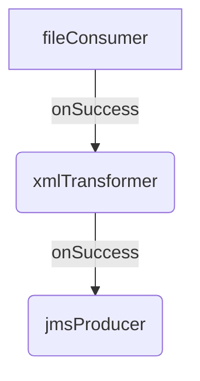
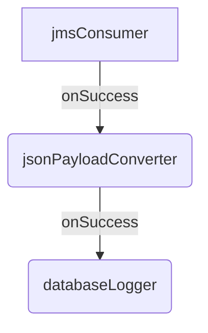
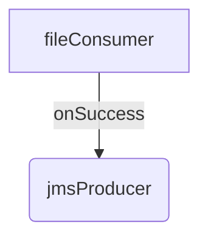

# Ikasan Module: demo-for-jeff

This document describes the `demo-for-jeff` module, a sample Ikasan integration module designed to demonstrate common integration patterns. The module is built for Ikasan version `4.1.0` and contains three distinct flows.

## Flows

The module includes the following flows:

1.  **File Ingest Flow**: Reads files from the local filesystem, transforms them, and sends them to a JMS topic.
2.  **JMS Processing Flow**: Consumes messages from a JMS queue, converts the payload, and logs the data to a database.
3.  **fileToJmsFlow**: A simple flow that reads files from the filesystem and sends them directly to a JMS topic.

### File Ingest Flow

This flow is designed to automatically ingest XML files from a specified directory, transform them, and publish the results to a JMS topic.

**Components:**

-   `fileConsumer`: Consumes XML files from `/tmp/jeff/files`.
-   `xmlTransformer`: Transforms the incoming XML payload.
-   `jmsProducer`: Publishes the transformed message to the `topic/jeff.demo.topic` JMS topic.

### JMS Processing Flow

This flow manually consumes messages from a JMS queue, converts the JSON payload, and logs the result to a database.

**Components:**

-   `jmsConsumer`: Consumes messages from the `queue/jeff.demo.queue` JMS queue.
-   `jsonPayloadConverter`: Converts the message payload to a JSON format.
-   `databaseLogger`: Logs the processed data to a database.

### fileToJmsFlow

This is a simple, automatic flow that moves files directly from the filesystem to a JMS topic without any transformation.

**Components:**

-   `fileConsumer`: Consumes files from `/tmp/jeff/files`.
-   `jmsProducer`: Publishes the file content to the `topic/jeff.demo.topic` JMS topic.
