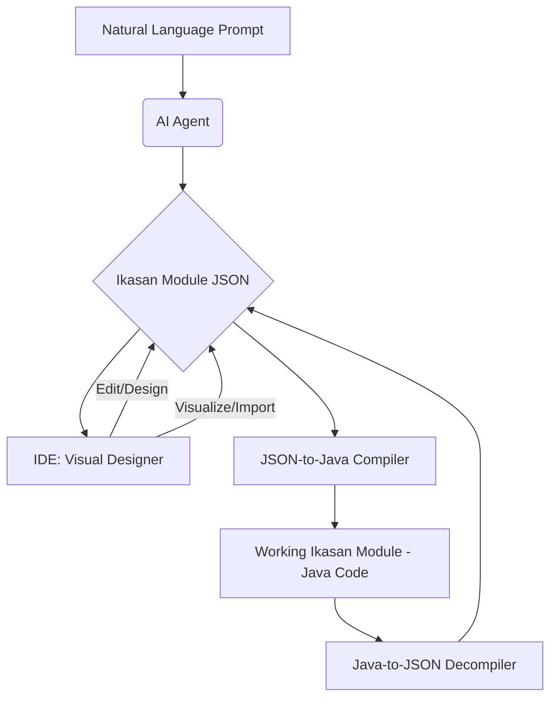

# Theme 6: AI-Powered Productivity Tools (Accelerator)

This theme focuses on using AI to automate the most time-consuming parts of Ikasan development. These tools will build on the foundation provided by the JSON schema.

*   **Goal: Automate Module Creation with AI**
    *   **Action:** Develop a "Natural Language to Ikasan JSON" Service
        *   Create a new service that integrates with a large language model (LLM).
        *   This service will take a high-level, natural-language prompt as input.
        *   **Example Prompt:** *"Create a module that consumes messages from a JMS queue named `INBOUND.Q`, filters out any message that doesn't have a `REGION` header equal to `EU`, and then publishes the result to an SFTP server at `sftp.example.com`."*
        *   The service's output will be a valid `ikasan-module.json` file that conforms to the [Ikasan module datamodel](IkasanDataModel.md).
    *   **Action: Integrate AI into the IDE**
        *   The IDE extension will provide a command to "Create Ikasan Module from description...".
        *   This command will invoke the AI service, generate the JSON, and then use the JSON-to-Java "compiler" to scaffold the complete, working module in the user's workspace.
*   **Goal: AI-Assisted Component Configuration**
    *   **Action:** Within the IDE's visual designer, add an "AI Assistant" feature.
    *   When a developer is configuring a complex component (e.g., a Hibernate consumer), they can ask the assistant for help in natural language.
    *   **Example Query:** *"How do I set up the Hibernate component to poll the `CUSTOMER` table every 5 seconds?"*
    *   The AI assistant will provide the correct configuration values or even fill them in directly.
*   **Goal (Long-Term): Fine-Tuning for Ikasan**
    *   **Action:** Investigate the possibility of fine-tuning a smaller, open-source LLM on the entire Ikasan codebase, documentation, and existing integration modules.
    *   **Why:** A fine-tuned model would have a deep understanding of Ikasan's specific patterns and best practices, leading to higher-quality, more idiomatic generated code and configurations.

## The Ikasan Module Generation Lifecycle

This diagram illustrates the end-to-end lifecycle of Ikasan module generation, from natural language descriptions to a working module, leveraging both IDE-based visual design and AI-driven automation.

