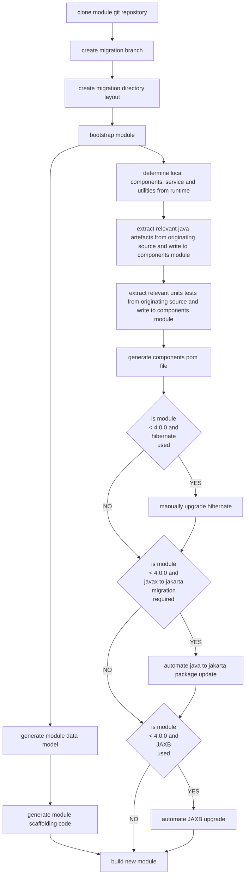

# Theme 2: Module Generation and Migration Upgrade Utilities (Accelerator)

This theme focuses on the necessity to automate and streamline the Ikasan Enterprise Service Bus module upgrade process.
- Cost of ownership of the Ikasan Enterprise Service Bus platform is reduced, thus making adoption more compelling.
- Developers not required to perform repetitive and mundane manual migrations.
- If module upgrades can be automated, implementations of the Ikasan Enterprise Service Bus can remain relevant and leverage new features in a more timely manner.


*   **Goal: Automate Module Upgrade Process**
    *   **Action:** Develop an "Automated Ikasan Enterprise Service Bus Integration Module Upgrade Tool".
        *   Leverage the "Core Ikasan Module Data Model" to drive the automation process.
        *   Given that the "Core Ikasan Module Data Model" is descriptive enough to generate an "Ikasan Integration Module", why would a developer ever need to write the scaffolding of a module. The migration tooling should automate the building of the module scaffolding.
        *   Ikasan Components, services or utilities that are used by an "Ikasan Integration Module" are either developed locally to a module, or are provided by dependencies to the module. Ikasan Components, services or utilities local to the module should be pulled into a jar that can be referenced from the automated scaffolding created in the previous step.   
        *   For existing modules, develop an automated process that isolates the Ikasan Components, services or utilities that are local to the module that is being migrated, and build the jar mentioned in the previous step. 
    
## The Ikasan Module Upgrade Lifecycle


### 1. clone module git repository
Assuming that the module lives in a git backed repository, clone the repository. If not the case simply expand the module source code on the file system. 

### 2. create migration branch
Assuming that the module lives in a git backed repository, create a migration branch. This step can be skipped otherwise.

### 3. create migration directory layout
The target migration structure can be seen below, and it is created along the originating directory structure of the module being
migrated. Ultimately it will replace the layout we are migrating from. The main difference being a scaffolding sub-module in which classes responsible 
for bootstrapping the application reside, along with the definitions of the module itself and the flows. Secondly, the components
sub-module contains any Ikasan component implementations that are required by the module, along with any services, model classes
or utilities associated with the module. 
```text
module-root
|-- scaffolding
|---- src
|------- main
|---------- java
|------------ src code...
|---------- resources
|------- test
|---------- java
|------------ integration tests...
|---------- resources
|------------ test data and properties
|---- pom.xml
|-- components
|---- src
|------- main
|---------- java
|------------ src code...
|---------- resources
|------- test
|---------- java
|------------ unit tests...
|---------- resources
|------------ test data and properties
|---- pom.xml
|-- distribution
|---- distribution.xml
|---- pom.xml
|-- pom.xml
|-- .gitignore
|-- README.md
```
### 4. bootstrap module
It is necessary to bootstrap the module in a context that allows the [JsonModuleManifestMetaDataProvider](../../../topology/src/main/java/org/ikasan/topology/metadata/JsonModuleManifestMetaDataProvider.java)
to be called which allows the core module data model to be generated.

### 5. generate module scaffolding code
From the core module data model, the process will delegate to freemarker or similar technology to generate opinionated
module scaffolding code under the scaffolding sub-module. Ultimately, there should never be a need for a developer to
write any scaffolding code. This cannot be prevented however and should be recommended or mandated, or even a way to enforce
could be implemented.

### 6. determine local components, service and utilities from runtime
We have both the originating module code available on the filesystem, as well as the module having been bootstrapped, access
to the Spring context and the ability to inspect the runtime. From both, this goal of this step is to identify all local
implementations of Ikasan components, as well as service and utilities. This is really the key to automating the migration
and could in fact be very difficult to achieve, if possible at all. 

### 7. extract relevant java artefacts from originating source and write to components module
Assuming we have been able to get enough context in the previous step, extract all relevant source code from the originating
source code, and write it to the components sub-module. We also need to be able to define all the relevant spring context
wiring, ideally using spring auto-configuration.

### 8. extract relevant units tests from originating source and write to components module
Extract all relevant unit test source code from the originating source code, and write it to the components sub-module.

### 9. generate components pom file
It is necessary to generate a pom file for the components sub-module. The will need to be sensitive to the dependencies in the
originating source code, alongside the versions of the dependencies required by the version of Ikasan that the migration is 
targeting. 

### 10. if originating module version < 4.0.0 and hibernate used
It may be possible to automate the upgrade to JPA and associated version of Hibernate. However, is it likely that it will 
be necessary to manually migrate this step.

### if originating module version < 4.0.0 and javax to jakarta migration required
JDK17 upgrade mandates that the javax namespace is migration to the jakarta namespace. This migration step should be automated
and a simple String replacement should be sufficient.

### if originating module version < 4.0.0 and JAXB used
JDK17 upgrade mandates that JAXB is upgraded. This migration step should be automated and a simple String replacement should be sufficient.
There may be manual steps required if any dependencies delegate to an older version of Ikasan.