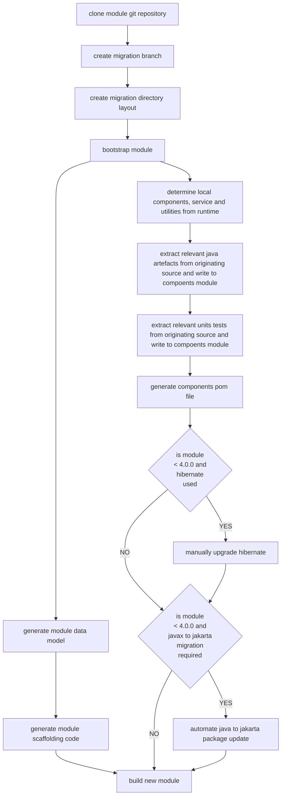

# Theme 3: Module Upgrade Utilities

This theme focuses on the necessity to automate and streamline the Ikasan Enterprise Service Bus module upgrade process.
- Cost of ownership of the Ikasan Enterprise Service Bus platform is reduced, thus making adoption more compelling.
- Developers not required to perform repetitive and mundane manual migrations.
- If module upgrades can be automated, implementations of the Ikasan Enterprise Service Bus can remain relevant and leverage new features in a more timely manner.

*   **Goal: Automate Module Upgrade Process**
    *   **Action:** Develop an "Automated Ikasan Enterprise Service Bus Integration Module Upgrade Tool".
        *   Leverage the "Core Ikasan Module Data Model" to drive the automation process.
        *   Given that the "Core Ikasan Module Data Model" is descriptive enough to generate an "Ikasan Integration Module", why would a developer ever need to write the scaffolding of a module. The migration tooling should automate the building of the module scaffolding.
        *   Ikasan Components, services or utilities that are used by an "Ikasan Integration Module" are either developed locally to a module, or are provided by dependencies to the module. Ikasan Components, services or utilities local to the module should be pulled into a jar that can be referenced from the automated scaffolding created in the previous step.   
        *   For existing modules, develop an automated process that isolates the Ikasan Components, services or utilities that are local to the module that is being migrated, and build the jar mentioned in the previous step. 
    
## The Ikasan Module Upgrade Lifecycle

- module-root
    - scaffolding
        - src
            - main
                - java
                    - src code...
            - test
                - java
                    - integration tests
                - resources
                    - test data and properties
        - pom.xml
    - components
        - src
            - main
                - java
                    - src code...
            - test
                - java
                    - component tests
                - resources
                    - test data and properties
    - pom.xml
    - .gitignore
    - README.md

