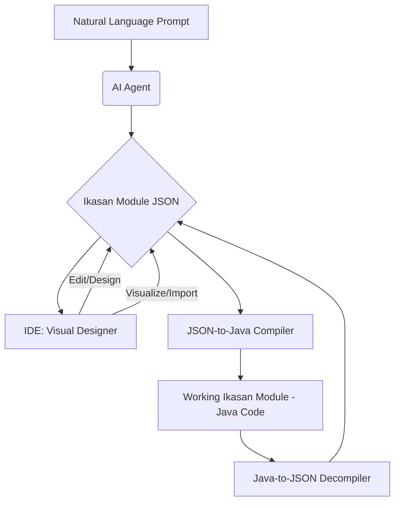

# Theme 2: The Ikasan IDE (Visual Development)

This theme covers the creation of an IDE extension (e.g., for VS Code or IntelliJ) that provides a rich, visual environment for developing Ikasan modules.

*   **Goal: Create a Visual Module Designer**
    *   **Action:** Develop the core IDE extension, which will feature a webview-based visual designer.
        *   Use a canvas library (like `vis.js`, which is already used in the dashboard, or a more modern alternative like `React Flow`) to create a drag-and-drop interface for designing flows.
        *   Build a dynamic property editor that displays the correct configuration fields for any selected component.
        *   The designer will read from and write to a standard `ikasan-module.json` file in the project.
    *   **Action: Build the "Compiler": JSON-to-Java**
        *   Create a service (likely as part of the `cli` or a new `ikasan-code-generator` module) that takes a valid `ikasan-module.json` file as input.
        *   This service will generate the complete, compilable Java source code for the module, including the `pom.xml`, flow configurations, and component wirings.
    *   **Action: Build the "Decompiler": Java-to-JSON**
        *   Create a service that can parse an existing Ikasan module's Java source code.
        *   This service will reverse-engineer the module's structure and generate the corresponding `ikasan-module.json` file. This is critical for importing and visualizing existing projects.
    *   **Action: Integrate Tooling**
        *   The IDE extension will use the "compiler" and "decompiler" to provide a seamless, two-way sync between the visual design and the underlying Java code.

*   **Goal: Create a Visual Data Mapping Utility**
    *   **Action:** Develop a user-friendly, visual interface within the IDE extension that allows non-technical users to define data transformations.
        *   Support various data formats (e.g., XML, JSON, CSV, database schemas).
        *   Enable drag-and-drop mapping between source and target fields.
        *   Provide basic transformation functions (e.g., concatenation, simple arithmetic, conditional logic).
        *   Generate the underlying Ikasan mapping component configuration (e.g., XSLT, custom Java mapping code) from the visual design.
    *   **Why:** Data mapping is a frequent and complex task in integration. A visual tool empowers business users and reduces reliance on developers for common transformations.

## The Ikasan Module Generation Lifecycle

This diagram illustrates the end-to-end lifecycle of Ikasan module generation, from natural language descriptions to a working module, leveraging both IDE-based visual design and AI-driven automation.

