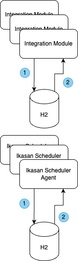

# Ikasan Current State

## Module/Agent Authentication and Authorisation
Module/Agent authentication and authorisation can be configured to delegate to the Ikasan Dashboard, or delegate to the local
H2 database.

When the `ikasan.dashboard.extract.enabled` flag is set to true in the application.properties, authentication and authorisation 
delegates to the authentication REST service (see [Dashboard REST Services](../../../../visualisation/dashboard/dashboard-rest.md)) 
exposed in the Ikasan Dashboard. Depending on the configuration of the Ikasan Dashboard, authentication will performed against LDAP, 
or the dashboard's local H2 database. 

When configured in this manner, the module/agent is reliant upon the Ikasan Dashboard being available in order
to access the associated console. However, the module can still be stopped and started via the Ikasan Shell and assuming flows are 
configured to start automatically the module will process business messages unimpeded. 
```properties
ikasan.dashboard.extract.enabled=true
```

Module/Agent authentication and authorisation can also be configured to delegate to its local H2 database by setting the
`ikasan.dashboard.extract.enabled` flag to false in the application.properties.
```properties
ikasan.dashboard.extract.enabled=false
```

### Dashboard and LDAP Authentication and Authorisation

1. Module or agent initiates a call to the authentication service exposed in the Ikasan Dashboard.
2. Using the credential provided in the authentication request, the user account is authenticated against the LDAP server.
3. If the authentication is successful, a call to the dashboard's underlying H2 database retrieves the policies for which the user is authorised.
4. A JSON Web Token (JWT) is returned to the module / agent providing access to the authorisations for the authenticated user.

> [!NOTE]  
> - Relies on a highly available LDAP server.
> - If the Ikasan Dashboard is not available, the module/agent cannot authenticate and the associated console cannot be accessed and entities cannot be harvested to the document store via the Ikasan Dashboard.
> - If the H2 database associated with the Ikasan Dashboard is corrupted or unavailable, the authentication and authorisation will fail.

### Dashboard and Local Authentication and Authorisation

1. Module or agent initiates a call to the authentication service exposed in the Ikasan Dashboard - see [Dashboard REST Services](../../../../visualisation/dashboard/dashboard-rest.md).
2. Using the credential provided in the authentication request, the user account is authenticated against the password stored in the H2 database.
3. If the authentication is successful, a call to the dashboard's underlying H2 database retrieves the policies for which the user is authorised.
4. A JSON Web Token (JWT) is returned to the module / agent providing access to the authorisations for the authenticated user.

> [!NOTE]
> - If the Ikasan Dashboard is not available, the module/agent cannot authenticate and the associated console cannot be accessed and entities cannot be harvested to the document store via the Ikasan Dashboard.
> - If the H2 database associated with the Ikasan Dashboard is corrupted or unavailable, the authentication and authorisation will fail.


### Module/Agent Local Authentication and Authorisation

1. Module or agent initiates delegates to the local H2 database, and the user account is authenticated against the password stored in the H2 database.
2. If the authentication is successful, the module/agent policies are retrieved from the local H2 database and the user given access to the module/agent console with access to features for which they are authorised.

> [!NOTE]  
> - If the H2 database associated with the module/agent is corrupted or unavailable, the authentication and authorisation will fail. Moreover, the module/agent will simply not start.

## Module Metadata Ingestion
When an Ikasan module/agent is activated the module is rendered into a [ModuleMetaData](../../../../topology/README.md) JSON document. All
configurations associated with the module are also rendered into a collection of [ConfigurationMetaData](../../../../configuration-service/Readme.md) JSON documents.
The module registers itself with the Ikasan Dashboard that it is configured to be associated with by publishing the module meta data and collection of configuration metadata
via the [Dashboard REST Services](../../../../visualisation/dashboard/dashboard-rest.md). 
The properties below are provided in the module/agents application.properties file. Once a module is registered with the Ikasan Dashboard, the module is able to be rendered
in the dashboard, it can be controlled and the state of its flows reported.

````properties
## Dashboard data extraction settings
ikasan.dashboard.extract.enabled=true
ikasan.dashboard.extract.base.url=http://localhost:9090
ikasan.dashboard.extract.username=admin
ikasan.dashboard.extract.password=pa55w0rd
````


1. The module/agent is activated and the module metadata JSON document and configuration metadata JSON documents are resolved. The module/agent activation is generally associated with a module restart, however in the case of an agent this can also happen when job plans are deployed or synchronised with the agent.
2. The module metadata is published to the Ikasan Dashboard via the [Dashboard REST Services](../../../../visualisation/dashboard/dashboard-rest.md).
3. The configuration metadata collection is published to the Ikasan Dashboard.
4. The metadata documents are published to the SOLR document index.

> [!NOTE]
> - The resolution of the module metadata is not dependant upon the availability of the module/agents underlying H2 database, however the resolution of the configuration meta data is.
> - If the H2 database associated with the module/agent is corrupted or unavailable, the module/agent will simply not start.
> - The the Ikasan Dashboard is unavailable, the module and configuration metadata cannot be published. The module/agent will still restart, however the dashboard will not receive any notification of module shape changes, or the deployment of a new module until the module/agent next goes through its restart lifecycle when the Ikasan Dashboard is active.
> - If the SOLR document index is unavailable the publication of the module and configuration metadata will fail, however the module/agent will still restart as per the previous statement. The Ikasan Dasboard will generally be adversely affected if the document index is unavailable.

## Entity Harvesting and Ingestion
All Ikasan Integration Modules and Scheduler Agents capture various entity data as part of their normal operation (wiretap events, system events, 
exclusion events, error events, replay events, metrics events) to their local H2 database, and these entities are subsequently harvested to
a SOLR document index via [Dashboard REST Services](../../../../visualisation/dashboard/dashboard-rest.md).


1. An Ikasan module/agent captures an entity in its local H2 database.
2. For each entity, a periodic harvesting job reads n entity records.
3. The harvesting writes the entity records to an exposed REST service on the Ikasan Dashboard - see [Dashboard REST Services](../../../../visualisation/dashboard/dashboard-rest.md).
4. The entities are published to the SOLR document index.
5. The entity records are marked as successfully harvested and updated in the module/agent local H2 database. 

> [!NOTE]
> - If the H2 database associated with the module/agent is corrupted or unavailable, entities will not be written to the underlying H2 database. 
> - If the Ikasan Dashboard is unavailable, entity harvesting will fail until the dashboard is available again. The harvesting is configured to retry. As such the module/agent is engineered to cope with the dashboard being unavailable.
> - If the SOLR document index is unavailable entity harvesting will fail. The Ikasan Dasboard will generally be adversely affected if the document index is unavailable. 


