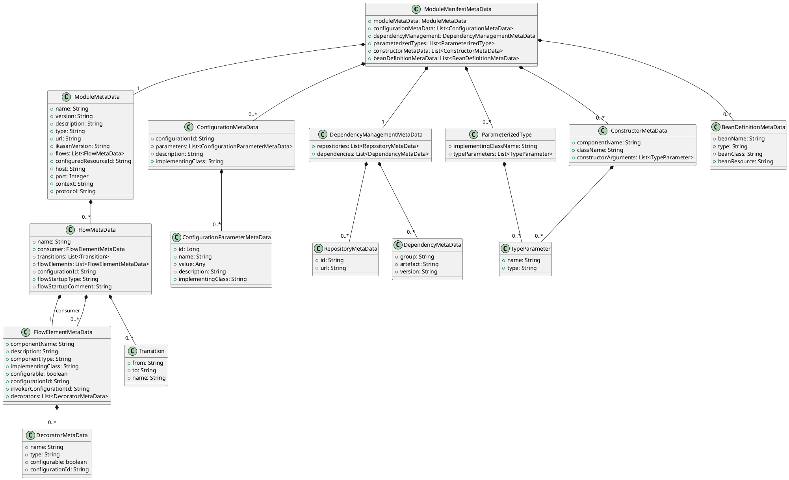

# Theme 1: The Ikasan Module JSON Data Model (The Foundation)

The foundation for our developer tooling and AI-driven features is a standardized JSON representation of an Ikasan module. Crucially, this JSON data model is **directly derived from and maps to existing Ikasan core classes**, ensuring consistency and leveraging the established domain model.

*   **Goal: Leverage Existing Ikasan Metadata Classes**
    *   **Action:** The JSON data model will directly reflect the structure of Ikasan classes.
    *   **Action:** The JSON structure, as detailed below, will serve as the canonical representation for module definitions.
    *   **Action:** Ensure that any tooling (IDE, AI generator) directly works with this established data model for both input and output, minimizing transformation overhead and maintaining fidelity with the Ikasan core.

## ModuleManifestMetaDataImpl JSON Data Model

This document provides a detailed description of the JSON data model for `ModuleManifestMetaDataImpl.java`, which represents the metadata of an Ikasan module. This metadata is essential for understanding the module's structure, configurations, and dependencies.

### Data Model Class Diagram



### JSON Structure

The JSON object consists of the following top-level properties:

-   `moduleMetaData`: General information about the module.
-   `configurationMetaData`: A list of metadata for the module's configurations.
-   `dependencyManagement`: Information about the module's dependencies.
-   `parameterizedTypes`: A list of parameterized types used in the module.
-   `constructorMetaData`: A list of metadata for the module's constructors.
-   `beanDefinitionMetaData`: A list of metadata for the bean definitions within the module.

### Detailed Field Descriptions

#### ModuleMetaData

This object contains fundamental information about the module.

| Field                | Type       | Description                                                                 |
| -------------------- | ---------- | --------------------------------------------------------------------------- |
| `name`               | `String`   | The name of the module.                                                     |
| `version`            | `String`   | The version of the module.                                                  |
| `description`        | `String`   | A brief description of the module's purpose.                                |
| `type`               | `String`   | The type of the module (e.g., `Integration Module`).                        |
| `url`                | `String`   | The URL of the module.                                                      |
| `ikasanVersion`      | `String`   | The version of the Ikasan platform the module is built for.                 |
| `flows`              | `Array`    | A list of flow metadata objects within the module.                          |
| `configuredResourceId` | `String`   | The ID for the module's configuration.                                      |
| `host`               | `String`   | The host where the module is running.                                       |
| `port`               | `Integer`  | The port the module is running on.                                          |
| `context`            | `String`   | The context path for the module.                                            |
| `protocol`           | `String`   | The protocol used by the module (e.g., `http`).                             |

##### FlowMetaData

| Field                | Type      | Description                                                                 |
| -------------------- | --------- | --------------------------------------------------------------------------- |
| `name`               | `String`  | The name of the flow.                                                       |
| `consumer`           | `Object`  | The flow's consumer metadata.                                               |
| `transitions`        | `Array`   | A list of transitions between flow elements.                                |
| `flowElements`       | `Array`   | A list of all elements within the flow.                                     |
| `configurationId`    | `String`  | The ID for the flow's configuration.                                        |
| `flowStartupType`    | `String`  | The startup type for the flow.                                              |
| `flowStartupComment` | `String`  | A comment about the flow's startup.                                         |

##### Consumer

| Field                 | Type      | Description                                                                 |
| --------------------- | --------- | --------------------------------------------------------------------------- |
| `componentName`       | `String`  | The name of the consumer component.                                         |
| `description`         | `String`  | A description of the consumer.                                              |
| `componentType`       | `String`  | The type of the consumer component.                                         |
| `implementingClass`   | `String`  | The fully qualified class name of the consumer's implementation.            |
| `configurable`        | `Boolean` | Whether the consumer is configurable.                                       |
| `configurationId`     | `String`  | The ID for the consumer's configuration.                                    |
| `invokerConfigurationId` | `String`  | The ID for the consumer's invoker configuration.                            |
| `decorators`          | `Array`   | A list of decorators applied to the consumer.                               |

##### Decorators

| Field             | Type      | Description                                                                 |
| ----------------- | --------- | --------------------------------------------------------------------------- |
| `name`            | `String`  | The name of the decorator.                                                  |
| `type`            | `String`  | The type of the decorator.                                                  |
| `configurable`    | `Boolean` | Whether the decorator is configurable.                                      |
| `configurationId` | `String`  | The ID for the decorator's configuration.                                   |

##### Transitions

| Field | Type     | Description                               |
| ----- | -------- | ----------------------------------------- |
| `from`  | `String` | The name of the source flow element.      |
| `to`    | `String` | The name of the target flow element.      |
| `name`  | `String` | The name of the transition.               |

##### FlowElementMetaData

| Field                 | Type      | Description                                                                 |
| --------------------- | --------- | --------------------------------------------------------------------------- |
| `componentName`       | `String`  | The name of the flow element.                                               |
| `description`         | `String`  | A description of the flow element.                                          |
| `componentType`       | `String`  | The type of the flow element.                                               |
| `implementingClass`   | `String`  | The fully qualified class name of the flow element's implementation.        |
| `configurable`        | `Boolean` | Whether the flow element is configurable.                                   |
| `configurationId`     | `String`  | The ID for the flow element's configuration.                                |
| `invokerConfigurationId` | `String`  | The ID for the flow element's invoker configuration.                        |
| `decorators`          | `Array`   | A list of decorators applied to the flow element.                           |

##### ConfigurationMetaData

An array of objects, each describing a specific configuration within the module.

| Field               | Type      | Description                                                                 |
| ------------------- | --------- | --------------------------------------------------------------------------- |
| `configurationId`   | `String`  | A unique identifier for the configuration.                                  |
| `parameters`        | `Object`  | A map of configuration parameters.                                          |
| `description`       | `String`  | A description of the configuration's purpose.                               |
| `implementingClass` | `String`  | The fully qualified class name of the configuration's implementation.       |

##### ConfigurationParameters

| Field             | Type      | Description                                                                 |
| ----------------- | --------- | --------------------------------------------------------------------------- |
| `id`              | `Long`    | The ID of the configuration parameter.                                      |
| `name`            | `String`  | The name of the configuration parameter.                                    |
| `value`           | `Any`     | The value of the configuration parameter.                                   |
| `description`     | `String`  | A description of the configuration parameter.                               |
| `implementingClass` | `String`  | The fully qualified class name of the configuration parameter's implementation. |

##### DependencyManagement

This object details the module's dependencies.

| Field          | Type    | Description                                      |
| -------------- | ------- | ------------------------------------------------ |
| `repositories` | `Array` | A list of Maven repositories used by the module. |
| `dependencies` | `Array` | A list of the module's dependencies.            |

##### Repositories

| Field | Type     | Description                               |
| ----- | -------- | ----------------------------------------- |
| `id`    | `String` | The ID of the repository.                 |
| `url`   | `String` | The URL of the repository.                |

#### Dependencies

| Field      | Type     | Description                               |
| ---------- | -------- | ----------------------------------------- |
| `group`    | `String` | The group ID of the dependency.           |
| `artefact` | `String` | The artifact ID of the dependency.        |
| `version`  | `String` | The version of the dependency.            |

### ParameterizedTypes

An array of objects, each representing a parameterized type used in the module.

| Field                 | Type     | Description                                                              |
| --------------------- | -------- | ------------------------------------------------------------------------ |
| `implementingClassName` | `String` | The fully qualified class name of the parameterized type.                |
| `typeParameters`      | `Array`  | A list of the type parameters.                                           |

#### TypeParameter

| Field | Type     | Description                               |
| ----- | -------- | ----------------------------------------- |
| `name`  | `String` | The name of the type parameter.           |
| `type`  | `String` | The type of the type parameter.           |

##### ConstructorMetaData

An array of objects, each describing a constructor within the module.

| Field                | Type     | Description                                                              |
| -------------------- | -------- | ------------------------------------------------------------------------ |
| `componentName`      | `String` | The name of the component.                                               |
| `className`          | `String` | The fully qualified class name of the component.                         |
| `constructorArguments` | `Array`  | A list of the constructor's arguments.                                   |

##### ConstructorArguments 

| Field | Type     | Description                               |
| ----- | -------- | ----------------------------------------- |
| `name`  | `String` | The name of the constructor argument.     |
| `type`  | `String` | The type of the constructor argument.     |

##### BeanDefinitionMetaData

An array of objects, each providing metadata for a bean definition within the module.

| Field          | Type     | Description                                                              |
| -------------- | -------- | ------------------------------------------------------------------------ |
| `beanName`     | `String` | The name of the bean.                                                    |
| `type`         | `String` | The scope of the bean (e.g., `singleton`).                               |
| `beanClass`    | `String` | The fully qualified class name of the bean.                              |
| `beanResource` | `String` | The resource where the bean is defined (e.g., a classpath XML file).     |

## Example

```json
{
  "moduleMetaData": {
    "name": "SampleModule",
    "version": "1.2.3",
    "description": "A comprehensive example of an Ikasan module.",
    "type": "Integration Module",
    "url": "/sample-module",
    "ikasanVersion": "3.0.1",
    "flows": [],
    "configuredResourceId": "sample-module-config",
    "host": "localhost",
    "port": 8080,
    "context": "/sample-module-context",
    "protocol": "http"
  },
  "configurationMetaData": [
    {
      "configurationId": "jms-connection-factory",
      "parameters": {
        "providerUrl": "tcp://localhost:61616",
        "username": "admin",
        "password": "admin"
      },
      "description": "ActiveMQ JMS Connection Factory configuration.",
      "implementingClass": "org.apache.activemq.ActiveMQConnectionFactory"
    }
  ],
  "dependencyManagement": {
    "repositories": [
      {
        "id": "central",
        "url": "https://repo.maven.apache.org/maven2"
      }
    ],
    "dependencies": [
      {
        "groupId": "org.apache.activemq",
        "artifactId": "activemq-client",
        "version": "5.16.3"
      }
    ]
  },
  "parameterizedTypes": [
    {
      "implementingClassName": "org.ikasan.connector.base.outbound.EISConnectionSpec",
      "typeParameters": [
        {
          "name": "ConnectionSpec",
          "rawType": "javax.resource.cci.ConnectionSpec"
        }
      ]
    }
  ],
  "constructorMetaData": [
    {
      "componentName": "sftpConsumer",
      "className": "org.ikasan.connector.sftp.SftpConsumer",
      "constructorArguments": [
        {
          "name": "transactionManager",
          "rawType": "org.springframework.transaction.PlatformTransactionManager"
        }
      ]
    }
  ],
  "beanDefinitionMetaData": [
    {
      "beanName": "jmsConnectionFactory",
      "type": "singleton",
      "beanClass": "org.apache.activemq.ActiveMQConnectionFactory",
      "beanResource": "classpath:/META-INF/spring/jms-context.xml"
    }
  ]
}
```
