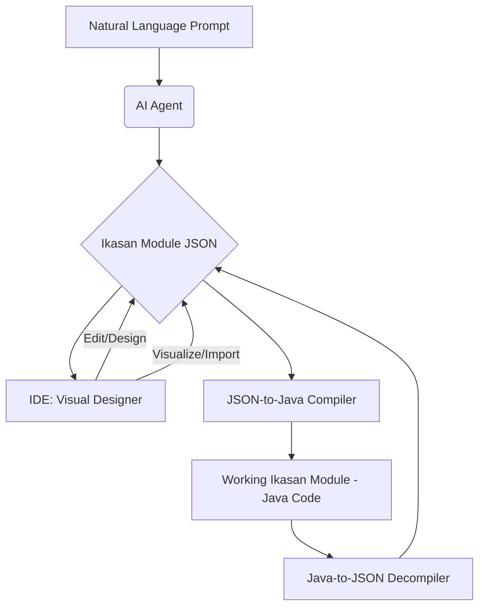

# Ikasan Strategic Roadmap: Developer Experience and AI

This document outlines a strategic roadmap for the Ikasan core framework, focusing on two primary goals:
1.  Creating a modern, IDE-based developer tool for visual module design.
2.  Leveraging AI to dramatically accelerate developer productivity and automate module generation.

The central concept is to establish a **standard JSON representation** of an Ikasan module, which will serve as the backbone for all tooling.

---

### Theme 1: The Ikasan Module JSON Data Model (The Foundation)

The foundation for our developer tooling and AI-driven features is a standardized JSON representation of an Ikasan module. Crucially, this JSON data model is **directly derived from and maps to existing Ikasan core classes**, ensuring consistency and leveraging the established domain model.

*   **Goal: Leverage Existing Ikasan Metadata Classes**
    *   **Action:** The JSON data model will directly reflect the structure of the following core Ikasan classes:
        *   `org.ikasan.spec.metadata.ModuleMetaData` (implemented by `org.ikasan.topology.metadata.model.ModuleMetaDataImpl`)
        *   `org.ikasan.spec.metadata.FlowMetaData` (implemented by `org.ikasan.topology.metadata.model.FlowMetaDataImpl`)
        *   `org.ikasan.spec.metadata.FlowElementMetaData` (implemented by `org.ikasan.topology.metadata.model.FlowElementMetaDataImpl`)
        *   `org.ikasan.spec.metadata.Transition` (implemented by `org.ikasan.topology.metadata.model.TransitionImpl`)
        *   `org.ikasan.spec.metadata.ConfigurationMetaData` (implemented by `org.ikasan.configurationService.metadata.ConfigurationMetaDataImpl`)
        *   `org.ikasan.spec.metadata.ConfigurationParameterMetaData` (implemented by `org.ikasan.configurationService.metadata.ConfigurationParameterMetaDataImpl`)
    *   **Action:** The JSON structure, as detailed in the Appendix, will serve as the canonical representation for module definitions.
    *   **Action:** Ensure that any tooling (IDE, AI generator) directly works with this established data model for both input and output, minimizing transformation overhead and maintaining fidelity with the Ikasan core.

---

### Theme 2: The Ikasan IDE (Visual Development)

This theme covers the creation of an IDE extension (e.g., for VS Code or IntelliJ) that provides a rich, visual environment for developing Ikasan modules.

*   **Goal: Create a Visual Module Designer**
    *   **Action:** Develop the core IDE extension, which will feature a webview-based visual designer.
        *   Use a canvas library (like `vis.js`, which is already used in the dashboard, or a more modern alternative like `React Flow`) to create a drag-and-drop interface for designing flows.
        *   Build a dynamic property editor that displays the correct configuration fields for any selected component.
        *   The designer will read from and write to a standard `ikasan-module.json` file in the project.
    *   **Action: Build the "Compiler": JSON-to-Java**
        *   Create a service (likely as part of the `cli` or a new `ikasan-code-generator` module) that takes a valid `ikasan-module.json` file as input.
        *   This service will generate the complete, compilable Java source code for the module, including the `pom.xml`, flow configurations, and component wirings.
    *   **Action: Build the "Decompiler": Java-to-JSON**
        *   Create a service that can parse an existing Ikasan module's Java source code.
        *   This service will reverse-engineer the module's structure and generate the corresponding `ikasan-module.json` file. This is critical for importing and visualizing existing projects.
    *   **Action: Integrate Tooling**
        *   The IDE extension will use the "compiler" and "decompiler" to provide a seamless, two-way sync between the visual design and the underlying Java code.

---

### Theme 3: AI-Powered Productivity Tools (The Accelerator)

This theme focuses on using AI to automate the most time-consuming parts of Ikasan development. These tools will build on the foundation provided by the JSON schema.

*   **Goal: Automate Module Creation with AI**
    *   **Action: Develop a "Natural Language to Ikasan JSON" Service**
        *   Create a new service that integrates with a large language model (LLM).
        *   This service will take a high-level, natural-language prompt as input.
        *   **Example Prompt:** *"Create a module that consumes messages from a JMS queue named `INBOUND.Q`, filters out any message that doesn't have a `REGION` header equal to `EU`, and then publishes the result to an SFTP server at `sftp.example.com`."*
        *   The service's output will be a valid `ikasan-module.json` file that conforms to the standard schema.
    *   **Action: Integrate AI into the IDE**
        *   The IDE extension will provide a command to "Create Ikasan Module from description...".
        *   This command will invoke the AI service, generate the JSON, and then use the JSON-to-Java "compiler" to scaffold the complete, working module in the user's workspace.
*   **Goal: AI-Assisted Component Configuration**
    *   **Action:** Within the IDE's visual designer, add an "AI Assistant" feature.
    *   When a developer is configuring a complex component (e.g., a Hibernate consumer), they can ask the assistant for help in natural language.
    *   **Example Query:** *"How do I set up the Hibernate component to poll the `CUSTOMER` table every 5 seconds?"*
    *   The AI assistant will provide the correct configuration values or even fill them in directly.
*   **Goal (Long-Term): Fine-Tuning for Ikasan**
    *   **Action:** Investigate the possibility of fine-tuning a smaller, open-source LLM on the entire Ikasan codebase, documentation, and existing integration modules.
    *   **Why:** A fine-tuned model would have a deep understanding of Ikasan's specific patterns and best practices, leading to higher-quality, more idiomatic generated code and configurations.

---

### The Ikasan Module Generation Lifecycle

This diagram illustrates the end-to-end lifecycle of Ikasan module generation, from natural language descriptions to a working module, leveraging both IDE-based visual design and AI-driven automation.



---

### Appendix: Ikasan Module JSON Structure

The following documents the JSON structure that will be used to represent an Ikasan module. This structure is based on the existing `ModuleMetaDataImpl`, `FlowMetaDataImpl`, `FlowElementMetaDataImpl`, `TransitionImpl`, `ConfigurationMetaDataImpl`, and `ConfigurationParameterMetaDataImpl` classes.

An Ikasan module is represented as a single JSON object with two top-level properties: `moduleMetaData` and `configurationMetaData`.

#### `moduleMetaData`

This object defines the structure of the module, its flows, and its components.

```json
{
  "moduleMetaData": {
    "name": "module-name",
    "description": "A description of the module.",
    "version": "1.0.0",
    "type": "SCHEDULER_AGENT",
    "url": "http://localhost:8080",
    "flows": [
      // Array of FlowMetaData objects
    ]
  },
  "configurationMetaData": [
    // Array of ConfigurationMetaData objects
  ]
}
```

#### `FlowMetaData`

This object defines a single flow within the module.

```json
{
  "name": "flow-name",
  "consumer": { /* FlowElementMetaData object */ },
  "flowElements": [
    // Array of FlowElementMetaData objects
  ],
  "transitions": [
    // Array of Transition objects
  ],
  "configurationId": "flow-configuration-id"
}
```

#### `FlowElementMetaData`

This object represents a single component within a flow.

```json
{
  "componentName": "component-name",
  "componentType": "consumer", // e.g., consumer, producer, splitter, router
  "implementingClass": "org.ikasan.component.jms.JmsConsumer",
  "isConfigurable": true,
  "configurationId": "component-configuration-id",
  "invokerConfigurationId": "invoker-configuration-id",
  "decorators": []
}
```

#### `Transition`

This object defines a directed link between two components.

```json
{
  "from": "component-name-1",
  "to": "component-name-2",
  "name": "transition-name" // e.g., "when 'true'"
}
```

#### `ConfigurationMetaData`

This object defines the configuration for a single component.

```json
{
  "configurationId": "component-configuration-id",
  "description": "Configuration for the JMS consumer.",
  "implementingClass": "org.ikasan.component.jms.JmsConsumerConfiguration",
  "parameters": [
    // Array of ConfigurationParameterMetaData objects
  ]
}
```

#### `ConfigurationParameterMetaData`

This object defines a single configuration parameter.

```json
{
  "name": "destinationName",
  "value": "in.queue",
  "description": "The name of the JMS queue to consume from.",
  "implementingClass": "java.lang.String"
}
```

---

### Full Working Example: `hello-world-jms`

This example demonstrates a complete JSON representation for a module named `hello-world-jms`. The module contains a single flow, "Hello World Flow," that consumes a message from a JMS queue, logs it, and then publishes it to a JMS topic.

```json
{
  "moduleMetaData": {
    "name": "hello-world-jms",
    "description": "A simple JMS hello world module.",
    "version": "1.0.0",
    "type": "SCHEDULER_AGENT",
    "url": "http://localhost:8080",
    "flows": [
      {
        "name": "Hello World Flow",
        "consumer": {
          "componentName": "JMS Consumer",
          "componentType": "consumer",
          "implementingClass": "org.ikasan.component.jms.JmsConsumer",
          "isConfigurable": true,
          "configurationId": "jms-consumer-config"
        },
        "flowElements": [
          {
            "componentName": "Logging Producer",
            "componentType": "producer",
            "implementingClass": "org.ikasan.component.endpoint.console.ConsoleProducer",
            "isConfigurable": false
          },
          {
            "componentName": "JMS Producer",
            "componentType": "producer",
            "implementingClass": "org.ikasan.component.jms.JmsProducer",
            "isConfigurable": true,
            "configurationId": "jms-producer-config"
          }
        ],
        "transitions": [
          {
            "from": "JMS Consumer",
            "to": "Logging Producer",
            "name": "default"
          },
          {
            "from": "Logging Producer",
            "to": "JMS Producer",
            "name": "default"
          }
        ]
      }
    ]
  },
  "configurationMetaData": [
    {
      "configurationId": "jms-consumer-config",
      "description": "Configuration for the JMS Consumer",
      "implementingClass": "org.ikasan.component.jms.JmsConsumerConfiguration",
      "parameters": [
        {
          "name": "destinationName",
          "value": "in.queue",
          "description": "The name of the JMS queue to consume from.",
          "implementingClass": "java.lang.String"
        }
      ]
    },
    {
      "configurationId": "jms-producer-config",
      "description": "Configuration for the JMS Producer",
      "implementingClass": "org.ikasan.component.jms.JmsProducerConfiguration",
      "parameters": [
        {
          "name": "destinationName",
          "value": "out.topic",
          "description": "The name of the JMS topic to publish to.",
          "implementingClass": "java.lang.String"
        }
      ]
    }
  ]
}
```
