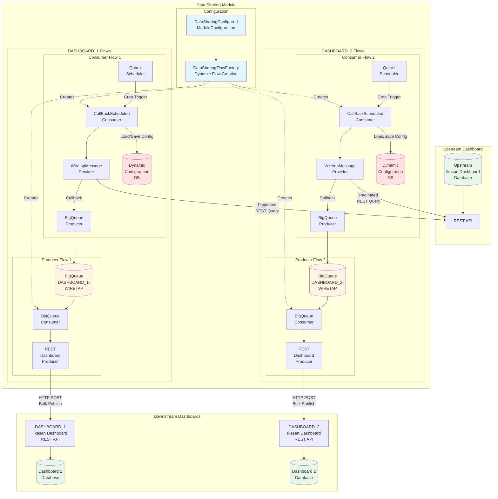
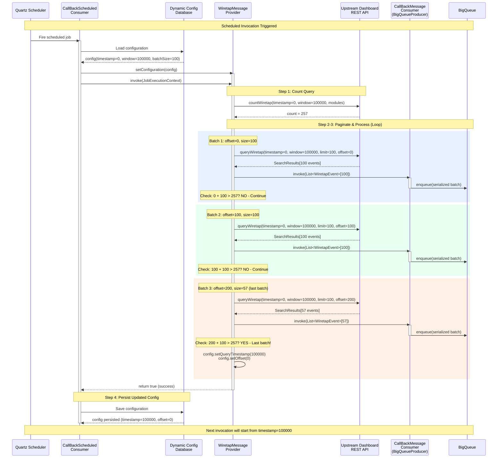
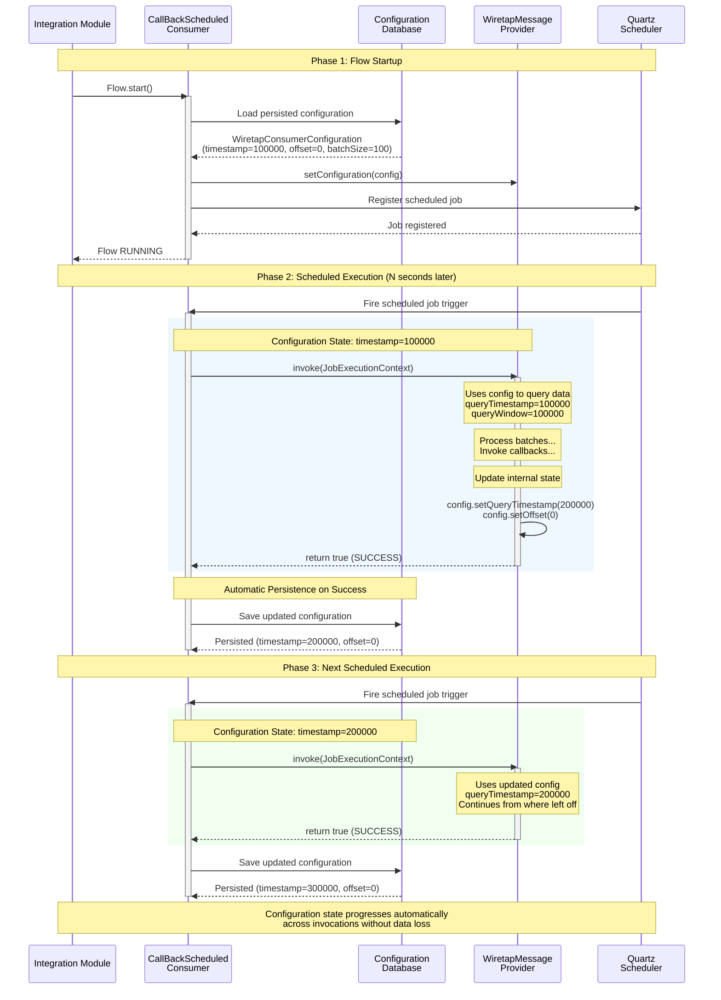

# Ikasan Data Sharing Module

## Table of Contents

- [Overview](#overview)
- [Key Features](#key-features)
- [Architecture](#architecture)
  - [Consumer Flow Pattern](#1-consumer-flow-pattern)
  - [Producer Flow Pattern](#2-producer-flow-pattern)
  - [Architecture Diagram](#architecture-diagram)
- [CallBackMessageProvider Pattern](#callbackmessageprovider-pattern)
  - [How CallBackMessageProvider Works](#how-callbackmessageprovider-works)
  - [Integration in Consumer Flows](#integration-in-consumer-flows)
  - [Benefits of This Pattern](#benefits-of-this-pattern)
- [WiretapMessageProvider: Paging and Reliability](#wiretapmessageprovider-paging-and-reliability)
  - [Query Window and Time-Based Paging](#query-window-and-time-based-paging)
  - [Pagination Algorithm](#pagination-algorithm)
  - [Reliability Mechanisms](#reliability-mechanisms)
  - [Example Execution Flow](#example-execution-flow)
  - [Module Filtering](#module-filtering)
  - [Configuration Parameters](#configuration-parameters)
  - [Best Practices](#best-practices)
- [Dynamic Configuration](#dynamic-configuration)
  - [Property-Driven Flow Factory](#property-driven-flow-factory)
  - [Configuration Structure](#configuration-structure)
- [Flow Naming Convention](#flow-naming-convention)
- [Supported Entity Types](#supported-entity-types)
- [Configuration Properties Reference](#configuration-properties-reference)
- [Example Configuration Scenarios](#example-configuration-scenarios)
- [Data Flow Lifecycle](#data-flow-lifecycle)
- [Error Handling and Retry](#error-handling-and-retry)
- [Maven Dependency](#maven-dependency)
- [Component Architecture](#component-architecture)
- [Monitoring and Operations](#monitoring-and-operations)
- [Performance Considerations](#performance-considerations)
- [Security](#security)
- [Troubleshooting](#troubleshooting)
- [Future Enhancements](#future-enhancements)
- [Contributing](#contributing)
- [License](#license)

## Overview

The **Ikasan Data Sharing Module** is a dynamic, configuration-driven integration module that enables automated synchronization of Ikasan ESB operational data between multiple dashboard instances. It acts as a data distribution hub, consuming data from an upstream dashboard and intelligently routing it to multiple downstream dashboards based on flexible configuration rules.

## Key Features

- **Dynamic Flow Creation**: Flows are automatically created at runtime based on property configuration
- **Multi-Dashboard Support**: Connect to one upstream dashboard and distribute to multiple downstream dashboards
- **Entity-Based Filtering**: Selectively share different types of data (Wiretap, Errors, Exclusions, Replays, etc.)
- **Module Filtering**: Configure which modules' data should be shared with each downstream dashboard
- **Configurable Scheduling**: Define custom cron expressions for each entity type per downstream dashboard
- **BigQueue-Based Buffering**: Reliable message buffering using persistent BigQueue storage
- **Zero-Code Configuration**: All behavior controlled through `application.properties`

## Architecture

The module consists of two primary flow patterns for each downstream dashboard and entity type:

### 1. Consumer Flow Pattern
```
[Scheduled Consumer] → [REST Query Upstream] → [BigQueue Producer]
```
- Polls upstream dashboard on a schedule (configurable via cron expression)
- Queries data using REST API with pagination support
- Buffers retrieved data in persistent BigQueue for reliability

### 2. Producer Flow Pattern
```
[BigQueue Consumer] → [REST Publisher] → [Downstream Dashboard]
```
- Consumes batched data from BigQueue
- Publishes to downstream dashboard via REST API
- Ensures reliable delivery with automatic retry

### Architecture Diagram

The following diagram illustrates the complete architecture showing how data flows from upstream dashboard through the data sharing module to multiple downstream dashboards:



**Key Architecture Points:**

1. **Dynamic Flow Creation**: `DataSharingFlowFactory` reads `DataSharingConfiguredModuleConfiguration` and dynamically creates flow pairs for each downstream dashboard and entity type

2. **Independent Flow Instances**: Each downstream dashboard gets its own consumer and producer flow pair, allowing:
   - Different polling schedules (cron expressions)
   - Independent configuration state (query timestamps)
   - Isolated failure domains

3. **Stateful Consumption**: Each consumer flow maintains its own dynamic configuration in the database, tracking query position independently

4. **BigQueue Buffering**: Persistent queues decouple consumer and producer flows, providing:
   - Reliability (survives restarts)
   - Backpressure handling
   - Batch accumulation

5. **Parallel Processing**: Multiple downstream dashboards consume from the same upstream source simultaneously at their own pace

## CallBackMessageProvider Pattern

The module leverages Ikasan's `CallBackMessageProvider` pattern to implement reliable, paginated data retrieval from upstream dashboards. This pattern provides a sophisticated approach to scheduled data consumption with built-in callback mechanisms.

### How CallBackMessageProvider Works

The `CallBackMessageProvider` interface defines a contract for scheduled message providers that work in conjunction with `CallBackScheduledConsumer`. This pattern differs from traditional consumers by:

1. **Separation of Concerns**: The provider focuses on data retrieval logic while the consumer handles scheduling and flow integration
2. **Callback Mechanism**: The provider is given a reference to a `CallBackMessageConsumer` which it invokes for each batch of data
3. **Flexible Invocation**: Supports multiple callbacks within a single scheduled execution

### Integration in Consumer Flows

```java
// Consumer Flow Structure
CallBackScheduledConsumer
    ├── WiretapMessageProvider (implements CallBackMessageProvider)
    │   └── invokes → CallBackMessageConsumer (injected)
    └── BigQueueProducer (the CallBackMessageConsumer)
```

**Flow Execution Sequence:**
1. Quartz scheduler fires `CallBackScheduledConsumer` based on cron expression
2. Consumer loads persisted configuration and injects it into `WiretapMessageProvider` via `setConfiguration()`
3. Consumer invokes `WiretapMessageProvider.invoke(JobExecutionContext)`
4. Provider queries upstream dashboard using configuration state (timestamp, window, modules)
5. Provider paginates through results, calling `callBackMessageConsumer.invoke(List<WiretapEvent>)` for each batch
6. CallBackMessageConsumer (BigQueueProducer) serializes and stores batch in BigQueue
7. Provider updates configuration state (advances timestamp, resets offset)
8. Provider returns `true` on success
9. Consumer automatically persists updated configuration to database for next invocation

### Benefits of This Pattern

- **Controlled Paging**: Provider manages pagination internally, invoking callback for each page
- **Memory Efficiency**: Large datasets processed in batches without loading all into memory
- **Error Isolation**: Errors in one batch don't prevent processing of subsequent batches
- **Flow Decoupling**: Provider logic is independent of flow-specific concerns
- **Reusability**: Same provider implementation can be used across different flow configurations
- **Stateful Execution**: Dynamic configuration maintains query position across restarts and failures

## WiretapMessageProvider: Paging and Reliability

The `WiretapMessageProvider` implementation demonstrates sophisticated query paging and reliability mechanisms for handling large volumes of wiretap data.

### Query Window and Time-Based Paging

The provider uses a **sliding time window** approach for reliable data retrieval:

```java
// Configuration
queryTimestamp = 0                    // Starting point (epoch or last processed time)
queryWindowMilliseconds = 100000      // 100 seconds window
```

**Time Window Strategy:**
- Queries data within a fixed time range: `[queryTimestamp, queryTimestamp + queryWindowMilliseconds]`
- After processing all data in window, advances timestamp by window size
- Prevents duplicate data retrieval by tracking last processed timestamp
- Enables checkpoint-based recovery on failure

### Pagination Algorithm

The provider implements a count-first pagination strategy:

```java
// Step 1: Count total records in time window
long count = dataSharingRestService.countWiretap(
    queryTimestamp,
    queryTimestamp + queryWindowMilliseconds,
    moduleNames
);

// Step 2: Paginate through results
for(int offset=0; offset<count; offset+=batchSize) {
    SearchResults<WiretapEvent> results = dataSharingRestService.queryWiretap(
        queryTimestamp,
        queryTimestamp + queryWindowMilliseconds,
        moduleNames,
        batchSize,
        offset
    );

    // Step 3: Invoke callback for each batch
    callBackMessageConsumer.invoke(results.getResultList());

    // Step 4: Advance timestamp on last batch
    if(offset + batchSize > count) {
        configuration.setOffset(0);
        configuration.setQueryTimestamp(
            queryTimestamp + queryWindowMilliseconds
        );
    }
}
```

#### Pagination Sequence Diagram

The following sequence diagram illustrates how the CallBackScheduledConsumer, WiretapMessageProvider, and CallBackMessageConsumer (BigQueueProducer) interact during paginated data retrieval:



**Key Points Illustrated:**

1. **Configuration Lifecycle**: Consumer loads config at start, provider updates it, consumer saves at end
2. **Count-First Strategy**: Provider queries total count before pagination to know when to stop
3. **Multiple Callbacks**: Provider invokes callback once per batch (3 times for 257 records)
4. **Last Batch Detection**: Condition `(offset + batchSize > count)` determines when to advance timestamp
5. **Timestamp Advancement**: Only updates on last batch, ensuring all data in window is processed
6. **State Persistence**: Updated configuration saved to database for next invocation
7. **Offset Reset**: After processing window, offset returns to 0 for next time window

**Failure Scenarios:**

- **If failure occurs on Batch 2**: Configuration not updated (still timestamp=0, offset=0), next invocation retries from beginning
- **If failure occurs after Batch 3 callback but before config save**: Same window re-processed (safe, idempotent)
- **If config save succeeds**: Next invocation starts from timestamp=100000, continuing forward

### Reliability Mechanisms

#### 1. Stateful Configuration via Dynamic Configuration Paradigm

The `WiretapMessageProvider` leverages **Ikasan's Dynamic Configuration paradigm** to maintain state across invocations. This is achieved by implementing the `ConfiguredResource<WiretapConsumerConfiguration>` interface, which enables automatic persistence of configuration changes.

**How Dynamic Configuration Works:**

The `CallBackScheduledConsumer` component is configured with the `WiretapMessageProvider` as its message provider. When the provider implements `ConfiguredResource`, Ikasan automatically:

1. **Loads Configuration**: On flow startup, loads persisted configuration from database
2. **Injects Configuration**: Calls `setConfiguration()` to provide the provider with its configuration
3. **Persists Changes**: After each successful invocation, automatically saves configuration updates to database
4. **Survives Restarts**: Configuration state persists across module restarts and JVM restarts

**Configuration Persistence in Action:**

```java
public class WiretapMessageProvider implements
    CallBackMessageProvider<Boolean>,
    ConfiguredResource<WiretapConsumerConfiguration> {  // Key interface

    private WiretapConsumerConfiguration configuration;

    @Override
    public Boolean invoke(JobExecutionContext context) {
        // Query and process data...

        // Update configuration state
        configuration.setQueryTimestamp(newTimestamp);  // Updates are automatically persisted
        configuration.setOffset(0);

        return true;  // Success triggers configuration save
    }
}
```

**State Tracked Between Invocations:**
- **Query Timestamp**: Tracks the last successfully processed time window (milliseconds since epoch)
- **Offset**: Records position within current time window (enables mid-window recovery)
- **Batch Size**: Configurable batch size for pagination (default: 100)
- **Module Names**: Filter list for targeted data retrieval
- **Query Window**: Size of time window in milliseconds (default: 100000)

**Benefits of Dynamic Configuration:**

1. **Automatic Persistence**: No manual database code required
2. **Transactional Safety**: Configuration saved only on successful flow execution
3. **Runtime Modification**: Configuration can be updated via Ikasan dashboard
4. **Audit Trail**: All configuration changes are tracked in database
5. **Multi-Instance Safe**: Each flow instance maintains independent configuration state

**Configuration Lifecycle:**

The following sequence diagram shows how configuration state is managed across the lifecycle of the consumer flow:



**Lifecycle Phases Explained:**

1. **Flow Startup**:
   - Consumer loads last persisted configuration from database
   - Configuration injected into provider via `setConfiguration()`
   - Flow ready to execute with correct query position

2. **Scheduled Execution**:
   - Quartz triggers consumer based on cron expression
   - Provider uses current configuration state to query data
   - Provider processes data and updates configuration internally
   - On success, consumer automatically persists updated configuration

3. **Next Execution**:
   - Cycle repeats with updated configuration state
   - Query continues from where previous invocation left off
   - No gaps or duplicates in data retrieval

**Configuration State Progression:**

| Invocation | Start Timestamp | Process Data From | End Timestamp | Status |
|-----------|-----------------|-------------------|---------------|---------|
| 1 | 100000 | [100000-200000] | 200000 | Persisted |
| 2 | 200000 | [200000-300000] | 300000 | Persisted |
| 3 | 300000 | [300000-400000] | 400000 | Persisted |
| ... | ... | ... | ... | ... |

This configuration paradigm ensures that each consumer flow maintains its own independent query position, enabling:
- **Parallel Processing**: Multiple downstream dashboards can consume at different rates
- **Idempotent Restarts**: Module restarts don't cause data loss or duplication
- **Checkpoint-Based Recovery**: Failures resume from last successful position

#### 2. Failure Recovery
If a failure occurs during processing:

**Scenario A: Failure mid-batch**
- Offset and timestamp remain unchanged
- Next invocation resumes from same position
- No data loss or duplication

**Scenario B: Failure after batch**
- Timestamp advanced only after last batch in window
- Partial window completion is preserved
- Next invocation continues from last successful position

#### 3. End-of-Window Detection
```java
if(offset + batchSize > count) {
    // Last batch in window - advance timestamp
    configuration.setOffset(0);
    configuration.setQueryTimestamp(
        queryTimestamp + queryWindowMilliseconds
    );
}
```

This condition ensures timestamp advances only when all data in the current time window has been successfully processed.

### Example Execution Flow

**Scenario: 257 records in 100-second window, batch size 100**

```
Invocation 1:
  Count: 257
  Batch 1: offset=0,   size=100 → Callback 1 → Success
  Batch 2: offset=100, size=100 → Callback 2 → Success
  Batch 3: offset=200, size=57  → Callback 3 → Success
  Check: offset(200) + batchSize(100) > count(257) = TRUE
  Action: Advance timestamp, reset offset
  Result: queryTimestamp += 100000, offset = 0

Invocation 2:
  Count: 36
  Batch 1: offset=0, size=36 → Callback 1 → Success
  Check: offset(0) + batchSize(100) > count(36) = TRUE
  Action: Advance timestamp, reset offset
  Result: queryTimestamp += 100000, offset = 0
```

**Scenario: Failure on second batch**

```
Invocation 1:
  Count: 257
  Batch 1: offset=0,   size=100 → Callback 1 → Success
  Batch 2: offset=100, size=100 → Callback 2 → FAILURE (BigQueue full)
  Result: Flow goes to error state
  State: queryTimestamp=0, offset=100 (persisted)

Invocation 2 (after recovery):
  Count: 257
  Batch 1: offset=100, size=100 → Callback 1 → Success (resumes from failure point)
  Batch 2: offset=200, size=57  → Callback 2 → Success
  Check: offset(200) + batchSize(100) > count(257) = TRUE
  Action: Advance timestamp, reset offset
```

### Module Filtering

The provider supports filtering by module names:

```java
// Configuration
moduleNames = ["orderModule", "customerModule"]

// Applied to all queries
countWiretap(timestamp, timestamp+window, moduleNames)
queryWiretap(timestamp, timestamp+window, moduleNames, batchSize, offset)
```

This enables targeted data sharing where only specific modules' wiretap events are synchronized to downstream dashboards.

### Configuration Parameters

| Parameter | Description | Default | Impact |
|-----------|-------------|---------|---------|
| `queryTimestamp` | Start of time window (milliseconds since epoch) | 0 | Determines which data is queried |
| `queryWindowMilliseconds` | Size of time window | 100000 | Affects query granularity and recovery window |
| `batchSize` | Records per page | 100 | Memory usage vs. network calls |
| `offset` | Current position in window | 0 | Enables mid-window recovery |
| `moduleNames` | Module name filter | [] | Scope of data retrieval |

### Best Practices

1. **Window Size**: Balance between checkpoint frequency and query overhead
   - Smaller windows: More frequent checkpoints, more queries
   - Larger windows: Fewer queries, longer recovery time on failure

2. **Batch Size**: Consider available memory and network latency
   - Smaller batches: More network round-trips, less memory
   - Larger batches: Better throughput, higher memory usage

3. **Module Filtering**: Use specific module lists for targeted data sharing
   - Empty list = all modules (highest load)
   - Specific modules = reduced data volume

4. **Cron Expressions**: Coordinate with window size to avoid gaps
   - Window: 100 seconds, Cron: every 90 seconds = slight overlap (safe)
   - Window: 100 seconds, Cron: every 120 seconds = potential gaps

## Dynamic Configuration

### Property-Driven Flow Factory

The `DataSharingFlowFactory` dynamically creates flows based on configuration in `DataSharingConfiguredModuleConfiguration`. The factory:

1. **Iterates over downstream dashboards** defined in properties
2. **Parses entity types** for each dashboard (WIRETAP, ERROR, EXCLUSION, REPLAY)
3. **Creates flow pairs** (Consumer + Producer) for each dashboard/entity combination
4. **Initializes BigQueues** for buffering between consumer and producer flows

### Configuration Structure

The module uses Spring Boot's `@ConfigurationProperties` with prefix `data-sharing`:

#### Upstream Dashboard (Data Source)
```properties
# The upstream dashboard to fetch data from
data-sharing.upstreamDashboard=http://localhost:9080/ikasan-dashboard
data-sharing.upstreamDashboardUsername=admin
data-sharing.upstreamDashboardPassword=admin
```

#### Downstream Dashboards (Data Destinations)
```properties
# Define downstream dashboards (keys must match across all maps)
data-sharing.downStreamDashboards[DASHBOARD_1\ Ikasan\ ESB\ Dashboard]=http://localhost:9081
data-sharing.downStreamDashboards[DASHBOARD_2\ Ikasan\ ESB\ Dashboard]=http://localhost:9082

# Authentication per downstream
data-sharing.downStreamDashboardUsernames[DASHBOARD_1\ Ikasan\ ESB\ Dashboard]=admin
data-sharing.downStreamDashboardUsernames[DASHBOARD_2\ Ikasan\ ESB\ Dashboard]=admin
data-sharing.downStreamDashboardPasswords[DASHBOARD_1\ Ikasan\ ESB\ Dashboard]=admin
data-sharing.downStreamDashboardPasswords[DASHBOARD_2\ Ikasan\ ESB\ Dashboard]=admin
```

#### Entity Configuration
```properties
# Comma-separated list of entities to share with each dashboard
# Supported: WIRETAP, ERROR, EXCLUSION, REPLAY, MODULE, CONFIGURATION
data-sharing.downStreamDashboardEntities[DASHBOARD_1\ Ikasan\ ESB\ Dashboard]=WIRETAP,ERROR,EXCLUSION
data-sharing.downStreamDashboardEntities[DASHBOARD_2\ Ikasan\ ESB\ Dashboard]=WIRETAP,ERROR

# Cron expressions for scheduled polling (per dashboard per entity)
data-sharing.downStreamDashboardEntityCronExpressions[DASHBOARD_1\ Ikasan\ ESB\ Dashboard-WIRETAP]=*/10 * * * * ?
data-sharing.downStreamDashboardEntityCronExpressions[DASHBOARD_2\ Ikasan\ ESB\ Dashboard-WIRETAP]=*/10 * * * * ?
```

#### Module Filtering
```properties
# Filter by module name (comma-separated, empty = all modules)
data-sharing.downStreamDashboardModules[DASHBOARD_1\ Ikasan\ ESB\ Dashboard]=module1,module2
data-sharing.downStreamDashboardModules[DASHBOARD_2\ Ikasan\ ESB\ Dashboard]=
```

## Flow Naming Convention

Flows are dynamically named following this pattern:

- **Consumer Flow**: `{Dashboard Name} {Entity Type} Entity Consumer Flow`
  - Example: `DASHBOARD_1 Ikasan ESB Dashboard Wiretap Entity Consumer Flow`

- **Producer Flow**: `{Dashboard Name} {Entity Type} Entity Producer Flow`
  - Example: `DASHBOARD_1 Ikasan ESB Dashboard Wiretap Entity Producer Flow`

## Supported Entity Types

| Entity Type | Description | Status |
|------------|-------------|---------|
| `WIRETAP` | Flow component wiretap events | ✅ Implemented |
| `ERROR` | Flow error occurrences | 🚧 Planned |
| `EXCLUSION` | Flow exclusion events | 🚧 Planned |
| `REPLAY` | Replay events | 🚧 Planned |
| `MODULE` | Module metadata | 🚧 Planned |
| `CONFIGURATION` | Configuration metadata | 🚧 Planned |

## Configuration Properties Reference

### Core Configuration

| Property | Description | Required | Default |
|----------|-------------|----------|---------|
| `data-sharing.upstreamDashboard` | Upstream dashboard base URL | Yes | - |
| `data-sharing.upstreamDashboardUsername` | Upstream authentication username | No | - |
| `data-sharing.upstreamDashboardPassword` | Upstream authentication password | No | - |

### Downstream Dashboard Maps

All downstream configurations use Map properties with dashboard name as key:

| Property Map | Description | Example |
|-------------|-------------|---------|
| `downStreamDashboards` | Dashboard URLs | `[DASHBOARD_1]=http://localhost:9081` |
| `downStreamDashboardUsernames` | Authentication usernames | `[DASHBOARD_1]=admin` |
| `downStreamDashboardPasswords` | Authentication passwords (masked) | `[DASHBOARD_1]=admin` |
| `downStreamDashboardEntities` | Comma-separated entity types | `[DASHBOARD_1]=WIRETAP,ERROR` |
| `downStreamDashboardModules` | Comma-separated module filter | `[DASHBOARD_1]=module1,module2` |
| `downStreamDashboardEntityCronExpressions` | Cron expressions | `[DASHBOARD_1-WIRETAP]=*/10 * * * * ?` |

### BigQueue Configuration

| Property | Description | Default |
|----------|-------------|---------|
| `big.queue.consumer.queueDir` | BigQueue storage directory | `./persistence/bigqueue` |
| `big.queue.page.size` | BigQueue page size (bytes) | `128MB` |

## Example Configuration Scenarios

### Scenario 1: Single Entity to Multiple Dashboards
```properties
# Share only wiretap events to two dashboards
data-sharing.upstreamDashboard=http://central-dashboard:9080
data-sharing.downStreamDashboards[Regional\ East]=http://east-dashboard:9081
data-sharing.downStreamDashboards[Regional\ West]=http://west-dashboard:9082

data-sharing.downStreamDashboardEntities[Regional\ East]=WIRETAP
data-sharing.downStreamDashboardEntities[Regional\ West]=WIRETAP

# East polls every 10 seconds, West every 30 seconds
data-sharing.downStreamDashboardEntityCronExpressions[Regional\ East-WIRETAP]=*/10 * * * * ?
data-sharing.downStreamDashboardEntityCronExpressions[Regional\ West-WIRETAP]=*/30 * * * * ?
```

**Result**: Creates 4 flows (2 consumer + 2 producer)

### Scenario 2: Different Entities per Dashboard
```properties
data-sharing.upstreamDashboard=http://central-dashboard:9080

# Monitoring dashboard gets everything
data-sharing.downStreamDashboards[Monitoring\ Dashboard]=http://monitoring:9081
data-sharing.downStreamDashboardEntities[Monitoring\ Dashboard]=WIRETAP,ERROR,EXCLUSION,REPLAY

# Audit dashboard gets only errors and exclusions
data-sharing.downStreamDashboards[Audit\ Dashboard]=http://audit:9082
data-sharing.downStreamDashboardEntities[Audit\ Dashboard]=ERROR,EXCLUSION
```

**Result**: Creates 12 flows (8 for Monitoring, 4 for Audit)

### Scenario 3: Module Filtering
```properties
# Production dashboard sees all modules
data-sharing.downStreamDashboards[Production]=http://prod-dashboard:9081
data-sharing.downStreamDashboardModules[Production]=
data-sharing.downStreamDashboardEntities[Production]=WIRETAP,ERROR

# Customer dashboard sees only customer-related modules
data-sharing.downStreamDashboards[Customer\ Portal]=http://customer-dashboard:9082
data-sharing.downStreamDashboardModules[Customer\ Portal]=customerModule,orderModule
data-sharing.downStreamDashboardEntities[Customer\ Portal]=ERROR
```

## Data Flow Lifecycle

### Consumer Flow Execution
1. **Scheduled Trigger**: Cron expression fires consumer
2. **Count Query**: Retrieves total available records from upstream
3. **Paginated Retrieval**: Fetches data in batches (default: 100 records)
4. **Serialization**: Converts events to binary format
5. **Queue Storage**: Persists batch to BigQueue
6. **Timestamp Update**: Advances query timestamp for next iteration

### Producer Flow Execution
1. **Queue Polling**: Continuously monitors BigQueue for data
2. **Deserialization**: Converts binary data back to event objects
3. **REST Publishing**: POSTs batch to downstream dashboard
4. **Retry Logic**: Automatic retry on failures (configurable)
5. **Acknowledgment**: Removes batch from queue on success

## Error Handling and Retry

### Consumer Flow Errors
- **Connection Failures**: Logged and retried on next schedule
- **Authentication Failures**: Flow moves to error state
- **Pagination Errors**: Retries same offset on next invocation

### Producer Flow Errors
- **Publishing Failures**: Retry with exponential backoff
- **Downstream Unavailable**: Data remains in queue for retry
- **Serialization Errors**: Event logged and moved to error queue

Configuration:
```properties
# Retry configuration for endpoint exceptions
ikasan.exceptions.retry-configs.[0].className=org.ikasan.spec.component.endpoint.EndpointException
ikasan.exceptions.retry-configs.[0].delayInMillis=5000
ikasan.exceptions.retry-configs.[0].maxRetries=-1
```

## Maven Dependency

```xml
<dependency>
    <groupId>org.ikasan</groupId>
    <artifactId>ikasan-data-sharing</artifactId>
    <version>${ikasan.version}</version>
</dependency>
```

## Component Architecture

### Key Classes

#### Configuration
- **`DataSharingConfiguredModuleConfiguration`**: Property-bound configuration class
  - Uses `@ConfigurationProperties(prefix = "data-sharing")`
  - Supports password masking with `@Masked` annotation
  - Manages Map-based multi-dashboard configuration

#### Flow Factory
- **`DataSharingFlowFactory`**: Implements `FlowFactory` interface
  - `create(String downstreamDashboard, String profile)` method
  - Parses entity list from configuration
  - Creates Consumer + Producer flow pairs dynamically
  - Initializes BigQueue instances per entity/dashboard

#### Consumer Components
- **`WiretapMessageProvider`**: Scheduled message provider
  - Implements `CallBackMessageProvider<Boolean>`
  - Queries upstream REST API with pagination
  - Manages query timestamp and offset
  - Implements `ConfiguredResource` for dynamic configuration

- **`WiretapConsumerConfiguration`**: Consumer configuration
  - Query timestamp tracking
  - Query window (time range) configuration
  - Batch size and offset management
  - Module name filtering

#### Producer Components
- **`WiretapEventRestProducer`**: REST publishing producer
  - Implements `Producer<String>`
  - Publishes JSON payload to downstream dashboard
  - Handles authentication and error responses

### BigQueue Management
- **`EntityBigQueueCache`**: Singleton cache for BigQueue instances
- **`BigQueueNameHelper`**: Generates consistent queue names
  - Format: `{DashboardName}-{EntityType}-queue`
  - Example: `DASHBOARD_1-Ikasan-ESB-Dashboard-WIRETAP-queue`

## Monitoring and Operations

### Flow Control
All dynamically created flows appear in the Ikasan dashboard and can be:
- Started/Stopped individually
- Monitored for execution history
- Configured with flow-specific properties
- Viewed for component details

### BigQueue Monitoring
- Queue size visible in flow monitoring
- Disk usage tracked by entity/dashboard
- Automatic garbage collection of processed data
- Queue directory: `${big.queue.consumer.queueDir}`

### Logging
```properties
# Enable debug logging for data sharing
logging.level.org.ikasan.ootb.data.sharing=DEBUG
```

## Performance Considerations

### Batch Sizing
- Default batch size: 100 records
- Configurable per consumer flow
- Balance between memory usage and throughput

### Scheduling
- Independent cron expressions per entity/dashboard
- Avoid overlapping schedules for resource optimization
- Consider upstream dashboard load

### BigQueue Tuning
- Page size affects disk I/O patterns
- Larger pages = better throughput, more memory
- Smaller pages = less memory, more disk operations

## Security

### Authentication
- HTTP Basic authentication supported
- Credentials stored in configuration (encrypted in production)
- Passwords automatically masked with `@Masked` annotation

### Best Practices
1. **Externalize Credentials**: Use environment variables or vault
2. **Secure Transport**: Use HTTPS for all dashboard connections
3. **Access Control**: Restrict downstream dashboard API access
4. **Audit**: Enable audit logging for data sharing activities

## Troubleshooting

### Flows Not Created
- Check `DataSharingConfiguredModuleConfiguration` bean initialization
- Verify property syntax (escaping spaces in keys)
- Review application startup logs for factory errors

### Data Not Flowing
- Verify upstream dashboard connectivity
- Check consumer flow configuration (cron, modules, timestamp)
- Inspect BigQueue for pending messages
- Review producer flow error logs

### Performance Issues
- Monitor BigQueue growth rate
- Adjust batch sizes and scheduling
- Check network latency to dashboards
- Review database query performance on upstream

## Future Enhancements

1. **Additional Entity Types**: ERROR, EXCLUSION, REPLAY support
2. **Transformation**: Data transformation between dashboards
3. **Filtering**: Advanced filtering rules (regex, expressions)
4. **Compression**: Optional compression for large payloads
5. **Metrics**: Detailed throughput and latency metrics
6. **Multi-Upstream**: Support for multiple upstream dashboards

## Contributing

When adding new entity types:
1. Add entity constant to `DataSharingEntity`
2. Create entity-specific Consumer and Producer flow factories
3. Implement message provider and configuration classes
4. Add case handler in `DataSharingFlowFactory.create()`
5. Update this README with new entity documentation

## License

Distributed under the Modified BSD License. See `LICENSE` file for details.

---

**Ikasan Enterprise Integration Platform**
For more information, visit: https://ikasan.org
