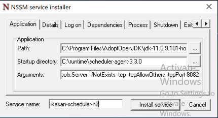

# Scheduler Agent

## Overview
Scheduler agents are standardised out of the box Integration Modules pre-built and shipped with Ikasan.

## Design
Each scheduled job managed within the Ikasan ESB employs a template flow. The consumer in the flow fires according to what ever [Quartz](http://www.quartz-scheduler.org/) cron expression is configured for the job. There is a router to determine if the job falls in a blackout window and a broker to execute the job along with endpoints to publish the execution status of the job. Scheduled jobs are configured and managed from within the [Ikasan Dashboard](../../../../visualisation/dashboard/scheduler.md). 
                                                                           


#### Components
|Route|Component|Description|
|----|---------|-----------|
|Main Route|Scheduled Consumer|consumer invoked from the Quartz scheduler callback|
|Main Route|JobExecution to Scheduled Status Event|converter from the Quartz scheduled context to the Ikasan Scheduled Execution Event|
|Main Route|Blackout Router|router to determine whether the scheduled callback has occurred within a black out window|
|Outside Blackout Period Route|Process Execution Broker|execute the scheduled targeted job|
|Outside Blackout Period Route|Scheduled Status Producer|publish the update Scheduled Execution Event|
|Default Route|Publish Scheduled Status|filter (true/false) as to whether to continue to publish the Scheduled Execution Event when in a blackout period. Default is true|
|Default Route|Blackout Scheduled Status Producer|publish the update Scheduled Execution Event|

All management and configuration of the Scheduler Agent is undertaken through the 
[Ikasan Dashboard Scheduler](../../../../visualisation/dashboard/scheduler.md) view.

## Deployment
All Ikasan binaries are available for download at [Maven Central](https://search.maven.org/search?q=org.ikasan)

1. In order to deploy a scheduler agent search for scheduler-agent-distribution and download the desired version which is bundled as a zip file. Unzip the file to the install location

The contents of the zip file is as follows.

| Filename | Description  |
| ---  | --- |
| simple-env.sh | Unix/Linux environment file in which environment variables required by the agent can be set. |
| simple-env.bat | Windows environment file in which environment variables required by the agent can be set. |
| config-service-env.bat | Windows environment file in which environment variables required by the agent can be set when running the agent in combination with [Spring Cloud Config](https://cloud.spring.io/spring-cloud-config/reference/html/). |
| config-service-env.sh | Unix/Linux environment file in which environment variables required by the agent can be set when running the agent in combination with [Spring Cloud Config](https://cloud.spring.io/spring-cloud-config/reference/html/). |
| ikasan-config-service.bat | Windows bat file that allows the agent to be started and stopped in a Windows environment when using [Spring Cloud Config](https://cloud.spring.io/spring-cloud-config/reference/html/). |
| ikasan-config-service.sh | Shell script that allows the agent to be started and stopped in a Unix/Linux environment when using [Spring Cloud Config](https://cloud.spring.io/spring-cloud-config/reference/html/). |
| ikasan-simple.bat  | Windows bat file that allows the agent to be started and stopped in a Windows environment. |
| ikasan-simple.sh  | Shell script that allows the agent to be started and stopped in a Unix/Linux environment |
| config/logback-spring.xml | Logging configuration file |
| config/application.properties | Scheduler agent properties file |
| lib/scheduler-agent-3.2.0.jar | Uber jar containing all libraries required by the scheduler agent | 
| lib/h2-1.4.200.jar | H2 database libraries used by the agent |
| lib/ikasan-shell-3.2.0.jar | The [Ikasan cli shell library](../../../../cli/shell/jar/Readme.md) |

2. Add the JAVA_HOME to the relevant environment file. Please note JDK11 is required.
```properties
#!/bin/bash

# Use this to set any environment properties for the ikasan-simple.sh shell
JAVA_HOME=/opt/platform/jdk-11.0.6+10
```
3. Update the `config/application.properties` to bind to desired host and ports. Provide the correct url for the Ikasan Dashboard and suitable credentials for an Ikasan admin account.
```properties
# Web Bindings
h2.db.port=8082
server.port=8080
server.address=localhost
.
.
.
# Dashboard data extraction settings
ikasan.dashboard.extract.enabled=false
ikasan.dashboard.extract.base.url=http://localhost:9080/ikasan-dashboard
ikasan.dashboard.extract.username=
ikasan.dashboard.extract.password=
```
4. Start the scheduler agent.
```bash
./ikasan-simple.sh start
```
5. Log into the Ikasan Dashboard to confirm that the agent has registered itself with the dashboard.


6. Once successfully registered it is possible to begin to create new [scheduled jobs](../../../../visualisation/dashboard/scheduler.md).

## Configuring as a Service
All Ikasan Modules, including Scheduler Agents, can be easily configured as a service to be managed within the standard Operating System service constructs for starting and stopping.

### Pre-Requisites
Ikasan Scheduler Agent is deployed via the .zip package and working, but does not automatically start on host boot, or cleanly stop on host shutdown.

Each Ikasan Scheduler requires two processes to run, one is the h2 process for persistence; and the other the Scheduler Agent itself. 
The Agent process has a dependency on the h2 persistence process, so when starting the h2 process must be started first, followed by the Scheduler Agent; and conversely when stopping the Scheduler Agent shuold be stopped followed by the h2 process.

There are two ways of starting and stopping these processes - one is via the Ikasan Shell the other by invoking the process commands directly. You would opt for one appraoch over the over depending on your use case.

#### Ikasan Shell Process Management
This is the simplest as you just need to configure the Ikasan Shell command to start and stop processes as follows,

To start h2 and the Scheduler Agent -> ```ikasan-simple.[sh|bat] start```

To stop the Scheduler Agent and h2  -> ```ikasan-simple.[sh|bat] stop```

However, as the shell spawns the Ikasan processes as independent processes this can be an issue on maintaining a reference to the processes to stop in Windows OS and Container platforms,
so the Direct Process management may be a better option. 

#### Direct Process Management
This does exactly the same as the Ikasan shell, but deals with the direct command for starting and stopping the processes, so a little more thought on configuration is required.

Firstly, you need to ascertain the commands to run to start the h2 and Scheduler Agent process.
The easiest way to do this is run the ```env``` command in the ikasan shell as follows,

```
ikasan-simple.[sh|bat]
```

```
 _____  __   __    ___      _____   ___    __    __
|_   _| | | / /   /   \    /  __/  /   \   | \  | |
  | |   | |/ /   / / \ \   \ \    / / \ \  |  \ | |
  | |   |   /   | |___| |   \ \  | |___| | |   \| |
 _| |_  | |\ \  |  ___  |  __\ \ |  ___  | | |\ ' |
|_____| |_| \_\ |_|   |_| /____/ |_|   |_| |_| \__|
===================================================
IkasanEIP  (v3.3.0)
Ikasan Shell:> env
```
This will provide all environment variables and settings for your Ikasan processes.

```
Environment Properties
        h2.xms [128m]
        h2.xmx [256m]
        h2.jar.name [h2-*.jar]
        module.xms [256m]
        module.xmx [256m]
        module.name [scheduler-agent]
        module.jar.name [scheduler-agent]
        h2.java.command [java -Xms128m -Xmx256m -Dmodule.name=scheduler-agent -classpath ./lib/h2-*.jar org.h2.tools.Server -ifNotExists -tcp -tcpAllowOthers -tcpPort 8082]
        module.java.command [java -server -Xms256m -Xmx256m -XX:MaxMetaspaceSize=128m -Dspring.jta.logDir=./persistence/scheduler-agent-ObjectStore -Dorg.apache.activemq.SERIALIZABLE_PACKAGES=* -Dmodule.name=scheduler-agent -jar ./lib/scheduler-agent-*.jar]

Processed Properties
        h2.java.command Command List [java -Xms128m -Xmx256m -Dmodule.name=scheduler-agent -classpath ./lib/h2-1.4.200.jar: org.h2.tools.Server -ifNotExists -tcp -tcpAllowOthers -tcpPort 8082]
        module.java.command Command List [java -server -Xms256m -Xmx256m -XX:MaxMetaspaceSize=128m -Dspring.jta.logDir=./persistence/scheduler-agent-ObjectStore -Dorg.apache.activemq.SERIALIZABLE_PACKAGES=* -Dmodule.name=scheduler-agent -jar ./lib/scheduler-agent-3.3.0.jar]
```

The two lines under Processed Properties show the full command for both the h2 process and the agent process.

These can be tested by running them directly on the command line to start h2 and the Scheduler Agent prior to configuring in any OS service configuration.

### Linux Service Configuration
Ikasan Scheduler Agents ship with a default Systemd .service file. This file can be found in the ```service``` directory.

Placeholders of {INSTRUCTION TEXT} are in the .service file and require replacing with your specific environment values.

```
[Unit]
   Description=Ikasan Scheduler Agent {INSTANCE NAME}
   
   [Service]
   Type=forking
   User={APPLICATION ADMIN USER}
   ExecStart={FULLY QUALIFIED PATH}/bin/ikasan-simple.sh start
   ExecStop={FULLY QUALIFIED PATH}/bin/ikasan-simple.sh stop
```
- INSTANCE NAME - helps identify this Ikasan Scheduler Agent when multiple agents exist on a host.  Recommended to be the Module Name.
- APPLICATION ADMIN USER - user that the Iksan Scheduler Agent will be run as
- FULLY QUALIFIED PATH - specific to your runtime environment and points to the location of the ikasan start and stop CLI scripts such as ikasan-simple.sh or ikasan-config-service.sh as required.

#### Installation Steps
1. Login to the host machine as root 
2. Copy the ```ikasan-scheduler-agent.service``` file to ```/lib/systemd/system```
3. Enable and test the service for start, status, and stop
```systemctl daemon-reload
   systemctl enable ikasan-scheduler-agent.service
   systemctl start ikasan-scheduler-agent.service
   systemctl status ikasan-scheduler-agent.service
   systemctl stop ikasan-scheduler-agent.service
```

### Windows Service Configuration
The nature of Windows services is such that the Ikasan Scheduler Agents are required to be installed 
and invoked as direct java process commands, rather than using the Ikasan shell (see Pre-Requisites above for how to source the direct commands).
Each process, the Scheduler Agent module and the Scheduler Agent H2 database, are installed as separate services, but with dependencies on each other.

#### Pre-Requisites
Windows services installed and managed through the native ```sc``` command can be a little sensitive to start-up times and other configuration required in the registry in order to get the services operating correctly. 
Given this we recommend using the NSSM windows executable for installing and managing the configuration of these processes as Windows services.
NSSM (the Non-Sucking Service Manager) can be downloaded from [NSSM download](https://nssm.cc/download). At the time of writing, nssm-2.24 was the latest version.

Download and unzip the binary to your local machine. 

*NOTE:  For convenience it is recommended to add ```nssm``` to the Windows ```PATH``` variable.
It is simply a utility for installing and managing the Windows Service and does not require any other processes to be run or create additional dependencies at runtime.*

Test the binary by opening a Windows command prompt.

Enter ```nssm```

You should see the following output, 

```NSSM: The non-sucking service manager
Version 2.24 64-bit, 2014-08-31
Usage: nssm <option> [<args> ...]

To show service installation GUI:

        nssm install [<servicename>]

To install a service without confirmation:

        nssm install <servicename> <app> [<args> ...]

To show service editing GUI:

        nssm edit <servicename>

To retrieve or edit service parameters directly:

        nssm get <servicename> <parameter> [<subparameter>]

        nssm set <servicename> <parameter> [<subparameter>] <value>

        nssm reset <servicename> <parameter> [<subparameter>]

To show service removal GUI:

        nssm remove [<servicename>]

To remove a service without confirmation:

        nssm remove <servicename> confirm

To manage a service:

        nssm start <servicename>

        nssm stop <servicename>

        nssm restart <servicename>

        nssm status <servicename>

        nssm rotate <servicename>
```

#### Installation Steps
1. Run a Windows command prompt as an administrator
2. For installation using the UI type ```nssm install``` - this will bring up the nssm installer window


For each process installed as a service we need to populate the Application tab with,
* Path - location of your java.exe
* Startup directory - location of the installed Ikasan Scheduler Agent
* Arguments - provides the arguments to pass to the java command on service start
* Service name - name associated with this installed service

The same can be undertaken directly on the command line - we recommend referring to the ```nssm``` documentation.

Firstly we will install the h2 database process by populating the Application tab for example,



* Path - ```%JAVA_HOME%\bin\java.exe```

* Startup - ```C:\runtime\scheduler-agent-3.3.0```

* Arguments - ```-Dmodule.name=scheduler-agent -classpath ./lib/h2-1.4.200.jar org.h2.tools.Server -ifNotExists -tcp -tcpAllowOthers -tcpPort 8082```

*NOTE: Arguments for the h2 process can be sourced via the Ikasan Shell ```env``` command as detailed above.*

Repeat the same steps to install the Ikasan Scheduler Agent.

1. Run a Windows command prompt as an administrator
2. For installation using the UI type ```nssm install``` - this will bring up the nssm installer window
  


Install the Ikasan Scheduler Agent database process by populating the Application tab for example,


* Path - ```%JAVA_HOME%\bin\java.exe```

* Startup - ```C:\runtime\scheduler-agent-3.3.0```

* Arguments - ```-server -Xms256m -Xmx256m -XX:MaxMetaspaceSize=128m -Dspring.jta.logDir=./persistence/scheduler-agent-ObjectStore -Dorg.apache.activemq.SERIALIZABLE_PACKAGES=* -Dmodule.name=scheduler-agent -jar ./lib/scheduler-agent-3.3.0.jar```

*NOTE: Arguments for the Scheduler Agent can be sourced via the Ikasan Shell ```env``` command as detailed above.*

One final step is to add a service dependency from the Ikasan Scheduler Agent to the H2 process.

```nssm set ikasan-scheduler-agent DependOnService ikasan-scheduler-h2```

You can now test your services by starting and stopping them through standard Windows services. 

Make sure you set them as Automatic and also with the desired user to run as when the service is started.
