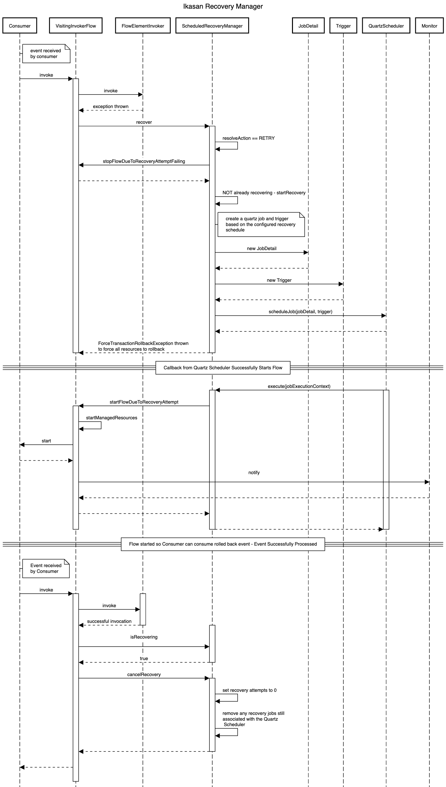
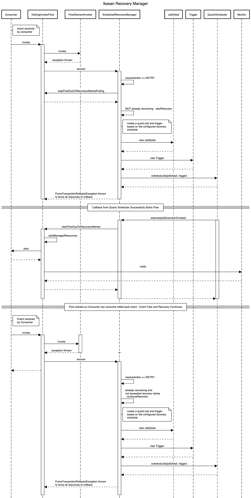
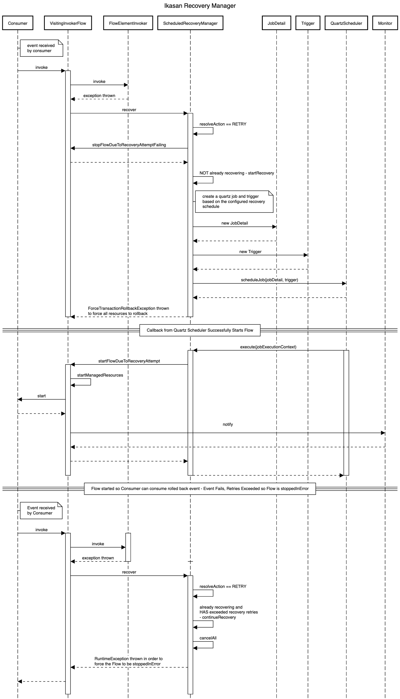
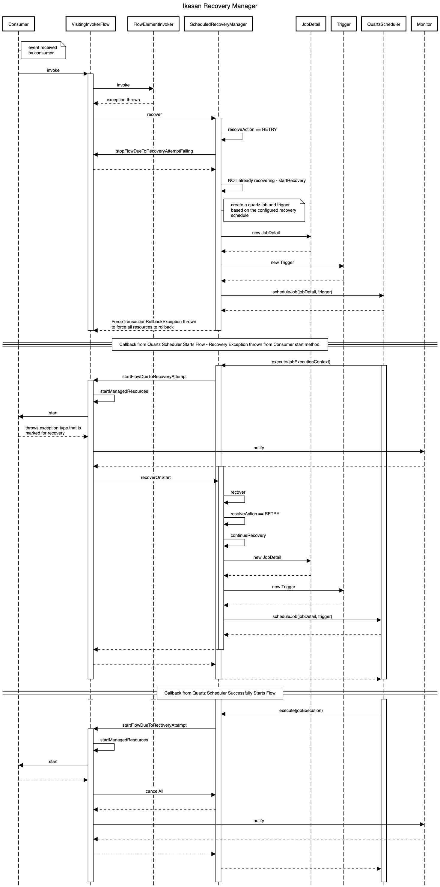
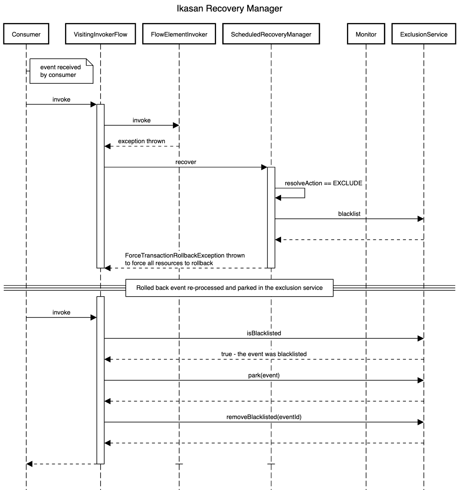
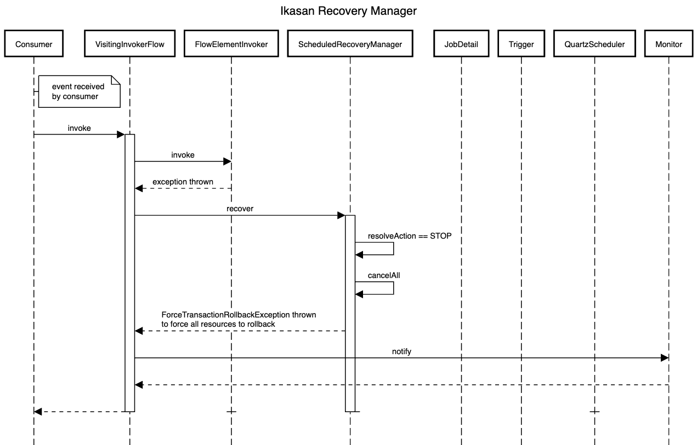

[../](../../Readme.md)

# Recovery Manager
The [Ikasan Scheduled Recovery Manager](./src/main/java/org/ikasan/recovery/ScheduledRecoveryManager.java) is an implementation of
[RecoveryManager](../spec/recoveryManager/src/main/java/org/ikasan/spec/recovery/RecoveryManager.java) and its role within Ikasan
is to manage and resolve exception scenarios that occur when a Flow is processing an event. Depending on how Ikasan is configured,
exceptions of can be configured to cause the recovery manager to behave in the desired manner. 

For example:

- When an `org.ikasan.spec.component.endpoint.EndpointException` is encountered retry every 5000 milliseconds for an indefinite number of retries.  
```properties
ikasan.exceptions.retry-configs.[0].className=org.ikasan.spec.component.endpoint.EndpointException
ikasan.exceptions.retry-configs.[0].delayInMillis=5000
ikasan.exceptions.retry-configs.[0].maxRetries=-1
```
- When an `org.ikasan.spec.component.endpoint.EndpointException` is encountered retry every 5000 milliseconds for 10 retries. If the 10 retries are exceeded stop the flow in error.
```properties
ikasan.exceptions.retry-configs.[0].className=org.ikasan.spec.component.endpoint.EndpointException
ikasan.exceptions.retry-configs.[0].delayInMillis=5000
ikasan.exceptions.retry-configs.[0].maxRetries=10
```
- When an `org.ikasan.spec.component.transformation.TransformationException` is encountered, exclude the event and park it in the hospital service.
```properties
ikasan.exceptions.excludedClasses[0]=org.ikasan.spec.component.transformation.TransformationException
```
When a `java.lang.RuntimeException`, stop the flow in an error state.
```properties
ikasan.exceptions.stopClasses[0]=java.lang.RuntimeException
```

## Ikasan Scheduled Recovery Manager Sequence Diagrams
The following section contains a number of sequence diagrams that out line the interactions that occur for a number of different use cases.

### Use Case 1. An exception is thrown that causes the recovery manager to retry. The flow successfully recovers on the first retry attempt. 


### Use Case 2. An exception is thrown that causes the recovery manager to retry. The flow does not recover and continues to retry.


### Use Case 3. An exception is thrown that causes the recovery manager to retry. The flow does not recover and continues to retry, however it has exceeded the retry limit and has stopped in error.


### Use Case 4. An exception is thrown that causes the recovery manager to retry. The recovery manager attempts to recover, however and exception is thrown in the start method of the consumer. The recovery continues and is successful on the next recovery attempt. 


### Use Case 5. An exception is thrown that causes the recovery manager to exclude an event.


### Use Case 6. An exception is thrown that causes the recovery manager to stop the flow in an error state.
