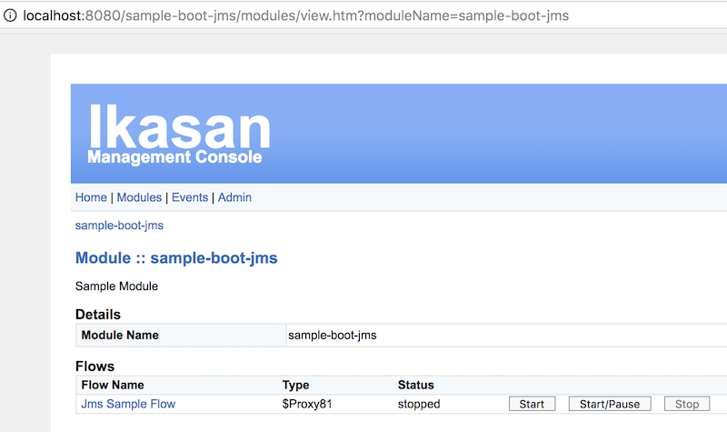
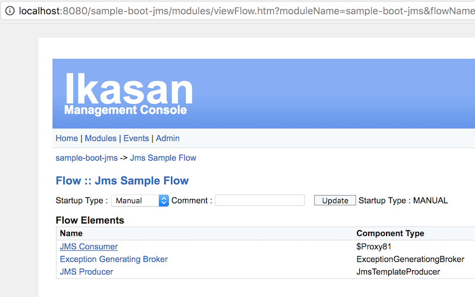
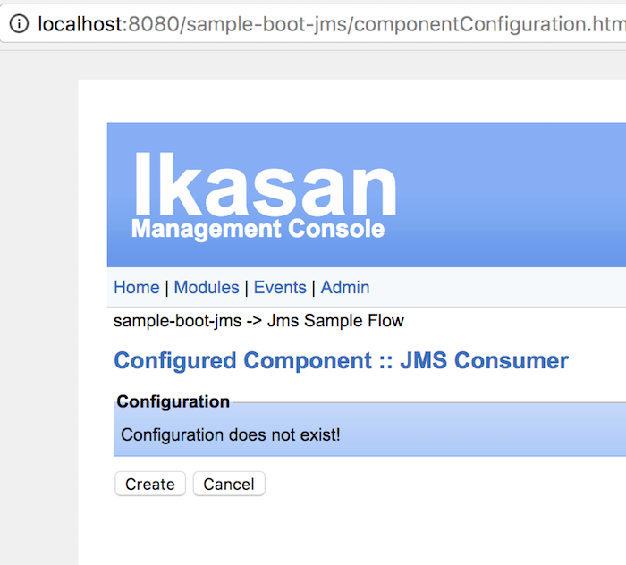

# sample-spring-boot-jms

Sample spring-boot-jms project provides self contained example of Ikasan integration module. 
The sample is build as fat-jar containing all dependencies and bootstraps as a spring-boot web application with embedded tomcat web-container. 
As majority of core ikasan services depend on persistent store this sample starts up with embedded in memory H2 database.

sample-spring-boot-jms provides example of integration module using JMS, in order to keep the sample self contained an embedded ActiveMQ broker is used. The module contains single flow with following components:
* JMS Consumer (subscribing to 'source' queue )
* Exception Generating Broker 
* JMS Producer (sends messages to 'target' queue)


## How to construct 'Jms Sample Flow' using builder pattern
Check out the source code at [Application](src/main/java/com/ikasan/sample/spring/boot/builderpattern/Application.java)
```java
public Module getModule(){

  ModuleBuilder mb = builderFactory.getModuleBuilder("sample-boot-jms");

  FlowBuilder fb = mb.getFlowBuilder("Jms Sample Flow");

  ConnectionFactory connectionFactory = new ActiveMQXAConnectionFactory(brokerUrl);
  Consumer jmsConsumer = builderFactory.getComponentBuilder().jmsConsumer()
          .setConnectionFactory(connectionFactory)
          .setDestinationJndiName("source")
          .setAutoContentConversion(true)
          .setConfiguredResourceId("jmsConsumer")
          .build();


  Producer jmsProducer = builderFactory.getComponentBuilder().jmsProducer()
          .setConnectionFactory(connectionFactory)
          .setDestinationJndiName("target")
          .setConfiguredResourceId("jmsProducer")
          .build();

  Flow flow = fb
          .withDescription("Flow demonstrates usage of JMS Concumer and JMS Producer")
          .withErrorReportingServiceFactory(errorReportingServiceFactory)
          .consumer("JMS Consumer", jmsConsumer)
          .broker( "Exception Generating Broker", new ExceptionGenerationgBroker())
          .producer("JMS Producer", jmsProducer)
          .build();

  Module module = mb.withDescription("Sample Module").addFlow(flow).build();
  return module;
}
```

## How to build from source

```
mvn clean install
```


## How to startup

If you managed to obtain the jar by building it or by downloading it from mvn repo:
* https://oss.sonatype.org/content/repositories/snapshots/org/ikasan/sample-spring-boot-jms/2.0.0-SNAPSHOT/ 

You can start up the sample 

```java -jar sample-spring-boot-jms-2.0.0-SNAPSHOT.jar```

If all went well you will see following 
```
2017-10-22 11:56:34.349  INFO 1407 - [main] o.i.m.s.ModuleInitialisationServiceImpl  : Module host [localhost:8080] running with PID [1407]
2017-10-22 11:56:34.361  INFO 1407 - [main] o.i.m.s.ModuleInitialisationServiceImpl  : Server instance  [Server [id=null, name=localhost, description=http://localhost:8080//sample-boot-jms, url=http://localhost, port=8080, createdDateTime=Sun Oct 22 11:56:34 BST 2017, updatedDateTime=Sun Oct 22 11:56:34 BST 2017]], creating...
2017-10-22 11:56:34.367  INFO 1407 - [main] o.i.m.s.ModuleInitialisationServiceImpl  : module does not exist [sample-module], creating...
2017-10-22 11:56:34.391  INFO 1407 - [main] o.i.m.s.ModuleActivatorDefaultImpl       : Module [sample-module] Flow [flowName] startup is set to [MANUAL]. Not automatically started!

(...)

2017-10-22 11:56:36.855  INFO 1407 - [main] o.s.j.e.a.AnnotationMBeanExporter        : Registering beans for JMX exposure on startup
2017-10-22 11:56:36.867  INFO 1407 - [main] o.s.c.support.DefaultLifecycleProcessor  : Starting beans in phase 0
2017-10-22 11:56:36.935  INFO 1407 - [main] o.s.c.support.DefaultLifecycleProcessor  : Starting beans in phase 2147483647
2017-10-22 11:56:37.017  INFO 1407 - [main] s.b.c.e.t.TomcatEmbeddedServletContainer : Tomcat started on port(s): 8080 (http)
2017-10-22 11:56:37.025  INFO 1407 - [main] o.i.s.s.boot.builderpattern.Application  : Started Application in 11.599 seconds (JVM running for 12.248)
Context ready
```

You can now access the basic web interface http://localhost:8080/sample-boot-jms/ 


## How to navigate the web console


* Open Login Page  

* Login using admin/admin as username and password  

* Click on Modules  

* Click on sample-module  

* Click on JMS Sample Flow  

* Click on JMS consumer  

* Click on JMS Configuration  

* Click Create
 
* The configuration screen allows you to chage the JMS consumer configuration, like:
** change jms destination name
** provide JNDI properties