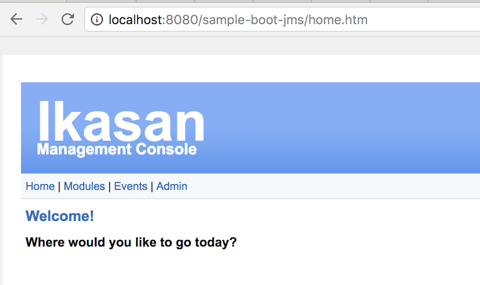

# sample-spring-boot-file

Sample spring-boot-file project provides self contained example of Ikasan integration module. 
The sample is build as fat-jar containing all dependencies and bootstraps as a spring-boot web application with embedded tomcat web-container. 
As majority of core ikasan services depend on persistent store this sample starts up with embedded in memory H2 database.

sample-spring-boot-file provides example of integration module using local file system. The module contains two flows:
* sourceFileFlow (This flow downloads file from local file system and delivers the sends it to jms queue)
  * File Consumer - downloads local file based on configuration provided
  * File Converter
  * JMS Producer - Sends file to ActiveMq topic 'jms.topic.test'
*  targetFileFlow (This consumes message representing a file and delivers file to local file system)
  * JMS Consumer - consumes message representing a file
  * File Producer - delivers file to local file system

## How to construct sourceFileFlow using builder pattern
Check out the source code at [Application](src/main/java/org/ikasan/sample/spring/boot/builderpattern/Application.java)
```java

Flow sourceFlow = moduleBuilder.getFlowBuilder("sourceFileFlow")
  .withDescription("Sample file to JMS flow")
  .withExceptionResolver( getSourceFlowExceptionResolver() )
  .consumer("File Consumer", getFileConsumer())
  .converter("File Converter", getSourceFileConverter())
  .producer("JMS Producer", getJmsProducer()).build();


Consumer getFileConsumer(){
  return builderFactory.getComponentBuilder().fileConsumer()
    .setCronExpression(cronExpression)
    .setScheduledJobGroupName(scheduledGroupName)
    .setScheduledJobName(scheduledName)
    .setFilenames(sourceFilenames)
    .setLogMatchedFilenames(true)
    .setConfiguredResourceId(fileConsumerConfiguredResourceId)
    .build();
}

Converter getSourceFileConverter(){
  return new SourceFileConverter();
}

Producer getJmsProducer(){
  ActiveMQXAConnectionFactory connectionFactory = new ActiveMQXAConnectionFactory(jmsProviderUrl);

  return builderFactory.getComponentBuilder().jmsProducer()
    .setConfiguredResourceId(jmsProducerConfiguredResourceId)
    .setDestinationJndiName("jms.topic.test")
    .setConnectionFactory(connectionFactory)
    .setSessionAcknowledgeMode(Session.SESSION_TRANSACTED)
    .setSessionTransacted(true)
    .setPubSubDomain(false)
    .setDeliveryPersistent(true)
    .setDeliveryMode(DeliveryMode.PERSISTENT)
    .setExplicitQosEnabled(true)
    .setMessageIdEnabled(true)
    .setMessageTimestampEnabled(true)
    .build();
}

```
## How to build from source

```
mvn clean install
```


## How to startup

If you managed to obtain the jar by building it or by downloading it from mvn repo:
* https://oss.sonatype.org/content/repositories/snapshots/org/ikasan/sample-spring-boot-file/2.0.0-SNAPSHOT/ 

You can start up the sample 

```java -jar sample-spring-boot-file-2.0.0-SNAPSHOT.jar```

If all went well you will see following 
```
2017-10-22 20:42:55.896  INFO 2837 --- [main] o.i.m.s.ModuleInitialisationServiceImpl  : Module host [localhost:8080] running with PID [2837]
2017-10-22 20:42:55.907  INFO 2837 --- [main] o.i.m.s.ModuleInitialisationServiceImpl  : Server instance  [Server [id=null, name=localhost, description=http://localhost:8080//sample-boot-file, url=http://localhost, port=8080, createdDateTime=Sun Oct 22 20:42:55 BST 2017, updatedDateTime=Sun Oct 22 20:42:55 BST 2017]], creating...
(...)

2017-10-22 20:11:10.628  INFO 2734 --- [main] o.s.j.e.a.AnnotationMBeanExporter        : Registering beans for JMX exposure on startup
2017-10-22 20:11:10.640  INFO 2734 --- [main] o.s.c.support.DefaultLifecycleProcessor  : Starting beans in phase 0
2017-10-22 20:11:10.788  INFO 2734 --- [main] s.b.c.e.t.TomcatEmbeddedServletContainer : Tomcat started on port(s): 8080 (http)
2017-10-22 20:11:10.798  INFO 2734 --- [main] o.i.s.s.boot.builderpattern.Application  : Started Application in 11.208 seconds (JVM running for 11.712)
Context ready
```

You can now access the basic web interface http://localhost:8080/sample-boot-file/ 


## How to navigate the web console


* Open Login Page  

* Login using admin/admin as username and password  
