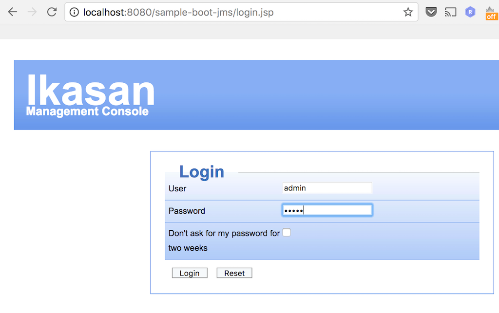
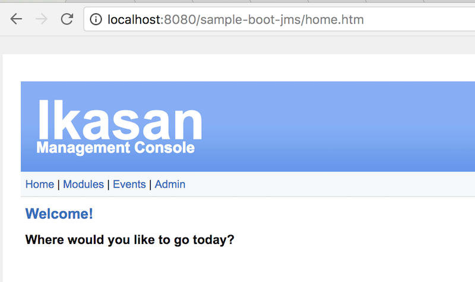

# sample-spring-boot-sftp-jms

Sample spring-boot-sftp-jms project provides self contained example of Ikasan integration module. 
The sample is build as fat-jar containing all dependencies and bootstraps as a spring-boot web application with embedded tomcat web-container. 
As majority of core ikasan services depend on persistent store this sample starts up with embedded in memory H2 database.

sample-spring-boot-sftp-jms provides example of integration module using SFTP and JMS which is standard EIP approach. The module contains two flow:
* Sftp To Jms Flow (This flow downloads file from SFTP server and converts it to Map Message and sends it to private JMS queue)
  * Sftp Consumer -  Connects to SFTP server to download file
  * Sftp Payload to Map Converter
  * Sftp Jms Producer - Standard JMS Producer
* Jms To Sftp Flow (This flow consumes JMS Map message from private queue converts it to Payload object and sends it of to SFTP server.)
  * Sftp Jms Consumer - Standard JMS Consumer
  * MapMessage to SFTP Payload Converter - Converts Map Message to Payload Object
  * Sftp Producer - Delivers the file to SFTP server

## How to build from source

```
mvn clean install
```


## How to startup

If you managed to obtain the jar by building it or by downloading it from mvn repo:
* https://oss.sonatype.org/content/repositories/snapshots/org/ikasan/sample-spring-boot-sftp-jms/2.0.0-SNAPSHOT/ 

You can start up the sample 

```java -jar sample-spring-boot-sftp-jms-2.0.0-SNAPSHOT.jar```

If all went well you will see following 
```
2017-10-22 20:42:55.896  INFO 2837 --- [           main] o.i.m.s.ModuleInitialisationServiceImpl  : Module host [localhost:8080] running with PID [2837]
2017-10-22 20:42:55.907  INFO 2837 --- [           main] o.i.m.s.ModuleInitialisationServiceImpl  : Server instance  [Server [id=null, name=localhost, description=http://localhost:8080//sample-boot-sftp, url=http://localhost, port=8080, createdDateTime=Sun Oct 22 20:42:55 BST 2017, updatedDateTime=Sun Oct 22 20:42:55 BST 2017]], creating...
(...)

2017-10-22 20:11:10.628  INFO 2734 --- [           main] o.s.j.e.a.AnnotationMBeanExporter        : Registering beans for JMX exposure on startup
2017-10-22 20:11:10.640  INFO 2734 --- [           main] o.s.c.support.DefaultLifecycleProcessor  : Starting beans in phase 0
2017-10-22 20:11:10.788  INFO 2734 --- [           main] s.b.c.e.t.TomcatEmbeddedServletContainer : Tomcat started on port(s): 8080 (http)
2017-10-22 20:11:10.798  INFO 2734 --- [           main] o.i.s.s.boot.builderpattern.Application  : Started Application in 11.208 seconds (JVM running for 11.712)
Context ready
```

You can now access the basic web interface http://localhost:8080/sample-boot-sftp-jms/ 


## How to navigate the web console


* Open Login Page  

* Login using admin/admin as username and password  
