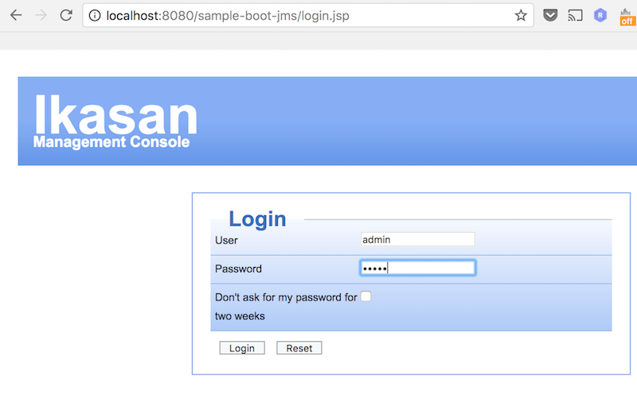
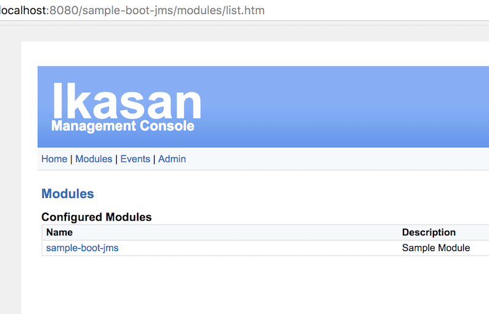
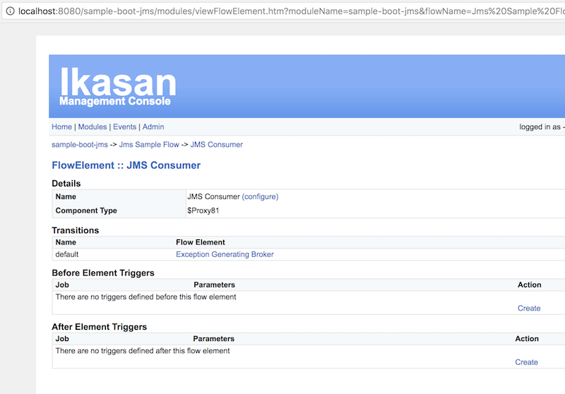

# sample-spring-boot-startup-processor

This project is similiar to the sample-spring-boot-jms project but shows how the startup processor can be used to set
startup types and wiretap triggers using the spring application.properties file. 

## How to Set StartupProcessor properties 
Specify the following in the modules application.properties 
```properties

#
# Any flow that has not had its startup type saved previously will have its startup type set to this. This
# will not overwrite any previously or manually saved startup type - unless deleteAllPreviouslySavedStartupTypes 
# is true
#
ikasan.startup.defaultFlowStartupType=AUTOMATIC

#
# Maps the flow name to its startup type - this will be used in preference to the defaultFlowStartupType
# if the flow has not had its startup type saved previously it will be set to this mapped value. This
# will not overwrite any previously or manually saved startup type - unless deleteAllPreviouslySavedStartupTypes
# is true
#
ikasan.startup.flowNameToStartupTypeMap[Flow\ One]=MANUAL

#
# Use with CAUTION will delete all saved startup types from the database. Useful if you want to guarentee the
# flows startup types are set as defined by the defaultFlowStartupType and flowNameToStartupType map above
# without any manually saved startup types interfering with this
#
ikasan.startup.deleteAllPreviouslySavedStartupTypes=true;
```

## How to build from source

```
mvn clean install
```


## How to startup

If you managed to obtain the jar by building it or by downloading it from mvn repo:
* https://oss.sonatype.org/content/repositories/snapshots/org/ikasan/sample-spring-boot-startup-processor/2.0.0-SNAPSHOT/ 

You can start up the sample 

```java -jar sample-spring-boot-jms-2.0.0-SNAPSHOT.jar```

If all went well you will see following 
```
2017-10-22 11:56:34.349  INFO 1407 - [main] o.i.m.s.ModuleInitialisationServiceImpl  : Module host [localhost:8080] running with PID [1407]
2017-10-22 11:56:34.361  INFO 1407 - [main] o.i.m.s.ModuleInitialisationServiceImpl  : Server instance  [Server [id=null, name=localhost, description=http://localhost:8080//sample-boot-jms, url=http://localhost, port=8080, createdDateTime=Sun Oct 22 11:56:34 BST 2017, updatedDateTime=Sun Oct 22 11:56:34 BST 2017]], creating...
2017-10-22 11:56:34.367  INFO 1407 - [main] o.i.m.s.ModuleInitialisationServiceImpl  : module does not exist [sample-module], creating...
2017-10-22 11:56:34.391  INFO 1407 - [main] o.i.m.s.ModuleActivatorDefaultImpl       : Module [sample-module] Flow [flowName] startup is set to [MANUAL]. Not automatically started!

(...)

2017-10-22 11:56:36.855  INFO 1407 - [main] o.s.j.e.a.AnnotationMBeanExporter        : Registering beans for JMX exposure on startup
2017-10-22 11:56:36.867  INFO 1407 - [main] o.s.c.support.DefaultLifecycleProcessor  : Starting beans in phase 0
2017-10-22 11:56:36.935  INFO 1407 - [main] o.s.c.support.DefaultLifecycleProcessor  : Starting beans in phase 2147483647
2017-10-22 11:56:37.017  INFO 1407 - [main] s.b.c.e.t.TomcatEmbeddedServletContainer : Tomcat started on port(s): 8080 (http)
2017-10-22 11:56:37.025  INFO 1407 - [main] o.i.s.s.boot.builderpattern.Application  : Started Application in 11.599 seconds (JVM running for 12.248)
Context ready
```

You can now access the basic web interface http://localhost:8080/sample-boot-startup-processor/ 


## How to navigate the web console


* Open Login Page  

* Login using admin/admin as username and password  

* Click on Modules  

* Click on sample-module  

* Click on JMS Sample Flow  

* Click on JMS consumer  

* Click on JMS Configuration  

* Click Create
 
* The configuration screen allows you to chage the JMS consumer configuration, like:
** change jms destination name
** provide JNDI properties