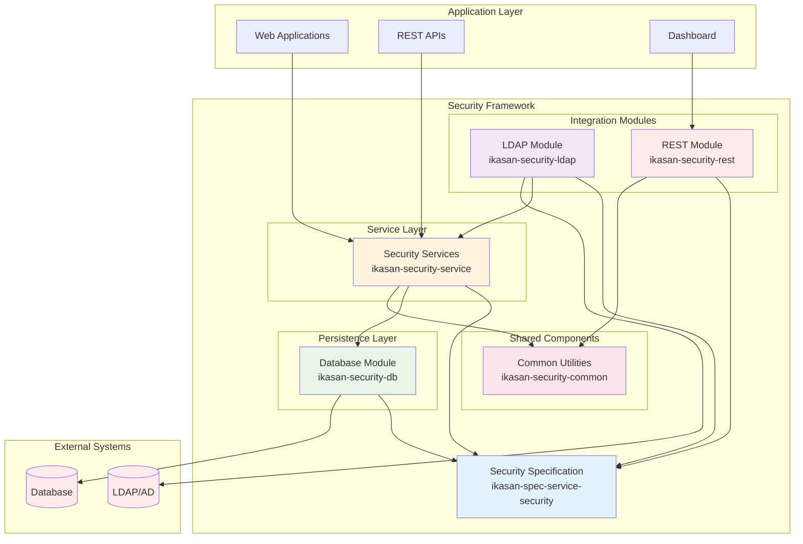
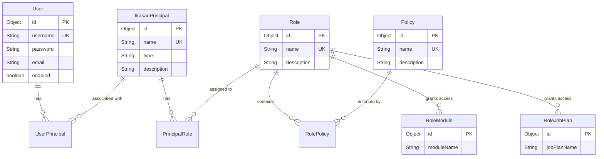
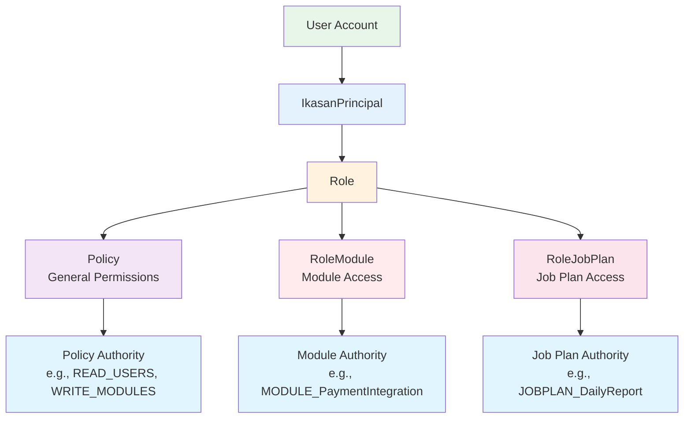
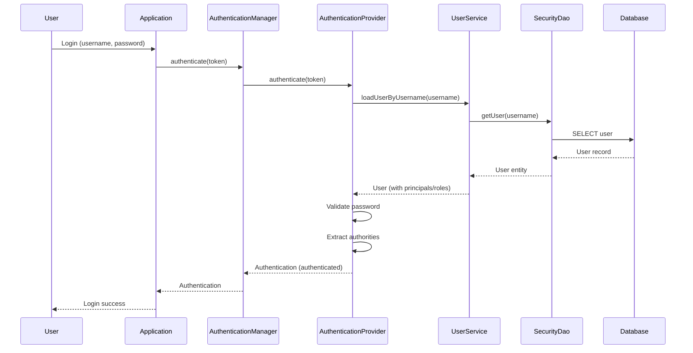
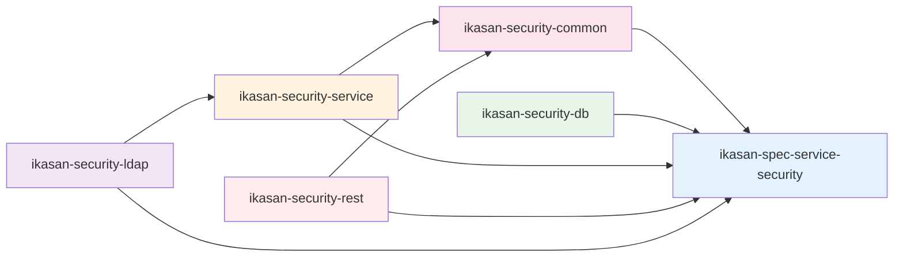

# Ikasan Security Framework

## Overview

The Ikasan Security Framework provides comprehensive authentication, authorization, and user management capabilities for the Ikasan Enterprise Integration Platform. Built on Spring Security, it offers a modular, extensible security architecture supporting multiple authentication mechanisms, fine-grained access control, and enterprise directory integration.

## Purpose

The security framework serves as:
- **Authentication System**: Multi-provider authentication (local database, LDAP/Active Directory, custom)
- **Authorization Framework**: Role-based access control (RBAC) with policy-based permissions
- **User Management**: Complete user lifecycle management with credential handling
- **Directory Integration**: LDAP/Active Directory synchronization and authentication
- **API Security**: REST API security with JWT token support
- **Module Security**: Fine-grained access control for integration modules and job plans

## Architecture Overview



## Module Structure

The security framework is organized into six modules, each with specific responsibilities:

```
ikasaneip/security/
├── ../spec/service/security/          # Security specification (interfaces)
├── common/                            # Shared utilities
├── db/                                # Database persistence
├── service/                           # Service implementations
├── rest/                              # REST API models
├── ldap/                              # LDAP integration
└── pom.xml                           # Parent POM
```

## Modules

### 1. Security Specification (ikasan-spec-service-security)

**Location**: `ikasaneip/spec/service/security/`
**Artifact**: `org.ikasan:ikasan-spec-service-security`

The foundation module defining all security contracts and interfaces.

**Key Components:**
- **Model Interfaces**: User, IkasanPrincipal, Role, Policy, AuthenticationMethod
- **Service Interfaces**: UserService, SecurityService, AuthenticationService
- **DAO Interfaces**: UserDao, SecurityDao, AuthorityDao
- **Filter Interfaces**: UserFilter, IkasanPrincipalFilter

**Purpose:**
- Defines the contract layer for all security implementations
- Enables multiple implementations without coupling
- Provides type definitions for security entities
- Integrates with Spring Security interfaces

**[View Full Documentation →](../spec/service/security/README.md)**

---

### 2. Security Database (ikasan-security-db)

**Location**: `ikasaneip/security/db/`
**Artifact**: `org.ikasan:ikasan-security-db`

Hibernate/JPA persistence implementation with complete database schema.

**Key Components:**
- **DAO Implementations**: HibernateSecurityDaoImpl, HibernateUserDaoImpl
- **Entity Models**: Hibernate entity classes for all security objects
- **Database Schema**: JPA annotations defining security tables
- **Auto-Configuration**: Spring Boot auto-configuration support
- **Named Queries**: Optimized HQL queries for common operations

**Database Schema:**
- Users, IkasanPrincipals, Roles, Policies
- UserPrincipal, PrincipalRole, RolePolicy (join tables)
- RoleModule, RoleJobPlan (resource access)
- AuthenticationMethod (authentication configuration)

**Purpose:**
- Provides database-backed persistence for all security entities
- Manages complex relationships between users, principals, roles, and policies
- Supports filtering and pagination for large datasets
- Enables transactional security operations

**[View Full Documentation →](db/README.md)**

---

### 3. Security Service (ikasan-security-service)

**Location**: `ikasaneip/security/service/`
**Artifact**: `org.ikasan:ikasan-security-service`

Service layer implementations providing business logic and authentication.

**Key Components:**
- **SecurityServiceImpl**: Security entity management (principals, roles, policies)
- **UserServiceImpl**: User lifecycle and credential management
- **AuthenticationServiceImpl**: Authentication coordination
- **LocalAuthenticationProvider**: Database authentication
- **AuthenticationProviderFactory**: Multi-provider authentication support
- **IkasanAuthentication**: Custom authentication token

**Business Logic:**
- User creation, updates, and deletion
- Password management and encoding
- Role and policy assignment
- Authentication method configuration
- Authority extraction and management

**Purpose:**
- Implements business rules for security operations
- Coordinates DAO operations with transactions
- Provides authentication mechanisms
- Bridges specification interfaces with concrete implementations

**[View Full Documentation →](service/README.md)**

---

### 4. Security REST (ikasan-security-rest)

**Location**: `ikasaneip/security/rest/`
**Artifact**: `org.ikasan:ikasan-security-rest`

REST API models and dashboard-specific security services.

**Key Components:**
- **POJO Models**: JSON-serializable implementations (UserImpl, RoleImpl, PolicyImpl)
- **JWT DTOs**: JwtRequest, JwtResponse for token authentication
- **DashboardUserServiceImpl**: Remote security service client
- **DashboardAuthenticationProvider**: Dashboard authentication
- **ModuleAuthenticationProviderFactoryImpl**: Module-level auth factory

**REST Models:**
- Lightweight POJOs without JPA dependencies
- JSON serialization/deserialization support
- Compatible with REST APIs and microservices

**Purpose:**
- Enables distributed security architecture
- Supports dashboard applications with remote security services
- Provides JWT-based authentication
- Facilitates REST API security integration

**[View Full Documentation →](rest/README.md)**

---

### 5. Security LDAP (ikasan-security-ldap)

**Location**: `ikasaneip/security/ldap/`
**Artifact**: `org.ikasan:ikasan-security-ldap`

LDAP/Active Directory integration for enterprise authentication.

**Key Components:**
- **LdapServiceImpl**: LDAP synchronization service
- **LdapAuthenticationProvider**: Pure LDAP authentication
- **LdapLocalAuthenticationProvider**: Hybrid LDAP/local authentication
- **AuthenticationProviderFactoryImpl**: LDAP provider factory

**LDAP Features:**
- User synchronization from LDAP to local database
- Group synchronization mapped to roles
- Pure LDAP authentication (no local database)
- Hybrid authentication (LDAP credentials, local authorization)
- Active Directory support
- Scheduled synchronization

**Purpose:**
- Integrates with enterprise directory services
- Eliminates duplicate user management
- Supports centralized authentication
- Enables hybrid authentication strategies

**[View Full Documentation →](ldap/README.md)**

---

### 6. Security Common (ikasan-security-common)

**Location**: `ikasaneip/security/common/`
**Artifact**: `org.ikasan:ikasan-security-common`

Shared utilities and specialized authority implementations.

**Key Components:**
- **AuthoritiesHelper**: Authority extraction utility
- **ModuleGrantedAuthorityImpl**: Module-level access authority
- **JobPlanGrantedAuthorityImpl**: Job plan access authority

**Utilities:**
- Extract Spring Security authorities from Ikasan security model
- Convert principals → roles → policies/modules/jobplans to GrantedAuthority
- Specialized authority types for fine-grained access control

**Purpose:**
- Provides shared code to avoid duplication
- Bridges Ikasan security model with Spring Security
- Enables module-level and job-plan-level authorization
- Supports programmatic access control

**[View Full Documentation →](common/README.md)**

---

## Security Model

### Entity Relationships



### Authority Hierarchy



## Authentication Flow



## Key Features

### 🔐 Multi-Provider Authentication
- **Local Database**: BCrypt-encrypted credentials in database
- **LDAP/Active Directory**: Enterprise directory integration
- **Custom Providers**: Extensible authentication provider framework
- **JWT Tokens**: Token-based authentication for REST APIs

### 👥 User Management
- Complete user lifecycle (create, read, update, delete)
- Enable/disable user accounts
- Password management with secure encoding
- User search and filtering
- Pagination support for large user bases

### 🛡️ Role-Based Access Control
- Flexible role hierarchy
- Policy-based permissions
- Module-level access control
- Job plan access control
- Dynamic role assignment

### 🔄 LDAP Synchronization
- Automated user/group synchronization
- Scheduled background sync
- Incremental updates
- Group-to-role mapping
- Hybrid authentication support

### 🌐 Distributed Security
- Remote security service support
- REST API security models
- JWT authentication
- Dashboard integration
- Microservices-ready architecture

### 📊 Fine-Grained Authorization
- Method-level security with `@PreAuthorize`
- Programmatic access control
- Module-specific authorities
- Job plan-specific authorities
- Custom authority types

## Getting Started

### Maven Dependencies

**For service implementations (most common):**
```xml
<dependency>
    <groupId>org.ikasan</groupId>
    <artifactId>ikasan-security-service</artifactId>
    <version>${ikasan.version}</version>
</dependency>

<dependency>
    <groupId>org.ikasan</groupId>
    <artifactId>ikasan-security-db</artifactId>
    <version>${ikasan.version}</version>
</dependency>

<dependency>
    <groupId>org.ikasan</groupId>
    <artifactId>ikasan-security-common</artifactId>
    <version>${ikasan.version}</version>
</dependency>
```

**For LDAP integration:**
```xml
<dependency>
    <groupId>org.ikasan</groupId>
    <artifactId>ikasan-security-ldap</artifactId>
    <version>${ikasan.version}</version>
</dependency>
```

**For REST/Dashboard applications:**
```xml
<dependency>
    <groupId>org.ikasan</groupId>
    <artifactId>ikasan-security-rest</artifactId>
    <version>${ikasan.version}</version>
</dependency>
```

### Basic Configuration

```java
@Configuration
@EnableWebSecurity
public class SecurityConfig extends WebSecurityConfigurerAdapter {

    @Autowired
    private UserService userService;

    @Autowired
    private SecurityService securityService;

    @Bean
    public PasswordEncoder passwordEncoder() {
        return new BCryptPasswordEncoder();
    }

    @Override
    protected void configure(AuthenticationManagerBuilder auth) throws Exception {
        auth.userDetailsService(userService)
            .passwordEncoder(passwordEncoder());
    }

    @Override
    protected void configure(HttpSecurity http) throws Exception {
        http
            .authorizeRequests()
                .antMatchers("/api/public/**").permitAll()
                .antMatchers("/api/admin/**").hasAuthority("ADMIN")
                .anyRequest().authenticated()
            .and()
            .formLogin()
                .loginPage("/login")
                .permitAll()
            .and()
            .logout()
                .permitAll();
    }
}
```

### Application Properties

```properties
# Database Configuration
spring.datasource.url=jdbc:h2:mem:securitydb
spring.datasource.driver-class-name=org.h2.Driver
spring.jpa.hibernate.ddl-auto=update

# Security Configuration
ikasan.security.local-auth.enabled=true
ikasan.security.password-encoder=bcrypt

# LDAP Configuration (optional)
ikasan.security.ldap.enabled=false
ikasan.security.ldap.server-url=ldap://ldap.example.com:389
ikasan.security.ldap.sync.cron=0 0 2 * * ?
```

## Usage Examples

### Creating a User with Roles

```java
@Service
@Transactional
public class UserBootstrap {

    private final UserService userService;
    private final SecurityService securityService;

    public void createAdminUser() {
        // Create user
        User user = userService.createUser(
            "admin",
            "password123",
            "admin@example.com",
            true
        );
        user.setFirstName("Admin");
        user.setSurname("User");

        // Create principal
        IkasanPrincipal principal = securityService.createPrincipal();
        principal.setName("admin");
        principal.setType("user");
        securityService.savePrincipal(principal);

        // Assign admin role
        Role adminRole = securityService.findRoleByName("ADMIN");
        if (adminRole == null) {
            adminRole = securityService.createNewRole("ADMIN", "Administrator role");

            // Add policies
            Policy readPolicy = securityService.createNewPolicy("READ_ALL", "Read all resources");
            Policy writePolicy = securityService.createNewPolicy("WRITE_ALL", "Write all resources");
            adminRole.addPolicy(readPolicy);
            adminRole.addPolicy(writePolicy);

            securityService.saveRole(adminRole);
        }

        principal.addRole(adminRole);
        user.addPrincipal(principal);
        userService.updateUser(user);
    }
}
```

### Method-Level Security

```java
@RestController
@RequestMapping("/api/modules")
public class ModuleController {

    @GetMapping("/{moduleName}")
    @PreAuthorize("hasAuthority('MODULE_' + #moduleName) or hasAuthority('ADMIN')")
    public ResponseEntity<Module> getModule(@PathVariable String moduleName) {
        // Return module details
    }

    @PostMapping("/{moduleName}/start")
    @PreAuthorize("hasAuthority('MODULE_' + #moduleName) and hasAuthority('START_MODULE')")
    public ResponseEntity<Void> startModule(@PathVariable String moduleName) {
        // Start module
    }
}
```

### Programmatic Authorization

```java
@Service
public class ModuleAccessService {

    public List<String> getUserAccessibleModules(User user) {
        List<GrantedAuthority> authorities =
            AuthoritiesHelper.getGrantedAuthorities(user.getPrincipals());

        return authorities.stream()
            .filter(auth -> auth instanceof ModuleGrantedAuthorityImpl)
            .map(auth -> ((ModuleGrantedAuthorityImpl) auth).getModuleName())
            .collect(Collectors.toList());
    }

    public boolean canAccessModule(User user, String moduleName) {
        List<GrantedAuthority> authorities =
            AuthoritiesHelper.getGrantedAuthorities(user.getPrincipals());

        return authorities.stream()
            .anyMatch(auth ->
                auth instanceof ModuleGrantedAuthorityImpl &&
                ((ModuleGrantedAuthorityImpl) auth).getModuleName().equals(moduleName)
            );
    }
}
```

## Module Dependencies



## Testing

Each module includes comprehensive unit tests:

- **security-db**: DAO and entity persistence tests
- **security-service**: Service layer business logic tests (116 test methods)
- **security-ldap**: LDAP connection and synchronization tests
- **security-rest**: REST model serialization tests
- **security-common**: Authority extraction utility tests

Run tests:
```bash
cd ikasaneip/security
mvn clean test
```

## Best Practices

1. **Always use transactions**: Wrap security operations in `@Transactional` methods
2. **Encode passwords**: Always use `PasswordEncoder` for password storage
3. **Use AuthoritiesHelper**: Leverage `AuthoritiesHelper` for consistent authority extraction
4. **Method security**: Prefer declarative security with `@PreAuthorize` annotations
5. **HTTPS only**: Always use HTTPS for authentication in production
6. **Secure credentials**: Store sensitive credentials (LDAP bind passwords, JWT secrets) in secure vaults
7. **Audit logging**: Log security-sensitive operations for compliance
8. **Regular sync**: Schedule LDAP synchronization during low-usage periods
9. **Password policies**: Enforce strong password requirements
10. **Session management**: Configure appropriate session timeout values

## Migration Guide

### From Local to LDAP Authentication

1. Enable LDAP module dependency
2. Configure LDAP properties
3. Run initial synchronization
4. Test hybrid authentication
5. Gradually migrate users
6. Switch to pure LDAP authentication

### From Monolith to Distributed

1. Add security-rest module
2. Configure REST client URLs
3. Deploy security service separately
4. Update dashboard to use DashboardUserServiceImpl
5. Enable JWT authentication
6. Test distributed security

## Troubleshooting

### Common Issues

**Issue**: User authentication fails
**Solution**: Check password encoding, verify user is enabled, check authorities

**Issue**: LDAP sync fails
**Solution**: Verify LDAP connection, check bind credentials, validate base DN and filters

**Issue**: Module access denied
**Solution**: Verify RoleModule associations, check authority extraction

**Issue**: Database constraint violations
**Solution**: Ensure proper cascading configuration, check for duplicate entries

## Version Information

- **Parent**: ikasan-build
- **Group ID**: org.ikasan
- **Artifact ID**: ikasan-security-parent
- **Version**: 5.0.0-SNAPSHOT

## Contributing

When contributing to the security framework:
- Follow existing code patterns
- Add comprehensive unit tests
- Update relevant documentation
- Consider backward compatibility
- Review security implications

## License

Distributed under the Modified BSD License.
Copyright notice: The copyright for this software and a full listing of individual contributors are as shown in the packaged copyright.txt file.

---

For detailed information about each module, please refer to the individual module README files linked above.
