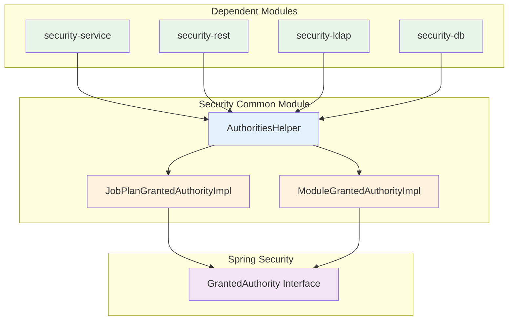
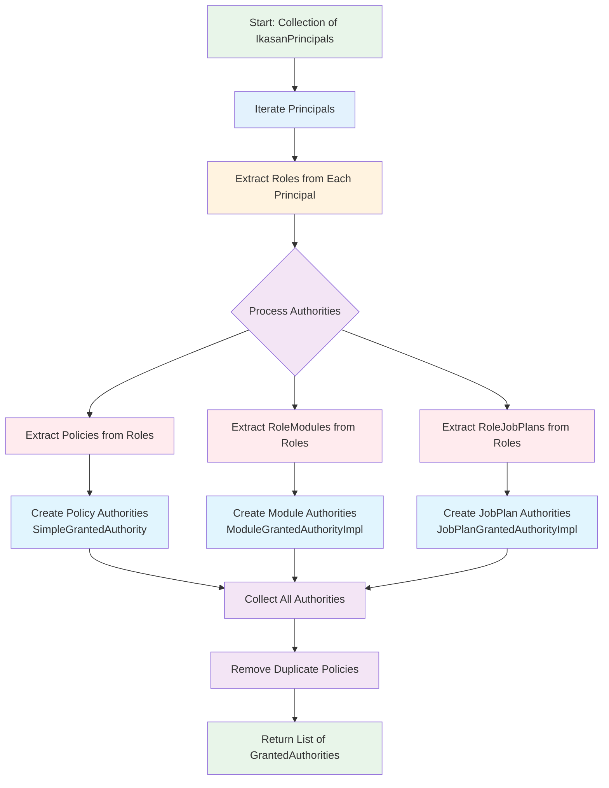
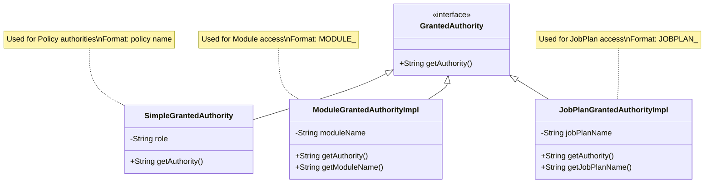

# Ikasan Security Common Module

## Overview

The security-common module provides shared utilities and model classes used across all Ikasan security modules. It contains common authority implementations and helper utilities for extracting and managing Spring Security granted authorities from Ikasan's security model.

## Purpose

This module serves as:
- **Shared Utilities**: Common helper classes used by multiple security modules
- **Authority Models**: Specialized GrantedAuthority implementations for module and job plan access
- **Cross-Module Dependencies**: Provides shared code to avoid duplication across security modules
- **Authority Extraction**: Utilities for converting Ikasan security model to Spring Security authorities

## Module Structure

```
ikasaneip/security/common/
├── src/main/java/org/ikasan/security/
│   ├── model/
│   │   ├── JobPlanGrantedAuthorityImpl.java   # Job plan authority
│   │   └── ModuleGrantedAuthorityImpl.java    # Module authority
│   └── util/
│       └── AuthoritiesHelper.java             # Authority extraction utility
└── pom.xml
```

## Architecture

### Component Relationships



### Authority Extraction Flow



## Key Components

### Utility Classes

#### AuthoritiesHelper

Static utility class for extracting Spring Security `GrantedAuthority` objects from Ikasan security principals.

**Purpose:**
- Convert Ikasan security model to Spring Security authorities
- Extract policies, module authorities, and job plan authorities
- Provide consistent authority extraction across all modules
- Support Spring Security access control decisions

**Key Method:**

```java
public static List<GrantedAuthority> getGrantedAuthorities(
        Collection<IkasanPrincipal> ikasanPrincipals) {

    // Extract policy authorities (distinct)
    List<GrantedAuthority> authorities = ikasanPrincipals.stream()
        .flatMap(principal -> principal.getRoles().stream())
        .flatMap(role -> role.getPolicies().stream())
        .distinct()
        .collect(Collectors.toList());

    // Extract module authorities
    authorities.addAll(ikasanPrincipals.stream()
        .flatMap(principal -> principal.getRoles().stream())
        .flatMap(role -> role.getRoleModules().stream())
        .map(roleModule -> new ModuleGrantedAuthorityImpl(
            roleModule.getModuleName()
        ))
        .toList());

    // Extract job plan authorities
    authorities.addAll(ikasanPrincipals.stream()
        .flatMap(principal -> principal.getRoles().stream())
        .flatMap(role -> role.getRoleJobPlans().stream())
        .map(roleJobPlan -> new JobPlanGrantedAuthorityImpl(
            roleJobPlan.getJobPlanName()
        ))
        .toList());

    return authorities;
}
```

**Processing Logic:**

1. **Policy Authorities**: Extract all policies from all roles across all principals, removing duplicates
2. **Module Authorities**: Extract all role-module associations and create module authorities
3. **Job Plan Authorities**: Extract all role-job-plan associations and create job plan authorities
4. **Return**: Combined list of all authorities for Spring Security

**Example Usage:**

```java
// In authentication provider
User user = userService.loadUserByUsername(username);
List<GrantedAuthority> authorities =
    AuthoritiesHelper.getGrantedAuthorities(user.getPrincipals());

// Create authenticated token with authorities
return new UsernamePasswordAuthenticationToken(
    username,
    password,
    authorities
);
```

```java
// In service layer
@Service
public class UserAuthorizationService {

    public boolean hasAccessToModule(User user, String moduleName) {
        List<GrantedAuthority> authorities =
            AuthoritiesHelper.getGrantedAuthorities(user.getPrincipals());

        return authorities.stream()
            .anyMatch(auth ->
                auth instanceof ModuleGrantedAuthorityImpl &&
                ((ModuleGrantedAuthorityImpl) auth).getModuleName()
                    .equals(moduleName)
            );
    }

    public boolean hasAccessToJobPlan(User user, String jobPlanName) {
        List<GrantedAuthority> authorities =
            AuthoritiesHelper.getGrantedAuthorities(user.getPrincipals());

        return authorities.stream()
            .anyMatch(auth ->
                auth instanceof JobPlanGrantedAuthorityImpl &&
                ((JobPlanGrantedAuthorityImpl) auth).getJobPlanName()
                    .equals(jobPlanName)
            );
    }
}
```

### Model Classes

#### ModuleGrantedAuthorityImpl

Specialized `GrantedAuthority` implementation representing access rights to a specific module.

**Purpose:**
- Grant access to integration modules
- Enable module-level authorization
- Support fine-grained access control for modules

**Structure:**

```java
public class ModuleGrantedAuthorityImpl implements GrantedAuthority, Serializable {

    private static final long serialVersionUID = 1L;

    private String moduleName;

    public ModuleGrantedAuthorityImpl(String moduleName) {
        if (moduleName == null || moduleName.isEmpty()) {
            throw new IllegalArgumentException("moduleName cannot be null or empty");
        }
        this.moduleName = moduleName;
    }

    @Override
    public String getAuthority() {
        return "MODULE_" + moduleName;
    }

    public String getModuleName() {
        return moduleName;
    }

    @Override
    public boolean equals(Object obj) {
        if (this == obj) return true;
        if (obj == null || getClass() != obj.getClass()) return false;
        ModuleGrantedAuthorityImpl that = (ModuleGrantedAuthorityImpl) obj;
        return moduleName.equals(that.moduleName);
    }

    @Override
    public int hashCode() {
        return moduleName.hashCode();
    }

    @Override
    public String toString() {
        return "ModuleGrantedAuthorityImpl{moduleName='" + moduleName + "'}";
    }
}
```

**Key Features:**
- Implements `GrantedAuthority` for Spring Security integration
- Implements `Serializable` for session storage
- Authority string format: `MODULE_<moduleName>`
- Proper equals/hashCode for collection operations

**Usage Examples:**

```java
// Create module authority
ModuleGrantedAuthorityImpl moduleAuth =
    new ModuleGrantedAuthorityImpl("PaymentIntegration");

// Get authority string
String authority = moduleAuth.getAuthority();  // "MODULE_PaymentIntegration"

// Check in Spring Security
@PreAuthorize("hasAuthority('MODULE_PaymentIntegration')")
public void processPayment(PaymentRequest request) {
    // Process payment
}

// Check programmatically
boolean hasAccess = SecurityContextHolder.getContext()
    .getAuthentication()
    .getAuthorities()
    .stream()
    .anyMatch(auth -> auth.getAuthority().equals("MODULE_PaymentIntegration"));
```

#### JobPlanGrantedAuthorityImpl

Specialized `GrantedAuthority` implementation representing access rights to a specific job plan.

**Purpose:**
- Grant access to scheduled job plans
- Enable job-plan-level authorization
- Support fine-grained access control for scheduled jobs

**Structure:**

```java
public class JobPlanGrantedAuthorityImpl implements GrantedAuthority, Serializable {

    private static final long serialVersionUID = 1L;

    private String jobPlanName;

    public JobPlanGrantedAuthorityImpl(String jobPlanName) {
        if (jobPlanName == null || jobPlanName.isEmpty()) {
            throw new IllegalArgumentException("jobPlanName cannot be null or empty");
        }
        this.jobPlanName = jobPlanName;
    }

    @Override
    public String getAuthority() {
        return "JOBPLAN_" + jobPlanName;
    }

    public String getJobPlanName() {
        return jobPlanName;
    }

    @Override
    public boolean equals(Object obj) {
        if (this == obj) return true;
        if (obj == null || getClass() != obj.getClass()) return false;
        JobPlanGrantedAuthorityImpl that = (JobPlanGrantedAuthorityImpl) obj;
        return jobPlanName.equals(that.jobPlanName);
    }

    @Override
    public int hashCode() {
        return jobPlanName.hashCode();
    }

    @Override
    public String toString() {
        return "JobPlanGrantedAuthorityImpl{jobPlanName='" + jobPlanName + "'}";
    }
}
```

**Key Features:**
- Implements `GrantedAuthority` for Spring Security integration
- Implements `Serializable` for session storage
- Authority string format: `JOBPLAN_<jobPlanName>`
- Proper equals/hashCode for collection operations

**Usage Examples:**

```java
// Create job plan authority
JobPlanGrantedAuthorityImpl jobPlanAuth =
    new JobPlanGrantedAuthorityImpl("DailyReportGeneration");

// Get authority string
String authority = jobPlanAuth.getAuthority();  // "JOBPLAN_DailyReportGeneration"

// Check in Spring Security
@PreAuthorize("hasAuthority('JOBPLAN_DailyReportGeneration')")
public void executeJobPlan(String jobPlanName) {
    // Execute job plan
}

// Check programmatically
boolean hasAccess = SecurityContextHolder.getContext()
    .getAuthentication()
    .getAuthorities()
    .stream()
    .anyMatch(auth ->
        auth.getAuthority().equals("JOBPLAN_DailyReportGeneration")
    );
```

## Authority Hierarchy



## Integration with Spring Security

### Access Control Expressions

```java
@RestController
@RequestMapping("/api/modules")
public class ModuleController {

    // Method-level security with module authority
    @GetMapping("/{moduleName}")
    @PreAuthorize("hasAuthority('MODULE_' + #moduleName)")
    public ResponseEntity<Module> getModule(@PathVariable String moduleName) {
        // Get module details
    }

    // Method-level security with job plan authority
    @PostMapping("/jobplans/{jobPlanName}/execute")
    @PreAuthorize("hasAuthority('JOBPLAN_' + #jobPlanName)")
    public ResponseEntity<Void> executeJobPlan(@PathVariable String jobPlanName) {
        // Execute job plan
    }

    // Method-level security with policy authority
    @DeleteMapping("/{moduleName}")
    @PreAuthorize("hasAuthority('DELETE_MODULE')")
    public ResponseEntity<Void> deleteModule(@PathVariable String moduleName) {
        // Delete module
    }

    // Combined authorities
    @PostMapping("/{moduleName}/restart")
    @PreAuthorize("hasAuthority('MODULE_' + #moduleName) and hasAuthority('RESTART_MODULE')")
    public ResponseEntity<Void> restartModule(@PathVariable String moduleName) {
        // Restart module
    }
}
```

### Programmatic Access Control

```java
@Service
public class ModuleAuthorizationService {

    public boolean canAccessModule(Authentication authentication, String moduleName) {
        return authentication.getAuthorities()
            .stream()
            .anyMatch(auth -> {
                if (auth instanceof ModuleGrantedAuthorityImpl) {
                    return ((ModuleGrantedAuthorityImpl) auth)
                        .getModuleName()
                        .equals(moduleName);
                }
                return false;
            });
    }

    public List<String> getAccessibleModules(Authentication authentication) {
        return authentication.getAuthorities()
            .stream()
            .filter(auth -> auth instanceof ModuleGrantedAuthorityImpl)
            .map(auth -> ((ModuleGrantedAuthorityImpl) auth).getModuleName())
            .collect(Collectors.toList());
    }

    public boolean canAccessJobPlan(Authentication authentication, String jobPlanName) {
        return authentication.getAuthorities()
            .stream()
            .anyMatch(auth -> {
                if (auth instanceof JobPlanGrantedAuthorityImpl) {
                    return ((JobPlanGrantedAuthorityImpl) auth)
                        .getJobPlanName()
                        .equals(jobPlanName);
                }
                return false;
            });
    }

    public List<String> getAccessibleJobPlans(Authentication authentication) {
        return authentication.getAuthorities()
            .stream()
            .filter(auth -> auth instanceof JobPlanGrantedAuthorityImpl)
            .map(auth -> ((JobPlanGrantedAuthorityImpl) auth).getJobPlanName())
            .collect(Collectors.toList());
    }
}
```

## Testing

### Unit Tests

```java
public class AuthoritiesHelperTest {

    @Test
    public void testGetGrantedAuthorities() {
        // Create test data
        IkasanPrincipal principal = new HibernateIkasanPrincipalImpl();
        principal.setName("testUser");

        Role role = new HibernateRoleImpl();
        role.setName("TestRole");

        Policy policy1 = new HibernatePolicyImpl();
        policy1.setName("READ");

        Policy policy2 = new HibernatePolicyImpl();
        policy2.setName("WRITE");

        RoleModule roleModule = new HibernateRoleModuleImpl();
        roleModule.setModuleName("TestModule");

        RoleJobPlan roleJobPlan = new HibernateRoleJobPlanImpl();
        roleJobPlan.setJobPlanName("TestJobPlan");

        role.addPolicy(policy1);
        role.addPolicy(policy2);
        role.addRoleModule(roleModule);
        role.addRoleJobPlan(roleJobPlan);
        principal.addRole(role);

        // Extract authorities
        List<GrantedAuthority> authorities =
            AuthoritiesHelper.getGrantedAuthorities(Arrays.asList(principal));

        // Verify
        assertEquals(4, authorities.size());
        assertTrue(authorities.contains(policy1));
        assertTrue(authorities.contains(policy2));
        assertTrue(authorities.stream()
            .anyMatch(a -> a.getAuthority().equals("MODULE_TestModule")));
        assertTrue(authorities.stream()
            .anyMatch(a -> a.getAuthority().equals("JOBPLAN_TestJobPlan")));
    }

    @Test
    public void testGetGrantedAuthoritiesRemovesDuplicatePolicies() {
        // Test that duplicate policies are removed
    }
}
```

```java
public class ModuleGrantedAuthorityImplTest {

    @Test
    public void testGetAuthority() {
        ModuleGrantedAuthorityImpl auth =
            new ModuleGrantedAuthorityImpl("PaymentModule");

        assertEquals("MODULE_PaymentModule", auth.getAuthority());
        assertEquals("PaymentModule", auth.getModuleName());
    }

    @Test(expected = IllegalArgumentException.class)
    public void testConstructorWithNullModuleName() {
        new ModuleGrantedAuthorityImpl(null);
    }

    @Test
    public void testEqualsAndHashCode() {
        ModuleGrantedAuthorityImpl auth1 =
            new ModuleGrantedAuthorityImpl("Module1");
        ModuleGrantedAuthorityImpl auth2 =
            new ModuleGrantedAuthorityImpl("Module1");
        ModuleGrantedAuthorityImpl auth3 =
            new ModuleGrantedAuthorityImpl("Module2");

        assertEquals(auth1, auth2);
        assertEquals(auth1.hashCode(), auth2.hashCode());
        assertNotEquals(auth1, auth3);
    }
}
```

## Performance Considerations

### Stream Processing Efficiency

The `AuthoritiesHelper.getGrantedAuthorities()` method uses Java Streams for efficient processing:

- **FlatMap Operations**: Efficiently flattens nested collections (principals → roles → policies/modules/jobplans)
- **Distinct Policies**: Removes duplicate policy authorities
- **Lazy Evaluation**: Streams are evaluated lazily for better performance
- **Parallel Streams**: Can be converted to parallel streams for large datasets

### Memory Usage

- Authority objects are lightweight (single String field)
- Proper equals/hashCode enables efficient set operations
- Serializable for session storage without excessive memory

## Dependencies

```xml
<dependencies>
    <!-- Ikasan Security Spec -->
    <dependency>
        <groupId>org.ikasan</groupId>
        <artifactId>ikasan-spec-service-security</artifactId>
    </dependency>

    <!-- Spring Security Core -->
    <dependency>
        <groupId>org.springframework.security</groupId>
        <artifactId>spring-security-core</artifactId>
    </dependency>
</dependencies>
```

## Best Practices

1. **Use AuthoritiesHelper**: Always use `AuthoritiesHelper` for consistent authority extraction
2. **Type checking**: Use `instanceof` to differentiate between authority types
3. **Authority naming**: Follow naming conventions (MODULE_, JOBPLAN_)
4. **Null checks**: Validate authority names before creating instances
5. **Equality**: Rely on proper equals/hashCode implementations
6. **Serialization**: Ensure authorities are serializable for session storage
7. **Stream operations**: Leverage streams for efficient authority processing
8. **Testing**: Test authority extraction with various role/policy combinations
9. **Caching**: Consider caching authorities for frequently accessed users
10. **Logging**: Log authority extraction for security audit trails

## Version Information

- **Module**: ikasan-security-common
- **Parent**: ikasan-security
- **Group ID**: org.ikasan
- **Artifact ID**: ikasan-security-common
