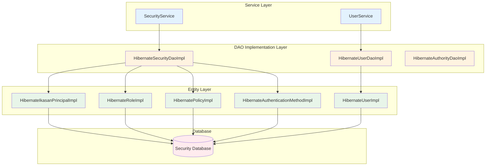
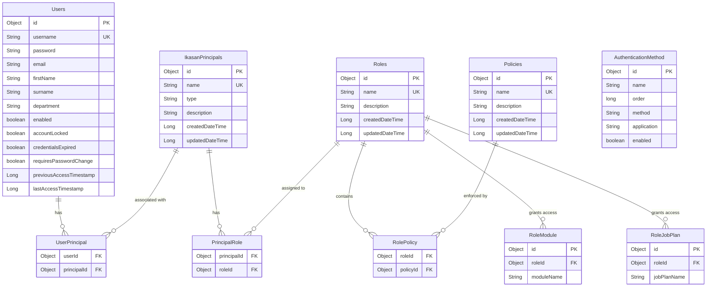
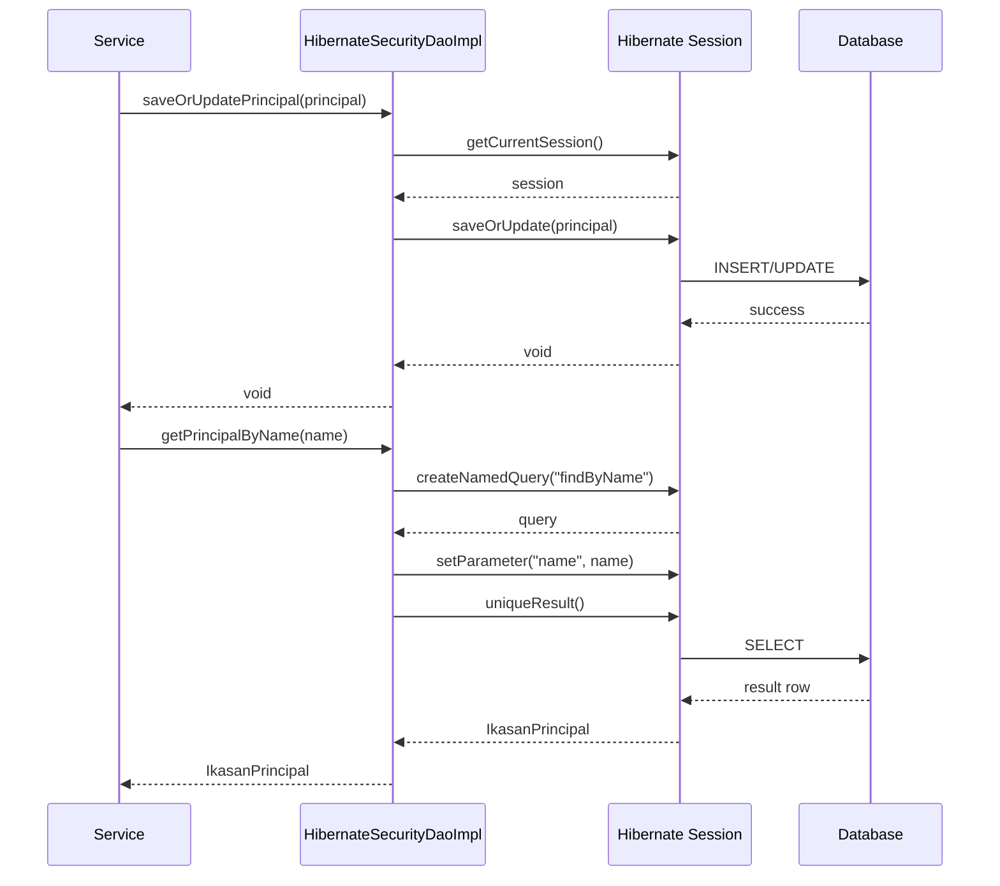

# Ikasan Security Database Module

## Overview

The security-db module provides the persistence layer implementation for the Ikasan security framework using Hibernate and JPA. It implements the security specification interfaces with database-backed storage, providing CRUD operations for users, principals, roles, policies, and authentication methods.

## Purpose

This module serves as:
- **Persistence Implementation**: Hibernate/JPA implementation of security DAO interfaces
- **Entity Mapping**: JPA entity classes for security domain objects
- **Query Management**: Named queries and HQL for efficient data retrieval
- **Auto-Configuration**: Spring Boot auto-configuration for security beans
- **Database Schema**: Defines security database schema through JPA annotations

## Module Structure

```
ikasaneip/security/db/
├── src/main/java/org/ikasan/security/
│   ├── SecurityAutoConfiguration.java          # Spring Boot auto-configuration
│   ├── dao/
│   │   ├── HibernateSecurityDaoImpl.java      # Security DAO implementation
│   │   ├── HibernateUserDaoImpl.java          # User DAO implementation
│   │   ├── HibernateAuthorityDaoImpl.java     # Authority DAO implementation
│   │   └── constants/
│   │       └── SecurityQueries.java            # Named query constants
│   ├── model/
│   │   ├── HibernateIkasanPrincipalImpl.java  # Principal entity
│   │   ├── HibernateUserImpl.java             # User entity
│   │   ├── HibernateRoleImpl.java             # Role entity
│   │   ├── HibernatePolicyImpl.java           # Policy entity
│   │   ├── HibernateAuthenticationMethodImpl.java # Auth method entity
│   │   ├── HibernateRoleModuleImpl.java       # Role-module mapping
│   │   ├── HibernateRoleJobPlanImpl.java      # Role-job plan mapping
│   │   ├── HibernateIkasanPrincipalLiteImpl.java # Lightweight principal
│   │   ├── HibernateUserLiteImpl.java         # Lightweight user
│   │   ├── HibernateIkasanPrincipalFilterImpl.java # Principal filter
│   │   ├── HibernateUserFilterImpl.java       # User filter
│   │   ├── HibernateUserPrincipalImpl.java    # User-principal join
│   │   ├── HibernatePrincipalRoleImpl.java    # Principal-role join
│   │   ├── HibernateRolePolicyImpl.java       # Role-policy join
│   │   ├── HibernateAuthorityImpl.java        # Authority entity
│   │   ├── UserPrincipalPk.java               # Composite key
│   │   ├── PrincipalRolePk.java               # Composite key
│   │   └── RolePolicyPk.java                  # Composite key
│   └── util/
│       └── InitialisePermission.java          # Permission initialization
├── src/main/resources/
│   └── db/migration/                          # Database migration scripts
└── pom.xml
```

## Architecture

### Layered Architecture



### Entity Relationship Diagram



### DAO Implementation Pattern



## Key Components

### DAO Implementations

#### HibernateSecurityDaoImpl
Primary DAO for security entity persistence.

**Key Features:**
- Implements `SecurityDao` interface
- Manages Principal, Role, Policy, RoleModule, RoleJobPlan, and AuthenticationMethod entities
- Uses Hibernate SessionFactory for database access
- Provides factory methods for entity creation
- Implements complex queries with filtering and pagination

**Key Methods:**
```java
public IkasanPrincipal createPrincipal();
public void saveOrUpdatePrincipal(IkasanPrincipal principal);
public IkasanPrincipal getPrincipalByName(String name);
public List<IkasanPrincipal> getAllPrincipals();
public void deletePrincipal(IkasanPrincipal principal);

public Role createRole();
public void saveOrUpdateRole(Role role);
public Role getRoleByName(String name);

public Policy createPolicy();
public void saveOrUpdatePolicy(Policy policy);
public Policy getPolicyByName(String name);

public RoleModule createRoleModule();
public void saveRoleModule(RoleModule roleModule);

public AuthenticationMethod createAuthenticationMethod();
public void saveOrUpdateAuthenticationMethod(AuthenticationMethod method);
```

#### HibernateUserDaoImpl
Specialized DAO for user account management.

**Key Features:**
- Implements `UserDao` interface
- Manages User entities and relationships
- Supports complex user queries with filtering
- Provides role-based user retrieval
- Handles user search operations

**Key Methods:**
```java
public User createUser(String username, String password, String email, boolean enabled);
public User getUser(String username);
public void save(User user);
public void delete(User user);
public List<User> getUsers();
public List<UserLite> getUserLites();
public List<UserLite> getUsersWithRole(String roleName, UserFilter filter, int limit, int offset);
public int getUsersWithRoleCount(String roleName, UserFilter filter);
public List<User> getUserByUsernameLike(String username);
```

### Entity Implementations

#### Core Entities

**HibernateIkasanPrincipalImpl**
- JPA entity for security principals
- Maps to `IkasanPrincipals` table
- Manages many-to-many relationships with Roles and Users
- Includes audit timestamps

**HibernateUserImpl**
- JPA entity for user accounts
- Implements Spring Security's `UserDetails` interface
- Maps to `Users` table
- Contains credential and account status fields
- Tracks access timestamps

**HibernateRoleImpl**
- JPA entity for roles
- Maps to `Roles` table
- Manages relationships with Policies, Modules, and Job Plans
- Supports role hierarchy

**HibernatePolicyImpl**
- JPA entity for policies (permissions)
- Maps to `Policies` table
- Links to PolicyLinks for fine-grained permissions

#### Association Entities

**HibernateUserPrincipalImpl**
- Join table entity for User-Principal relationship
- Uses `UserPrincipalPk` composite key
- Maps to `UserPrincipal` table

**HibernatePrincipalRoleImpl**
- Join table entity for Principal-Role relationship
- Uses `PrincipalRolePk` composite key
- Maps to `PrincipalRole` table

**HibernateRolePolicyImpl**
- Join table entity for Role-Policy relationship
- Uses `RolePolicyPk` composite key
- Maps to `RolePolicy` table

### Named Queries

Defined in `SecurityQueries` interface:

```java
// Principal queries
String FIND_PRINCIPAL_BY_NAME = "SELECT p FROM HibernateIkasanPrincipalImpl p WHERE p.name = :name";

String GET_ALL_PRINCIPALS = "SELECT p FROM HibernateIkasanPrincipalImpl p";

String GET_PRINCIPALS_WITH_ROLE =
    "SELECT p FROM HibernateIkasanPrincipalImpl p " +
    "JOIN p.roles r WHERE r.name = :roleName";

// User queries
String FIND_USER_BY_USERNAME = "SELECT u FROM HibernateUserImpl u WHERE u.username = :username";

String GET_USERS_WITH_ROLE =
    "SELECT DISTINCT u FROM HibernateUserImpl u " +
    "JOIN u.principals p JOIN p.roles r " +
    "WHERE r.name = :roleName";

// Role queries
String FIND_ROLE_BY_NAME = "SELECT r FROM HibernateRoleImpl r WHERE r.name = :name";

// Policy queries
String FIND_POLICY_BY_NAME = "SELECT p FROM HibernatePolicyImpl p WHERE p.name = :name";
```

### Auto-Configuration

**SecurityAutoConfiguration**
Spring Boot auto-configuration class that sets up:
- SessionFactory bean
- DAO implementations (HibernateSecurityDaoImpl, HibernateUserDaoImpl)
- Service implementations
- Transaction management
- Database initialization

```java
@Configuration
@EnableTransactionManagement
public class SecurityAutoConfiguration {

    @Bean
    public SessionFactory sessionFactory(EntityManagerFactory emf) {
        return emf.unwrap(SessionFactory.class);
    }

    @Bean
    public SecurityDao securityDao(SessionFactory sessionFactory) {
        return new HibernateSecurityDaoImpl(sessionFactory);
    }

    @Bean
    public UserDao userDao(SessionFactory sessionFactory) {
        return new HibernateUserDaoImpl(sessionFactory);
    }
}
```

## Database Schema

### Tables

```sql
-- Users table
CREATE TABLE Users (
    id BIGINT PRIMARY KEY AUTO_INCREMENT,
    username VARCHAR(255) UNIQUE NOT NULL,
    password VARCHAR(255) NOT NULL,
    email VARCHAR(255),
    firstName VARCHAR(255),
    surname VARCHAR(255),
    department VARCHAR(255),
    enabled BOOLEAN DEFAULT TRUE,
    accountLocked BOOLEAN DEFAULT FALSE,
    credentialsExpired BOOLEAN DEFAULT FALSE,
    requiresPasswordChange BOOLEAN DEFAULT FALSE,
    previousAccessTimestamp BIGINT,
    lastAccessTimestamp BIGINT
);

-- Principals table
CREATE TABLE IkasanPrincipals (
    id BIGINT PRIMARY KEY AUTO_INCREMENT,
    name VARCHAR(255) UNIQUE NOT NULL,
    type VARCHAR(50) NOT NULL,
    description TEXT,
    createdDateTime BIGINT,
    updatedDateTime BIGINT
);

-- Roles table
CREATE TABLE Roles (
    id BIGINT PRIMARY KEY AUTO_INCREMENT,
    name VARCHAR(255) UNIQUE NOT NULL,
    description TEXT,
    createdDateTime BIGINT,
    updatedDateTime BIGINT
);

-- Policies table
CREATE TABLE Policies (
    id BIGINT PRIMARY KEY AUTO_INCREMENT,
    name VARCHAR(255) UNIQUE NOT NULL,
    description TEXT,
    createdDateTime BIGINT,
    updatedDateTime BIGINT
);

-- Join tables
CREATE TABLE UserPrincipal (
    userId BIGINT,
    principalId BIGINT,
    PRIMARY KEY (userId, principalId),
    FOREIGN KEY (userId) REFERENCES Users(id),
    FOREIGN KEY (principalId) REFERENCES IkasanPrincipals(id)
);

CREATE TABLE PrincipalRole (
    principalId BIGINT,
    roleId BIGINT,
    PRIMARY KEY (principalId, roleId),
    FOREIGN KEY (principalId) REFERENCES IkasanPrincipals(id),
    FOREIGN KEY (roleId) REFERENCES Roles(id)
);

CREATE TABLE RolePolicy (
    roleId BIGINT,
    policyId BIGINT,
    PRIMARY KEY (roleId, policyId),
    FOREIGN KEY (roleId) REFERENCES Roles(id),
    FOREIGN KEY (policyId) REFERENCES Policies(id)
);

-- Resource access tables
CREATE TABLE RoleModule (
    id BIGINT PRIMARY KEY AUTO_INCREMENT,
    roleId BIGINT,
    moduleName VARCHAR(255),
    FOREIGN KEY (roleId) REFERENCES Roles(id)
);

CREATE TABLE RoleJobPlan (
    id BIGINT PRIMARY KEY AUTO_INCREMENT,
    roleId BIGINT,
    jobPlanName VARCHAR(255),
    FOREIGN KEY (roleId) REFERENCES Roles(id)
);

-- Authentication methods table
CREATE TABLE AuthenticationMethod (
    id BIGINT PRIMARY KEY AUTO_INCREMENT,
    name VARCHAR(255) UNIQUE NOT NULL,
    order BIGINT NOT NULL,
    method VARCHAR(50),
    application VARCHAR(255),
    enabled BOOLEAN DEFAULT TRUE
);
```

## Query Examples

### User Queries

```java
// Find user by username
User user = userDao.getUser("john.doe");

// Get users with specific role (paginated)
List<UserLite> admins = userDao.getUsersWithRole(
    "Administrator",
    null,  // no filter
    20,    // limit
    0      // offset
);

// Search users by username pattern
List<User> users = userDao.getUserByUsernameLike("john%");

// Get users count with role
int count = userDao.getUsersWithRoleCount("Administrator", null);
```

### Principal Queries

```java
// Find principal by name
IkasanPrincipal principal = securityDao.getPrincipalByName("john.doe");

// Get principals with role (filtered and paginated)
IkasanPrincipalFilter filter = new HibernateIkasanPrincipalFilterImpl();
filter.setNameFilter("admin");
List<IkasanPrincipalLite> principals = securityDao.getAllPrincipalsWithRole(
    "Administrator",
    filter,
    50,   // limit
    0     // offset
);

// Get principal count
int count = securityDao.getPrincipalCount(filter);
```

### Role and Policy Queries

```java
// Find role by name
Role role = securityDao.getRoleByName("Administrator");

// Get all roles
List<Role> roles = securityDao.getAllRoles();

// Find policy by name
Policy policy = securityDao.getPolicyByName("READ_USERS");

// Get policies associated with role
List<Policy> policies = securityDao.getAllPoliciesWithRole("Administrator");
```

## Transaction Management

All DAO operations are designed to work within Spring-managed transactions:

```java
@Service
@Transactional
public class SecurityServiceImpl implements SecurityService {

    private final SecurityDao securityDao;

    @Transactional(readOnly = true)
    public IkasanPrincipal findPrincipalByName(String name) {
        return securityDao.getPrincipalByName(name);
    }

    @Transactional
    public void savePrincipal(IkasanPrincipal principal) {
        securityDao.saveOrUpdatePrincipal(principal);
    }
}
```

## Performance Considerations

### Lazy Loading
- Collections (roles, policies, principals) use lazy loading by default
- Fetch joins used in queries where relationships are needed
- Lightweight entities (`UserLite`, `IkasanPrincipalLite`) for list operations

### Query Optimization
- Named queries compiled at startup
- Indexed columns: username, principal name, role name, policy name
- Pagination support for large result sets

### Caching
- Second-level cache can be enabled for read-heavy entities (Roles, Policies)
- Query cache for frequently executed queries

## Configuration

### Application Properties

```properties
# Hibernate properties
spring.jpa.hibernate.ddl-auto=validate
spring.jpa.show-sql=false
spring.jpa.properties.hibernate.dialect=org.hibernate.dialect.H2Dialect

# Connection pool
spring.datasource.hikari.maximum-pool-size=10
spring.datasource.hikari.minimum-idle=5
```

## Dependencies

```xml
<dependencies>
    <!-- Ikasan Security Spec -->
    <dependency>
        <groupId>org.ikasan</groupId>
        <artifactId>ikasan-spec-service-security</artifactId>
    </dependency>

    <!-- Hibernate/JPA -->
    <dependency>
        <groupId>org.hibernate</groupId>
        <artifactId>hibernate-core</artifactId>
    </dependency>

    <!-- Spring Boot JPA -->
    <dependency>
        <groupId>org.springframework.boot</groupId>
        <artifactId>spring-boot-starter-data-jpa</artifactId>
    </dependency>

    <!-- Spring Security -->
    <dependency>
        <groupId>org.springframework.security</groupId>
        <artifactId>spring-security-core</artifactId>
    </dependency>
</dependencies>
```

## Best Practices

1. **Always use transactions**: Wrap DAO operations in service-layer transactions
2. **Lazy loading awareness**: Initialize collections before detaching entities
3. **Use lightweight entities**: Prefer `UserLite` and `IkasanPrincipalLite` for listings
4. **Pagination for large datasets**: Always specify limit and offset for large queries
5. **Filter null checks**: Check filter parameters for null before applying
6. **Cascade operations carefully**: Understand cascade settings for relationships
7. **Index management**: Ensure proper indexes on frequently queried columns
8. **Connection pooling**: Configure appropriate pool sizes for your workload

## Version Information

- **Module**: ikasan-security-db
- **Parent**: ikasan-security
- **Group ID**: org.ikasan
- **Artifact ID**: ikasan-security-db
