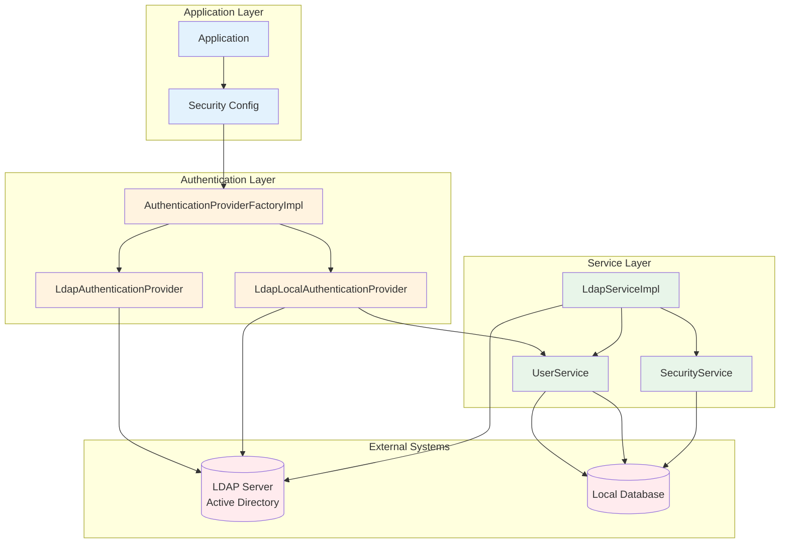
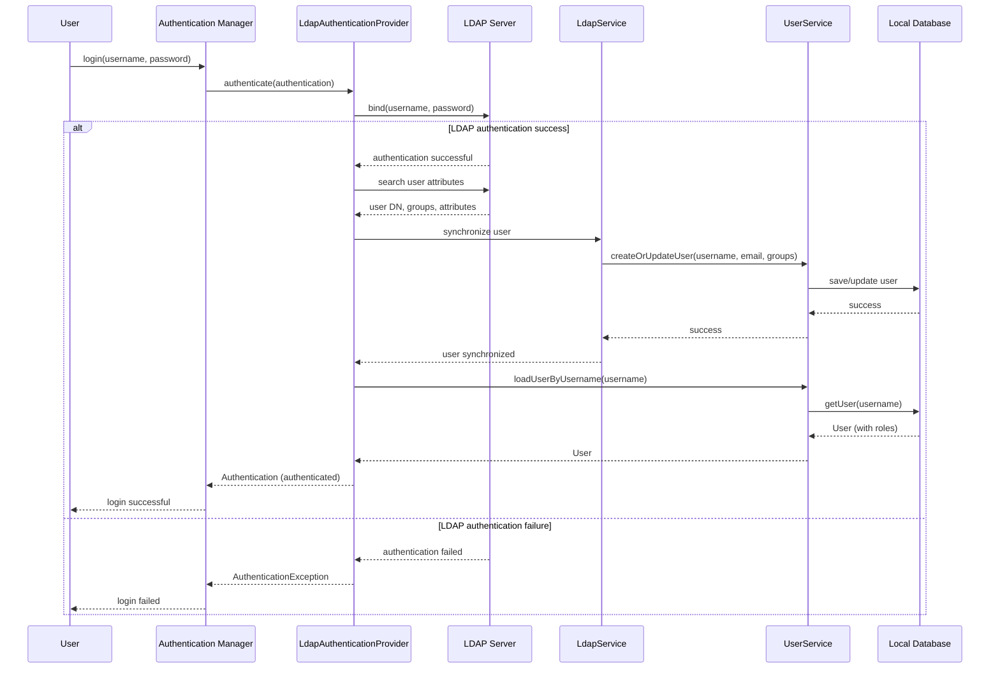
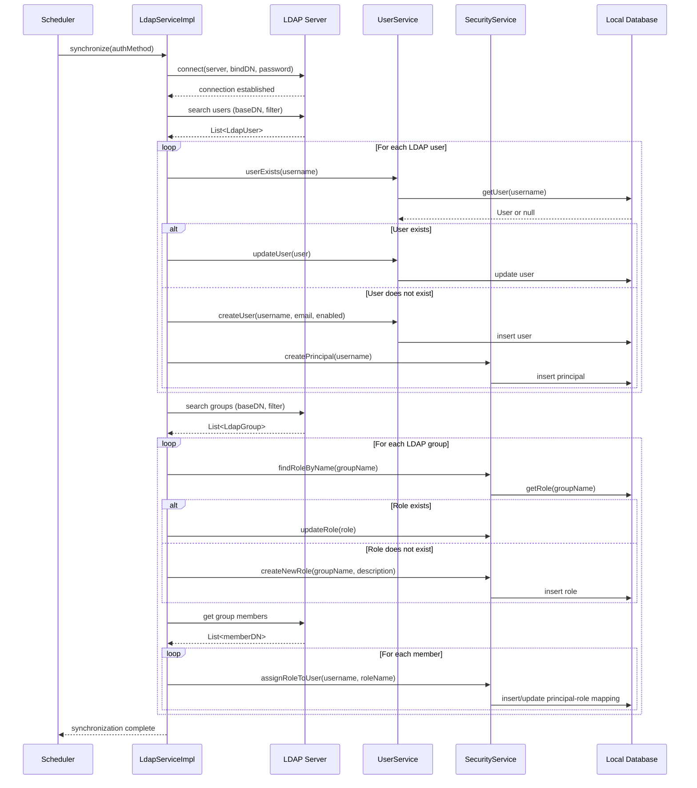

# Ikasan Security LDAP Module

## Overview

The security-ldap module provides LDAP (Lightweight Directory Access Protocol) integration for the Ikasan security framework. It enables authentication against LDAP directories (Active Directory, OpenLDAP, etc.) and synchronization of user/group information from LDAP to the local security database.

## Purpose

This module serves as:
- **LDAP Authentication**: Authenticates users against LDAP/Active Directory servers
- **User Synchronization**: Syncs LDAP users and groups to local database
- **Hybrid Authentication**: Supports combined LDAP and local authentication
- **Directory Integration**: Integrates with enterprise directory services
- **Authentication Provider Factory**: Creates LDAP-specific authentication providers

## Module Structure

```
ikasaneip/security/ldap/
├── src/main/java/org/ikasan/security/
│   └── service/
│       ├── LdapService.java                    # LDAP sync service interface
│       ├── LdapServiceImpl.java                # LDAP sync implementation
│       ├── LdapServiceException.java           # LDAP exception
│       └── authentication/
│           ├── AuthenticationProviderFactoryImpl.java   # LDAP auth factory
│           ├── LdapAuthenticationProvider.java          # Pure LDAP auth
│           └── LdapLocalAuthenticationProvider.java     # Hybrid LDAP/local auth
└── pom.xml
```

## Architecture

### LDAP Integration Architecture



### LDAP Authentication Flow



### LDAP Synchronization Flow



## Key Components

### Service Components

#### LdapService

Interface defining LDAP synchronization operations.

**Purpose:**
- Define contract for LDAP synchronization
- Enable pluggable LDAP implementations

**Interface:**
```java
public interface LdapService {
    /**
     * Synchronize the local security DB against LDAP.
     *
     * @param authenticationMethod LDAP configuration
     * @throws LdapServiceException if synchronization fails
     */
    void synchronize(AuthenticationMethod authenticationMethod)
        throws LdapServiceException;
}
```

#### LdapServiceImpl

Implementation of LDAP synchronization service.

**Dependencies:**
- `UserService` - User management
- `SecurityService` - Security entity management
- `LdapContextSource` - LDAP connection
- `LdapTemplate` - LDAP operations

**Key Responsibilities:**
- Connect to LDAP/Active Directory servers
- Search and retrieve user entries
- Search and retrieve group entries
- Create/update local users from LDAP users
- Create/update local roles from LDAP groups
- Map LDAP group membership to role assignments

**Key Methods:**
```java
@Override
public void synchronize(AuthenticationMethod authenticationMethod)
        throws LdapServiceException {

    try {
        // Extract LDAP configuration
        String server = authenticationMethod.getServerUrl();
        String bindDN = authenticationMethod.getBindDN();
        String bindPassword = authenticationMethod.getBindPassword();
        String userBaseDN = authenticationMethod.getUserBaseDN();
        String userFilter = authenticationMethod.getUserFilter();
        String groupBaseDN = authenticationMethod.getGroupBaseDN();
        String groupFilter = authenticationMethod.getGroupFilter();

        // Configure LDAP context
        LdapContextSource contextSource = new LdapContextSource();
        contextSource.setUrl(server);
        contextSource.setUserDn(bindDN);
        contextSource.setPassword(bindPassword);
        contextSource.afterPropertiesSet();

        LdapTemplate ldapTemplate = new LdapTemplate(contextSource);

        // Synchronize users
        synchronizeUsers(ldapTemplate, userBaseDN, userFilter);

        // Synchronize groups
        synchronizeGroups(ldapTemplate, groupBaseDN, groupFilter);

        // Synchronize group memberships
        synchronizeMemberships(ldapTemplate, groupBaseDN, groupFilter);

    } catch (Exception e) {
        throw new LdapServiceException("LDAP synchronization failed", e);
    }
}

private void synchronizeUsers(LdapTemplate ldapTemplate, String baseDN, String filter) {
    List<Object> users = ldapTemplate.search(
        baseDN,
        filter,
        new UserAttributesMapper()
    );

    for (Object userObj : users) {
        LdapUser ldapUser = (LdapUser) userObj;
        String username = ldapUser.getUsername();

        if (userService.userExists(username)) {
            // Update existing user
            User user = userService.loadUserByUsername(username);
            user.setEmail(ldapUser.getEmail());
            user.setFirstName(ldapUser.getFirstName());
            user.setSurname(ldapUser.getSurname());
            userService.updateUser(user);
        } else {
            // Create new user
            User user = userService.createUser(
                username,
                generateRandomPassword(), // LDAP users auth via LDAP
                ldapUser.getEmail(),
                true
            );
            user.setFirstName(ldapUser.getFirstName());
            user.setSurname(ldapUser.getSurname());

            // Create principal
            IkasanPrincipal principal = securityService.createPrincipal();
            principal.setName(username);
            principal.setType("user");
            securityService.savePrincipal(principal);

            user.addPrincipal(principal);
            userService.updateUser(user);
        }
    }
}

private void synchronizeGroups(LdapTemplate ldapTemplate, String baseDN, String filter) {
    List<Object> groups = ldapTemplate.search(
        baseDN,
        filter,
        new GroupAttributesMapper()
    );

    for (Object groupObj : groups) {
        LdapGroup ldapGroup = (LdapGroup) groupObj;
        String groupName = ldapGroup.getName();

        Role role = securityService.findRoleByName(groupName);
        if (role == null) {
            // Create new role
            role = securityService.createNewRole(
                groupName,
                "LDAP Group: " + groupName
            );
        }
    }
}
```

**Configuration Properties:**
```properties
# LDAP Server Configuration
ldap.server.url=ldap://ldap.example.com:389
ldap.server.bind-dn=cn=admin,dc=example,dc=com
ldap.server.bind-password=secret

# User Search Configuration
ldap.user.base-dn=ou=users,dc=example,dc=com
ldap.user.filter=(objectClass=inetOrgPerson)
ldap.user.attributes=cn,mail,givenName,sn

# Group Search Configuration
ldap.group.base-dn=ou=groups,dc=example,dc=com
ldap.group.filter=(objectClass=groupOfNames)
ldap.group.member-attribute=member

# Synchronization Schedule
ldap.sync.cron=0 0 2 * * ?  # Daily at 2 AM
```

#### LdapServiceException

Custom exception for LDAP-specific errors.

**Purpose:**
- Encapsulate LDAP connection errors
- Encapsulate LDAP query errors
- Provide meaningful error messages

**Structure:**
```java
public class LdapServiceException extends Exception {

    public LdapServiceException(String message) {
        super(message);
    }

    public LdapServiceException(String message, Throwable cause) {
        super(message, cause);
    }
}
```

### Authentication Components

#### AuthenticationProviderFactoryImpl

Factory implementation for creating LDAP authentication providers.

**Purpose:**
- Create appropriate authentication provider based on configuration
- Support pure LDAP authentication
- Support hybrid LDAP/local authentication

**Key Methods:**
```java
public class AuthenticationProviderFactoryImpl
        implements AuthenticationProviderFactory {

    private final UserService userService;
    private final SecurityService securityService;

    @Override
    public AuthenticationProvider getProvider(AuthenticationMethod authMethod) {
        String method = authMethod.getMethod();

        if ("ldap".equals(method)) {
            return createLdapAuthenticationProvider(authMethod);
        } else if ("ldap-local".equals(method)) {
            return createLdapLocalAuthenticationProvider(authMethod);
        } else {
            throw new IllegalArgumentException(
                "Unsupported authentication method: " + method
            );
        }
    }

    private LdapAuthenticationProvider createLdapAuthenticationProvider(
            AuthenticationMethod authMethod) {

        LdapAuthenticationProvider provider = new LdapAuthenticationProvider();
        provider.setContextSource(createContextSource(authMethod));
        provider.setUserDnPatterns(authMethod.getUserDnPatterns());
        provider.setUserSearchBase(authMethod.getUserBaseDN());
        provider.setUserSearchFilter(authMethod.getUserFilter());
        return provider;
    }

    private LdapLocalAuthenticationProvider createLdapLocalAuthenticationProvider(
            AuthenticationMethod authMethod) {

        LdapLocalAuthenticationProvider provider =
            new LdapLocalAuthenticationProvider();
        provider.setContextSource(createContextSource(authMethod));
        provider.setUserService(userService);
        provider.setSecurityService(securityService);
        return provider;
    }

    private LdapContextSource createContextSource(AuthenticationMethod authMethod) {
        LdapContextSource contextSource = new LdapContextSource();
        contextSource.setUrl(authMethod.getServerUrl());
        contextSource.setUserDn(authMethod.getBindDN());
        contextSource.setPassword(authMethod.getBindPassword());
        contextSource.afterPropertiesSet();
        return contextSource;
    }
}
```

#### LdapAuthenticationProvider

Spring Security LDAP authentication provider for pure LDAP authentication.

**Purpose:**
- Authenticate users directly against LDAP
- No local database fallback
- Uses Spring Security's LDAP support

**Key Features:**
- Extends Spring Security's `AbstractLdapAuthenticationProvider`
- Supports user DN patterns and search filters
- Loads user authorities from LDAP groups
- Does not require local user database

**Configuration:**
```java
@Configuration
public class LdapSecurityConfig {

    @Bean
    public LdapAuthenticationProvider ldapAuthenticationProvider() {
        LdapAuthenticationProvider provider = new LdapAuthenticationProvider(
            bindAuthenticator(),
            ldapAuthoritiesPopulator()
        );
        return provider;
    }

    @Bean
    public BindAuthenticator bindAuthenticator() {
        BindAuthenticator authenticator = new BindAuthenticator(contextSource());
        authenticator.setUserDnPatterns(new String[]{"uid={0},ou=users"});
        return authenticator;
    }

    @Bean
    public LdapAuthoritiesPopulator ldapAuthoritiesPopulator() {
        DefaultLdapAuthoritiesPopulator populator =
            new DefaultLdapAuthoritiesPopulator(
                contextSource(),
                "ou=groups"
            );
        populator.setGroupRoleAttribute("cn");
        populator.setGroupSearchFilter("(member={0})");
        return populator;
    }

    @Bean
    public LdapContextSource contextSource() {
        LdapContextSource contextSource = new LdapContextSource();
        contextSource.setUrl("ldap://ldap.example.com:389");
        contextSource.setBase("dc=example,dc=com");
        contextSource.setUserDn("cn=admin,dc=example,dc=com");
        contextSource.setPassword("secret");
        return contextSource;
    }
}
```

#### LdapLocalAuthenticationProvider

Hybrid authentication provider that authenticates via LDAP but uses local database for authorization.

**Purpose:**
- Authenticate credentials against LDAP
- Load user details and authorities from local database
- Enable LDAP authentication with local role management

**Dependencies:**
- `LdapContextSource` - LDAP connection
- `UserService` - Load local user details
- `SecurityService` - Load local security entities

**Authentication Process:**
```java
public class LdapLocalAuthenticationProvider
        extends AbstractUserDetailsAuthenticationProvider {

    private LdapContextSource contextSource;
    private UserService userService;
    private SecurityService securityService;

    @Override
    protected void additionalAuthenticationChecks(
            UserDetails userDetails,
            UsernamePasswordAuthenticationToken authentication)
            throws AuthenticationException {

        // Authenticate against LDAP
        String username = authentication.getName();
        String password = authentication.getCredentials().toString();

        try {
            // Build user DN
            String userDn = buildUserDn(username);

            // Attempt LDAP bind
            DirContext context = contextSource.getContext(userDn, password);
            context.close();

        } catch (Exception e) {
            throw new BadCredentialsException("LDAP authentication failed", e);
        }
    }

    @Override
    protected UserDetails retrieveUser(
            String username,
            UsernamePasswordAuthenticationToken authentication)
            throws AuthenticationException {

        // Load user from local database
        try {
            return userService.loadUserByUsername(username);
        } catch (UsernameNotFoundException e) {
            // User not in local DB, could sync from LDAP here
            throw new UsernameNotFoundException(
                "User not found in local database: " + username
            );
        }
    }

    private String buildUserDn(String username) {
        return "uid=" + username + "," + userSearchBase;
    }
}
```

**Use Cases:**
- LDAP authentication with local role management
- Gradual migration from local to LDAP authentication
- LDAP authentication with custom authorization rules

## LDAP Configuration Examples

### Active Directory Configuration

```yaml
ikasan:
  security:
    ldap:
      enabled: true
      server-url: ldap://ad.example.com:389
      bind-dn: CN=Service Account,OU=Service Accounts,DC=example,DC=com
      bind-password: ${LDAP_PASSWORD}
      user:
        base-dn: OU=Users,DC=example,DC=com
        filter: (&(objectClass=user)(sAMAccountName={0}))
        search-subtree: true
        attributes:
          username: sAMAccountName
          email: mail
          first-name: givenName
          last-name: sn
      group:
        base-dn: OU=Groups,DC=example,DC=com
        filter: (objectClass=group)
        member-attribute: member
        role-attribute: cn
      sync:
        enabled: true
        cron: 0 0 2 * * ?
```

### OpenLDAP Configuration

```yaml
ikasan:
  security:
    ldap:
      enabled: true
      server-url: ldap://ldap.example.com:389
      bind-dn: cn=admin,dc=example,dc=com
      bind-password: ${LDAP_PASSWORD}
      user:
        base-dn: ou=users,dc=example,dc=com
        filter: (&(objectClass=inetOrgPerson)(uid={0}))
        search-subtree: false
        attributes:
          username: uid
          email: mail
          first-name: givenName
          last-name: sn
      group:
        base-dn: ou=groups,dc=example,dc=com
        filter: (objectClass=groupOfNames)
        member-attribute: member
        role-attribute: cn
      sync:
        enabled: true
        cron: 0 0 2 * * ?
```

## Scheduled Synchronization

```java
@Component
public class LdapSyncScheduler {

    private final LdapService ldapService;
    private final SecurityService securityService;

    @Scheduled(cron = "${ikasan.security.ldap.sync.cron:0 0 2 * * ?}")
    public void synchronizeLdap() {
        logger.info("Starting LDAP synchronization");

        try {
            // Get LDAP authentication methods
            List<AuthenticationMethod> ldapMethods = securityService
                .getAuthenticationMethods()
                .stream()
                .filter(am -> "ldap".equals(am.getMethod()) && am.isEnabled())
                .collect(Collectors.toList());

            // Synchronize each LDAP server
            for (AuthenticationMethod authMethod : ldapMethods) {
                logger.info("Synchronizing LDAP: {}", authMethod.getName());
                ldapService.synchronize(authMethod);
            }

            logger.info("LDAP synchronization completed successfully");

        } catch (LdapServiceException e) {
            logger.error("LDAP synchronization failed", e);
        }
    }
}
```

## LDAP Testing

```java
@RunWith(SpringRunner.class)
@ContextConfiguration
public class LdapAuthenticationProviderTest {

    @Autowired
    private LdapAuthenticationProvider ldapAuthenticationProvider;

    @Test
    public void testAuthenticateWithValidCredentials() {
        UsernamePasswordAuthenticationToken authentication =
            new UsernamePasswordAuthenticationToken("john.doe", "password123");

        Authentication result = ldapAuthenticationProvider.authenticate(authentication);

        assertNotNull(result);
        assertTrue(result.isAuthenticated());
        assertEquals("john.doe", result.getName());
    }

    @Test(expected = BadCredentialsException.class)
    public void testAuthenticateWithInvalidCredentials() {
        UsernamePasswordAuthenticationToken authentication =
            new UsernamePasswordAuthenticationToken("john.doe", "wrongpassword");

        ldapAuthenticationProvider.authenticate(authentication);
    }
}
```

## Dependencies

```xml
<dependencies>
    <!-- Ikasan Security Spec -->
    <dependency>
        <groupId>org.ikasan</groupId>
        <artifactId>ikasan-spec-service-security</artifactId>
    </dependency>

    <!-- Ikasan Security Service -->
    <dependency>
        <groupId>org.ikasan</groupId>
        <artifactId>ikasan-security-service</artifactId>
    </dependency>

    <!-- Spring Security LDAP -->
    <dependency>
        <groupId>org.springframework.security</groupId>
        <artifactId>spring-security-ldap</artifactId>
    </dependency>

    <!-- Spring LDAP Core -->
    <dependency>
        <groupId>org.springframework.ldap</groupId>
        <artifactId>spring-ldap-core</artifactId>
    </dependency>

    <!-- UnboundID LDAP SDK (optional, for testing) -->
    <dependency>
        <groupId>com.unboundid</groupId>
        <artifactId>unboundid-ldapsdk</artifactId>
        <scope>test</scope>
    </dependency>
</dependencies>
```

## Best Practices

1. **Secure credentials**: Store LDAP bind credentials securely (environment variables, vault)
2. **Connection pooling**: Configure LDAP connection pooling for performance
3. **Timeout configuration**: Set appropriate connection and read timeouts
4. **Error handling**: Handle LDAP connection failures gracefully
5. **Sync scheduling**: Schedule synchronization during low-usage periods
6. **Incremental sync**: Consider incremental sync for large directories
7. **Group mapping**: Map LDAP groups to application roles consistently
8. **SSL/TLS**: Use LDAPS (LDAP over SSL) for production
9. **Logging**: Log LDAP operations for troubleshooting
10. **Testing**: Test with embedded LDAP server for development

## Troubleshooting

### Common Issues

**Connection Refused:**
```
Problem: Unable to connect to LDAP server
Solution: Check server URL, port, and firewall rules
```

**Authentication Failed:**
```
Problem: Bind DN authentication fails
Solution: Verify bind DN and password are correct
```

**User Not Found:**
```
Problem: LDAP search returns no results
Solution: Check base DN, search filter, and user exists in LDAP
```

**Slow Synchronization:**
```
Problem: LDAP sync takes too long
Solution: Narrow search base DN, use indexed attributes, enable paging
```

## Version Information

- **Module**: ikasan-security-ldap
- **Parent**: ikasan-security
- **Group ID**: org.ikasan
- **Artifact ID**: ikasan-security-ldap
