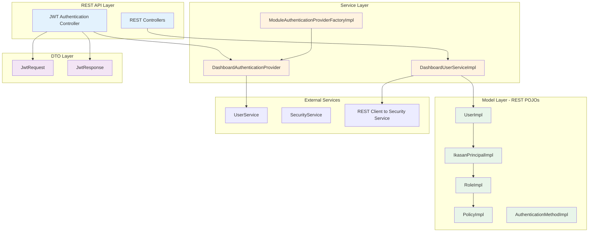
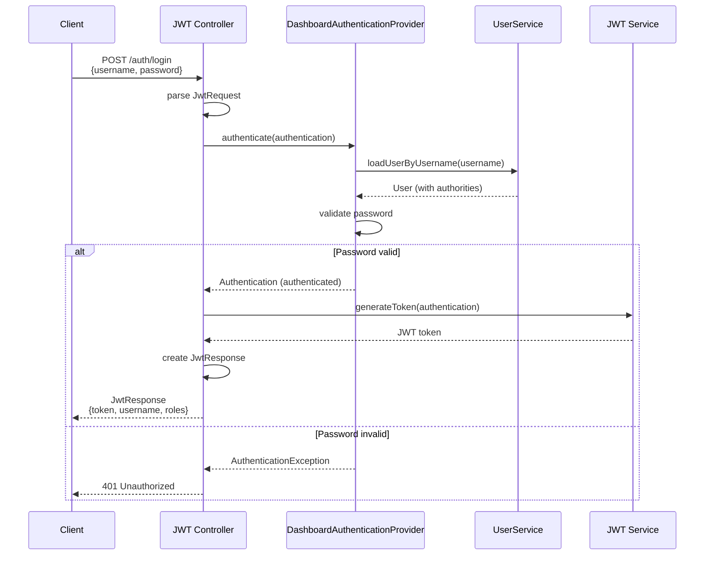
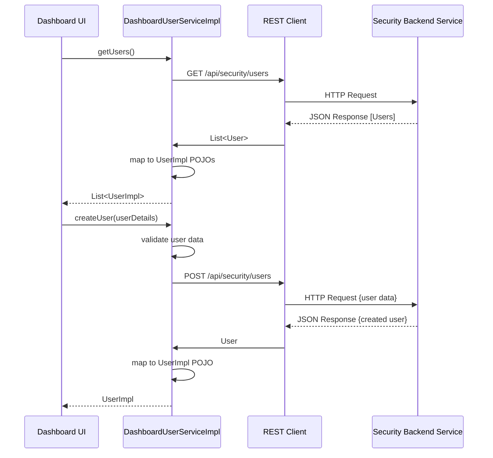
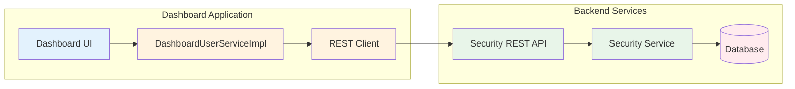
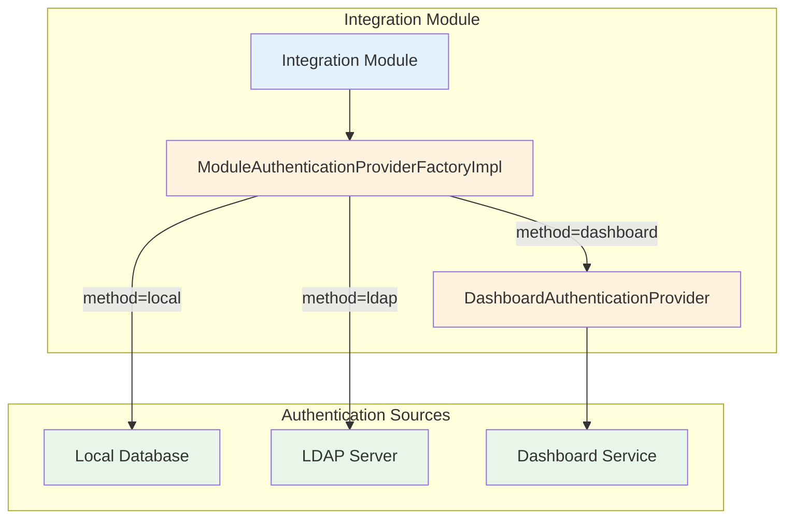

# Ikasan Security REST Module

## Overview

The security-rest module provides REST API model implementations and specialized service components for web-based and dashboard applications. It includes POJO implementations of security model interfaces, JWT authentication support, and dashboard-specific authentication providers.

## Purpose

This module serves as:
- **REST Model Layer**: Plain Java Object (POJO) implementations for JSON serialization
- **Dashboard Security**: Specialized security services for dashboard applications
- **JWT Support**: Request/response DTOs for JWT-based authentication
- **Module Authentication**: Authentication provider factory for module-level security
- **Web Integration**: Facilitates REST API and web application security

## Module Structure

```
ikasaneip/security/rest/
├── src/main/java/org/ikasan/security/
│   ├── service/
│   │   ├── DashboardUserServiceImpl.java      # Dashboard user service
│   │   ├── authentication/
│   │   │   ├── DashboardAuthenticationProvider.java       # Dashboard auth
│   │   │   └── ModuleAuthenticationProviderFactoryImpl.java # Module auth factory
│   │   ├── dto/
│   │   │   ├── JwtRequest.java                # JWT login request
│   │   │   └── JwtResponse.java               # JWT login response
│   │   └── model/
│   │       ├── IkasanPrincipalImpl.java       # POJO principal
│   │       ├── UserImpl.java                   # POJO user
│   │       ├── RoleImpl.java                   # POJO role
│   │       ├── PolicyImpl.java                 # POJO policy
│   │       ├── AuthenticationMethodImpl.java   # POJO auth method
│   │       ├── RoleModuleImpl.java             # POJO role-module
│   │       └── RoleJobPlanImpl.java            # POJO role-job plan
└── pom.xml
```

## Architecture

### Component Architecture



### JWT Authentication Flow



### Dashboard User Service Flow



## Key Components

### Service Components

#### DashboardUserServiceImpl

Specialized implementation of `UserService` for dashboard applications that communicates with a remote security service via REST.

**Purpose:**
- Provides user management operations for dashboard UI
- Acts as a REST client to backend security services
- Converts between REST DTOs and domain models
- Enables distributed security architecture

**Key Features:**
- REST client integration for remote user management
- POJO model conversion for JSON serialization
- Dashboard-specific user operations
- Remote authentication support

**Key Methods:**
```java
@Override
public List<User> getUsers() {
    // Call REST API to retrieve users
    List<UserImpl> users = restClient.get("/api/security/users", UserImpl[].class);
    return new ArrayList<>(users);
}

@Override
public void createUser(UserDetails userDetails) {
    UserImpl user = convertToUserImpl(userDetails);
    restClient.post("/api/security/users", user);
}

@Override
public User loadUserByUsername(String username) throws UsernameNotFoundException {
    try {
        return restClient.get("/api/security/users/" + username, UserImpl.class);
    } catch (RestClientException e) {
        throw new UsernameNotFoundException("User not found: " + username, e);
    }
}
```

**Configuration:**
```java
@Configuration
public class DashboardSecurityConfig {

    @Value("${ikasan.security.service.url}")
    private String securityServiceUrl;

    @Bean
    public UserService dashboardUserService() {
        return new DashboardUserServiceImpl(securityServiceUrl);
    }
}
```

#### DashboardAuthenticationProvider

Spring Security authentication provider for dashboard applications.

**Purpose:**
- Authenticates dashboard users
- Integrates with UserService for credential validation
- Builds authentication tokens with authorities

**Dependencies:**
- `UserService` - Load user details and validate credentials
- `PasswordEncoder` - Validate passwords

**Authentication Logic:**
```java
@Override
public Authentication authenticate(Authentication authentication)
        throws AuthenticationException {

    String username = authentication.getName();
    String password = authentication.getCredentials().toString();

    // Load user from service
    User user = userService.loadUserByUsername(username);

    // Validate password
    if (!passwordEncoder.matches(password, user.getPassword())) {
        throw new BadCredentialsException("Invalid username or password");
    }

    // Check account status
    if (!user.isEnabled()) {
        throw new DisabledException("User account is disabled");
    }

    // Build granted authorities
    List<GrantedAuthority> authorities = new ArrayList<>(user.getAuthorities());

    // Return authenticated token
    return new UsernamePasswordAuthenticationToken(username, password, authorities);
}

@Override
public boolean supports(Class<?> authentication) {
    return UsernamePasswordAuthenticationToken.class.isAssignableFrom(authentication);
}
```

#### ModuleAuthenticationProviderFactoryImpl

Factory implementation for creating authentication providers for module-level security.

**Purpose:**
- Creates appropriate authentication providers based on authentication method
- Supports multiple authentication strategies (local, LDAP, dashboard)
- Enables per-module authentication configuration

**Key Methods:**
```java
@Override
public AuthenticationProvider getProvider(AuthenticationMethod authenticationMethod) {
    String method = authenticationMethod.getMethod();

    switch (method) {
        case "local":
            return createLocalAuthenticationProvider();
        case "ldap":
            return createLdapAuthenticationProvider(authenticationMethod);
        case "dashboard":
            return createDashboardAuthenticationProvider();
        default:
            throw new IllegalArgumentException("Unsupported authentication method: " + method);
    }
}

private AuthenticationProvider createDashboardAuthenticationProvider() {
    DashboardAuthenticationProvider provider = new DashboardAuthenticationProvider();
    provider.setUserService(userService);
    provider.setPasswordEncoder(passwordEncoder);
    return provider;
}
```

### Model Implementations (POJOs)

All model implementations are Plain Old Java Objects (POJOs) suitable for JSON serialization via Jackson or similar libraries. They implement the security specification interfaces but do not contain JPA annotations.

#### UserImpl

POJO implementation of `User` interface.

**Key Features:**
- No JPA annotations (pure POJO)
- JSON serializable
- Implements Spring Security's `UserDetails`
- Contains all user fields (username, password, email, etc.)

**Structure:**
```java
public class UserImpl implements User, UserDetails {

    private Object id;
    private String username;
    private String password;
    private String email;
    private String firstName;
    private String surname;
    private String department;
    private boolean enabled = true;
    private boolean accountLocked = false;
    private boolean credentialsExpired = false;
    private boolean requiresPasswordChange = false;
    private Set<IkasanPrincipal> principals = new HashSet<>();
    private Long previousAccessTimestamp;
    private Long lastAccessTimestamp;

    // Getters, setters, UserDetails implementation
}
```

**JSON Example:**
```json
{
  "id": 1,
  "username": "john.doe",
  "email": "john.doe@example.com",
  "firstName": "John",
  "surname": "Doe",
  "department": "IT",
  "enabled": true,
  "accountLocked": false,
  "principals": [
    {
      "id": 1,
      "name": "john.doe",
      "type": "user",
      "roles": [...]
    }
  ]
}
```

#### IkasanPrincipalImpl

POJO implementation of `IkasanPrincipal` interface.

**Structure:**
```java
public class IkasanPrincipalImpl implements IkasanPrincipal {

    private Object id;
    private String name;
    private String type;
    private String description;
    private Set<Role> roles = new HashSet<>();
    private Long createdDateTime;
    private Long updatedDateTime;

    // Getters and setters
}
```

#### RoleImpl

POJO implementation of `Role` interface.

**Structure:**
```java
public class RoleImpl implements Role {

    private Object id;
    private String name;
    private String description;
    private Set<Policy> policies = new HashSet<>();
    private Set<RoleModule> roleModules = new HashSet<>();
    private Set<RoleJobPlan> roleJobPlans = new HashSet<>();
    private Long createdDateTime;
    private Long updatedDateTime;

    // Getters and setters
}
```

#### PolicyImpl

POJO implementation of `Policy` interface.

**Structure:**
```java
public class PolicyImpl implements Policy {

    private Object id;
    private String name;
    private String description;
    private Set<PolicyLink> policyLinks = new HashSet<>();
    private Long createdDateTime;
    private Long updatedDateTime;

    // Getters and setters
}
```

#### AuthenticationMethodImpl

POJO implementation of `AuthenticationMethod` interface.

**Structure:**
```java
public class AuthenticationMethodImpl implements AuthenticationMethod {

    private Object id;
    private String name;
    private long order;
    private String method; // "local", "ldap", "dashboard"
    private String application;
    private boolean enabled = true;

    // Getters and setters
}
```

### DTOs

#### JwtRequest

Data Transfer Object for JWT authentication requests.

**Purpose:**
- Encapsulates login credentials
- Used in POST /auth/login requests

**Structure:**
```java
public class JwtRequest {

    private String username;
    private String password;

    // Constructors, getters, setters
}
```

**JSON Example:**
```json
{
  "username": "john.doe",
  "password": "SecurePassword123!"
}
```

#### JwtResponse

Data Transfer Object for JWT authentication responses.

**Purpose:**
- Returns JWT token and user information
- Used in successful authentication responses

**Structure:**
```java
public class JwtResponse {

    private String token;
    private String type = "Bearer";
    private String username;
    private String email;
    private List<String> roles;

    // Constructors, getters, setters
}
```

**JSON Example:**
```json
{
  "token": "eyJhbGciOiJIUzI1NiIsInR5cCI6IkpXVCJ9...",
  "type": "Bearer",
  "username": "john.doe",
  "email": "john.doe@example.com",
  "roles": ["Administrator", "User"]
}
```

## REST API Usage

### Authentication Endpoint

```java
@RestController
@RequestMapping("/api/auth")
public class AuthenticationController {

    private final AuthenticationManager authenticationManager;
    private final JwtTokenProvider jwtTokenProvider;

    @PostMapping("/login")
    public ResponseEntity<JwtResponse> login(@RequestBody JwtRequest request) {
        try {
            // Authenticate
            Authentication authentication = authenticationManager.authenticate(
                new UsernamePasswordAuthenticationToken(
                    request.getUsername(),
                    request.getPassword()
                )
            );

            // Generate token
            String token = jwtTokenProvider.generateToken(authentication);

            // Build response
            User user = (User) authentication.getPrincipal();
            List<String> roles = user.getAuthorities().stream()
                .map(GrantedAuthority::getAuthority)
                .collect(Collectors.toList());

            JwtResponse response = new JwtResponse(
                token,
                user.getUsername(),
                user.getEmail(),
                roles
            );

            return ResponseEntity.ok(response);

        } catch (AuthenticationException e) {
            return ResponseEntity.status(HttpStatus.UNAUTHORIZED).build();
        }
    }
}
```

### User Management Endpoints

```java
@RestController
@RequestMapping("/api/users")
public class UserController {

    private final UserService userService;

    @GetMapping
    public ResponseEntity<List<UserImpl>> getAllUsers() {
        List<User> users = userService.getUsers();
        List<UserImpl> userImpls = users.stream()
            .map(this::convertToUserImpl)
            .collect(Collectors.toList());
        return ResponseEntity.ok(userImpls);
    }

    @GetMapping("/{username}")
    public ResponseEntity<UserImpl> getUser(@PathVariable String username) {
        try {
            User user = userService.loadUserByUsername(username);
            return ResponseEntity.ok(convertToUserImpl(user));
        } catch (UsernameNotFoundException e) {
            return ResponseEntity.notFound().build();
        }
    }

    @PostMapping
    public ResponseEntity<UserImpl> createUser(@RequestBody UserImpl user) {
        userService.createUser(user);
        return ResponseEntity.status(HttpStatus.CREATED).body(user);
    }

    @PutMapping("/{username}")
    public ResponseEntity<Void> updateUser(@PathVariable String username,
                                            @RequestBody UserImpl user) {
        user.setUsername(username);
        userService.updateUser(user);
        return ResponseEntity.ok().build();
    }

    @DeleteMapping("/{username}")
    public ResponseEntity<Void> deleteUser(@PathVariable String username) {
        userService.deleteUser(username);
        return ResponseEntity.noContent().build();
    }

    private UserImpl convertToUserImpl(User user) {
        // Conversion logic
    }
}
```

## Integration Scenarios

### Scenario 1: Standalone Dashboard Application



**Configuration:**
```yaml
ikasan:
  security:
    service:
      url: http://backend-security-service:8080
    auth:
      type: dashboard
      jwt:
        enabled: true
        secret: ${JWT_SECRET}
        expiration: 3600000  # 1 hour
```

### Scenario 2: Module-Level Authentication



## JSON Serialization

All POJO models support JSON serialization out of the box:

```java
ObjectMapper mapper = new ObjectMapper();

// Serialize user to JSON
UserImpl user = new UserImpl();
user.setUsername("john.doe");
user.setEmail("john.doe@example.com");
String json = mapper.writeValueAsString(user);

// Deserialize JSON to user
String json = "{\"username\":\"john.doe\",\"email\":\"john.doe@example.com\"}";
UserImpl user = mapper.readValue(json, UserImpl.class);
```

**Jackson Configuration:**
```java
@Configuration
public class JacksonConfig {

    @Bean
    public ObjectMapper objectMapper() {
        ObjectMapper mapper = new ObjectMapper();
        mapper.setSerializationInclusion(JsonInclude.Include.NON_NULL);
        mapper.configure(SerializationFeature.WRITE_DATES_AS_TIMESTAMPS, false);
        mapper.registerModule(new JavaTimeModule());
        return mapper;
    }
}
```

## Security Configuration

### JWT Token Configuration

```java
@Configuration
@EnableWebSecurity
public class JwtSecurityConfig extends WebSecurityConfigurerAdapter {

    @Autowired
    private JwtAuthenticationEntryPoint jwtAuthenticationEntryPoint;

    @Autowired
    private JwtRequestFilter jwtRequestFilter;

    @Autowired
    private DashboardAuthenticationProvider dashboardAuthenticationProvider;

    @Override
    protected void configure(AuthenticationManagerBuilder auth) throws Exception {
        auth.authenticationProvider(dashboardAuthenticationProvider);
    }

    @Override
    protected void configure(HttpSecurity http) throws Exception {
        http.csrf().disable()
            .authorizeRequests()
                .antMatchers("/api/auth/**").permitAll()
                .anyRequest().authenticated()
            .and()
            .exceptionHandling()
                .authenticationEntryPoint(jwtAuthenticationEntryPoint)
            .and()
            .sessionManagement()
                .sessionCreationPolicy(SessionCreationPolicy.STATELESS);

        http.addFilterBefore(jwtRequestFilter, UsernamePasswordAuthenticationFilter.class);
    }
}
```

## Dependencies

```xml
<dependencies>
    <!-- Ikasan Security Spec -->
    <dependency>
        <groupId>org.ikasan</groupId>
        <artifactId>ikasan-spec-service-security</artifactId>
    </dependency>

    <!-- Spring Security -->
    <dependency>
        <groupId>org.springframework.security</groupId>
        <artifactId>spring-security-core</artifactId>
    </dependency>

    <!-- Spring Web (REST Client) -->
    <dependency>
        <groupId>org.springframework</groupId>
        <artifactId>spring-web</artifactId>
    </dependency>

    <!-- Jackson (JSON) -->
    <dependency>
        <groupId>com.fasterxml.jackson.core</groupId>
        <artifactId>jackson-databind</artifactId>
    </dependency>

    <!-- JWT (Optional) -->
    <dependency>
        <groupId>io.jsonwebtoken</groupId>
        <artifactId>jjwt</artifactId>
        <version>0.9.1</version>
    </dependency>
</dependencies>
```

## Best Practices

1. **Use POJOs for REST**: POJO models ensure clean JSON serialization
2. **JWT expiration**: Configure appropriate token expiration times
3. **Secure token storage**: Store JWT tokens securely on client side
4. **REST client timeouts**: Configure connection and read timeouts
5. **Error handling**: Properly handle REST client exceptions
6. **Token refresh**: Implement token refresh mechanism for long-lived sessions
7. **CORS configuration**: Configure CORS for cross-origin dashboard access
8. **HTTPS only**: Always use HTTPS for authentication endpoints
9. **Password validation**: Never send passwords in GET requests or logs
10. **Rate limiting**: Implement rate limiting on authentication endpoints

## Version Information

- **Module**: ikasan-security-rest
- **Parent**: ikasan-security
- **Group ID**: org.ikasan
- **Artifact ID**: ikasan-security-rest
