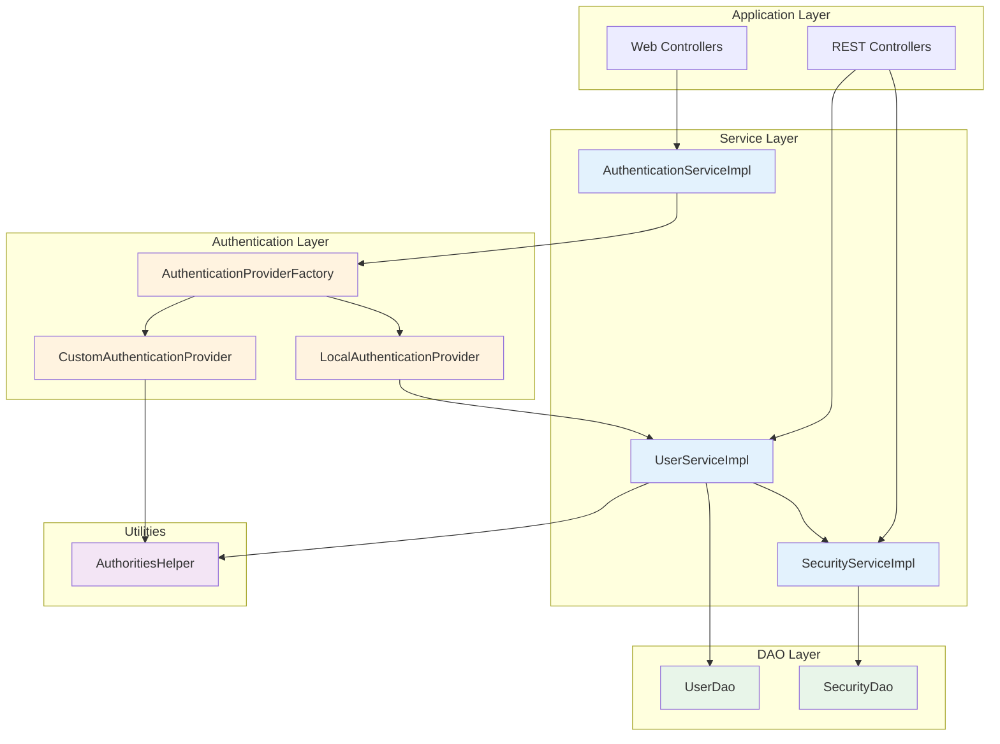
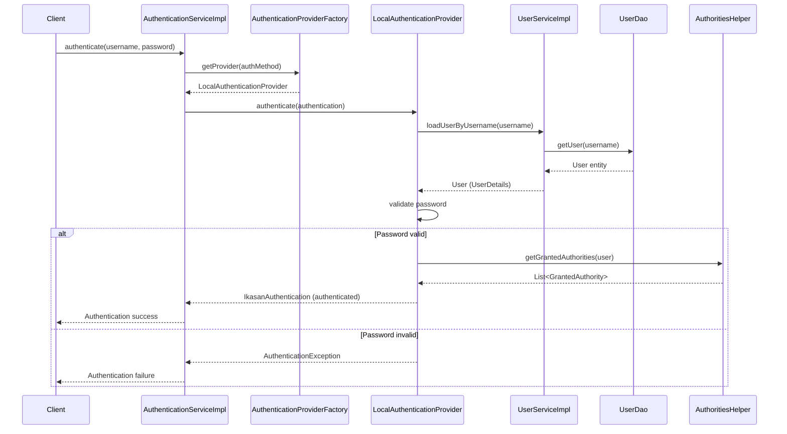
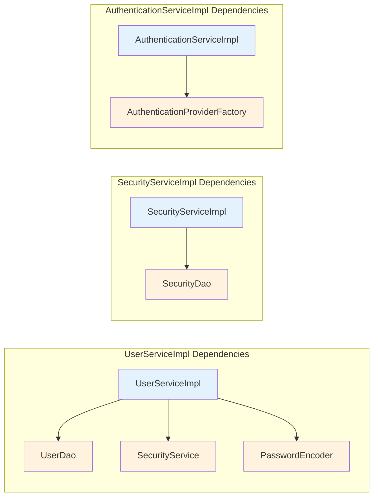
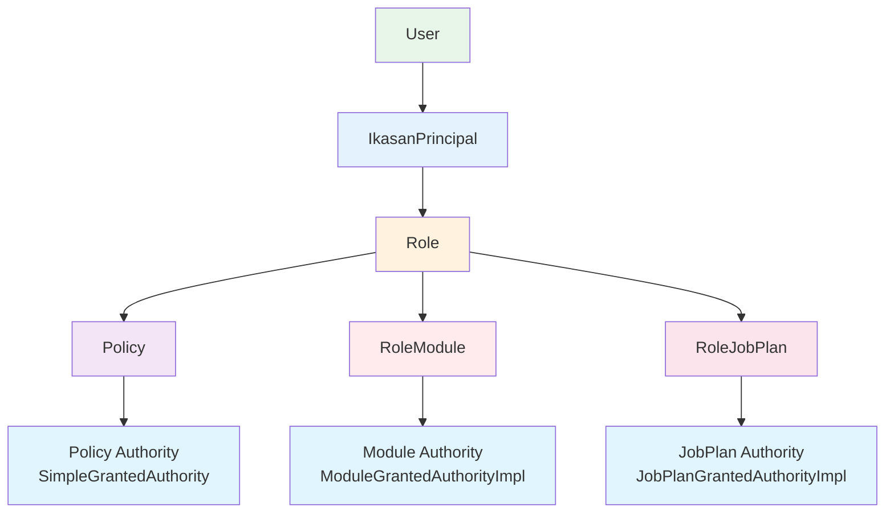
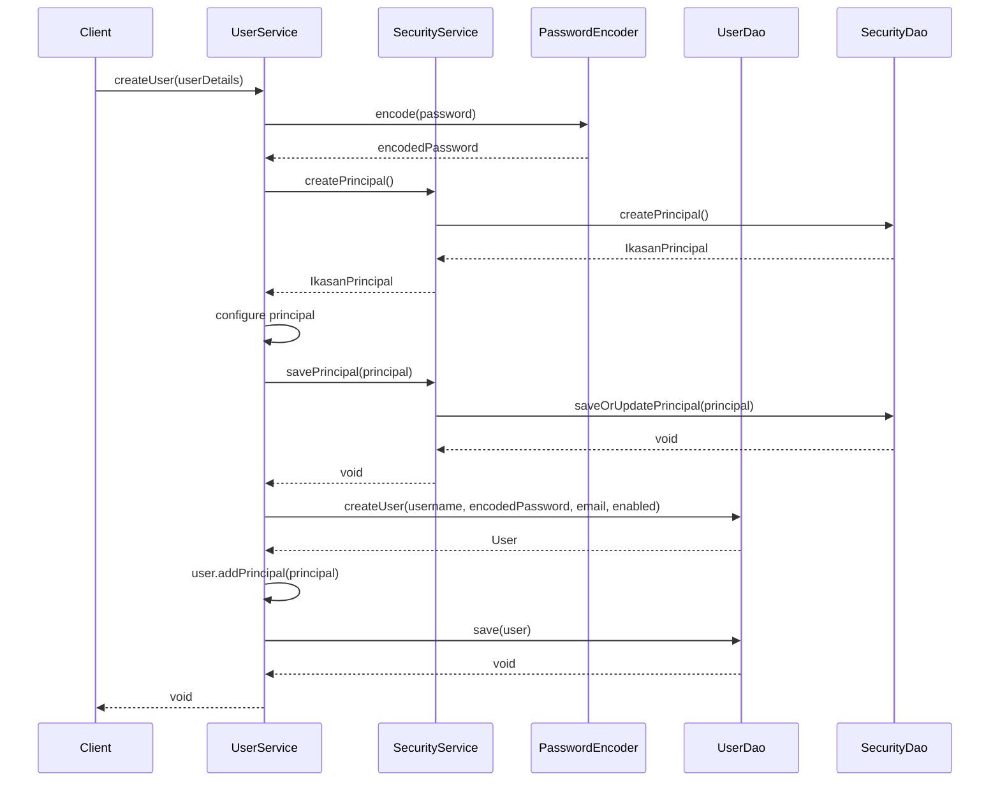

# Ikasan Security Service Module

## Overview

The security-service module provides the core service layer implementations for the Ikasan security framework. It implements business logic for user management, security entity management, and authentication operations, serving as the bridge between the DAO layer and the application layer.

## Purpose

This module serves as:
- **Service Layer Implementation**: Implements SecurityService and UserService interfaces
- **Business Logic Container**: Encapsulates security-related business rules
- **Authentication Provider**: Provides custom authentication mechanisms
- **Transaction Boundary**: Defines transactional boundaries for security operations
- **DAO Coordination**: Coordinates multiple DAO calls for complex operations

## Module Structure

```
ikasaneip/security/service/
├── src/main/java/org/ikasan/security/
│   ├── model/
│   │   ├── JobPlanGrantedAuthorityImpl.java   # Job plan authority
│   │   └── ModuleGrantedAuthorityImpl.java    # Module authority
│   ├── service/
│   │   ├── SecurityServiceImpl.java           # Security service implementation
│   │   ├── UserServiceImpl.java               # User service implementation
│   │   ├── AuthenticationServiceImpl.java     # Authentication service
│   │   └── authentication/
│   │       ├── AuthenticationProviderFactory.java     # Provider factory
│   │       ├── CustomAuthenticationProvider.java     # Custom auth provider
│   │       ├── LocalAuthenticationProvider.java      # Local auth provider
│   │       └── IkasanAuthentication.java             # Custom authentication
│   └── util/
│       └── AuthoritiesHelper.java             # Authority utilities
└── pom.xml
```

## Architecture

### Service Layer Architecture



### Authentication Flow



### Service Dependencies



## Key Components

### Service Implementations

#### SecurityServiceImpl

Implements `SecurityService` interface, providing business logic for security entity management.

**Dependencies:**
- `SecurityDao` - Data access for security entities

**Key Responsibilities:**
- Create, update, delete principals, roles, and policies
- Manage role-module and role-job-plan associations
- Query security entities with filtering
- Manage authentication methods

**Key Methods:**
```java
// Entity creation
public IkasanPrincipal createPrincipal()
public Role createRole()
public Policy createPolicy()
public RoleModule createRoleModule()
public RoleJobPlan createRoleJobPlan()

// Entity persistence
public void savePrincipal(IkasanPrincipal principal)
public void saveRole(Role role)
public void savePolicy(Policy policy)

// Entity retrieval
public IkasanPrincipal findPrincipalByName(String name)
public Role findRoleByName(String name)
public Policy findPolicyByName(String name)

// Entity deletion
public void deletePrincipal(IkasanPrincipal principal)
public void deleteRole(Role role)
public void deletePolicy(Policy policy)

// Complex operations
public void setJobPlanRoles(String jobPlanName, List<String> roleNames)
```

**Example Usage:**
```java
@Service
@Transactional
public class SecurityManager {

    private final SecurityService securityService;

    public Role createAdministratorRole() {
        // Create role
        Role role = securityService.createRole();
        role.setName("Administrator");
        role.setDescription("System administrator role");
        securityService.saveRole(role);

        // Create and assign policies
        Policy readPolicy = securityService.createPolicy();
        readPolicy.setName("READ_ALL");
        securityService.savePolicy(readPolicy);

        role.addPolicy(readPolicy);
        securityService.saveRole(role);

        return role;
    }
}
```

#### UserServiceImpl

Implements `UserService` interface, providing business logic for user account management.

**Dependencies:**
- `UserDao` - Data access for user entities
- `SecurityService` - Security entity management
- `PasswordEncoder` - Password encryption
- `boolean preventLocalAuthentication` - Local auth control flag

**Key Responsibilities:**
- Create, update, delete user accounts
- Enable/disable user accounts
- Manage user passwords
- Grant/revoke authorities
- Query users with filtering and pagination
- Load users for authentication

**Key Methods:**
```java
// User lifecycle
public void createUser(UserDetails userDetails)
public void updateUser(UserDetails userDetails)
public void deleteUser(String username)
public boolean userExists(String username)

// Account control
public void enableUser(String username)
public void disableUser(String username)

// Credential management
public void changeUsersPassword(String username, String newPassword, String confirmNewPassword)
public void changeUsersEmail(String username, String newEmail)

// Authority management
public void grantAuthority(String username, String authority)
public void revokeAuthority(String username, String authority)

// User retrieval
public User loadUserByUsername(String username)
public List<User> getUsers()
public List<UserLite> getUserLites(int limit, int offset)
public List<UserLite> getUsersWithRole(String roleName, UserFilter filter, int limit, int offset)

// User search
public List<User> getUserByUsernameLike(String username)
public List<User> getUserByFirstnameLike(String firstname)
public List<User> getUserBySurnameLike(String surname)
```

**Example Usage:**
```java
@Service
@Transactional
public class UserManager {

    private final UserService userService;
    private final SecurityService securityService;

    public void createAdministrator(String username, String password, String email) {
        // Create user
        User user = userService.createUser(username, password, email, true);
        user.setFirstName("Admin");
        user.setSurname("User");

        // Create principal
        IkasanPrincipal principal = securityService.createPrincipal();
        principal.setName(username);
        principal.setType("user");
        securityService.savePrincipal(principal);

        // Assign role
        Role adminRole = securityService.findRoleByName("Administrator");
        principal.addRole(adminRole);
        user.addPrincipal(principal);

        userService.updateUser(user);
    }
}
```

#### AuthenticationServiceImpl

Implements `AuthenticationService` interface, providing authentication coordination.

**Dependencies:**
- `AuthenticationProviderFactory` - Creates authentication providers

**Key Responsibilities:**
- Authenticate users using configured providers
- Manage authentication methods
- Coordinate multi-provider authentication

**Key Methods:**
```java
public boolean authenticate(String username, String password)
    throws AuthenticationServiceException

public List<AuthenticationMethod> getAuthenticationMethods()
```

**Example Usage:**
```java
@RestController
@RequestMapping("/api/auth")
public class AuthenticationController {

    private final AuthenticationService authService;

    @PostMapping("/login")
    public ResponseEntity<?> login(@RequestBody LoginRequest request) {
        try {
            boolean authenticated = authService.authenticate(
                request.getUsername(),
                request.getPassword()
            );

            if (authenticated) {
                return ResponseEntity.ok("Login successful");
            } else {
                return ResponseEntity.status(HttpStatus.UNAUTHORIZED)
                    .body("Invalid credentials");
            }
        } catch (AuthenticationServiceException e) {
            return ResponseEntity.status(HttpStatus.INTERNAL_SERVER_ERROR)
                .body("Authentication error");
        }
    }
}
```

### Authentication Components

#### AuthenticationProviderFactory

Factory interface for creating authentication providers based on authentication methods.

**Purpose:**
- Decouples authentication method configuration from provider implementation
- Enables multiple authentication strategies (local, LDAP, SSO)
- Allows runtime provider selection

**Interface:**
```java
public interface AuthenticationProviderFactory {
    AuthenticationProvider getProvider(AuthenticationMethod authenticationMethod);
}
```

#### LocalAuthenticationProvider

Spring Security authentication provider for local database authentication.

**Dependencies:**
- `UserService` - Load user details
- `PasswordEncoder` - Validate passwords

**Key Features:**
- Validates username and password against database
- Loads user authorities using `AuthoritiesHelper`
- Returns `IkasanAuthentication` on success
- Throws `AuthenticationException` on failure

**Authentication Process:**
```java
public Authentication authenticate(Authentication authentication) {
    String username = authentication.getName();
    String password = authentication.getCredentials().toString();

    // Load user
    User user = userService.loadUserByUsername(username);

    // Validate password
    if (!passwordEncoder.matches(password, user.getPassword())) {
        throw new BadCredentialsException("Invalid credentials");
    }

    // Build authorities
    List<GrantedAuthority> authorities = AuthoritiesHelper.getGrantedAuthorities(user);

    // Return authenticated token
    return new IkasanAuthentication(username, password, authorities, user);
}
```

#### CustomAuthenticationProvider

Extensible authentication provider for custom authentication mechanisms.

**Purpose:**
- Supports custom authentication logic
- Integrates with external authentication systems
- Allows application-specific authentication rules

#### IkasanAuthentication

Custom `Authentication` implementation that extends `UsernamePasswordAuthenticationToken`.

**Key Features:**
- Stores authenticated user object
- Contains granted authorities
- Integrates with Spring Security context

**Constructor:**
```java
public IkasanAuthentication(String principal, String credentials,
                            Collection<? extends GrantedAuthority> authorities,
                            User user) {
    super(principal, credentials, authorities);
    this.user = user;
    setAuthenticated(true);
}
```

### Utility Components

#### AuthoritiesHelper

Utility class for extracting Spring Security `GrantedAuthority` objects from Ikasan security model.

**Key Method:**
```java
public static List<GrantedAuthority> getGrantedAuthorities(User user) {
    List<GrantedAuthority> authorities = new ArrayList<>();

    for (IkasanPrincipal principal : user.getPrincipals()) {
        for (Role role : principal.getRoles()) {
            for (Policy policy : role.getPolicies()) {
                authorities.add(new SimpleGrantedAuthority(policy.getName()));
            }

            // Module authorities
            for (RoleModule roleModule : role.getRoleModules()) {
                authorities.add(new ModuleGrantedAuthorityImpl(
                    roleModule.getModuleName()
                ));
            }

            // Job plan authorities
            for (RoleJobPlan roleJobPlan : role.getRoleJobPlans()) {
                authorities.add(new JobPlanGrantedAuthorityImpl(
                    roleJobPlan.getJobPlanName()
                ));
            }
        }
    }

    return authorities;
}
```

**Authority Hierarchy:**


### Model Implementations

#### JobPlanGrantedAuthorityImpl

Represents a granted authority for accessing a specific job plan.

**Fields:**
- `String jobPlanName` - Name of the job plan

**Methods:**
```java
public String getAuthority() {
    return "JOBPLAN_" + jobPlanName;
}
```

#### ModuleGrantedAuthorityImpl

Represents a granted authority for accessing a specific module.

**Fields:**
- `String moduleName` - Name of the module

**Methods:**
```java
public String getAuthority() {
    return "MODULE_" + moduleName;
}
```

## Transaction Management

All service methods are designed to work within Spring-managed transactions:

```java
@Service
@Transactional
public class SecurityServiceImpl implements SecurityService {

    @Transactional(readOnly = true)
    public IkasanPrincipal findPrincipalByName(String name) {
        return this.securityDao.getPrincipalByName(name);
    }

    @Transactional
    public void savePrincipal(IkasanPrincipal principal) {
        this.securityDao.saveOrUpdatePrincipal(principal);
    }

    @Transactional
    public void setJobPlanRoles(String jobPlanName, List<String> roleNames) {
        // Delete existing associations
        this.securityDao.getRoleJobPlansByJobPlanName(jobPlanName)
            .forEach(roleJobPlan -> {
                Role role = this.getRoleById(roleJobPlan.getRole().getId());
                role.getRoleJobPlans().remove(roleJobPlan);
                this.saveRole(role);
                this.securityDao.deleteRoleJobPlan(roleJobPlan);
            });

        // Create new associations
        roleNames.forEach(roleName -> {
            Role role = this.securityDao.getRoleByName(roleName);
            if (role != null) {
                RoleJobPlan roleJobPlan = this.securityDao.createRoleJobPlan();
                roleJobPlan.setRole(role);
                roleJobPlan.setJobPlanName(jobPlanName);
                this.securityDao.saveRoleJobPlan(roleJobPlan);
            }
        });
    }
}
```

## User Creation Flow



## Security Configuration

### Password Encoding

```java
@Configuration
public class SecurityConfig {

    @Bean
    public PasswordEncoder passwordEncoder() {
        return new BCryptPasswordEncoder();
    }

    @Bean
    public UserService userService(UserDao userDao,
                                   SecurityService securityService,
                                   PasswordEncoder passwordEncoder) {
        return new UserServiceImpl(userDao, securityService, passwordEncoder, false);
    }
}
```

### Prevent Local Authentication

The `preventLocalAuthentication` flag disables local database authentication:

```java
public UserServiceImpl(UserDao userDao, SecurityService securityService,
                       PasswordEncoder passwordEncoder,
                       boolean preventLocalAuthentication) {
    this.userDao = userDao;
    this.securityService = securityService;
    this.passwordEncoder = passwordEncoder;
    this.preventLocalAuthentication = preventLocalAuthentication;
}

@Override
public User loadUserByUsername(String username) {
    if (this.preventLocalAuthentication) {
        throw new UsernameNotFoundException(
            "Local authentication disabled. Username: " + username
        );
    }
    // ... normal authentication logic
}
```

**Configuration:**
```properties
# Enable/disable local authentication
ikasan.security.local-auth.enabled=true
```

## Testing

The module includes comprehensive unit tests using JMock:

```java
public class SecurityServiceImplTest {

    private Mockery mockery = new Mockery() {{
        setImposteriser(ByteBuddyClassImposteriser.INSTANCE);
    }};

    private SecurityDao securityDao = mockery.mock(SecurityDao.class);
    private SecurityService securityService;

    @Before
    public void setUp() {
        securityService = new SecurityServiceImpl(securityDao);
    }

    @Test
    public void testCreatePrincipal() {
        final IkasanPrincipal principal = mockery.mock(IkasanPrincipal.class);

        mockery.checking(new Expectations() {{
            oneOf(securityDao).createPrincipal();
            will(returnValue(principal));
        }});

        IkasanPrincipal result = securityService.createPrincipal();

        assertEquals(principal, result);
        mockery.assertIsSatisfied();
    }
}
```

**Test Coverage:**
- SecurityServiceImpl: 80 test methods
- UserServiceImpl: 36 test methods
- AuthenticationServiceImpl: Covered in integration tests
- LocalAuthenticationProvider: Unit tested with mocks

## Dependencies

```xml
<dependencies>
    <!-- Ikasan Security Spec -->
    <dependency>
        <groupId>org.ikasan</groupId>
        <artifactId>ikasan-spec-service-security</artifactId>
    </dependency>

    <!-- Spring Security -->
    <dependency>
        <groupId>org.springframework.security</groupId>
        <artifactId>spring-security-core</artifactId>
    </dependency>

    <!-- Spring Context -->
    <dependency>
        <groupId>org.springframework</groupId>
        <artifactId>spring-context</artifactId>
    </dependency>

    <!-- SLF4J Logging -->
    <dependency>
        <groupId>org.slf4j</groupId>
        <artifactId>slf4j-api</artifactId>
    </dependency>
</dependencies>
```

## Best Practices

1. **Always use transactions**: All service methods should be transactional
2. **Password encoding**: Always encode passwords before storing
3. **Null validation**: Validate inputs for null before DAO calls
4. **Exception handling**: Throw appropriate exceptions for invalid operations
5. **Principal creation**: Always create and associate a principal with new users
6. **Authority helpers**: Use `AuthoritiesHelper` for consistent authority extraction
7. **Read-only transactions**: Use `@Transactional(readOnly = true)` for query methods
8. **Prevent local auth**: Configure `preventLocalAuthentication` based on deployment
9. **Complex operations**: Break complex operations into smaller transactional methods
10. **Logging**: Log security-sensitive operations for audit trails

## Version Information

- **Module**: ikasan-security-service
- **Parent**: ikasan-security
- **Group ID**: org.ikasan
- **Artifact ID**: ikasan-security-service
