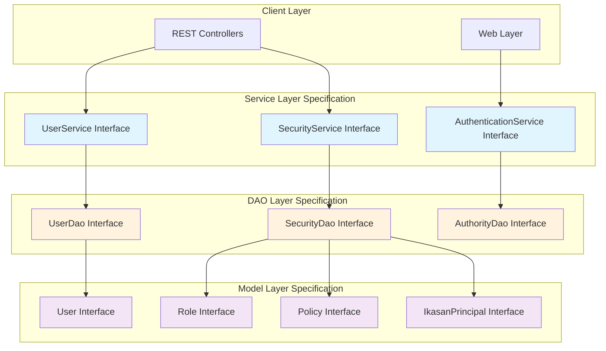
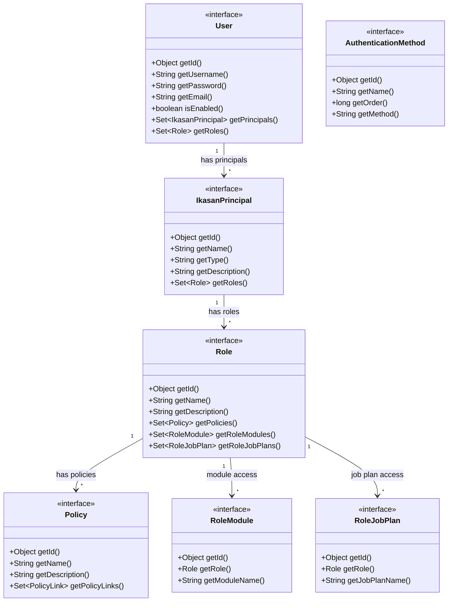
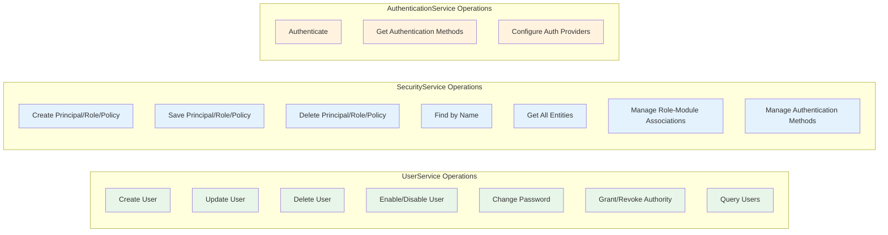
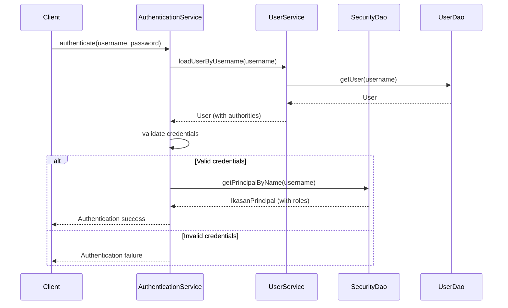
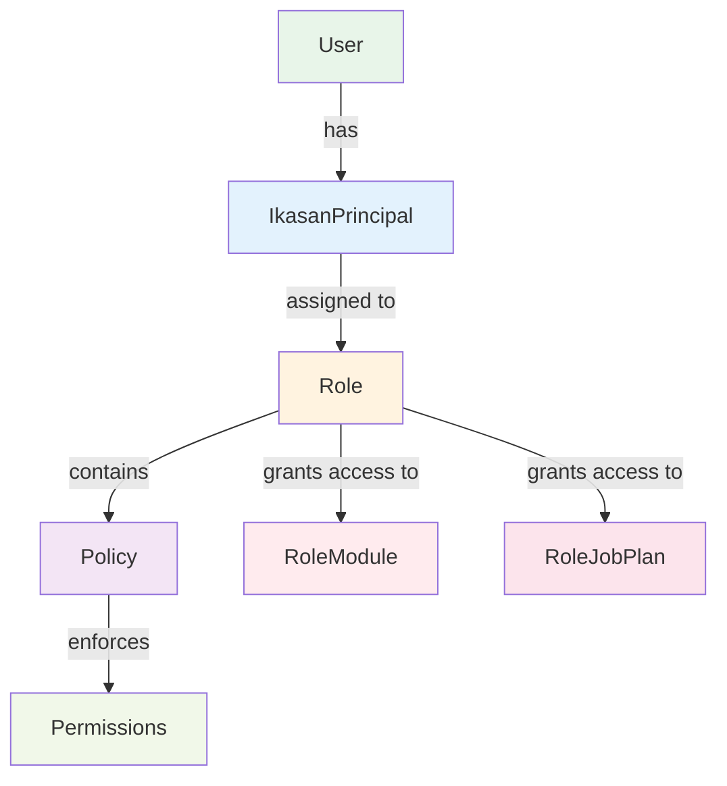

# Ikasan Security Specification Module

## Overview

This module defines the core security specification interfaces for the Ikasan Enterprise Integration Platform. It provides the contract layer that all security implementations must adhere to, establishing a consistent API for authentication, authorization, user management, and access control across the platform.

## Purpose

The security specification module serves as:
- **API Contract**: Defines interfaces that concrete implementations must implement
- **Type Definitions**: Provides model interfaces for security entities (User, Role, Policy, Principal)
- **DAO Contracts**: Specifies data access layer interfaces for persistence operations
- **Service Contracts**: Defines service-layer interfaces for security business logic
- **Decoupling Mechanism**: Enables multiple implementations (database, LDAP, REST) without coupling

## Module Structure

```
ikasaneip/spec/service/security/
├── src/main/java/org/ikasan/spec/security/
│   ├── dao/                          # Data Access Object interfaces
│   │   ├── AuthorityDao.java        # Authority persistence operations
│   │   ├── SecurityDao.java          # Security entity persistence
│   │   └── UserDao.java              # User persistence operations
│   ├── model/                        # Domain model interfaces
│   │   ├── AuthenticationMethod.java # Authentication configuration
│   │   ├── Authority.java            # Permission representation
│   │   ├── IkasanPrincipal.java     # Security principal
│   │   ├── IkasanPrincipalFilter.java # Principal query filter
│   │   ├── IkasanPrincipalLite.java # Lightweight principal
│   │   ├── JobPlanGrantedAuthority.java # Job plan permissions
│   │   ├── ModuleGrantedAuthority.java  # Module permissions
│   │   ├── Policy.java               # Authorization policy
│   │   ├── Role.java                 # User role
│   │   ├── RoleJobPlan.java         # Role-to-job-plan mapping
│   │   ├── RoleModule.java          # Role-to-module mapping
│   │   ├── User.java                 # User account
│   │   ├── UserFilter.java          # User query filter
│   │   ├── UserLite.java            # Lightweight user
│   │   └── constants/
│   │       └── SecurityConstants.java # Security constants
│   └── service/                      # Service interfaces
│       ├── AuthenticationService.java # Authentication operations
│       ├── AuthenticationServiceException.java
│       ├── SecurityService.java      # Security management
│       └── UserService.java          # User management
└── pom.xml
```

## Architecture

### Layered Architecture



### Security Model Relationships



### Service Layer Contracts



## Key Interfaces

### Service Interfaces

#### UserService
Manages user account lifecycle, credentials, and authorities.

**Key Operations:**
- `createUser(String username, String password, String email, boolean enabled)` - Create new user
- `loadUserByUsername(String username)` - Retrieve user for authentication
- `changeUsersPassword(String username, String newPassword, String confirmNewPassword)` - Password management
- `enableUser(String username)` / `disableUser(String username)` - Account status control
- `grantAuthority(String username, String authority)` - Assign permissions
- `getUsersWithRole(String roleName, UserFilter filter, int limit, int offset)` - Query users by role

#### SecurityService
Manages security entities (principals, roles, policies) and their relationships.

**Key Operations:**
- `createPrincipal()` / `createRole()` / `createPolicy()` - Entity factory methods
- `savePrincipal(IkasanPrincipal)` / `saveRole(Role)` / `savePolicy(Policy)` - Persistence
- `findPrincipalByName(String)` / `findRoleByName(String)` / `findPolicyByName(String)` - Lookups
- `getAllPrincipals()` / `getAllRoles()` / `getAllPolicies()` - Retrieval
- `setJobPlanRoles(String jobPlanName, List<String> roleNames)` - Associate roles with job plans

#### AuthenticationService
Handles authentication operations and provider configuration.

**Key Operations:**
- `authenticate(String username, String password)` - Authenticate credentials
- `getAuthenticationMethods()` - Retrieve configured authentication methods

### DAO Interfaces

#### SecurityDao
Provides persistence operations for security entities.

**Key Methods:**
- Entity creation: `createPrincipal()`, `createRole()`, `createPolicy()`
- Persistence: `saveOrUpdatePrincipal()`, `saveOrUpdateRole()`, `saveOrUpdatePolicy()`
- Deletion: `deletePrincipal()`, `deleteRole()`, `deletePolicy()`
- Queries: `getPrincipalByName()`, `getRoleByName()`, `getPolicyByName()`
- Filtering: `getPrincipals(IkasanPrincipalFilter, int, int)`

#### UserDao
Provides persistence operations for user accounts.

**Key Methods:**
- `createUser(String username, String password, String email, boolean enabled)` - Create user
- `getUser(String username)` - Retrieve user by username
- `save(User user)` - Persist user changes
- `delete(User user)` - Remove user
- `getUsersWithRole(String roleName, UserFilter, int, int)` - Query by role
- `getUserByUsernameLike(String username)` - Search users

### Model Interfaces

All model interfaces follow a consistent pattern:
- `Object getId()` / `void setId(Object id)` - Universal ID handling
- Domain-specific getters and setters
- Collection accessors for relationships

**Key Model Entities:**
- **User**: Represents a user account with credentials and principals
- **IkasanPrincipal**: Security principal (user or application entity)
- **Role**: Grouping of policies assigned to principals
- **Policy**: Fine-grained permission
- **AuthenticationMethod**: Configuration for authentication providers

## Design Principles

### 1. Interface Segregation
Separate interfaces for different concerns (DAO, Service, Model) ensure clean separation of responsibilities.

### 2. Object-Based IDs
All entities use `Object` type for IDs, enabling flexibility for different persistence mechanisms (Long for JPA, String for NoSQL, etc.).

### 3. Spring Security Integration
- `User extends UserDetails` for Spring Security authentication
- `UserService extends UserDetailsManager` for user management
- Compatible with Spring Security's authentication and authorization framework

### 4. Filter-Based Queries
`UserFilter` and `IkasanPrincipalFilter` enable complex queries with pagination support.

### 5. Lightweight DTOs
`UserLite` and `IkasanPrincipalLite` provide efficient data transfer for listing operations.

## Authentication Flow



## Authorization Model



## Usage Example

```java
// Service layer usage
public class SecurityManager {
    private final UserService userService;
    private final SecurityService securityService;

    public void createUserWithRole(String username, String password, String roleName) {
        // Create user
        User user = userService.createUser(username, password,
            username + "@example.com", true);

        // Create principal
        IkasanPrincipal principal = securityService.createPrincipal();
        principal.setName(username);
        principal.setType("user");
        securityService.savePrincipal(principal);

        // Assign role
        Role role = securityService.findRoleByName(roleName);
        principal.addRole(role);
        user.addPrincipal(principal);

        userService.updateUser(user);
    }
}
```

## Dependencies

This module has minimal dependencies:
- **Spring Security Core**: For `UserDetails`, `UserDetailsManager`, `GrantedAuthority`
- **Spring DAO Support**: For `DataAccessException`
- **Java Standard Library**: No additional external dependencies

## Implementation Modules

This specification is implemented by:
- **ikasan-security-db**: Hibernate/JPA database implementation
- **ikasan-security-service**: Service layer implementations
- **ikasan-security-rest**: REST API model implementations
- **ikasan-security-ldap**: LDAP authentication integration

## Best Practices

1. **Always implement all interface methods**: Ensure complete contract fulfillment
2. **Use filters for queries**: Leverage `UserFilter` and `IkasanPrincipalFilter` for flexible queries
3. **Handle nulls appropriately**: DAO methods may return `null` for not-found scenarios
4. **Implement proper exception handling**: Use `UsernameNotFoundException`, `DataAccessException`
5. **Maintain transactional boundaries**: Service layer should manage transactions
6. **Validate inputs**: Check for null/empty values before persistence operations
7. **Use lightweight entities for listings**: Prefer `UserLite` and `IkasanPrincipalLite` for large result sets

## Version Information

- **Module**: ikasan-spec-service-security
- **Parent**: ikasan-spec-service
- **Group ID**: org.ikasan
- **Artifact ID**: ikasan-spec-service-security
