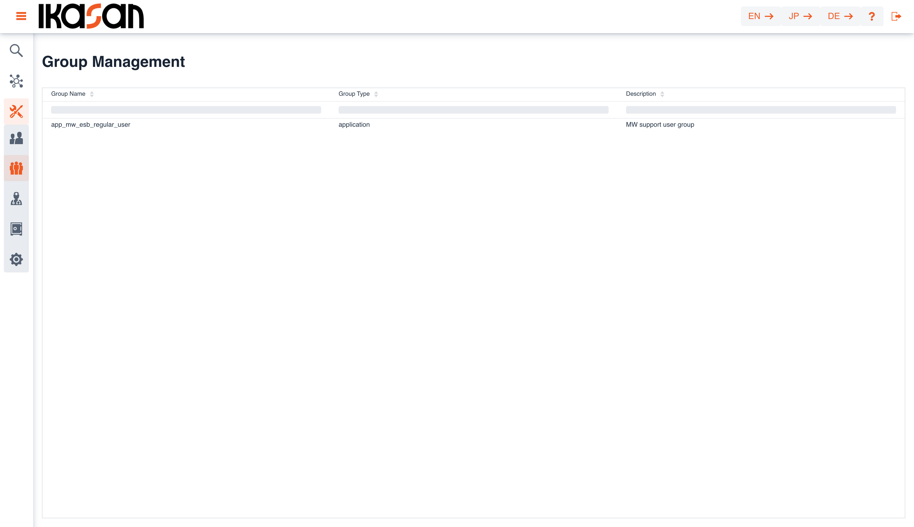
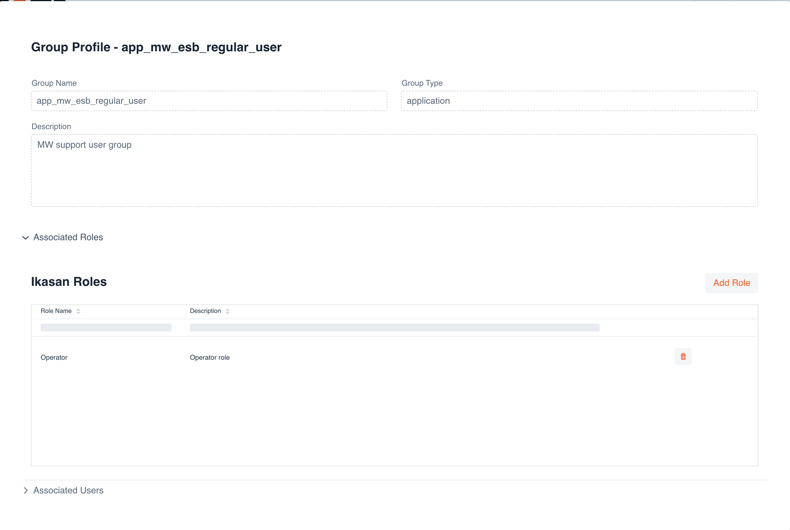
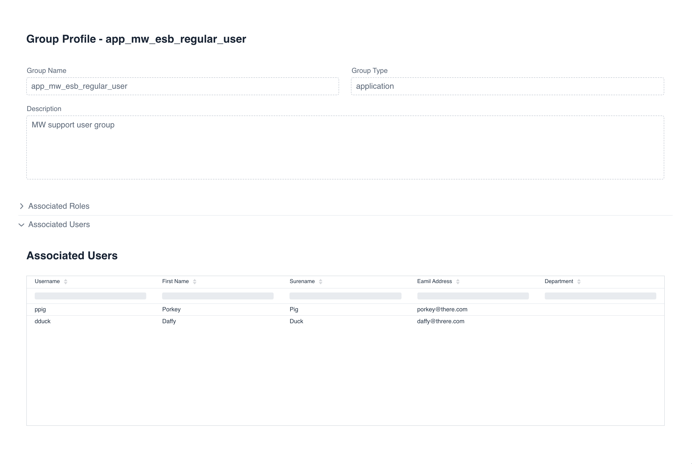

# Ikasan Visualisation Dashboard Security - Group Management
A 'Group' within the Ikasan security model is a direct mapping to an 'Active Directory' or 'LDAP' group. If Ikasan is configured against LDAP, 'Groups' will be populated within Ikasan as part of the 'Synchronisation' process with LDAP. This feature allows 'Roles' to be added to a 'Group', which subsequently assgns that 'Role' to all users who are part of that 'LDAP' group.

## Viewing Groups
The 'Group' search view can be navigated to from the left hand menu in the Ikasan dashboard. This view provides sortable and filterable grid containing all 'Groups'. It is not possible to remove a 'Group' as these are LDAP entities. Subsequent synchronisations against the LDAP repository will add and remove 'Groups' from this view as the changes within 'LDAP'. 

## Managing Groups
By double clicking on the a 'Group' in the above grid, users will be presented with the 'Group Management' screen. This screen contains 3 distinct sections:
- Details of the 'Group'
- Roles assigned to the 'Group'
- Users associated with the 'Group'

### Assigning Roles to Groups
It is possible to assing a 'Role' to a 'Group'. By pressing the 'Add Role' button seen on the screen above, the user will be presented with a dialog containing all 'Roles' that can be assigned to the 'Group'. Double click on the desired 'Role' and this will be added to the 'Group'. 'Roles' can also be removed from a 'Group' by clickin on the trash can icon in in the 'Associated Groups' view above.

### Associated Users
The 'Group Management' screen also provides a view on the 'Users' associated with a 'Group'. This relationship in not managable from within the Ikasan dashboard, as this relationship in managed in LDAP. The view is provided for informational purposes only.

