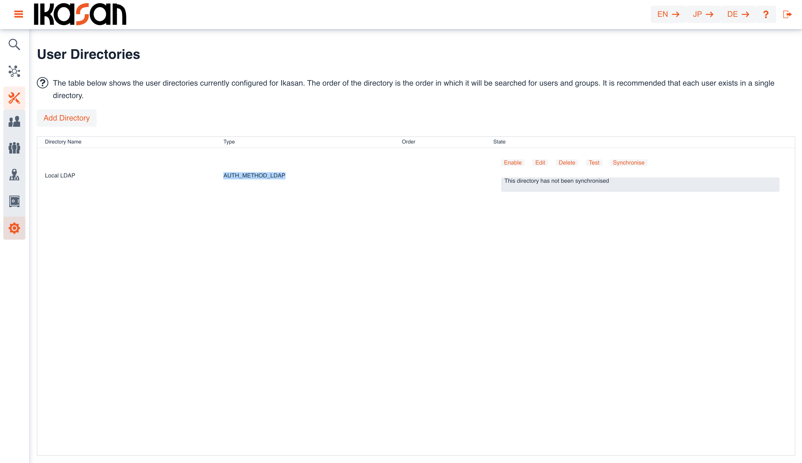
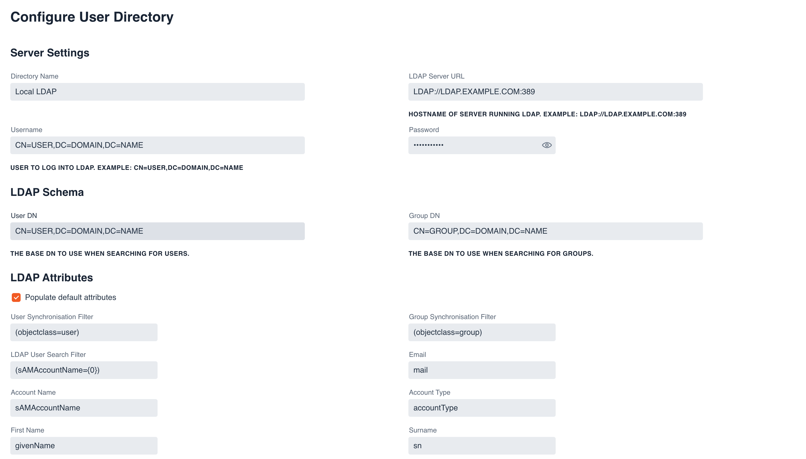

# Ikasan Visualisation Dashboard Security - LDAP Management

## Introduction
LDAP (Lightweight Directory Access Protocol) is a type of software that helps computers and other devices share information about 
users and resources, such as printers or files. Think of it like a phonebook or directory for computer systems.

In more technical terms, LDAP is a protocol used to access and manage information stored in a centralized database, called a 
directory. This directory contains information about users, groups, and resources within an organization, and LDAP allows 
applications and devices to access this information quickly and efficiently.

For example, when you log into a computer or application, LDAP can be used to check your username and password against the 
directory to verify your identity and determine what resources you have access to. It can also be used to manage user accounts
, such as creating or deleting accounts, resetting passwords, and assigning permissions.

Overall, LDAP is an important tool for managing user authentication and access control in complex IT environments.

## Ikasan and LDAP
It is possible to configure Ikasan to delegate to LDAP for authorisation, as well as synchronise users and groups against LDAP 
directories. This allows Ikasan to leverage enterprise management of user and group assignments which can then be associated 
with Ikasan 'Roles'. Once a group is assigned an Ikasan 'Role', it can be left to external IT teams to manage the enterprise 
security and simply manage access and authorisation to Ikasan by assigning a given LDAP users, an LDAP group.

### Managing LDAP Directory Configurations
The 'LDAP Directory Management' screen can be navigated to from the left hand menu in the Ikasan dashboard. This screen provides a grid containing all 'LDAP Directory Configurations'. There are a number of actions that can be performed against an 'LDAP Directory':

- Enable/Disable :- enable/disable authorisation against this LDAP server.
- Edit :- edit the configuration.
- Delete :- delete the configuration.
- Test :- test the validity of the configuration. Confirm that the connection to the LDAP server is successful.
- Synchronise :- this synchronises the local database with the underlying LDAP repository.

If there are multiple directories configured, is it also possible to order the directories in which the user validation will be attempted against. 

New configurations can be added by pressing the 'Add Directory' button.

### Configuring an LDAP Directory

When editing or creating a new configuration, the user will be presented with the following screen. All feilds are mandatory, however the majority of fields on the configuration screen can use the provided default values.

It is possible to schedule the synchronisation of LDAP repositories to run automatically as seen below. The cron expression must be a valid [quartz](http://www.quartz-scheduler.org/documentation/quartz-2.3.0/tutorials/crontrigger.html) expression.
 

