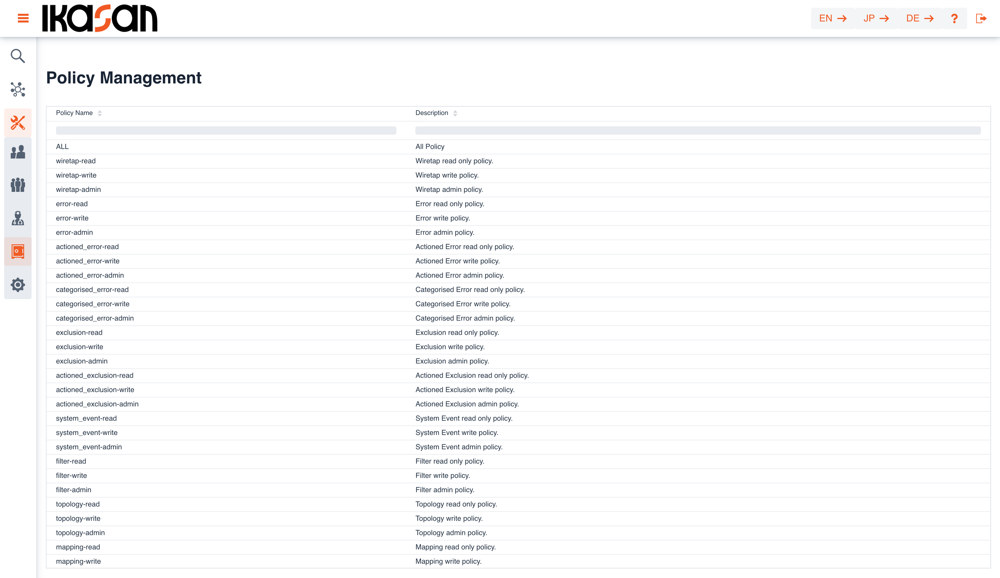

# Ikasan Visualisation Dashboard Security - Policy Management
The 'Policy Management' screen provides the ability for users to be able to view and administer all 'Policies' within Ikasan. From this screen users can perform the following tasks:
- Associate 'Policies' with 'Roles'

## Viewing Policies
The 'Policy' search view can be navigated to from the left hand menu in the Ikasan dashboard. This view provides a sortable and filterable grid containing all 'Policies'. It is not possible to remove a 'Policy' as these are fixed Ikasan entities.

## Managing Policies
By double clicking on the a 'Policy' in the above grid, users will be presented with the 'Policy Management' screen. This screen contains 2 distinct sections:

- Details of the 'Policy'
- 'Roles' that the 'Policy' is associated with

## Associating Policies with Roles
It is possible to associate a 'Policy' with a 'Role'. By pressing the 'Associate policy with role' button seen on the screen above, the user will be presented with a dialog containing all 'Policies' that can be assigned to the 'Role'. Double click on the desired 'Policy' and this will associated with the 'Role'. 'Policies' can also be dissociated from a 'Role' by clicking on the trash can icon in in the 'Ikasan Roles' grid above.

