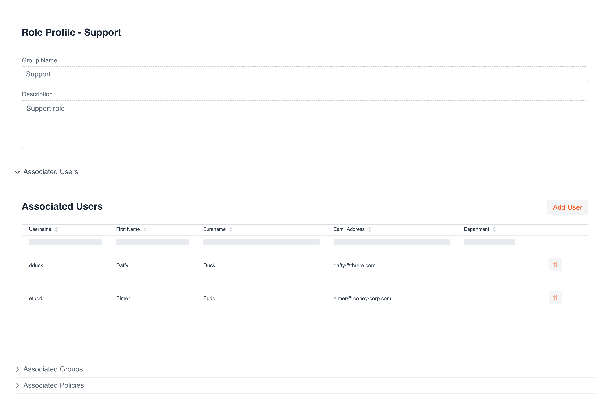

# Ikasan Visualisation Dashboard Security - Role Management
The 'Role Management' screen provides the ability for users to be able to view and administer all 'Roles' within Ikasan. From this screen users can perform the following tasks:
- Add and remove 'Roles'
- Assign and unassign 'Roles' to/from 'Users' and 'Groups'
- Assign and unassign 'Policies' to/from 'Roles'
- Assign and unassign 'Integration Modules' to/from 'Roles'

## Viewing Groups
The 'Role' search view can be navigated to from the left hand menu in the Ikasan dashboard. This view provides sortable and filterable grid containing all 'Roles'. From this screen users can remove 'Roles' by clicking on the trash can icon in the grid. 

New 'Roles' can be added by clicking on the '+' icon in the top right hand corner of the screen. When this '+' icon is clicked the user will be presented with the 'New Role' dialog.  

