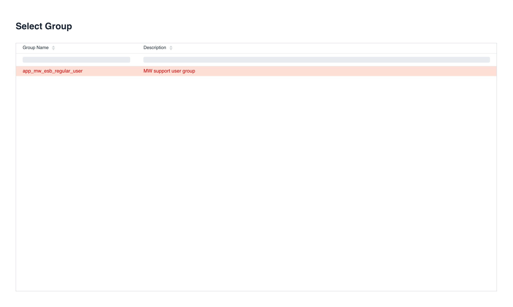

     

# Ikasan Visualisation Dashboard Security - Role Management
The 'Role Management' screen provides the ability for users to be able to view and administer all 'Roles' within Ikasan. From this screen users can perform the following tasks:
- Add and remove 'Roles'
- Assign and unassign 'Roles' to/from 'Users' and 'Groups'
- Assign and unassign 'Policies' to/from 'Roles'
- Assign and unassign 'Integration Modules' to/from 'Roles'

## Viewing Groups
The 'Role' search view can be navigated to from the left hand menu in the Ikasan dashboard. This view provides a sortable and filterable grid containing all 'Roles'. From this screen users can remove 'Roles' by clicking on the trash can icon in the grid. 

New 'Roles' can be added by clicking on the '+' icon in the top right hand corner of the screen. When this '+' icon is clicked the user will be presented with the 'New Role' dialog. Name and Description are required fields.

## Managing Roles
By double clicking on the a 'Role' in the above grid, users will be presented with the 'Role Management' screen. This screen contains 5 distinct sections:

- Details of the 'Role'
- 'Users' who have been assigned the 'Role'
- 'Groups' who have been assigned the 'Role'
- 'Policies' associated with the 'Role'
- 'Integration Modules' associated with the 'Role'

### Associated Users
The 'Associated Users' section of the 'Role Management' screen provides a view of all 'Users' who have been assigned the 'Role'. The grid can be sorted and filtered in order to narrow the 'Users'. The 'Role' can be removed from a given 'User' by clicking on the trash can item in the 'User' grid. 

### Assigning Roles to Users
The 'Role' can also be assigned to a 'User' by clicking on the 'Add User' button. The user will be presented with the 'Select User' dialog from where the 'User' is selected. It is possible to filter and sort the user grid, in order to narrow the desired 'User'. Once the desired 'User' is found, double click on this 'User' and they will be assigned the 'Role'.

### Associated Groups
The 'Associated Groups' section of the 'Role Management' screen provides a view of all 'Groups' that have been assigned the 'Role'. The grid can be sorted and filtered in order to narrow the 'Groups'. The 'Role' can be removed from a given 'Group' by clicking on the trash can item in the 'Group' grid. 

### Assigning Roles to Groups
The 'Role' can also be assigned to a 'Group' by clicking on the 'Add Group' button. The user will be presented with the 'Select Group' dialog from where the 'Group'  is selected. It is possible to filter and sort the group grid, in order to narrow the desired 'Group'. Once the desired 'Group' is found, double click on this 'Group' and the 'Role' will be assigned to the 'Group'.

### Associated Policies
'Policies' are the fine grained items that provide access to an element of Ikasan functionality. 'Policies' are assigned to 'Roles' in order for that 'Role' to have the particular funcationality available to it. The 'Associated Policies' section of the 'Role Management' screen provides a view of all 'Policies' that have been assigned to the 'Role'. The grid can be sorted and filtered in order to narrow the 'Policies'. The 'Policy' can be removed from the 'Role' by clicking on the trash can item in the 'Policy' grid. 

### Assigning Policies to Roles
A 'Policy' can also be assigned to the 'Role' by clicking on the 'Add Policy' button. The user will be presented with the 'Select Policy' dialog from where the 'Policy' is selected. It is possible to filter and sort the policy grid, in order to narrow the desired 'Policy'. Once the desired 'Policy' is found, double click on this 'Policy' and it will be assigned to the 'Role'.

### Associated Integration Modules
It is possible to define the 'Integration Modules' that are associated with a 'Role'. Users will only have access to the 'Integration Modules' that have been associated with the 'Role'. The 'Associated Integration Modules' section of the 'Role Management' screen provides a view of all 'Integration Modules' that have been assigned to the 'Role'. The grid can be sorted and filtered in order to narrow the 'Integration Modules'. The 'Integration Module' can be removed from the 'Role' by clicking on the trash can item in the 'Integration Modules' grid.

### Assigning Integration Modules to Roles
An 'Integration Module' can also be assigned to the 'Role' by clicking on the 'Add Integration Module' button. The user will be presented with the 'Select Integration Module' dialog from where the 'Integration Module' is selected. It is possible to filter and sort the integration module grid, in order to narrow the desired 'Integration Module'. Once the desired 'Integration Module' is found, double click on this 'Integration Module' and it will be assigned to the 'Role'
.

