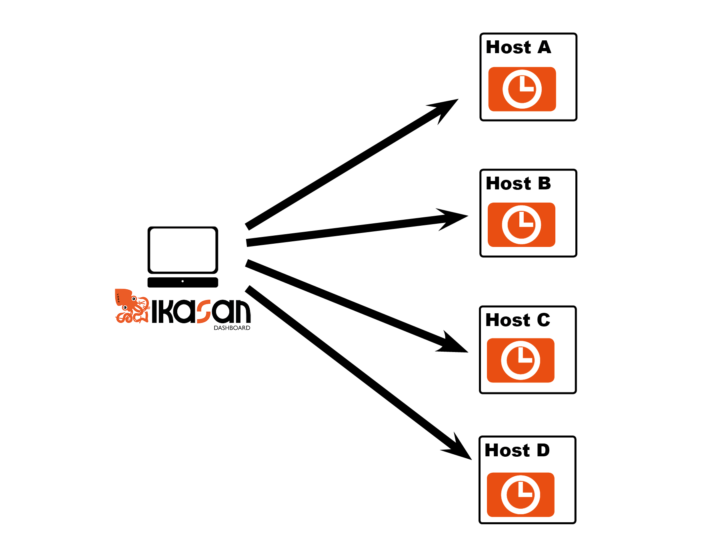
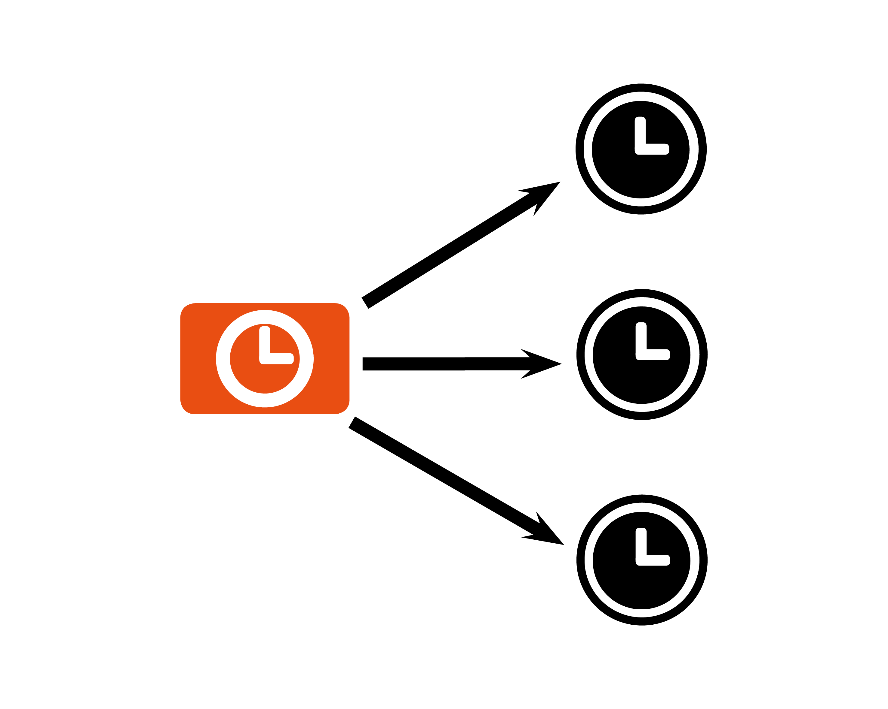
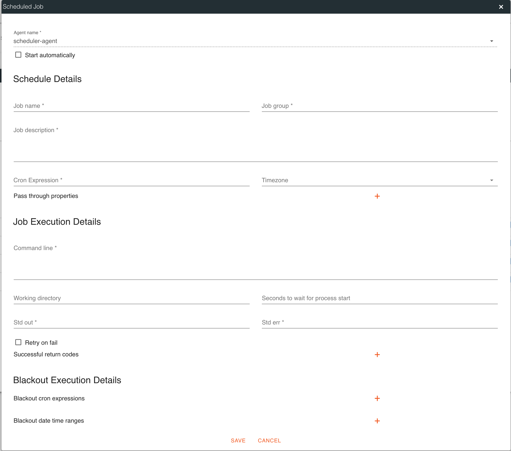
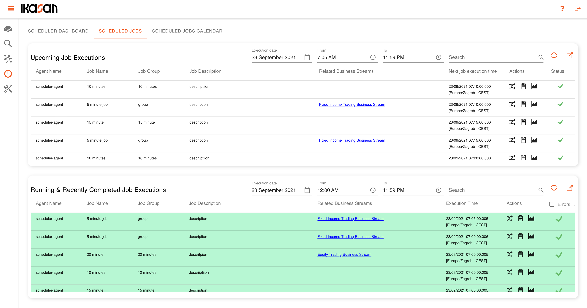
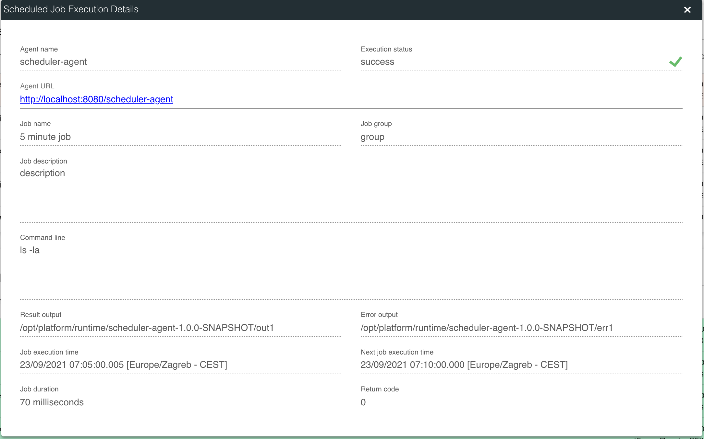
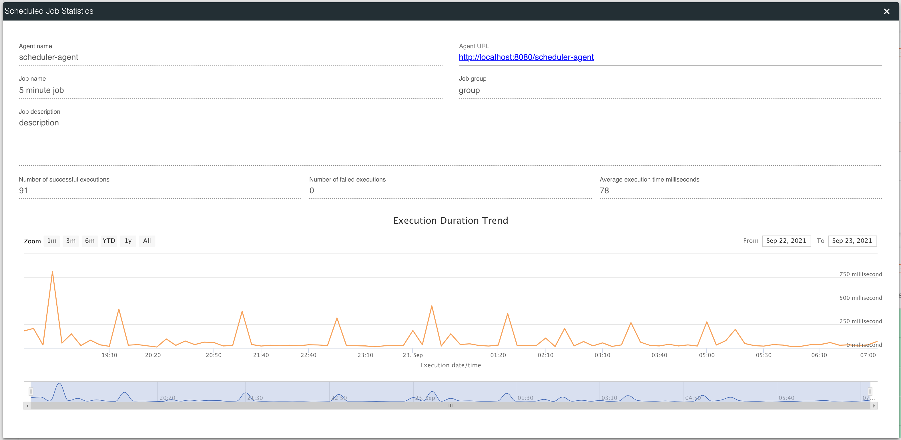

# Scheduler Agents
Version 3.2.0 of Ikasan has seen the introduction of a new bundled fully fledged Ikasan Module that fulfils the role of an enterprise scheduler. This
is the first zero code offering of the Ikasan platform. 

All scheduler agents are managed from the Ikasan dashboard as seen below. In a typical deployment a single Scheduler Agent module is deployed on a 
per host basis. The Scheduler Agent advertises itself to the Ikasan Dashboard when initially started and from this point onwards the agent becomes 
manageable from the dashboard.

The diagram below provides a conceptual view of a single agent per host. 

Each agent is responsible for managing any number of scheduled jobs. 

### Scheduler Dashboard
Upon navigating to the scheduler view, users are presented with the Scheduler Dashboard. The scheduler dashboard provides a view onto all Scheduler Agents as well as the status of all running jobs. In order to manage a Scheduler Agent, the user must double click on the table row for the desired Scheduler Agent.

The user is presented with the Scheduler Agent Management Dialog. This dialog contains details of the Scheduled Agent along with a list of jobs associated with the agent. The status of the job along with various controls relating to the job are presented. In the top right corner of the dialog is a plus icon that is clicked in order to create a new job. 

### Creating a New Scheduled Job
Once the user has clicked the plus icon, the New Scheduled Job dialog is presented to the user.

The following configuration values are required to create a new job.

| Configuration Field | Description  | Sample Value | Mandatory |
| ---  | --- | --- | --- |
| Agent name  | This field is prepopulated based on the agent that the new job will be associated with. | N/A | Y |
| Start automatically  | Checkbox to indicate if the job short start automatically when created and when agent restarts occur. The job will still obey the configured cron expression. It is recommended to set the job to start automatically. | N/A | N |
| Job name | The name of the job registered with scheduler. | "My Job" | Y |
| Job group | The group of the job registered with scheduler. | "My Job Group" | Y |
| Job description | A meaninful description of the job. | "This is my first scheduled job. It makes it easier for my collegues if I contain lots of detail." | Y |
| Cron expression | A valid quartz cron expression. See http://www.quartz-scheduler.org/ for more details. | 0 0/15 * * * ? | Y |
| Timezone| The timezone within which the schedule should operate. Note this value will default to the timezone of the host that the scheduler agent is running on. | Europe/Paris (UTC+02:00) | N |
| Pass through properties| A list of name/value pairs that are passed to the job being executed. | "key", "value" | N |
| Command line| This is the command that will be executed by the scheduled job. | ls -la | Y |
| Working directory| This is the directory from which the job will be executed. This will default to the root directory of the scheduler agent if not set. | /opt/platform/jobs | N |
| Seconds to wait for process to start | A delay between when the schedule fires and the command line is executed. | 10 | N |
| Std out| The directory where the standard out from the executed command line will be written. | /opt/platfrom/jobs/stdout | Y |
| Std err| The directory where the standard err from the executed command line will be written. | /opt/platfrom/jobs/stderr | Y |
| Successful return codes| A list of return codes that are returned by the process upon sucessful completion. | 5,100,200 | N |
| Blackout cron expressions| A list of cron expressions that represent windows within which the job will not be executed. | 0 0 17-23 * * ? | N |
| Blackout date time ranges| A list of date time pairs that represent windows within which the job will not be executed. | N/A | N |

### Job Controls

Each job has a series of controls:
1. Edit the job
2. Delete the job
3. Job statistics
4. Job running state control
5. And the rocket ship to fire the job immediately

### Scheduled Job Tab
The scheduled jobs tab contains details of running and recently completed jobs along with upcoming jobs. Both result tables can be filtered and the date ranges changed in order to provide an appropiate view. The tables can be expanded to provide full screen views. Each line item provides the opportunity to inspect the job execution details, the job configuration and statistics relating to the job.  

### Scheduled Job Execution Details 

### Scheduled Job Statistics

