# Ikasan Visualisation Dashboard Security - Search
The Ikasan Dashboard provides a search feature that allows for users to search the following events types:

- [Wiretaps Event](../../wiretap) 
- [Replay Events](../../replay)
- [Hospital Events](../../hospital) 
- [Error Events](../../error-reporting)

## Search Form
The search form provides the oportunity to simple set of search criteria including:
- Start Date and Time
- End Date and Time
- Search Term
- Entity Type
- The opportunity to negate the search term

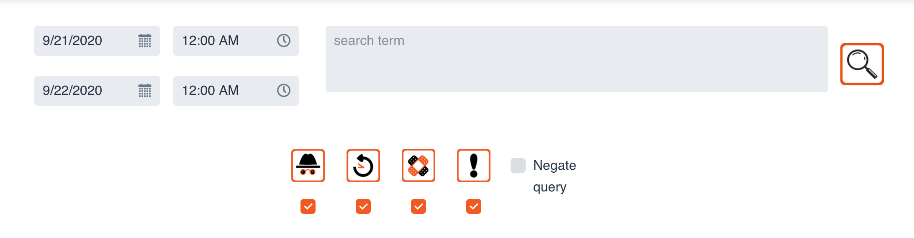

The search term can be a very simple term such as a trade identifier or a life identifier, or it can be a complex query that conforms to the [Solr Query Syntax](https://lucene.apache.org/solr/guide/8_5/the-standard-query-parser.html). The query will be applied to all fields on the entity.
Multiple entities can be selected for the same search. All searches are executed by clicking the magnifying glass.

### Wiretap Search
As with all searches, the results will be presented in the search results grid. The events can be filtered by the 'Module Name', 'Flow Name', 'Component Name' and 'Event Id/Error Uri'. Those same fields along with the 'Timestamp' can also be sorted.

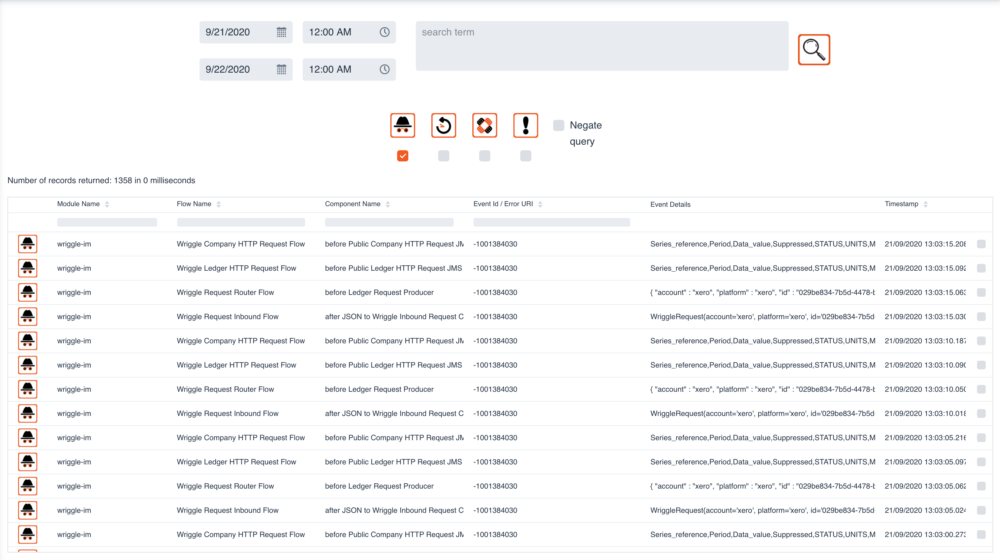

All rows within the above search result can be double clicked in order to open the 'Wiretap Event Details' screen. It provides the following information:
- The event coordinates ('Module Name', 'Flow Name', 'Component Name')
- The 'Event Life Identifier'
- The Date and Time of the event with millisecond precision.
- The contents (payload) of the event.

It is possible to download the payload by clicking the download button.

### Replay Search
An exclusive 'Replay Search' will provide all search results in the grid as seen below. 

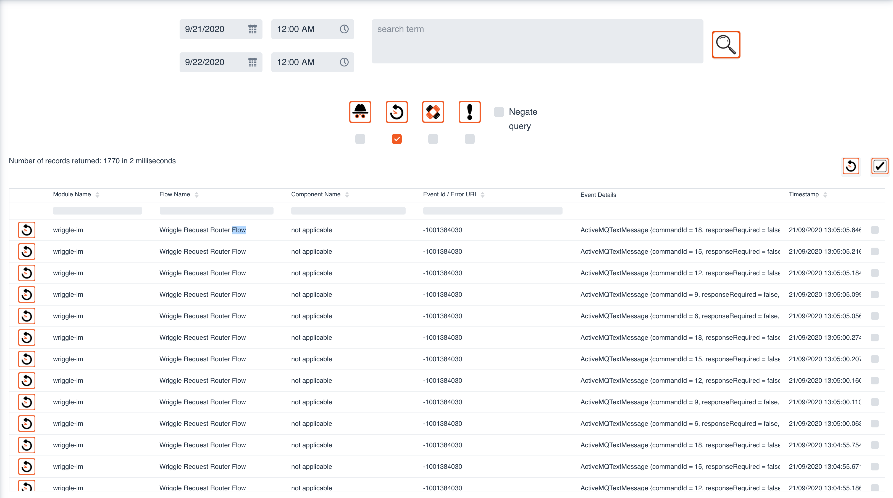

There are 2 other controls that appear on the search results grid.

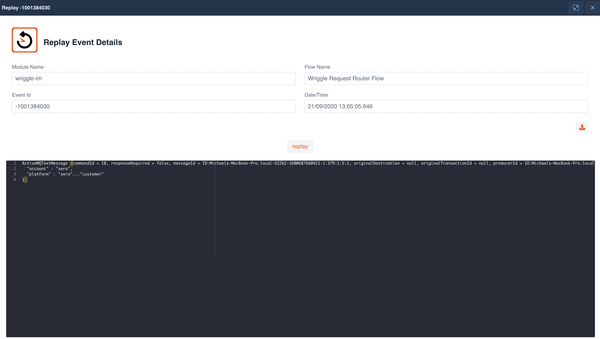

### Exclusion Search

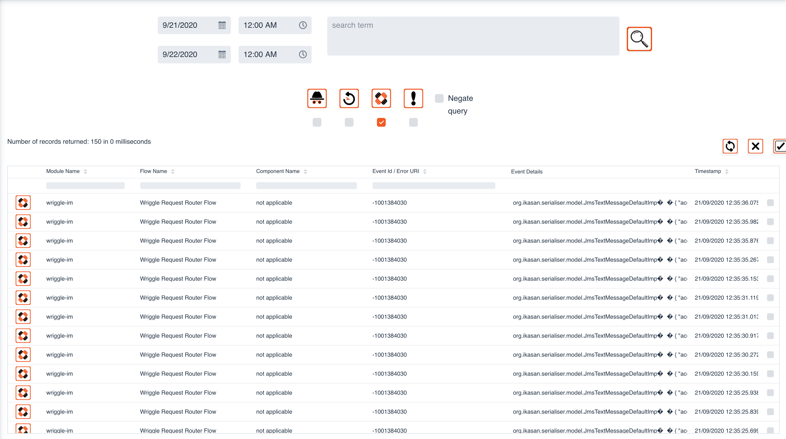

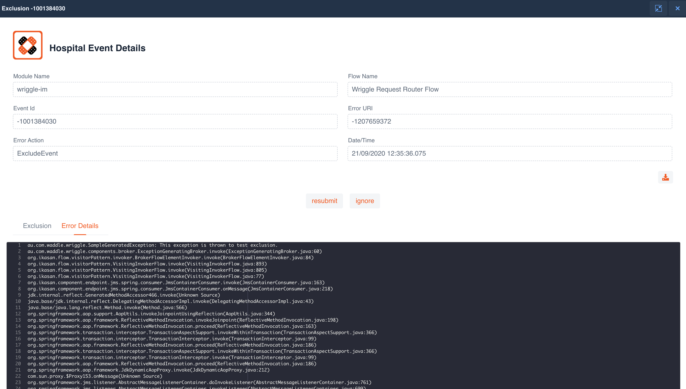

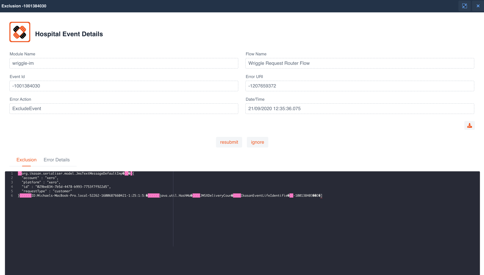

### Exclusion Search

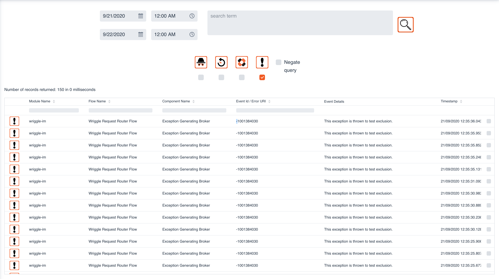

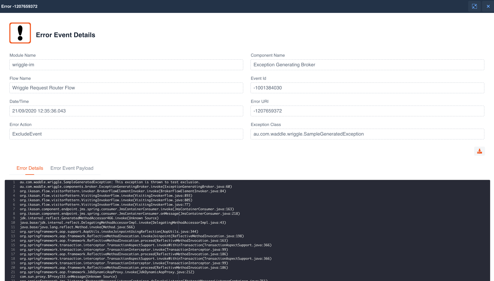

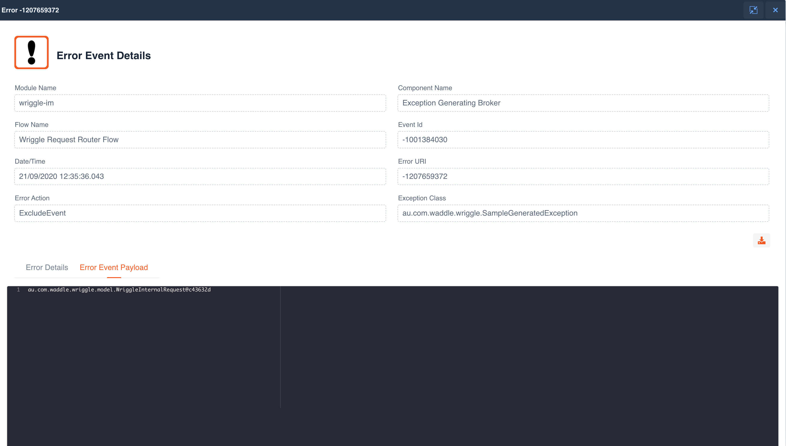

### Visualisation Screen Search

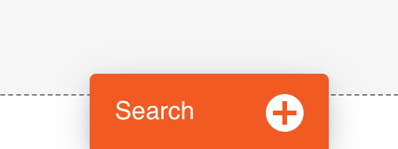

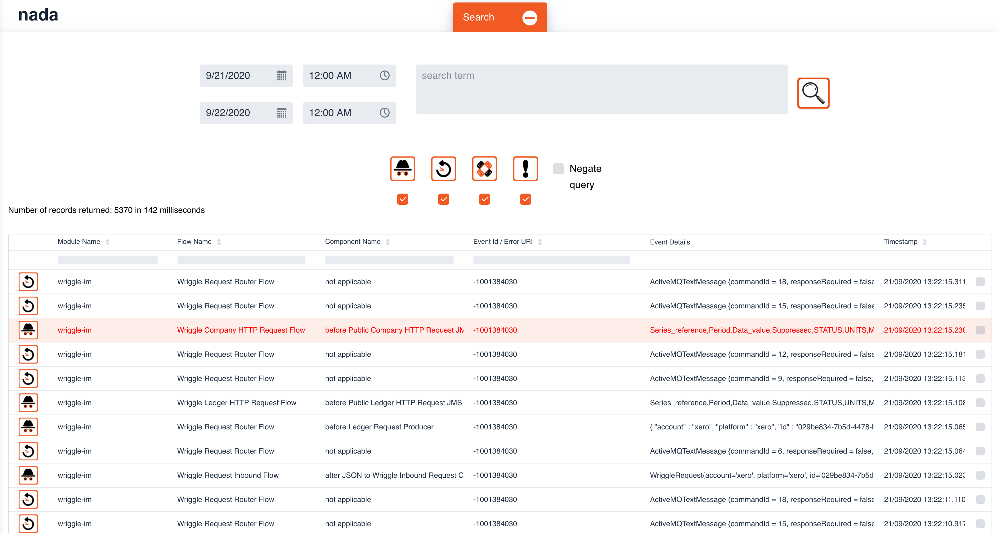

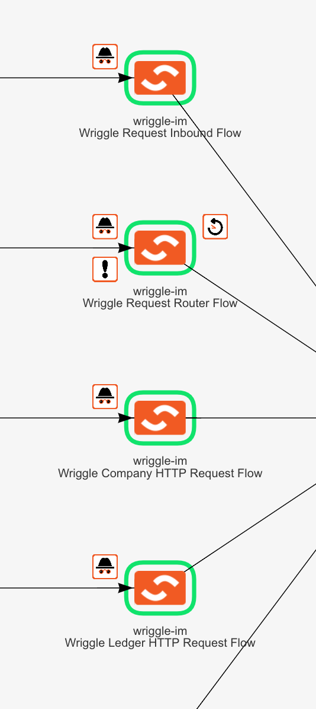

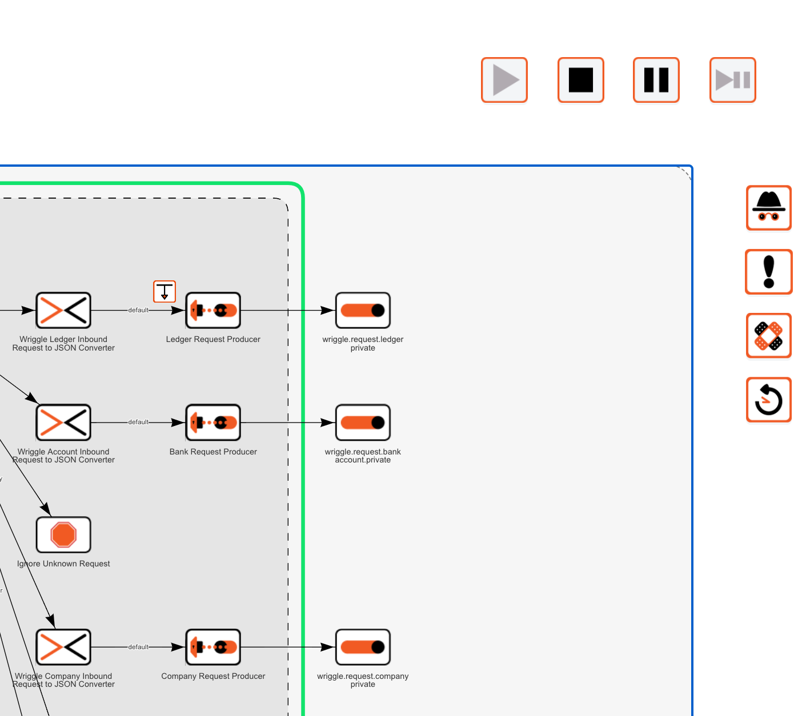

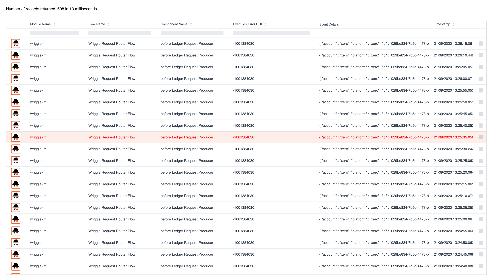
