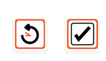
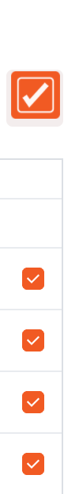
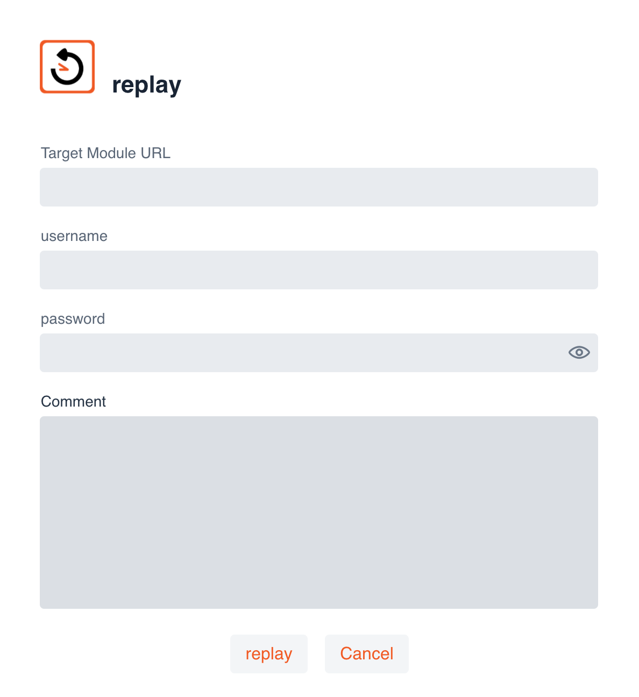
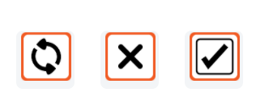
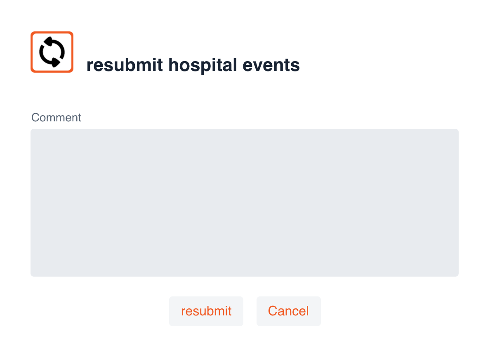
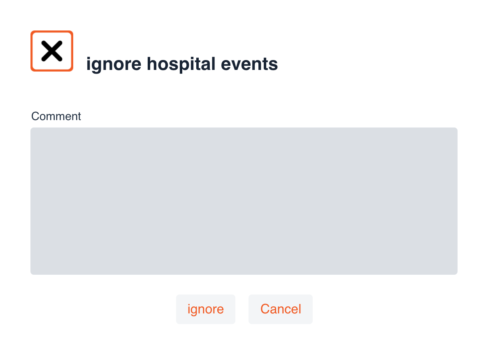

# Ikasan Visualisation Dashboard Security - Search
The Ikasan Dashboard provides a search feature that allows for users to search the following events types:

- [Wiretaps Event](../../wiretap) 
- [Replay Events](../../replay)
- [Hospital Events](../../hospital) 
- [Error Events](../../error-reporting)

## Search Form
The search form provides the oportunity to simple set of search criteria including:
- Start Date and Time
- End Date and Time
- Search Term
- Entity Type
- The opportunity to negate the search term

The search term can be a very simple term such as a trade identifier or a life identifier, or it can be a complex query that conforms to the [Solr Query Syntax](https://lucene.apache.org/solr/guide/8_5/the-standard-query-parser.html). The query will be applied to all fields on the entity.
Multiple entities can be selected for the same search. All searches are executed by clicking the magnifying glass.

### Wiretap Search
As with all searches, the results will be presented in the search results grid. The events can be filtered by the 'Module Name', 'Flow Name', 'Component Name' and 'Event Id/Error Uri'. Those same fields along with the 'Timestamp' can also be sorted.

All rows within the above search result can be double clicked in order to open the 'Wiretap Event Details' screen. It provides the following information:
- The event coordinates ('Module Name', 'Flow Name', 'Component Name')
- The 'Event Life Identifier'
- The Date and Time of the event with millisecond precision.
- The contents (payload) of the event.

It is possible to download the payload by clicking the download button.

### Replay Search
An exclusive 'Replay Search' will provide all search results in the grid as seen below. 

There are 2 other controls that appear on the search results grid when the search is an exclusive 'Replay Search' that allow for replay events to be administered in bulk. 

The left hand button is the 'Replay' button and the right hand button with the tick allow users to 'Select All' results in the results grid.

When the 'Replay' button is selected the 'replay' dialog will be presented. It requires the following fields to be entered in order to replay the events:
- The url of the module that the events are to be replayed to.
- The username who has the permission to execute the replay events in the environment being targeted.
- The associated password.
- Comments relating to the replay of the events. The could be a change control ticket reference or something more informal.

Once the form is completed, the events can be replayed by pressing the replay button.

It is also possible to view an individual replay event by double clicking a record in the search results grid. This view provides the following:
- The 'Module Name' and 'Flow Name' where the event was recorded.
- The 'Life Identifier' of the event.
- The 'Date and Time' that the event was captured.

Events can be downloaded the individual event replayed from this screen.

### Hospital Search
An exclusive 'Hosptial Search' will provide all search results in the grid as seen below.

There are 3 other controls that appear on the search results grid when the search is an exclusive 'Hospital Search' that allow for hospital events to be administered in bulk.

The left hand button is the 'Resubmit' button, the middle 'Ignore' and the right hand button with the tick allow users to 'Select All' results in the results grid.

If the 'Resubmit' button is selected, the user will be presented with the following dialog. The comment field is required. The 'resubmit' button will then send all selected events to the flow from where they originated to be executed. They will be resubmitted in chronological order (oldest to youngest).

If the 'Ignore' button is selected, the user will be presented with the following dialog. The comment field is required. The 'ignore' button will remove all 'ignored' events from the hospital service. An audit record for each 'ignored' event will be created.

It is possible to view each individual event by double clicking a record in the results grid. This view provides the following:
- The 'Module Name' and 'Flow Name' where the event was recorded.
- The 'Life Identifier' of the event.
- The 'Error URI' that was generated.
- The 'Error Action' that Ikasan took.
- The 'Date and Time' that the event was captured.

The error details will also be presented.

Along with the contents of the excluded event.

### Error Search
An exclusive 'Error Search' will provide all search results in the grid as seen below.

It is possible to view each individual error event by double clicking a record in the results grid. This view provides the following:
- The 'Module Name' and 'Flow Name' where the event was recorded.
- The 'Life Identifier' of the event.
- The 'Error URI' that was generated.
- The 'Error Action' that Ikasan took.
- The 'Date and Time' that the event was captured.
- The 'Exception Generating' class.

The error details will also be presented.

Along with the contents of the event that caused the error.

### Visualisation Screen Search
All search features are also available from the module and business stream visualisation screens. In order to perform a search, select the search card from the bottom of the screen.

All searches performed will only show results for flows in the module or business stream selected. All above search features mentioned in the proceeding sections are supported.

Icons will also be presented to the business stream visualisation denoting where various event types have occurred within flows of the business stream.

Double clicking on a flow from the business stream visualisation will also present icons to the right of the diagram, denoting which events are part of the search results.

All entity icons can be double clicked in order to display the results. Once again, all aforementioned functionality is available from this search results screen for the variious entity types.

