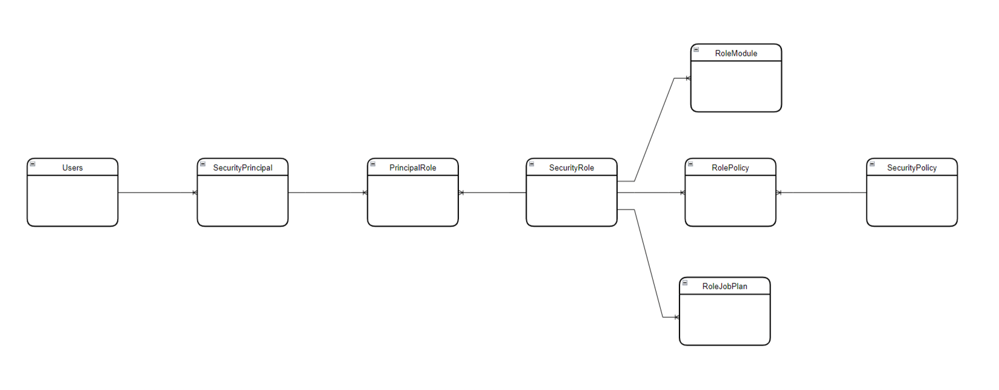

# Ikasan Visualisation Dashboard Security

Ikasan employs role-based access control. Role-based access control (RBAC) is a way to restrict access to certain resources, 
such as files or computer systems, based on the roles or responsibilities of users within an organization. In other words, 
RBAC ensures that users are only given access to the information and resources they need to perform their job duties, and 
nothing more.

RBAC works by assigning users to specific roles within the organization, such as manager, employee, or administrator. Each 
role is then granted a set of permissions that dictate what actions they are allowed to perform within the system. For example, 
an employee might have permission to view certain files, while a manager might have permission to edit them.

RBAC helps organizations to improve security by reducing the risk of unauthorized access or data breaches. It also simplifies 
the process of managing access rights, as permissions can be easily updated or revoked based on changes to an employee's role 
or responsibilities.

## Understanding the Ikasan Security Data Model

| Table Name        | Description                                                                                                                                            | Liquibase Table Definition                                                                   |
|-------------------|--------------------------------------------------------------------------------------------------------------------------------------------------------|----------------------------------------------------------------------------------------------|
| Users             | The users table holds all Ikasan user data whether created locally, or sourced from LDAP.                                                              | [db-changeLog-createUsers.xml](../../platform/ikasan-setup/src/main/resources/db/tables/db-changeLog-createUsers.xml) |
| SecurityPrincipal | All users are mapped directly to a SecurityPrincipal. SecurityPrincipals can also be sourced from LDAP as LDAP groups that are associated with a User. | [db-changeLog-createSecurityPrincipal.xml](../../platform/ikasan-setup/src/main/resources/db/tables/db-changeLog-createSecurityPrincipal.xml)                                                                                                          |
| UserPrincipal     | The UserPrincipal table provides a many to many mapping between the Users and SecurityPrincipal tables.                                                | [db-changeLog-createUserPrincipal.xml](../../platform/ikasan-setup/src/main/resources/db/tables/db-changeLog-createUserPrincipal.xml)                                                                                                          |
| SecurityRole      | The SecurityRole table represents a role within Ikasan. These roles can be created manually or added using SQL scripts.                                | [db-changeLog-createSecurityRole.xml](../../platform/ikasan-setup/src/main/resources/db/tables/db-changeLog-createSecurityRole.xml)                                                                                                          |
| PrincipalRole     | The PrincipalRole table provides a many to many mapping between the SecurityPrincipal and SecurityRole tables.                                         | [db-changeLog-createPrincipalRole.xml](../../platform/ikasan-setup/src/main/resources/db/tables/db-changeLog-createPrincipalRole.xml)                                                                                                          |
| SecurityPolicy    | The SecurityPolicy table defines policies that provide access to granular features withing Ikasan. A role has many policies.                           | [db-changeLog-createSecurityPolicy.xml](../../platform/ikasan-setup/src/main/resources/db/tables/db-changeLog-createSecurityPolicy.xml)                                                                                                          |
| RolePolicy        | The RolePolicy table provided a many to many mapping between the SecurityRole and SecurityPolicy tables.                                               | [db-changeLog-createRolePolicy.xml](../../platform/ikasan-setup/src/main/resources/db/tables/db-changeLog-createRolePolicy.xml)                                                                                                                                                                                                                                                                                                                                                           |
| RoleModule        | The RoleModule table provides a mapping between a SecurityRole and the Ikasan modules that the role can access.                                        | [db-changeLog-createRoleModule.xml](../../platform/ikasan-setup/src/main/resources/db/tables/db-changeLog-createRoleModule.xml)                                                                                                                                                                                                                                                                                                                                                           |
| RoleJobPlan       | The RoleJobPlan table provides a mapping between a SecurityRole and the Ikasan Scheduler job plans that the role can access.                           | [db-changeLog-createRoleJobPlan.xml](../../platform/ikasan-setup/src/main/resources/db/tables/db-changeLog-createRoleJobPlan.xml)                                                                                                                                                                                                                                                                                                                                                           |




## Managing Security Within the Ikasan Dashboard
- [User Management](./user-management.md) Ikasan supports both local users, as well as LDAP users if Ikasan is configured for LDAP security. Users are in fact security principals whose type is 'user'. If Ikasan is configured for LDAP security, user authentication is performed against LDAP, otherwise it is performed againt security credentials held in the Ikasan database.
- [Group Management](./group-management.md) is only relevant if Ikasan is configured for LDAP security. Groups are in fact security principals whose type is 'application'. There is a one to one relationship to LDAP groups. If an Ikasan 'Role' is assigned to a 'Group', all users within that group will be assigned that 'Role' within Ikasan.  
- [Role Management](./role-management.md) An Ikasan 'Role' is assigned security 'Policies'. A 'Role' can be assigned to a 'User' or a 'Group'.
- [Policy Management](./policy-management.md) A 'Policy' defines fine grained security associated with Ikasan features. 
- [LDAP Management](./ldap-management.md) The LDAP management section allows Ikasan to be configured to operate within a corporate environment employing LDAP security features.

## Manually Scripting Ikasan Security
It is possible to define SQL scripts in order to populate the Ikasan Security tables. The scripts below provide examples of how to define
roles and assign policies to them. There are also examples of how to assign a module and a job plan to an agent.

### Role Definitions
```sql
--<role-name> security roles --

-- <role-name>_READ_ONLY --
insert into SECURITYROLE (NAME, DESCRIPTION)
values ('<role-name>_READ_ONLY', 'Read only role for <role-name>.');
-- END <role-name>_READ_ONLY --

-- <role-name>_WRITE --
insert into SECURITYROLE (NAME, DESCRIPTION)
values ('<role-name>_WRITE', 'Write role for <role-name>.');
-- END <role-name>_WRITE --

-- <role-name>_ADMIN --
insert into SECURITYROLE (NAME, DESCRIPTION)
values ('<role-name>_ADMIN', 'Administrator role for <role-name>.');
-- <role-name>_ADMIN --

-- END <role-name> security roles --
```

### Associating Roles with Policies
The [Security Matrix](./security-matrix.md) page outlines the policies that are available within Ikasan and the features that they expose.
```sql
insert into ROLEPOLICY (ROLEID, POLICYID)
values (select ID from SECURITYROLE where NAME = '<role-name>_READ_ONLY', select ID from SECURITYPOLICY where NAME = '<policy-name>-read');

insert into ROLEPOLICY (ROLEID, POLICYID)
values (select ID from SECURITYROLE where NAME = '<role-name>_WRITE', select ID from SECURITYPOLICY where NAME = '<policy-name>-write');

insert into ROLEPOLICY (ROLEID, POLICYID)
values (select ID from SECURITYROLE where NAME = '<role-name>_ADMIN', select ID from SECURITYPOLICY where NAME = '<policy-name>-admin');
```

### Associated Modules
```sql
-- <role-name> security associated agents --
delete
from ROLEMODULE
where ROLEID IN (select ID from SECURITYROLE where NAME = '<role-name>_READ_ONLY', select ID from SECURITYROLE where NAME = '<role-name>_WRITE', select ID from SECURITYROLE where NAME = '<role-name>_ADMIN');

-- <role-name>_READ_ONLY --
insert into ROLEMODULE (ROLEID, MODULENAME)
values (select ID from SECURITYROLE where NAME = '<role-name>_READ_ONLY', '<module-name>');
-- END <role-name>_READ_ONLY --

-- <role-name>_WRITE --
insert into ROLEMODULE (ROLEID, MODULENAME)
values (select ID from SECURITYROLE where NAME = '<role-name>_WRITE', '<module-name>');
-- END <role-name>_WRITE --

-- <role-name>_ADMIN --
insert into ROLEMODULE (ROLEID, MODULENAME)
values (select ID from SECURITYROLE where NAME = '<role-name>_ADMIN', '<module-name>');
-- <role-name>_ADMIN --

-- END <role-name> associated agents --
```

### Associated Job Plans

```sql
-- Asset Control associated job plans --
delete
from ROLEJOBPLAN
where ROLEID IN (select ID from SECURITYROLE where NAME = 'IES_ASSET_CONTROL_READ_ONLY', select ID from SECURITYROLE where NAME = 'IES_ASSET_CONTROL_WRITE', select ID from SECURITYROLE where NAME = 'IES_ASSET_CONTROL_ADMIN');

-- <role-name>_READ_ONLY --
insert into ROLEJOBPLAN (ROLEID, JOBPLANNAME)
values (select ID from SECURITYROLE where NAME = '<role-name>_READ_ONLY', '<job-plan-name>');
-- END IES_ASSET_CONTROL_READ_ONLY --

-- <role-name>_WRITE --
insert into ROLEJOBPLAN (ROLEID, JOBPLANNAME)
values (select ID from SECURITYROLE where NAME = '<role-name>_WRITE', '<job-plan-name>');
-- END <role-name>_WRITE --

-- <role-name>_ADMIN --
insert into ROLEJOBPLAN (ROLEID, JOBPLANNAME)
values (select ID from SECURITYROLE where NAME = '<role-name>_ADMIN', '<job-plan-name>');
-- <role-name>_ADMIN --

-- END <role-name> associated job plans --
```
